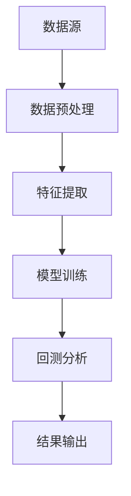
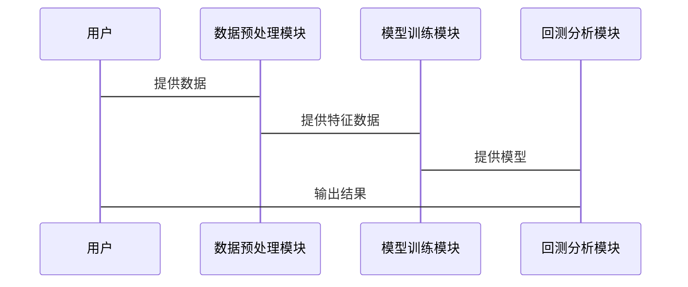

                 


# 《事件驱动投资：从公司行为中获取超额收益》

> **关键词**: 事件驱动投资, 公司行为, 股价预测, 回归模型, 事件窗口法

> **摘要**: 事件驱动投资是一种基于公司特定行为（如并购、重组、分红等）来预测股价变化的投资策略。本文详细介绍了事件驱动投资的理论基础、核心要素、数学模型和算法原理，结合实际案例分析了事件驱动投资的有效性，并提出了风险管理策略和未来研究方向。

---

## 第三部分: 事件驱动投资的数学模型与算法原理

### 第3章: 事件驱动投资的数学模型

#### 3.1 事件驱动投资的回归模型

##### 3.1.1 多元线性回归模型

多元线性回归模型是事件驱动投资中最常用的数学工具之一。其基本思想是通过自变量（公司行为特征）的线性组合来预测因变量（股价变化）。公式如下：

$$
R_i = \beta_0 + \beta_1 X_1 + \beta_2 X_2 + \ldots + \beta_n X_n + \epsilon
$$

其中：
- $R_i$ 是因变量，表示股价变化。
- $X_1, X_2, \ldots, X_n$ 是自变量，表示公司行为特征（如并购规模、重组类型等）。
- $\beta_0$ 是截距项。
- $\beta_1, \beta_2, \ldots, \beta_n$ 是回归系数，表示自变量对股价变化的影响程度。
- $\epsilon$ 是误差项，表示模型无法解释的部分。

##### 3.1.2 事件窗口法（Event Study Methodology）

事件窗口法是用于评估特定事件对股价影响的常用方法。其核心步骤包括：
1. **选择事件窗口**：设定事件前后的窗口期（如事件前30天，事件后30天）。
2. **计算异常收益**：比较事件窗口内实际收益与预期收益的差异。
3. **统计检验**：通过t检验等方法判断异常收益是否显著。

异常收益计算公式为：

$$
AR_t = R_t - R_{rf}
$$

其中：
- $AR_t$ 是异常收益。
- $R_t$ 是事件窗口内实际收益。
- $R_{rf}$ 是无风险利率。

##### 3.1.3 回归模型的假设检验

回归模型的假设检验包括：
- **回归系数显著性检验**：通过t检验判断$\beta_i$是否显著。
- **模型整体显著性检验**：通过F检验判断模型是否整体显著。
- **残差检验**：验证误差项是否满足正态分布、同方差等假设。

---

#### 3.2 事件驱动投资的分类模型

##### 3.2.1 逻辑回归与事件分类

逻辑回归用于将事件分为不同类别（如正面事件、负面事件）。其概率公式为：

$$
P(Y=1|X) = \frac{1}{1 + e^{-(\beta_0 + \beta_1 X_1 + \ldots + \beta_n X_n)}}
$$

其中：
- $Y$ 是因变量，表示事件类别（如1为正面事件，0为负面事件）。
- $X_1, X_2, \ldots, X_n$ 是自变量，表示事件特征。
- $\beta_0, \beta_1, \ldots, \beta_n$ 是回归系数。

##### 3.2.2 支持向量机（SVM）在事件分类中的应用

SVM通过构建超平面将数据点分为两类。其优化目标为：

$$
\min_{\beta, b} \frac{1}{2} ||\beta||^2 + C \sum_{i=1}^n \xi_i
$$

约束条件：
$$
y_i (\beta^T X_i + b) \geq 1 - \xi_i
$$

其中：
- $\beta$ 是法向量。
- $b$ 是偏置项。
- $\xi_i$ 是松弛变量。
- $C$ 是惩罚系数。

##### 3.2.3 随机森林与事件特征提取

随机森林通过构建多个决策树并集成预测结果来提高模型鲁棒性。其特征重要性可以通过Gini指数或节点分裂增益计算。

---

#### 3.3 事件驱动投资的因子模型

##### 3.3.1 Fama-French三因子模型

Fama-French三因子模型扩展了CAPM，加入了大小和价值因子：

$$
R_i = \beta_1 R_m + \beta_2 SMB + \beta_3 HML + \epsilon
$$

其中：
- $R_i$ 是个股收益。
- $R_m$ 是市场收益。
- $SMB$ 是小市值股票相对于大市值股票的收益。
- $HML$ 是高价值股票相对于低价值股票的收益。

##### 3.3.2 事件驱动因子的构建与应用

事件驱动因子用于衡量公司行为对股价的影响。例如，可以定义并购因子$M&A$为并购发生前后的股价变化。

##### 3.3.3 因子模型的实证分析

通过回归分析验证因子对股价的影响：

$$
R_i = \alpha + \beta_1 X_1 + \beta_2 X_2 + \ldots + \beta_n X_n + \epsilon
$$

---

#### 3.4 算法原理的数学公式

##### 3.4.1 回归模型公式

$$
R_i = \beta_0 + \beta_1 X_1 + \beta_2 X_2 + \ldots + \beta_n X_n + \epsilon
$$

##### 3.4.2 事件窗口法公式

$$
AR_t = R_t - R_{rf}
$$

##### 3.4.3 逻辑回归公式

$$
P(Y=1|X) = \frac{1}{1 + e^{-(\beta_0 + \beta_1 X_1 + \ldots + \beta_n X_n)}}
$$

##### 3.4.4 SVM公式

$$
\min_{\beta, b} \frac{1}{2} ||\beta||^2 + C \sum_{i=1}^n \xi_i
$$

约束条件：
$$
y_i (\beta^T X_i + b) \geq 1 - \xi_i
$$

##### 3.4.5 随机森林特征重要性

通过Gini指数计算特征重要性：

$$
Gini = \sum_{i=1}^n (p_i - 0.5)^2
$$

---

#### 3.5 事件驱动投资的系统架构

##### 3.5.1 系统功能设计

- 数据采集：获取公司行为数据和股价数据。
- 特征提取：提取事件特征（如并购规模、重组类型）。
- 模型训练：训练回归模型或分类模型。
- 回测分析：评估模型性能并优化参数。

##### 3.5.2 系统架构图



##### 3.5.3 系统接口设计

- 输入接口：接收公司行为数据和股价数据。
- 输出接口：输出预测收益和风险评估。

##### 3.5.4 系统交互图



---

#### 3.6 事件驱动投资的项目实战

##### 3.6.1 环境安装

```bash
pip install pandas statsmodels
```

##### 3.6.2 核心实现代码

```python
import pandas as pd
import statsmodels.api as sm

# 数据加载
df = pd.read_csv('event_data.csv')

# 定义自变量和因变量
X = df[['X1', 'X2', ...]]
y = df['R']

# 添加截距项
X = sm.add_constant(X)

# 训练模型
model = sm.OLS(y, X)
result = model.fit()

# 输出回归系数
print(result.params)
```

##### 3.6.3 代码解读与分析

- 数据加载：读取公司行为数据和股价数据。
- 特征定义：选择相关公司行为特征作为自变量。
- 模型训练：使用最小二乘法训练线性回归模型。
- 结果输出：打印回归系数和统计检验结果。

##### 3.6.4 实际案例分析

以并购事件为例，分析并购前后股价变化：

```python
# 并购事件窗口
start_date = '2023-01-01'
end_date = '2023-03-31'
df_mergers = df[(df['event_type'] == 'merger') & (df['date'].between(start_date, end_date))]
```

##### 3.6.5 项目小结

通过回归分析和事件窗口法，我们可以有效捕捉公司行为对股价的影响，从而制定投资策略。

---

#### 3.7 最佳实践 tips

- **数据质量**：确保数据准确性和完整性。
- **模型选择**：根据具体场景选择合适模型。
- **风险管理**：结合技术分析和基本面分析。

---

#### 3.8 小结

事件驱动投资的数学模型包括回归模型、分类模型和因子模型。通过这些模型，我们可以量化公司行为对股价的影响，从而制定有效的投资策略。

---

作者：AI天才研究院/AI Genius Institute & 禅与计算机程序设计艺术 /Zen And The Art of Computer Programming

