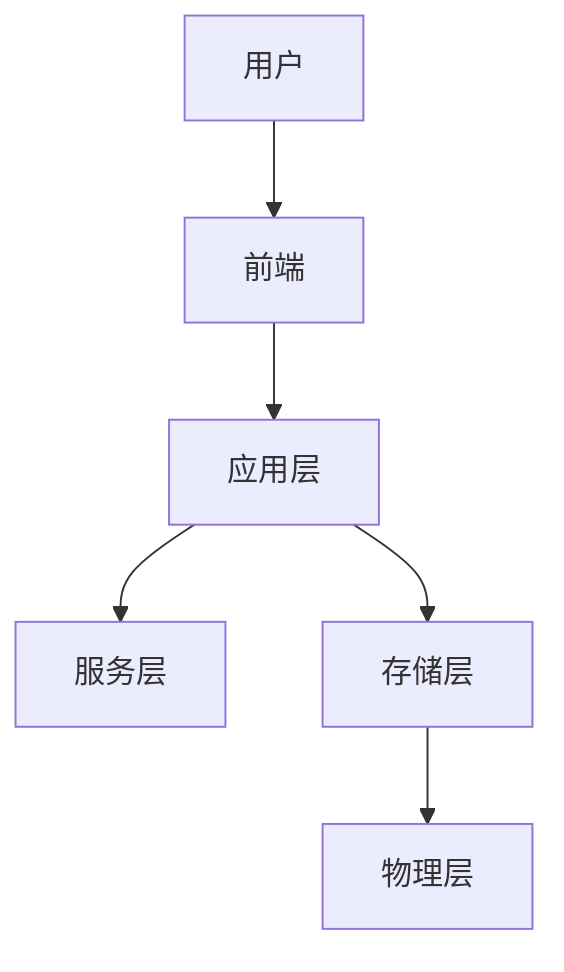
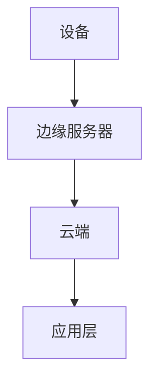
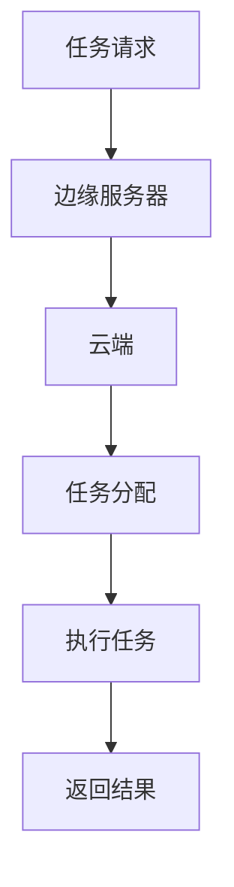
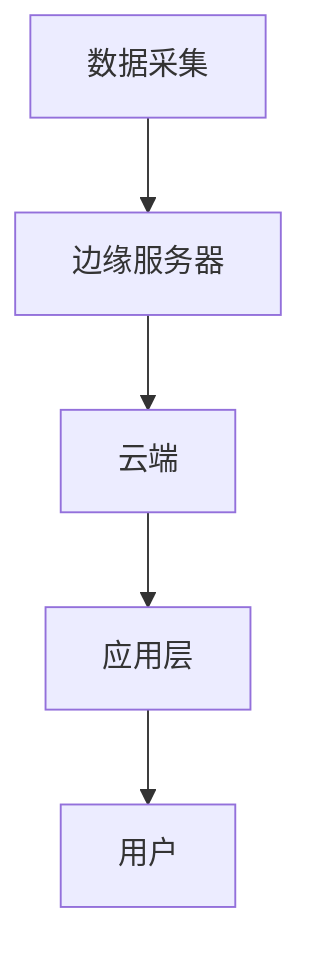

                 


# 云端 vs 边缘计算：AI Agent的最佳运行环境

> **关键词**：云端计算、边缘计算、AI Agent、分布式计算、实时处理、数据隐私、系统优化

> **摘要**：本文探讨了云端计算和边缘计算在AI Agent运行中的优劣，分析了两者如何协同工作以优化性能，同时通过项目实战展示了AI Agent在不同环境中的部署与优化策略。

---

# 第一部分: 云端与边缘计算的概述

## 第1章: 云端计算的基本概念与应用场景

### 1.1 云端计算的定义与特点

#### 1.1.1 云端计算的定义
云端计算是一种通过互联网按需提供计算资源（如计算能力、存储空间和应用程序）的模式。用户无需本地购买和维护硬件，而是通过订阅服务的方式使用云端资源。

#### 1.1.2 云端计算的核心特点
- **按需扩展**：根据需求动态分配资源。
- **弹性计算**：自动调整资源使用量。
- **全球覆盖**：通过多个数据中心提供服务。
- **高可用性**：通过冗余设计确保服务不中断。

#### 1.1.3 云端计算的技术架构
传统的云端计算架构包括前端（用户端）、应用层、服务层、存储层和物理层。数据通过前端传输到云端进行处理，再返回结果。

**Mermaid图：云端计算架构**


### 1.2 云端计算的应用场景

#### 1.2.1 云端计算在AI中的应用
云端计算为AI提供了强大的计算能力，支持深度学习模型的训练和推理。例如，图像识别和自然语言处理任务通常在云端进行。

#### 1.2.2 云端计算的优缺点分析
- **优点**：资源丰富，易于扩展，维护成本低。
- **缺点**：延迟较高，数据传输成本高，隐私风险。

#### 1.2.3 云端计算的未来发展趋势
随着5G和AI技术的发展，云端计算将更加智能化，支持更复杂的分布式计算。

---

## 第2章: 边缘计算的基本概念与应用场景

### 2.1 边缘计算的定义与特点

#### 2.1.1 边缘计算的定义
边缘计算是一种在数据源附近进行计算的模式，强调实时性、低延迟和本地化处理。

#### 2.1.2 边缘计算的核心特点
- **低延迟**：数据在本地处理，减少传输时间。
- **实时性**：适用于需要快速响应的场景。
- **带宽优化**：减少数据传输量。

#### 2.1.3 边缘计算的技术架构
边缘计算架构通常包括边缘设备、边缘服务器和云端。数据在边缘设备处理后，仅将必要信息上传到云端。

**Mermaid图：边缘计算架构**


### 2.2 边缘计算的应用场景

#### 2.2.1 边缘计算在AI中的应用
边缘计算适用于需要实时响应的AI应用，如自动驾驶和智能安防。

#### 2.2.2 边缘计算的优缺点分析
- **优点**：低延迟，带宽优化，隐私保护。
- **缺点**：计算能力有限，维护成本高。

#### 2.2.3 边缘计算的未来发展趋势
边缘计算将与物联网和5G技术深度融合，支持更多实时应用。

---

## 第3章: 云端与边缘计算的对比分析

### 3.1 云端与边缘计算的对比

#### 3.1.1 计算能力对比
云端计算提供强大的计算能力，而边缘计算受限于本地设备。

| 特性 | 云端计算 | 边缘计算 |
|------|----------|----------|
| 计算能力 | 强大 | 有限 |

#### 3.1.2 带宽需求对比
云端计算需要大量数据传输，边缘计算则减少带宽消耗。

| 场景 | 云端 | 边缘 |
|------|------|------|
| 数据处理 | 高带宽 | 低带宽 |

#### 3.1.3 延迟与实时性对比
云端计算延迟较高，边缘计算延迟低，实时性强。

### 3.2 云端与边缘计算的优缺点对比

| 特性 | 云端计算 | 边缘计算 |
|------|----------|----------|
| 优点 | 资源丰富，扩展性强 | 低延迟，隐私保护 |
| 缺点 | 成本高，延迟高 | 计算能力有限 |

---

# 第二部分: AI Agent的基本概念与应用场景

## 第4章: AI Agent的基本概念与应用场景

### 4.1 AI Agent的定义与特点

#### 4.1.1 AI Agent的定义
AI Agent是一种能够感知环境并执行任务的智能实体，能够自主决策和行动。

#### 4.1.2 AI Agent的核心特点
- **自主性**：无需外部干预。
- **反应性**：实时响应环境变化。
- **社交能力**：与其他系统或人类交互。

### 4.2 AI Agent的应用场景

#### 4.2.1 智能助手
AI Agent在智能手机和智能家居中的应用，如Siri和Alexa。

#### 4.2.2 自动驾驶
AI Agent在自动驾驶汽车中的应用，实时处理传感器数据。

#### 4.2.3 智慧城市
AI Agent在交通管理和公共安全中的应用，优化城市运行。

---

# 第三部分: 云端与边缘计算对AI Agent的影响

## 第5章: 云端计算对AI Agent的影响

### 5.1 云端计算优化AI Agent的性能
云端计算提供强大的计算能力，支持复杂的AI模型训练。

**公式：** 云端计算的延迟为 $D_{cloud}$，边缘计算的延迟为 $D_{edge}$，则 $D_{cloud} > D_{edge}$。

### 5.2 云端计算扩展AI Agent的能力
通过弹性计算，AI Agent可以根据需求扩展处理能力。

---

## 第6章: 边缘计算对AI Agent的影响

### 6.1 边缘计算优化AI Agent的实时性
边缘计算减少了数据传输延迟，提高了实时响应能力。

**公式：** 边缘计算的延迟优化模型为 $T_{edge} = T_{local} + T_{network}$。

### 6.2 边缘计算的挑战
边缘设备的计算能力有限，需要与云端协同工作。

---

# 第四部分: 云端与边缘计算的协同优化策略

## 第7章: 云端与边缘计算的协同优化策略

### 7.1 数据处理与计算资源分配
协同优化需要合理分配数据处理任务，平衡计算资源。

**公式：** 数据处理任务分配模型为 $C_{task} = \sum_{i=1}^{n} C_{i}$，其中 $C_{i}$ 是每个任务的计算量。

### 7.2 任务调度与负载均衡
通过动态任务调度算法，优化系统性能。

**Mermaid图：任务调度流程**


---

# 第五部分: 项目实战: AI Agent在云端与边缘计算中的部署与优化

## 第8章: 项目实战

### 8.1 环境搭建
搭建云端和边缘计算环境，选择合适的开发工具。

### 8.2 系统设计
设计AI Agent的系统架构，包括数据采集、处理和反馈模块。

**Mermaid图：系统架构设计**


### 8.3 代码实现
实现AI Agent的核心功能，如数据处理和决策逻辑。

```python
# 边缘服务器代码示例
def process_data(data):
    # 数据处理逻辑
    return result

# 云端代码示例
def train_model(data):
    # 模型训练逻辑
    return model
```

### 8.4 性能优化
优化数据传输和计算效率，降低延迟和成本。

---

## 第9章: 总结与展望

### 9.1 总结
云端和边缘计算各有优劣，协同工作可优化AI Agent的性能。

### 9.2 展望
未来，随着技术进步，云端和边缘计算的结合将更加紧密，推动AI Agent的发展。

---

# 作者：AI天才研究院 & 禅与计算机程序设计艺术

---

通过以上结构，文章详细探讨了云端和边缘计算在AI Agent中的应用，结合理论分析和项目实战，为读者提供了全面的知识和实践指导。

