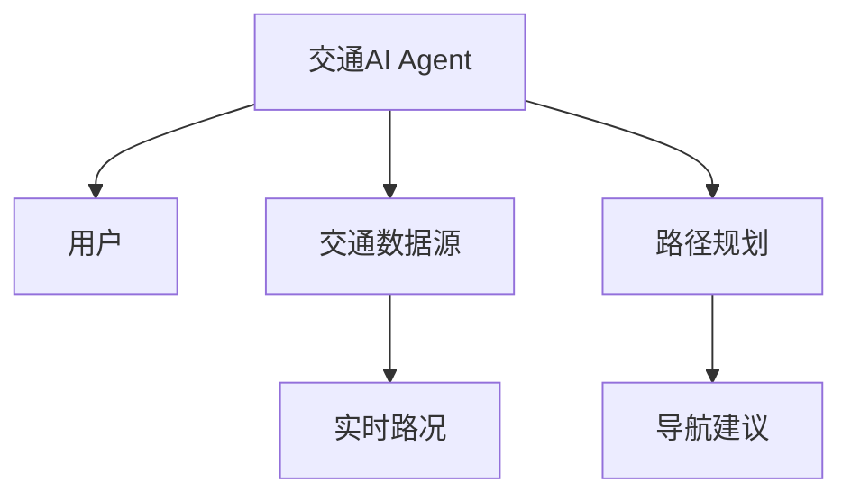
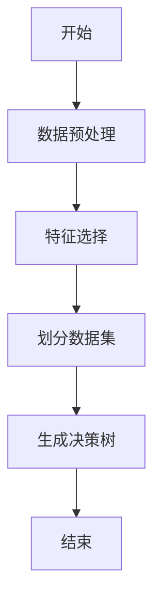
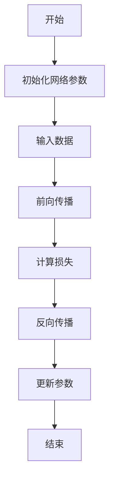
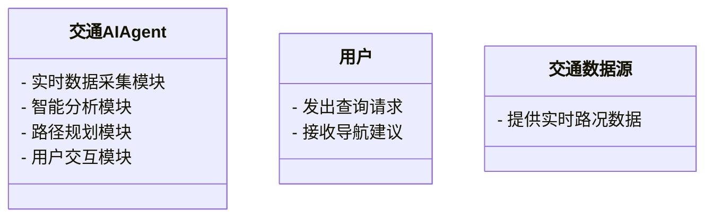
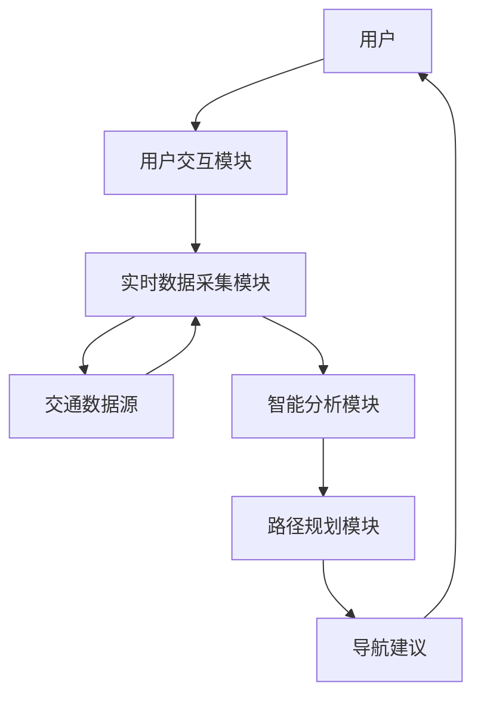
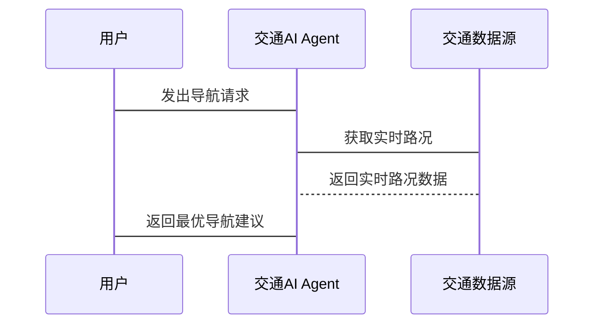

                 


# 《交通AI Agent：智能路况分析与导航》

> 关键词：交通AI Agent, 智能路况分析, 智能导航系统, 人工智能算法, 交通管理

> 摘要：本文详细探讨了交通AI Agent在智能路况分析与导航中的应用，从核心概念、算法原理、系统架构到项目实战，系统地分析了其在现代交通管理中的重要作用，并通过具体案例展示了其实际应用价值。

---

## 第一部分: 交通AI Agent概述

### 第1章: 交通AI Agent的背景与概念

#### 1.1 AI Agent的基本概念
- **1.1.1 AI Agent的定义与特点**
  - AI Agent（智能体）是指在环境中能够感知并自主行动以实现目标的实体。
  - 特点包括自主性、反应性、目标导向和社交能力。
  - 交通AI Agent是AI Agent在交通领域中的具体应用，用于实时分析路况并提供最优导航方案。

- **1.1.2 交通AI Agent的定义与核心要素**
  - 定义：交通AI Agent是一种能够实时感知交通状况、分析复杂路况并提供智能导航建议的智能系统。
  - 核心要素：实时数据采集、智能分析算法、动态路径规划、用户交互界面。

- **1.1.3 交通AI Agent的应用场景与边界**
  - 应用场景：城市交通管理、自动驾驶辅助、智能导航系统。
  - 边界：主要关注交通状况分析与路径规划，不涉及车辆控制或其他交通系统。

#### 1.2 交通AI Agent的核心概念与联系
- **核心概念原理**
  - 交通AI Agent通过实时数据采集、分析和预测，为用户提供最优路径规划。
  - 与传统导航系统的区别在于其实时性和动态性。

- **核心概念属性特征对比表**

| 特性       | 传统导航系统 | 交通AI Agent |
|------------|--------------|---------------|
| 数据来源   | 静态地图数据 | 实时交通数据   |
| 处理方式   | 预计算路径   | 动态路径优化   |
| 响应时间   | 固定路径     | 实时调整路径   |

- **ER实体关系图（Mermaid流程图）**


---

### 第2章: 交通AI Agent的算法原理

#### 2.1 常见算法概述
- **决策树算法**
  - 基于特征的分类和回归树结构，适合处理交通数据中的分类问题。
  - 优点：易于解释，适合处理多类别问题。
  - 缺点：对噪声数据敏感。

- **随机森林算法**
  - 基于决策树的集成算法，通过随机采样提高模型鲁棒性。
  - 优点：抗过拟合，适合处理高维数据。
  - 缺点：计算复杂度较高。

- **神经网络算法**
  - 通过多层神经网络结构模拟人类大脑的学习方式。
  - 优点：适合处理非线性关系，学习能力强。
  - 缺点：需要大量数据和计算资源。

#### 2.2 算法流程图（Mermaid）
- **决策树算法流程图**


- **神经网络算法流程图**


#### 2.3 算法数学模型与公式
- **决策树的熵与信息增益公式**
  - 熵公式：
    $$ H(S) = -\sum_{i=1}^{n} p_i \log p_i $$
  - 信息增益公式：
    $$ IG(S, A) = H(S) - H(S|A) $$

- **神经网络的激活函数与损失函数公式**
  - 激活函数（sigmoid）：
    $$ a = \frac{1}{1 + e^{-x}} $$
  - 损失函数（交叉熵损失）：
    $$ L = -\sum_{i=1}^{n} y_i \log y_i' + (1 - y_i) \log (1 - y_i') $$

---

### 第3章: 交通AI Agent的系统架构设计

#### 3.1 系统功能设计
- **领域模型（Mermaid类图）**


- **系统架构设计（Mermaid架构图）**


#### 3.2 系统接口与交互设计
- **系统接口设计**
  - 用户接口：API接口用于接收查询请求和返回导航建议。
  - 数据接口：与交通数据源（如交通摄像头、GPS数据）对接。

- **系统交互流程图（Mermaid序列图）**


---

### 第4章: 交通AI Agent的项目实战

#### 4.1 环境搭建与数据采集
- **开发环境安装**
  - Python 3.8+
  - 安装必要的库：numpy、pandas、scikit-learn、tensorflow。

- **数据采集与预处理**
  - 数据来源：交通摄像头、GPS数据、用户输入。
  - 数据预处理：清洗、归一化、特征提取。

#### 4.2 核心算法实现
- **决策树算法实现（Python代码）**
  ```python
  from sklearn.tree import DecisionTreeClassifier
  import numpy as np

  # 示例数据
  X = np.array([[0, 0], [1, 1], [1, 0], [0, 1]])
  y = np.array([0, 1, 1, 0])

  # 训练模型
  clf = DecisionTreeClassifier()
  clf.fit(X, y)

  # 预测
  print(clf.predict([[1, 1]]))  # 输出: [1]
  ```

- **神经网络算法实现（Python代码）**
  ```python
  import tensorflow as tf
  from tensorflow.keras import layers

  # 示例模型
  model = tf.keras.Sequential([
      layers.Dense(64, activation='relu'),
      layers.Dense(1, activation='sigmoid')
  ])

  # 编译模型
  model.compile(optimizer='adam', loss='binary_crossentropy', metrics=['accuracy'])

  # 训练
  model.fit(X_train, y_train, epochs=10, batch_size=32)
  ```

#### 4.3 系统功能实现
- **路况分析模块实现**
  - 使用实时数据进行交通状况分析，识别拥堵点和事故点。
- **导航模块实现**
  - 基于分析结果动态生成最优路径，考虑因素包括距离、时间、拥堵情况等。

#### 4.4 项目测试与优化
- **测试用例设计**
  - 正常情况测试：从A点到B点的最优路径。
  - 边缘情况测试：极端天气、交通事故等特殊情况下的路径调整。
- **系统优化与调优**
  - 数据预处理优化：增加数据清洗的效率。
  - 算法优化：调整决策树的剪枝参数，优化神经网络的训练参数。

---

## 第五章: 交通AI Agent的应用案例与扩展

### 5.1 应用案例分析
- **案例1：城市交通管理**
  - 使用交通AI Agent实时监控城市交通状况，优化信号灯控制，减少拥堵。
- **案例2：自动驾驶辅助**
  - 通过AI Agent分析实时路况，辅助自动驾驶车辆做出决策。

### 5.2 未来扩展与趋势
- **数据融合**
  - 结合更多数据源（如天气、交通事件）提升分析精度。
- **模型优化**
  - 使用更复杂的深度学习模型（如LSTM）进行时间序列预测。
- **多智能体协作**
  - 在城市交通管理中，多个AI Agent协作完成复杂的交通调度任务。

---

## 总结
交通AI Agent作为人工智能技术在交通领域的应用，通过实时分析和动态规划，显著提升了交通管理的效率和用户体验。随着技术的不断发展，交通AI Agent将在未来的智能交通系统中发挥越来越重要的作用。

---

## 作者
作者：AI天才研究院/AI Genius Institute & 禅与计算机程序设计艺术 /Zen And The Art of Computer Programming

--- 

本文详细分析了交通AI Agent的核心概念、算法原理、系统架构和项目实现，为读者提供了从理论到实践的全面指导。

