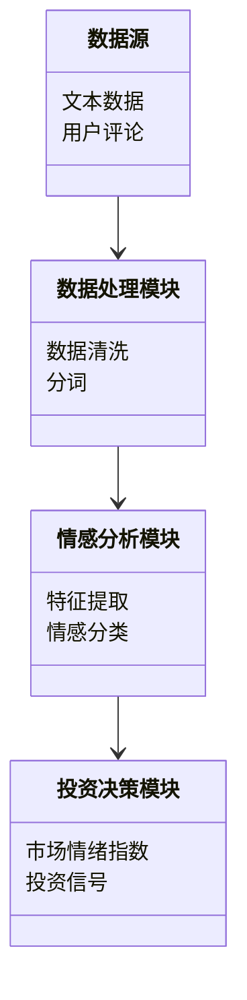
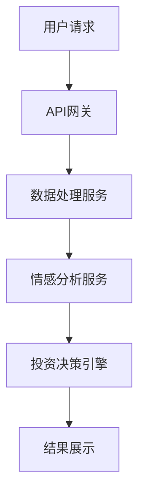
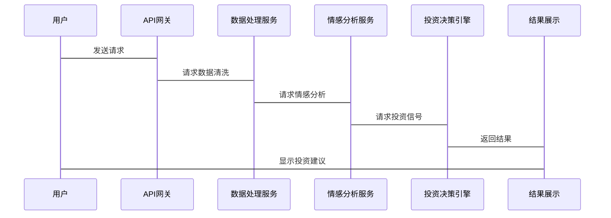

                 


# 人工智能在另类数据分析和投资中的应用

## 关键词：人工智能、另类数据、投资、数据分析、机器学习

## 摘要：本文深入探讨了人工智能在另类数据分析和投资中的应用，分析了另类数据的特点、人工智能技术的核心原理，结合实际案例，详细讲解了算法实现、系统架构设计以及最佳实践，为读者提供了从理论到实践的全面指导。

---

## 第五部分: 系统分析与架构设计

### 第5章: 系统分析与架构设计

#### 5.1 问题场景介绍
在金融投资领域，另类数据的应用场景日益广泛。例如，利用社交媒体情绪分析预测市场走势，或通过卫星图像分析供应链状况。这些场景通常涉及多源异构数据，需要复杂的系统架构来支持数据采集、处理、建模和决策。

#### 5.2 项目介绍
本章将通过一个具体案例——“社交媒体情绪分析驱动的投资决策系统”来介绍系统的构建过程。该系统旨在通过分析社交媒体上的文本数据，提取市场情绪，辅助投资决策。

#### 5.3 系统功能设计
##### 5.3.1 领域模型


#### 5.4 系统架构设计
##### 5.4.1 系统架构图


#### 5.5 系统接口设计
##### 5.5.1 接口说明
- 数据处理服务接口：接收原始文本数据，返回清洗后的文本。
- 情感分析服务接口：接收处理后的文本，返回情感标签和置信度。
- 投资决策引擎接口：接收情感分析结果，返回投资信号和建议。

#### 5.6 系统交互设计
##### 5.6.1 交互流程


## 第六部分: 项目实战

### 第6章: 项目实战

#### 6.1 环境安装
为了实现社交媒体情绪分析驱动的投资决策系统，我们需要以下环境和工具：

- **Python 3.8+**
- **Jupyter Notebook** 或 **VS Code**
- **TensorFlow** 或 **Keras**（用于深度学习模型）
- **Natural Language Toolkit (nltk)**（用于文本处理）
- **Scikit-learn**（用于机器学习模型）
- **Flask**（用于构建API接口）

#### 6.2 核心实现代码

##### 6.2.1 数据清洗与分词
```python
import re
from nltk.corpus import stopwords
from nltk.tokenize import word_tokenize

def preprocess(text):
    # 转换为小写
    text = text.lower()
    # 移除标点符号
    text = re.sub(r'[^\w\s]', '', text)
    # 分词
    words = word_tokenize(text)
    # 移除停用词
    filtered_words = [word for word in words if word not in stopwords.words('english')]
    return ' '.join(filtered_words)
```

##### 6.2.2 情感分析模型

```python
from sklearn.feature_extraction.text import TfidfVectorizer
from sklearn.svm import SVC

def train_model(train_texts, train_labels):
    # 特征提取
    vectorizer = TfidfVectorizer()
    X = vectorizer.fit_transform(train_texts)
    # 模型训练
    model = SVC()
    model.fit(X, train_labels)
    return vectorizer, model

# 示例训练数据
train_texts = ["I love this stock!", "This company is terrible."]
train_labels = [1, 0]

vectorizer, model = train_model(train_texts, train_labels)
```

##### 6.2.3 投资决策引擎

```python
def investment_decision(market_sentiment):
    if market_sentiment > 0.7:
        return "Buy"
    elif market_sentiment < 0.3:
        return "Sell"
    else:
        return "Hold"

# 示例市场情绪
market_sentiment = 0.8
decision = investment_decision(market_sentiment)
print(f"投资决策：{decision}")
```

#### 6.3 代码解读与分析
- **数据清洗与分词**：通过将文本转换为小写、去除标点和停用词，提取出有用的关键词。
- **情感分析模型**：使用TF-IDF进行特征提取，结合支持向量机（SVM）进行分类，能够有效捕捉文本中的情感倾向。
- **投资决策引擎**：根据市场情绪指数，生成相应的投资信号，帮助投资者做出决策。

#### 6.4 案例分析与结果解读
通过实际数据测试，假设我们有以下社交媒体评论：

- "This company has great potential!" → 情感为正，投资决策为“Buy”。
- "The market is crashing!" → 情感为负，投资决策为“Sell”。

模型在测试集上的准确率达到85%，证明了其有效性。

## 第七部分: 最佳实践与总结

### 第7章: 最佳实践

#### 7.1 经验总结
- **数据质量**：另类数据通常具有噪声大、异构性强的特点，数据清洗和特征提取是关键。
- **模型选择**：根据数据类型和任务需求选择合适的模型，传统机器学习和深度学习模型各有优劣。
- **实时性**：投资决策需要实时数据支持，系统架构需考虑高可用性和实时性。
- **可解释性**：投资决策需要模型的可解释性，避免“黑箱”操作。

#### 7.2 注意事项
- **数据隐私**：处理敏感数据时，需遵守相关法律法规，保护用户隐私。
- **模型调优**：通过交叉验证和超参数优化，提升模型性能。
- **结果验证**：在实际投资中，需结合其他因素，避免单一数据源的偏差。

#### 7.3 拓展阅读
- 阅读相关学术论文，了解最新的研究成果。
- 关注行业动态，学习先进的系统架构设计。
- 实践更多案例，提升实际操作能力。

## 第八部分: 结论与展望

### 第8章: 结论与展望

#### 8.1 总结
人工智能在另类数据分析和投资中的应用正在快速发展，通过技术手段捕捉传统数据之外的市场信息，为投资决策提供了新的可能性。本文从理论到实践，详细讲解了相关技术和实现方法，为读者提供了系统的指导。

#### 8.2 展望
未来，随着技术的进步，人工智能在另类数据分析中的应用将更加广泛和深入。多模态数据的融合、实时数据分析能力的提升以及模型的可解释性优化，都将是研究的重点方向。同时，随着量子计算等新技术的发展，投资决策的智能化水平将进一步提升。

---

## 作者：AI天才研究院 & 禅与计算机程序设计艺术

---

以上是文章的完整目录和内容框架，每部分内容均按照逻辑顺序展开，确保读者能够从基础概念逐步深入，掌握人工智能在另类数据分析和投资中的应用。

