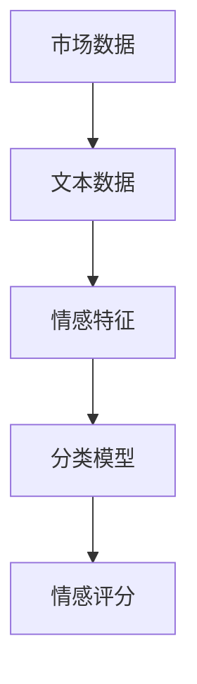

                 


# 人工智能在实时市场情绪分析中的应用

## 关键词

人工智能, 情绪分析, 实时市场, 自然语言处理, 深度学习

## 摘要

实时市场情绪分析是利用人工智能技术对金融市场中的文本数据进行实时情感分析，以辅助投资者做出更明智的决策。本文从背景和核心概念出发，详细探讨了人工智能在实时市场情绪分析中的应用，包括相关算法原理、系统架构设计以及项目实战。通过分析和实践，本文旨在为读者提供一个全面的理解和实施框架，帮助他们在金融领域中有效应用实时情绪分析技术。

---

# 第一部分: 人工智能与实时市场情绪分析概述

## 第1章: 背景与核心概念

### 1.1 人工智能与情绪分析的背景

#### 1.1.1 人工智能技术的发展

人工智能（AI）技术近年来取得了长足的进步，尤其是在自然语言处理（NLP）领域。从传统的规则-based系统到现代的深度学习模型，AI已经能够处理复杂的文本数据，理解上下文，并进行情感分析。

#### 1.1.2 情绪分析的定义与目标

情绪分析旨在识别和分类文本中的情感倾向。在金融市场中，情绪分析的目标是通过分析新闻、社交媒体帖子、评论等文本数据，判断市场参与者的情绪状态，进而预测市场走势。

#### 1.1.3 实时市场情绪分析的必要性

实时市场情绪分析能够帮助投资者快速捕捉市场情绪变化，做出及时的决策。尤其是在市场波动剧烈的情况下，实时分析能够提供及时的反馈，帮助投资者规避风险或抓住机会。

### 1.2 问题背景与描述

#### 1.2.1 市场情绪分析的定义

市场情绪分析是指通过分析文本数据，判断市场参与者对某个资产、公司或市场的看法和情绪状态。这种分析可以量化市场情绪，为投资者提供决策依据。

#### 1.2.2 实时分析的挑战

实时分析需要处理大量的实时数据，对计算能力和算法效率提出了更高的要求。此外，数据的质量和噪声也对模型的准确性提出了挑战。

#### 1.2.3 边界与外延

市场情绪分析的边界包括数据范围、时间范围和情感范围。外延则涉及对市场行为的影响、情绪与价格波动的关系等。

### 1.3 核心概念与联系

#### 1.3.1 核心概念原理

市场情绪分析的核心在于将文本数据转化为可量化的指标。这需要结合NLP技术和统计学习方法。

#### 1.3.2 情感分析与文本挖掘对比

情感分析更关注文本中的情感倾向，而文本挖掘则更广泛，包括信息提取、分类等多种任务。

#### 1.3.3 ER实体关系图架构

以下是市场情绪分析的实体关系图：



---

## 第2章: 人工智能在实时市场情绪分析中的应用

### 2.1 情感分析的核心技术

#### 2.1.1 文本预处理

文本预处理包括分词、去停用词、词干提取等步骤，目的是将原始文本转化为适合模型处理的形式。

#### 2.1.2 特征提取

特征提取是将文本转化为数值表示的过程。常用的方法包括词袋模型、TF-IDF和词嵌入模型。

#### 2.1.3 分类模型

分类模型用于将情感特征分类为积极、消极或中性。常用的分类算法包括SVM、Naive Bayes和随机森林等。

### 2.2 人工智能算法在情绪分析中的应用

#### 2.2.1 传统机器学习算法

传统机器学习算法包括SVM、Naive Bayes和随机森林等。这些算法在小规模数据上表现良好，但在大规模数据上可能效率不足。

#### 2.2.2 深度学习模型

深度学习模型如RNN、LSTM和Transformer在处理大规模数据时表现出色，能够捕捉复杂的语义信息。

#### 2.2.3 混合模型

混合模型结合了传统机器学习和深度学习的优势，能够在保持高准确率的同时，提高计算效率。

---

# 第三部分: 算法原理与数学模型

## 第3章: 情感分析的算法原理

### 3.1 基于传统机器学习的情感分析

#### 3.1.1 TF-IDF特征提取

TF-IDF是一种常用的文本特征提取方法，通过计算词频和逆文档频率，筛选出具有区分度的关键词。

#### 3.1.2 支持向量机(SVM)分类

SVM是一种监督学习算法，适用于小规模数据的分类任务。其对偶形式为：

$$ \max_{\alpha} \sum_{i=1}^n \alpha_i y_i - \frac{1}{2} \sum_{i,j} \alpha_i \alpha_j y_i y_j K(x_i, x_j) $$

其中，$K(x_i, x_j)$ 是核函数。

#### 3.1.3 随机森林分类

随机森林是一种基于决策树的集成学习算法，能够处理高维数据，并对噪声具有较强的鲁棒性。

#### 3.1.4 Naive Bayes分类

Naive Bayes基于贝叶斯定理，假设特征之间相互独立，适用于文本分类任务。

### 3.2 深度学习模型在情感分析中的应用

#### 3.2.1 RNN与LSTM

RNN适用于处理序列数据，而LSTM通过引入门控机制，能够更好地捕捉长序列信息。

#### 3.2.2 Transformer架构

Transformer基于自注意力机制，能够捕捉文本中的全局依赖关系，适用于大规模数据的处理。

#### 3.2.3 BERT模型

BERT是一种预训练语言模型，通过自监督学习，能够理解上下文语义，适用于情感分析任务。

### 3.3 情感分析的数学模型

#### 3.3.1 词袋模型

词袋模型将文本表示为词袋，忽略词序，适用于简单的分类任务。

#### 3.3.2 词嵌入模型

词嵌入模型如Word2Vec和GloVe，能够将词转化为低维向量，捕捉语义信息。

#### 3.3.3 分类模型的损失函数

常用的损失函数包括交叉熵损失和Hinge损失，具体选择取决于任务类型。

---

## 第4章: 情感分析的数学模型

### 4.1 词袋模型

词袋模型将文本表示为一个词的集合，忽略词序。例如，文本“我爱学习”可以表示为{“我”：“1”，“爱”：“1”，“学习”：“1”}。

### 4.2 词嵌入模型

词嵌入模型将词映射到低维空间，例如：

$$ W: \{word\_i\} \rightarrow \mathbb{R}^d $$

其中，$d$是嵌入维度。

### 4.3 分类模型的损失函数

交叉熵损失函数为：

$$ L = -\frac{1}{n} \sum_{i=1}^n y_i \log(p_i) + (1-y_i) \log(1-p_i) $$

其中，$y_i$是真实标签，$p_i$是预测概率。

---

# 第四部分: 系统分析与架构设计

## 第4章: 系统架构设计方案

### 4.1 问题场景介绍

#### 4.1.1 实时数据流处理

实时市场情绪分析需要处理大量的实时数据流，对系统的实时处理能力提出了要求。

#### 4.1.2 高效特征提取

特征提取是情绪分析的关键步骤，需要高效提取具有区分度的特征。

#### 4.1.3 实时分类与反馈

实时分类需要快速处理数据，并提供及时的反馈。

### 4.2 系统功能设计

#### 4.2.1 数据获取模块

数据获取模块负责从金融市场获取实时文本数据，例如新闻、社交媒体帖子等。

#### 4.2.2 特征工程模块

特征工程模块将文本数据转化为数值表示，例如TF-IDF、词嵌入等。

#### 4.2.3 模型训练模块

模型训练模块使用训练数据训练分类模型，例如SVM、LSTM等。

#### 4.2.4 实时处理模块

实时处理模块负责处理实时数据流，进行特征提取和分类，输出情感评分。

#### 4.2.5 结果展示模块

结果展示模块将情感评分以可视化形式展示，帮助投资者理解市场情绪。

### 4.3 系统架构设计

#### 4.3.1 分层架构

分层架构将系统划分为数据层、业务逻辑层和表现层，便于模块化开发和维护。

#### 4.3.2 微服务架构

微服务架构将系统划分为多个独立的服务，每个服务负责特定的功能，例如数据获取、特征提取、模型训练等。

#### 4.3.3 数据流架构

数据流架构描述了数据在系统中的流动过程，包括数据获取、预处理、特征提取、分类和结果展示等步骤。

---

## 第5章: 项目实战与案例分析

### 5.1 环境安装与配置

#### 5.1.1 Python环境搭建

需要安装Python 3.8及以上版本，并安装必要的库，例如numpy、pandas、scikit-learn、tensorflow等。

#### 5.1.2 依赖库安装

使用pip安装依赖库：

```bash
pip install numpy pandas scikit-learn tensorflow
```

#### 5.1.3 数据集准备

准备金融市场相关的文本数据，例如新闻、社交媒体帖子等。

### 5.2 系统核心实现源代码

#### 5.2.1 数据预处理

```python
import pandas as pd
from sklearn.feature_extraction.text import TfidfVectorizer

# 加载数据
data = pd.read_csv('market_comments.csv')

# 分词处理
def tokenize(text):
    return text.split()

# 特征提取
vectorizer = TfidfVectorizer(tokenizer=tokenize)
X = vectorizer.fit_transform(data['comment'])
```

#### 5.2.2 模型训练

```python
from sklearn.svm import SVC
from sklearn.metrics import accuracy_score

# 训练模型
model = SVC()
model.fit(X, data['label'])

# 预测
test_data = pd.read_csv('test_comments.csv')
X_test = vectorizer.transform(test_data['comment'])
y_pred = model.predict(X_test)

# 评估
print(accuracy_score(test_data['label'], y_pred))
```

### 5.3 案例分析

以某次市场波动为例，分析模型在实时情绪分析中的表现。例如，在某次突发事件中，模型能够准确捕捉到市场的负面情绪，并提前预警。

### 5.4 项目小结

总结项目实施的经验和教训，提出改进建议，例如优化特征提取方法、引入更复杂的模型等。

---

# 第五部分: 最佳实践与总结

## 第5章: 最佳实践 tips

### 5.1 核心技术与工具

- 使用高效的NLP库，如spaCy、Gensim等。
- 引入深度学习模型，如BERT、LSTM等。

### 5.2 系统优化建议

- 优化特征提取过程，减少计算时间。
- 使用分布式架构，提高系统的扩展性。

### 5.3 持续学习与改进

- 定期更新模型，适应市场变化。
- 监控模型性能，及时调整参数。

## 第6章: 总结

本文详细探讨了人工智能在实时市场情绪分析中的应用，从背景和核心概念出发，分析了相关的算法原理和系统架构设计，并通过项目实战展示了具体实现。未来，随着AI技术的不断发展，实时市场情绪分析将更加智能化和精准化，为投资者提供更有力的决策支持。

---

# 作者：AI天才研究院/AI Genius Institute & 禅与计算机程序设计艺术 /Zen And The Art of Computer Programming

---

希望这篇文章能够为读者提供全面的视角和实用的指导，帮助他们在金融市场中更好地应用人工智能技术。

