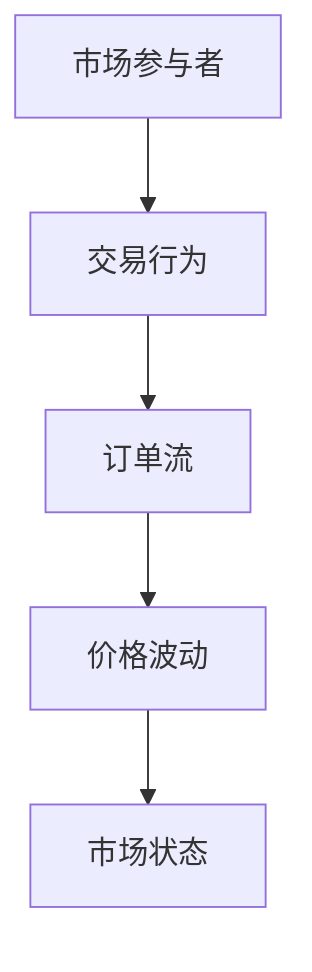
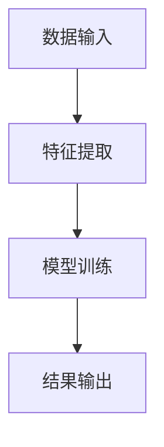

                 


# 人工智能在市场微结构变化检测中的应用

## 关键词：
- 人工智能
- 市场微结构
- 变化检测
- 时间序列分析
- 异常检测
- 深度学习

## 摘要：
人工智能在金融市场中的应用日益广泛，特别是在市场微结构变化检测方面。本文系统地探讨了人工智能技术在检测市场微观结构变化中的应用，从背景知识到算法原理，再到系统架构和项目实战，全面解析了人工智能如何帮助识别市场变化，优化交易策略，降低风险。通过详细分析和案例解读，本文为读者提供了一个从理论到实践的完整指南。

---

# 第一部分: 市场微结构变化检测的背景与基础

## 第1章: 人工智能与市场微结构概述

### 1.1 市场微结构的定义与特征

#### 1.1.1 市场微结构的基本概念
市场微结构是指金融市场上交易参与者、交易行为、订单流和价格波动等要素之间的相互作用和动态关系。它反映了市场的流动性、波动性和参与者行为特征。

#### 1.1.2 市场微结构的核心特征
市场微结构的核心特征包括：
1. **流动性**：市场的买卖订单匹配速度和交易频率。
2. **波动性**：价格的短期波动程度。
3. **参与者行为**：机构投资者、散户等不同参与者的行为模式差异。
4. **订单簿状态**：订单的深度和分布情况。

#### 1.1.3 市场微结构的变化形式
市场微结构的变化通常表现为价格波动加剧、订单簿深度变化、交易量突变等现象。这些变化反映了市场状态的转变，如从稳定状态进入高波动状态。

### 1.2 市场微结构变化检测的重要性

#### 1.2.1 市场微结构变化的经济意义
市场微结构变化能够揭示市场的潜在风险，例如流动性风险、波动性风险等。及时发现这些变化有助于投资者做出更明智的交易决策。

#### 1.2.2 变化检测在金融风险管理中的作用
通过检测市场微结构的变化，金融机构可以提前识别潜在的市场风险，调整投资策略，降低损失。

#### 1.2.3 变化检测对算法交易的影响
算法交易依赖于对市场微观结构的实时分析，变化检测能够帮助算法交易系统快速适应市场变化，优化交易策略。

### 1.3 人工智能在市场微结构分析中的应用前景

#### 1.3.1 人工智能技术的基本优势
人工智能技术具有强大的数据处理能力和模式识别能力，能够从大量复杂数据中提取有用的特征，发现隐藏的规律。

#### 1.3.2 人工智能在市场分析中的独特价值
人工智能可以实时分析市场数据，提供高频率的市场状态反馈，帮助交易者捕捉市场变化的瞬间。

#### 1.3.3 人工智能在市场微结构变化检测中的潜力
通过深度学习等技术，人工智能可以学习市场微结构的复杂模式，实现高精度的变化检测。

### 1.4 本章小结
本章介绍了市场微结构的基本概念、核心特征和变化形式，探讨了变化检测的经济意义以及人工智能在其中的应用前景。

---

## 第2章: 市场微结构变化检测的核心概念与联系

### 2.1 市场微结构变化检测的定义
市场微结构变化检测是指通过分析市场数据，识别市场微观结构中发生的显著变化，判断市场状态是否发生转变。

### 2.2 数据特征与模型特征对比

| 特征类型 | 数据特征 | 模型特征 |
|----------|----------|----------|
| 时间性   | 数据的时间序列特性 | 模型的时间依赖性 |
| 异常性   | 数据中的异常值 | 模型对异常数据的鲁棒性 |
| 关联性   | 数据中的相关性 | 模型的关联规则 |

### 2.3 实体关系图



---

# 第二部分: 市场微结构变化检测的算法原理

## 第3章: 市场微结构变化检测的算法原理

### 3.1 时间序列分析

#### 3.1.1 时间序列的基本概念
时间序列是指按照时间顺序排列的数据，常用于分析市场的动态变化。

#### 3.1.2 常见的时间序列模型
- **ARIMA模型**：自回归积分滑动平均模型，适用于线性时间序列预测。
- **Prophet模型**：Facebook开源的时间序列预测模型，适合具有明确时间周期的数据。

#### 3.1.3 基于AI的时间序列分析方法
深度学习模型如LSTM和Transformer在时间序列分析中表现出色，能够捕捉复杂的模式和长期依赖关系。

### 3.2 异常检测算法

#### 3.2.1 基于统计的异常检测
使用Z-score或IQR方法检测异常值，适用于正态分布的数据。

#### 3.2.2 基于深度学习的异常检测
使用Autoencoder或VAE模型，通过重构误差判断异常点。

#### 3.2.3 基于聚类的异常检测
通过K-means或DBSCAN算法，将数据聚类后识别异常样本。

### 3.3 深度学习模型

#### 3.3.1 RNN与LSTM网络
LSTM通过门控机制有效处理长期依赖关系，适用于金融时间序列预测。

#### 3.3.2 Transformer模型
Transformer模型通过自注意力机制捕捉全局关系，适合处理高维金融数据。

#### 3.3.3 图神经网络
图神经网络可以建模市场参与者之间的关系，适用于复杂网络结构的分析。

### 3.4 算法流程图



### 3.5 本章小结
本章介绍了时间序列分析、异常检测和深度学习模型的基本原理，并通过流程图展示了算法的整体框架。

---

# 第三部分: 市场微结构变化检测的系统架构设计

## 第4章: 市场微结构变化检测的系统架构设计

### 4.1 系统架构概述

#### 4.1.1 系统功能模块划分
- 数据采集模块：实时采集市场数据。
- 特征提取模块：提取数据特征。
- 模型训练模块：训练变化检测模型。
- 结果分析模块：分析检测结果并生成报告。

#### 4.1.2 系统架构图


---

# 第四部分: 项目实战

## 第5章: 项目实战

### 5.1 环境安装

```bash
pip install numpy pandas scikit-learn tensorflow
```

### 5.2 核心实现

#### 5.2.1 数据采集

```python
import pandas as pd
import yfinance as yf

data = yf.download('AAPL', start='2020-01-01', end='2023-01-01')
```

#### 5.2.2 特征提取

```python
from sklearn.preprocessing import StandardScaler

features = data[['Open', 'High', 'Low', 'Close']]
scaler = StandardScaler()
features_scaled = scaler.fit_transform(features)
```

#### 5.2.3 模型训练

```python
from tensorflow.keras.models import Sequential
from tensorflow.keras.layers import LSTM, Dense

model = Sequential()
model.add(LSTM(64, input_shape=(None, 4)))
model.add(Dense(1))
model.compile(loss='mse', optimizer='adam')
model.fit(features_scaled, epochs=10, batch_size=32)
```

#### 5.2.4 结果分析

```python
import matplotlib.pyplot as plt

predicted = model.predict(features_scaled)
plt.plot(predicted, label='Predicted')
plt.plot(data['Close'], label='Actual')
plt.legend()
plt.show()
```

### 5.3 项目小结
本章通过实际案例展示了如何使用Python和深度学习模型进行市场微结构变化检测，从数据采集到模型训练，再到结果分析，完整地演示了整个流程。

---

## 最佳实践 tips
1. 在实际应用中，建议结合多种算法进行对比实验，选择最优方案。
2. 数据预处理阶段，确保数据的完整性和准确性。
3. 模型部署时，考虑实时性要求，优化模型的运行效率。

## 小结
本文从理论到实践，详细介绍了人工智能在市场微结构变化检测中的应用，帮助读者理解并掌握相关技术。

## 注意事项
- 数据隐私和合规性是金融数据分析的重要考量。
- 模型的解释性和可 interpretability 对于实际应用至关重要。

## 拓展阅读
建议读者进一步阅读相关学术论文，如《LSTM-based stock market prediction》和《Deep Learning for Time Series Forecasting》。

---

## 作者信息
作者：AI天才研究院/AI Genius Institute & 禅与计算机程序设计艺术/Zen And The Art of Computer Programming  
邮箱：contact@aigeniusinstitute.com  
网址：https://aigeniusinstitute.com

---

# 结语
人工智能正在改变金融市场分析的方式，市场微结构变化检测作为其中的重要一环，凭借其强大的技术优势，将为金融行业带来更多的创新和突破。

