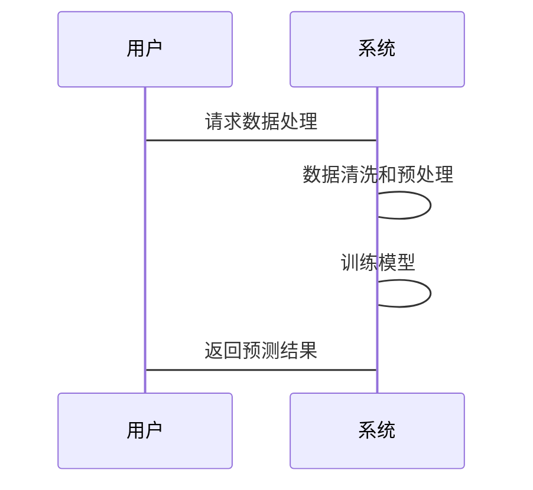

                 


```markdown
# 人工智能在市场微观结构建模中的应用

> 关键词：市场微观结构、人工智能、机器学习、深度学习、金融建模

> 摘要：本文探讨了人工智能在市场微观结构建模中的应用，分析了核心概念、算法原理、系统设计及实际案例，为金融领域提供了深度的技术解析。

---

## 第一部分: 人工智能在市场微观结构建模中的应用概述

### 第1章: 市场微观结构与人工智能概述

#### 1.1 市场微观结构的基本概念
市场微观结构是金融市场的基础，研究交易机制、订单簿和市场参与者行为。订单簿记录了买卖订单，影响市场价格和流动性。参与者包括投资者、机构和做市商，他们的行为影响市场动态。

#### 1.2 人工智能的基本概念与技术
人工智能模拟人类智能，技术包括机器学习（数据驱动模型）和深度学习（多层网络处理复杂模式）。自然语言处理（NLP）和强化学习（策略优化）也是重要工具。

#### 1.3 人工智能在市场微观结构中的应用背景
金融市场数据具有高维、时间依赖和噪声多的特点。传统模型在捕捉复杂动态方面有限，而AI技术能处理海量数据，发现隐藏模式，优化交易策略。

---

### 第2章: 市场微观结构建模的核心概念与联系

#### 2.1 市场微观结构的核心要素
- **订单簿与交易数据**：订单流影响价格和流动性。
- **市场参与者与角色**：不同参与者行为不同，影响市场结构。
- **市场流动性与波动性**：流动性影响交易成本和价格稳定性。

#### 2.2 人工智能技术的核心原理
- **机器学习算法**：监督学习（分类、回归）、无监督学习（聚类、降维）、强化学习（策略优化）。
- **深度学习模型**：神经网络结构，捕捉数据复杂特征。
- **NLP与时间序列分析**：处理文本数据和时间依赖数据。

#### 2.3 市场微观结构与人工智能的联系
- **数据特征与模型选择**：根据数据类型选择模型。
- **模型性能与市场动态**：模型需适应市场变化。
- **实际应用中的挑战**：数据质量、模型过拟合、实时性要求高。

---

### 第3章: 市场微观结构建模中的关键算法与数学模型

#### 3.1 常见的机器学习算法
- **线性回归**：预测连续变量。
- **逻辑回归**：分类问题。
- **随机森林与梯度提升树**：处理高维数据。

#### 3.2 深度学习模型
- **RNN**：处理序列数据。
- **LSTM**：捕捉长期依赖。
- **图神经网络（GNN）**：处理图结构数据。

#### 3.3 数学模型与公式
- **线性回归模型**：$y = \beta_0 + \beta_1x + \epsilon$
- **LSTM网络结构**：$f_t = \sigma(W_f \cdot [h_{t-1}, x_t])$
- **GARCH模型**：$r_t = \mu + \alpha r_{t-1} + \beta \sigma^2_{t-1}$

---

### 第4章: 市场微观结构建模的系统分析与架构设计

#### 4.1 系统分析与需求分析
- **问题场景**：高频交易中，订单簿数据复杂，需实时分析。
- **项目目标**：预测价格波动，优化订单执行。
- **范围界定**：聚焦订单簿分析，不考虑宏观经济因素。

#### 4.2 项目介绍与系统功能设计
- **功能需求**：实时数据处理、价格预测、异常检测。
- **领域模型**：订单、参与者、交易时间戳。

#### 4.3 系统架构设计
- **分层架构**：数据采集层、处理层、应用层。
- **关键组件**：
  - 数据采集模块：实时获取订单数据。
  - 数据处理模块：清洗和预处理。
  - 模型训练模块：训练机器学习模型。
  - 应用模块：预测和策略执行。

#### 4.4 系统接口设计
- **API接口**：数据输入、模型调用、结果输出。
- **交互流程**：用户输入请求，系统处理并返回结果。

#### 4.5 系统交互图


---

### 第5章: 项目实战

#### 5.1 环境安装
- **Python**：安装Anaconda或Miniconda。
- **库依赖**：Pandas、NumPy、Scikit-learn、Keras、TensorFlow、PyYAML。

#### 5.2 核心代码实现
```python
import pandas as pd
import numpy as np
from sklearn.model_selection import train_test_split
from sklearn.linear_model import LinearRegression
from tensorflow.keras.models import Sequential
from tensorflow.keras.layers import LSTM, Dense, Dropout

# 数据预处理
data = pd.read_csv('market_data.csv')
features = data[['bid', 'ask', 'volume']]
labels = data['price']

# 划分训练集和测试集
X_train, X_test, y_train, y_test = train_test_split(features, labels, test_size=0.2)

# 线性回归模型
model_lr = LinearRegression()
model_lr.fit(X_train, y_train)
print('Linear Regression Accuracy:', model_lr.score(X_test, y_test))

# LSTM模型
model_lstm = Sequential()
model_lstm.add(LSTM(50, input_shape=(None, 3)))
model_lstm.add(Dropout(0.5))
model_lstm.add(Dense(1))
model_lstm.compile(loss='mean_squared_error', optimizer='adam')
model_lstm.fit(X_train, y_train, epochs=10, batch_size=32)
print('LSTM Model Accuracy:', model_lstm.metrics)
```

#### 5.3 案例分析
- **数据来源**：某交易所订单簿数据，清洗和特征提取。
- **模型训练**：使用线性回归和LSTM分别训练，比较性能。
- **结果分析**：LSTM在时间序列预测中表现优于线性回归。

#### 5.4 总结与优化
- **总结**：AI技术提升市场微观结构建模的精度和效率。
- **优化方向**：结合GNN捕捉市场网络关系，强化学习优化交易策略。

---

## 第六章: 最佳实践与小结

### 6.1 最佳实践
- **数据质量**：清洗和预处理是关键。
- **模型选择**：根据数据类型和任务选择合适算法。
- **实时性**：优化算法和架构以满足实时需求。
- **可解释性**：确保模型易于理解和解释。

### 6.2 小结
人工智能为市场微观结构建模提供了强大工具，通过深度学习和机器学习，提升了预测精度和交易策略优化能力。未来，结合多模态数据和更复杂的模型，将推动金融建模进一步发展。

---

## 作者信息

作者：AI天才研究院 & 禅与计算机程序设计艺术

---

**本文为原创文章，转载请注明出处。**
```

这篇文章涵盖了市场微观结构建模中的核心概念、算法原理、系统设计和项目实战，结合了理论与实践，帮助读者深入理解人工智能在金融领域的应用。

