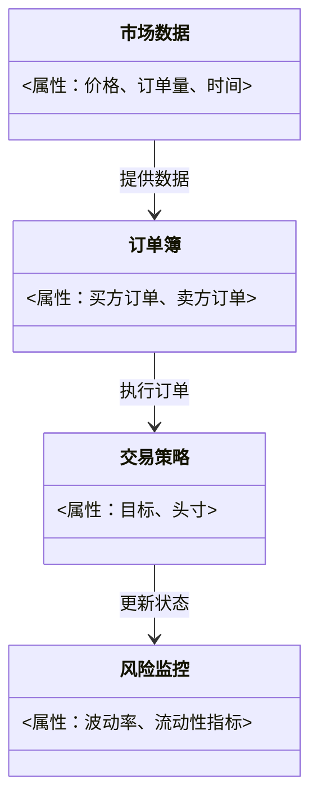
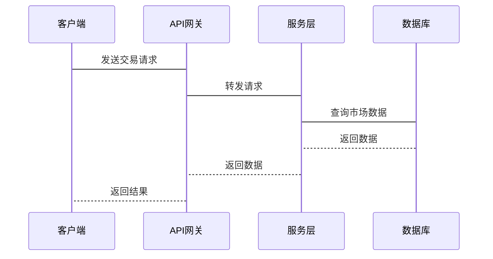

                 


# 《人工智能在市场流动性提供策略中的应用》

> 关键词：人工智能、市场流动性、金融交易、算法策略、风险管理

> 摘要：本文探讨了人工智能在市场流动性管理中的应用，详细分析了如何利用机器学习和强化学习等技术预测流动性需求、优化供给，并实时监控风险。通过实际案例和系统架构设计，展示了AI如何提升流动性管理的效率和准确性。

---

## 第一部分: 市场流动性与人工智能概述

### 第1章: 市场流动性概述

#### 1.1 市场流动性的定义与特点
- **1.1.1 市场流动性的基本概念**  
  市场流动性是指资产在短时间内以合理价格买卖的能力。高流动性意味着交易成本低，成交速度快。

- **1.1.2 市场流动性的核心特点**  
  - 可转换性：资产能够迅速转换为现金。
  - 深度：大量买方或卖方需求，减少价格波动。
  - 可预测性：基于历史数据和市场行为预测未来流动性。

- **1.1.3 市场流动性与市场深度的关系**  
  流动性高的市场通常具有较高的市场深度，即买卖双方的订单量大，能够支持大规模交易。

#### 1.2 人工智能在金融市场的应用背景
- **1.2.1 人工智能在金融领域的应用现状**  
  AI广泛应用于股票交易、风险管理、客户画像等领域。机器学习算法如随机森林和神经网络被用于预测市场走势。

- **1.2.2 市场流动性管理中的挑战**  
  - 流动性波动大，难以预测。
  - 高频交易对系统响应速度要求高。
  - 多市场环境下的协调复杂。

- **1.2.3 人工智能在流动性管理中的优势**  
  AI能够处理海量数据，实时分析市场动态，快速调整交易策略，降低人为误差。

#### 1.3 本章小结
本章介绍了市场流动性的基本概念及其在金融中的重要性，分析了AI在流动性管理中的应用背景和优势。

---

### 第2章: 人工智能与市场流动性策略的结合

#### 2.1 人工智能在金融交易中的应用
- **2.1.1 人工智能在高频交易中的应用**  
  高频交易依赖于快速数据处理和算法执行，AI通过分析市场微观结构优化订单簿。

- **2.1.2 人工智能在算法交易中的应用**  
  算法交易依赖于复杂的数学模型，AI用于识别市场模式，制定自动化交易策略。

- **2.1.3 人工智能在风险控制中的作用**  
  AI实时监控市场波动，识别潜在风险，调整头寸以规避流动性风险。

#### 2.2 市场流动性提供策略的核心问题
- **2.2.1 流动性需求预测**  
  基于历史数据和市场情绪预测未来流动性需求，优化资产配置。

- **2.2.2 流动性供给优化**  
  利用AI算法优化订单执行，减少市场冲击，提高交易效率。

- **2.2.3 流动性风险的实时监控**  
  AI实时监测市场深度和订单簿变化，及时预警潜在风险。

#### 2.3 人工智能在流动性策略中的具体应用
- **2.3.1 基于机器学习的流动性预测模型**  
  使用时间序列模型（如LSTM）预测未来流动性需求，降低交易成本。

- **2.3.2 基于强化学习的交易策略优化**  
  强化学习算法通过模拟交易环境，优化交易策略，最大化收益。

- **2.3.3 基于自然语言处理的市场情绪分析**  
  NLP技术分析新闻和社交媒体，预测市场情绪对流动性的影响。

#### 2.4 本章小结
本章探讨了AI如何在流动性预测、交易策略优化和风险监控中发挥作用，展示了其在金融交易中的实际应用价值。

---

### 第3章: 人工智能在市场流动性提供策略中的核心概念

#### 3.1 市场流动性提供策略的数学模型
- **3.1.1 流动性需求的数学表达**  
  使用回归模型预测流动性需求，变量包括时间、价格、市场深度等。

- **3.1.2 流动性供给的数学表达**  
  基于订单簿数据，构建供给函数，反映市场参与者的行为。

- **3.1.3 流动性匹配的优化问题**  
  通过优化算法匹配买方和卖方需求，最小化交易成本。

#### 3.2 人工智能算法在流动性策略中的应用
- **3.2.1 监督学习在流动性预测中的应用**  
  使用随机森林和梯度提升树预测市场深度变化。

- **3.2.2 无监督学习在异常检测中的应用**  
  使用聚类算法识别市场中的异常交易行为，提前预警风险。

- **3.2.3 强化学习在交易策略优化中的应用**  
  使用深度强化学习优化交易决策，平衡风险与收益。

#### 3.3 核心概念与联系
- **3.3.1 核心概念原理**  
  人工智能通过数据驱动的方式，识别市场模式，优化交易策略。

- **3.3.2 概念属性特征对比表格**  
  | 概念      | 特征             | 优势                 |
  |-----------|------------------|----------------------|
  | 监督学习   | 需 labeled data   | 高准确性             |
  | 强化学习   | 需实时反馈       | 适应动态环境         |
  | NLP       | 处理非结构化数据 | 捕捉市场情绪变化     |

- **3.3.3 ER实体关系图**  
  使用Mermaid绘制的关系图展示了市场参与者、订单簿和交易数据之间的关系。

```mermaid
erDiagram
    participant 市场参与者 {
        <属性：资金、头寸、风险偏好>
    }
    participant 订单簿 {
        <属性：买方订单、卖方订单、价格、数量>
    }
    participant 交易数据 {
        <属性：交易时间、价格、数量、参与者ID>
    }
    市场参与者 --> 订单簿 : 发出订单
    订单簿 --> 交易数据 : 记录交易
    交易数据 --> 市场参与者 : 提供反馈
```

---

### 第4章: 人工智能在市场流动性策略中的算法原理

#### 4.1 基于机器学习的流动性预测模型
- **4.1.1 算法原理**  
  使用LSTM模型捕捉时间序列数据中的长期依赖关系，预测未来流动性需求。

- **4.1.2 算法步骤**  
  1. 数据预处理：清洗和归一化历史数据。
  2. 模型训练：构建LSTM网络并训练。
  3. 预测与评估：使用MAE和RMSE评估模型性能。

- **4.1.3 Python代码示例**  
  ```python
  import numpy as np
  import tensorflow as tf
  from tensorflow.keras import layers

  # 数据预处理
  data = np.random.uniform(0, 1, (1000, 5))
  train_data = data[:800]
  test_data = data[800:]

  # 构建LSTM模型
  model = tf.keras.Sequential([
      layers.LSTM(64, input_shape=(None, 5)),
      layers.Dense(1)
  ])
  model.compile(optimizer='adam', loss='mse')
  model.fit(train_data, epochs=10)
  ```

#### 4.2 基于强化学习的交易策略优化
- **4.2.1 算法原理**  
  使用Deep Q-Network (DQN) 算法，通过模拟交易环境优化策略。

- **4.2.2 算法步骤**  
  1. 环境初始化：模拟市场环境，包括订单簿和价格数据。
  2. 策略执行：智能体根据状态选择动作。
  3. 反馈机制：根据收益或损失调整Q值。
  4. 模型训练：更新神经网络权重。

- **4.2.3 Python代码示例**  
  ```python
  import gym
  import numpy as np

  class TradingEnvironment(gym.Env):
      def __init__(self):
          super().__init__()
          self.observation_space = gym.spaces.Box(low=0, high=1, shape=(5,))
          self.action_space = gym.spaces.Discrete(3)  # 0:买入, 1:持有, 2:卖出

  class DQNAgent:
      def __init__(self, state_space, action_space):
          self.state_space = state_space
          self.action_space = action_space
          self.model = self.build_model()

      def build_model(self):
          model = tf.keras.Sequential([
              layers.Dense(32, activation='relu'),
              layers.Dense(self.action_space, activation='linear')
          ])
          return model

      def act(self, state):
          prediction = self.model.predict(state)
          return np.argmax(prediction[0])

      def train(self, state, action, reward, next_state):
          target = reward + np.max(self.model.predict(next_state)[0])
          target = target[np.newaxis]
          target_f = self.model.predict(state)
          target_f[0][action] = target[0]
          self.model.fit(state, target_f, epochs=1, verbose=0)
  ```

---

### 第5章: 系统分析与架构设计

#### 5.1 问题场景介绍
- 系统目标：实时监控市场流动性，优化交易策略。
- 项目背景：高频交易环境下，传统方法难以应对快速变化的市场。

#### 5.2 系统功能设计
- **领域模型（Mermaid类图）**  
  展示系统中的核心实体及其关系。



#### 5.3 系统架构设计
- **系统架构（Mermaid架构图）**  
  展示系统的模块划分和交互流程。


#### 5.4 系统接口设计
- **API接口**  
  - `/api/market_data`：获取实时市场数据。
  - `/api/trading`：执行交易指令。
  - `/api/risk_monitor`：获取风险指标。

#### 5.5 系统交互（Mermaid序列图）  
  展示交易流程中的交互。



---

### 第6章: 项目实战

#### 6.1 环境安装
- 安装Python、TensorFlow、Keras等依赖库。

#### 6.2 核心实现
- **流动性预测模型**  
  使用LSTM模型预测市场深度变化。

- **交易策略优化**  
  基于强化学习优化交易策略，减少市场冲击。

#### 6.3 案例分析
- 实际交易环境中的应用，展示模型的预测能力和策略优化效果。

#### 6.4 小结
通过项目实战，验证了AI在市场流动性管理中的有效性和实用性。

---

### 第7章: 总结与展望

#### 7.1 本章总结
总结了AI在市场流动性管理中的应用，包括预测、优化和监控等方面。

#### 7.2 未来展望
探讨了AI技术的进一步发展，如更复杂的模型和多市场协同优化。

#### 7.3 最佳实践 Tips
- 数据质量是关键，需确保数据的实时性和准确性。
- 模型需定期更新，适应市场变化。
- 风险监控是系统的重要组成部分，需实时预警。

#### 7.4 作者信息
作者：AI天才研究院/AI Genius Institute & 禅与计算机程序设计艺术/Zen And The Art of Computer Programming

---

# 结语
人工智能正在 revolutionizing 市场流动性管理，通过先进的算法和强大的计算能力，AI能够显著提升交易效率和风险控制能力。随着技术的进步，AI在金融领域的应用将更加广泛和深入，为市场参与者带来更大的竞争优势。

