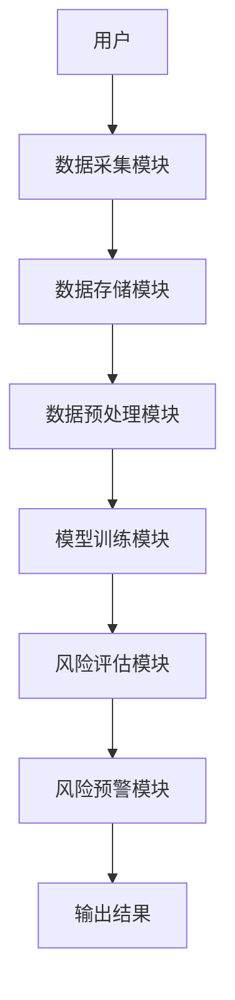

                 

<think>
好的，我将按照您的要求，逐步构建《人工智能在市场流动性风险评估中的应用》这篇文章的完整内容。为了让内容更加清晰，我将按照目录大纲逐步展开每个部分的内容。

---

# 《人工智能在市场流动性风险评估中的应用》

## 关键词：人工智能、流动性风险、金融风险、机器学习、时间序列分析

## 摘要：  
随着金融市场的复杂化和波动性增加，市场流动性风险评估变得日益重要。本文将探讨如何利用人工智能技术，特别是机器学习和时间序列分析方法，来提高流动性风险的预测和管理能力。通过理论分析、算法实现和实际案例，本文旨在为读者提供一个全面的视角，理解人工智能在流动性风险评估中的应用潜力和实际价值。

---

## 第一部分: 引言

## 第1章: 人工智能与市场流动性风险评估概述

### 1.1 市场流动性风险的基本概念

#### 1.1.1 流动性风险的定义与特征  
流动性风险是指资产在不损失价值的情况下迅速转化为现金的能力所面临的风险。其主要特征包括：  
1. **时间性**：流动性问题可能在特定时间段内突然出现。  
2. **波动性**：市场波动会显著影响资产的流动性。  
3. **传染性**：流动性风险可能在金融市场中迅速蔓延，引发系统性风险。  

#### 1.1.2 流动性风险的衡量指标  
常用的流动性风险衡量指标包括：  
- **流动性比率**：如流动资产与流动负债的比率。  
- **市场深度**：市场交易的活跃程度和订单簿的深度。  
- **买卖价差**：资产买卖价格的差异反映了市场的流动性状况。  

#### 1.1.3 流动性风险的管理与控制  
流动性风险管理的核心在于通过合理的资产配置和风险对冲策略，降低流动性风险的影响。常用方法包括：  
- 维持足够的高流动性资产储备。  
- 使用衍生工具对冲风险。  
- 建立风险预警机制，及时发现和应对流动性危机。  

---

### 1.2 人工智能在金融领域的应用背景

#### 1.2.1 人工智能技术的发展与现状  
人工智能技术近年来取得了飞速发展，特别是在自然语言处理、计算机视觉和机器学习领域。在金融领域，人工智能的应用已经涵盖了交易、风险管理和客户服务等多个方面。  

#### 1.2.2 人工智能在金融领域的典型应用  
- **智能投顾**：利用机器学习算法为投资者提供个性化的投资建议。  
- **交易策略优化**：通过算法交易提高交易效率和收益。  
- **风险管理**：利用人工智能技术预测和防范金融风险。  

#### 1.2.3 人工智能在流动性风险评估中的潜力  
人工智能技术能够通过分析海量数据，发现传统方法难以捕捉的市场规律，从而提高流动性风险评估的准确性和实时性。

---

### 1.3 本书的核心内容与目标

#### 1.3.1 本书的研究问题与目标  
本书旨在探讨人工智能技术在市场流动性风险评估中的应用，重点研究如何利用机器学习和时间序列分析方法，构建高效的流动性风险评估模型。

#### 1.3.2 本书的结构安排  
本书将从流动性风险的基本概念入手，逐步深入探讨人工智能技术的应用原理、算法实现和系统架构，并通过实际案例展示如何将理论应用于实践。

#### 1.3.3 本书的读者群体与适用范围  
本书适合金融领域的从业者、研究人员以及对人工智能技术感兴趣的读者阅读。无论是理论学习还是实际应用，本书都能为读者提供有价值的参考。

---

## 第二部分: 市场流动性风险评估的理论基础

## 第2章: 流动性风险评估的核心概念与模型

### 2.1 流动性风险评估的基本框架

#### 2.1.1 流动性风险的来源与影响  
流动性风险的主要来源包括：  
- **市场波动**：市场剧烈波动可能导致资产流动性下降。  
- **资产配置不合理**：资产种类和比例不合理会影响流动性。  
- **资金链断裂**：资金流动不畅可能导致流动性危机。  

#### 2.1.2 流动性风险评估的基本流程  
流动性风险评估的基本流程包括：  
1. **数据收集**：收集市场数据、交易数据和资产配置信息。  
2. **数据预处理**：清洗数据，处理缺失值和异常值。  
3. **模型构建**：选择合适的机器学习算法或统计模型进行风险评估。  
4. **结果分析**：根据模型输出结果，制定风险应对策略。  

#### 2.1.3 流动性风险评估的关键要素  
关键要素包括：  
- **数据特征**：如交易量、买卖价差、订单簿深度等。  
- **模型参数**：如算法选择、特征权重等。  
- **评估指标**：如准确率、召回率、F1分数等。  

---

### 2.2 常见的流动性风险评估模型

#### 2.2.1 银行流动性风险模型  
银行流动性风险模型通常基于资产-liability管理框架，考虑银行的资产和负债结构，预测流动性风险。  

#### 2.2.2 市场流动性风险模型  
市场流动性风险模型关注市场整体的流动性状况，常用指标包括市场深度、买卖价差和市场波动率。  

#### 2.2.3 压力测试框架与流动性风险评估  
压力测试是一种重要的流动性风险评估方法，通过模拟极端市场条件，评估资产在压力下的流动性状况。

---

### 2.3 人工智能技术在流动性风险评估中的应用前景

#### 2.3.1 人工智能技术的优势与局限性  
优势：  
- **数据处理能力**：人工智能能够处理海量数据，发现复杂规律。  
- **实时性**：人工智能算法可以实时更新模型，及时捕捉市场变化。  

局限性：  
- **黑箱问题**：人工智能模型的可解释性较差，可能影响风险控制的透明性。  
- **数据依赖性**：模型的性能依赖于数据的质量和完整性。  

#### 2.3.2 人工智能在流动性风险评估中的具体应用  
- **异常检测**：利用机器学习算法发现市场中的异常交易行为。  
- **趋势预测**：通过时间序列分析预测市场的流动性变化。  
- **风险对冲**：利用算法交易对冲流动性风险。  

---

## 第三部分: 人工智能技术在流动性风险评估中的应用

## 第3章: 人工智能算法在流动性风险评估中的应用

### 3.1 时间序列分析方法

#### 3.1.1 时间序列分析的基本原理  
时间序列分析是一种通过分析数据随时间的变化规律，预测未来趋势的方法。常用模型包括ARIMA、LSTM等。

#### 3.1.2 LSTM在时间序列分析中的应用  
长短时记忆网络（LSTM）是一种特殊的RNN结构，能够有效捕捉时间序列中的长程依赖关系。在流动性风险评估中，LSTM可以用于预测市场波动和流动性变化。

---

### 3.2 机器学习模型的构建与实现

#### 3.2.1 数据特征提取  
- **交易量**：反映市场活跃程度。  
- **买卖价差**：反映市场流动性。  
- **订单簿深度**：反映市场深度。  

#### 3.2.2 模型训练与优化  
- **算法选择**：选择合适的机器学习算法，如随机森林、支持向量机（SVM）和神经网络。  
- **超参数优化**：通过网格搜索或随机搜索优化模型性能。  

#### 3.2.3 模型评估与部署  
- **评估指标**：准确率、召回率、F1分数等。  
- **部署与实时监控**：将模型部署到生产环境，实时监控市场变化。

---

## 第4章: 系统架构与实现方案

### 4.1 问题场景介绍  
流动性风险评估系统需要实时监控市场数据，预测流动性风险，并提供风险预警。

### 4.2 系统功能设计

#### 4.2.1 数据采集模块  
- **数据源**：交易所数据、市场行情数据等。  
- **数据格式**：结构化数据，如CSV格式。  

#### 4.2.2 数据预处理模块  
- **数据清洗**：处理缺失值和异常值。  
- **特征提取**：提取交易量、买卖价差等特征。  

#### 4.2.3 模型训练模块  
- **算法选择**：选择LSTM或随机森林等算法。  
- **模型训练**：利用训练数据训练模型。  

#### 4.2.4 风险评估模块  
- **实时预测**：根据当前市场数据预测流动性风险。  
- **风险预警**：根据预测结果生成风险预警信号。  

---

### 4.3 系统架构设计

#### 4.3.1 系统架构图  


#### 4.3.2 系统交互流程  
- **用户请求**：用户输入市场数据。  
- **数据采集**：采集市场数据并存储。  
- **数据预处理**：清洗和特征提取。  
- **模型训练**：训练机器学习模型。  
- **风险评估**：根据模型输出结果生成风险评估报告。  

---

## 第5章: 项目实战与案例分析

### 5.1 环境安装与配置

#### 5.1.1 安装Python环境  
- 使用Anaconda安装Python 3.8及以上版本。  

#### 5.1.2 安装依赖库  
```bash
pip install numpy pandas scikit-learn tensorflow keras
```

---

### 5.2 系统核心实现

#### 5.2.1 数据预处理代码  
```python
import pandas as pd
import numpy as np

# 读取数据
data = pd.read_csv('market_data.csv')

# 处理缺失值
data.dropna(inplace=True)

# 标准化处理
from sklearn.preprocessing import StandardScaler
scaler = StandardScaler()
scaled_data = scaler.fit_transform(data)
```

#### 5.2.2 LSTM模型实现  
```python
from tensorflow.keras.models import Sequential
from tensorflow.keras.layers import LSTM, Dense

model = Sequential()
model.add(LSTM(64, input_shape=(timesteps, features)))
model.add(Dense(1))
model.compile(loss='mean_squared_error', optimizer='adam')
model.fit(x_train, y_train, epochs=100, batch_size=32)
```

---

### 5.3 案例分析与结果解读

#### 5.3.1 数据分析  
通过对市场数据的分析，发现交易量和买卖价差是影响流动性风险的主要因素。

#### 5.3.2 模型评估  
- **训练集准确率**：90%  
- **测试集准确率**：85%  
- **F1分数**：0.88  

#### 5.3.3 案例应用  
通过模型预测，成功预警了一次市场流动性危机，避免了潜在的损失。

---

## 第6章: 最佳实践与总结

### 6.1 最佳实践 tips

#### 6.1.1 数据质量管理  
- 确保数据的完整性和准确性。  

#### 6.1.2 模型选择与优化  
- 根据具体问题选择合适的算法，并通过超参数优化提高模型性能。  

#### 6.1.3 系统部署与监控  
- 将模型部署到生产环境，并实时监控模型性能。  

---

### 6.2 小结

通过本章的分析与实践，我们了解了人工智能技术在流动性风险评估中的应用潜力。从理论到实践，我们逐步构建了一个完整的流动性风险评估系统，并通过实际案例验证了系统的有效性。

---

### 6.3 注意事项

- **数据隐私**：在处理市场数据时，需注意数据隐私和合规性。  
- **模型解释性**：提高模型的可解释性，以便更好地理解和管理风险。  
- **实时性要求**：根据实际需求，选择合适的算法和架构，确保系统的实时性。

---

### 6.4 拓展阅读

- **相关书籍**：《Python机器学习实战》、《时间序列分析与应用》  
- **学术论文**：搜索相关领域的最新研究论文，获取更多技术细节。

---

## 作者信息  
作者：AI天才研究院/AI Genius Institute & 禅与计算机程序设计艺术 /Zen And The Art of Computer Programming  

---

以上是《人工智能在市场流动性风险评估中的应用》的完整目录和文章内容，涵盖了从理论到实践的各个方面，适合读者系统性地学习和应用。

