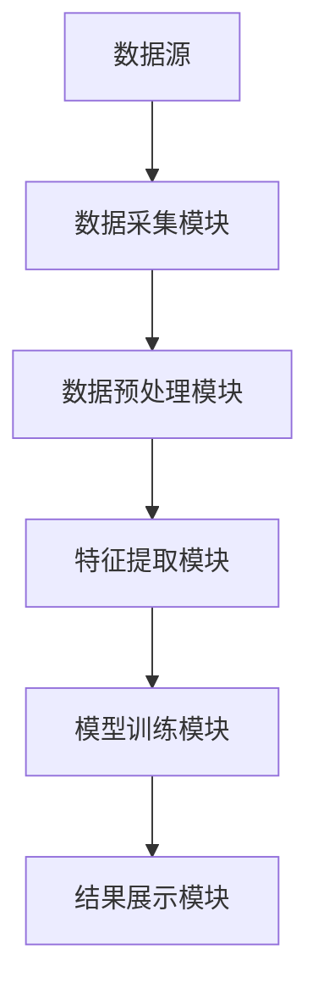

                 


# 人工智能在股市估值分析中的应用前景

## 关键词：人工智能，股市估值，机器学习，深度学习，股票分析，金融应用

## 摘要：人工智能技术在金融领域的应用日益广泛，尤其是在股市估值分析中展现出巨大的潜力。本文将从人工智能的基本概念、机器学习与深度学习的算法原理，到实际的股市估值系统实现，全面探讨人工智能在股市估值分析中的应用前景。通过详细分析数据处理、模型训练、系统架构等关键环节，结合实际案例，揭示人工智能技术如何提升股市估值的准确性和效率。

---

## 第一部分: 人工智能与股市估值分析的背景与基础

### 第1章: 人工智能与股市估值分析的背景

#### 1.1 人工智能的基本概念与技术发展

##### 1.1.1 人工智能的定义与核心概念
人工智能（Artificial Intelligence, AI）是指通过计算机模拟人类智能的技术，包括学习、推理、自适应等能力。核心概念包括：
- **数据驱动**：AI依赖大量数据进行训练和推理。
- **算法优化**：通过优化算法提升模型性能。
- **应用场景**：从图像识别到自然语言处理，AI已在多个领域得到广泛应用。

##### 1.1.2 人工智能技术的演进历程
人工智能的发展经历了三个阶段：
1. **符号推理阶段（1950s-1980s）**：基于逻辑推理的AI系统，如专家系统。
2. **机器学习阶段（1990s-2010s）**：基于数据的机器学习算法，如支持向量机（SVM）和随机森林。
3. **深度学习阶段（2010s至今）**：基于神经网络的深度学习算法，如卷积神经网络（CNN）和循环神经网络（RNN）。

##### 1.1.3 人工智能在金融领域的应用现状
AI在金融领域的应用包括：
- **股票预测**：利用历史数据预测股票价格。
- **风险评估**：通过AI模型评估投资风险。
- **智能投顾**：提供个性化的投资建议。

#### 1.2 股市估值分析的基本原理

##### 1.2.1 股票估值的定义与方法
股票估值是指对股票内在价值的评估，常用方法包括：
- **基本面分析**：通过公司财务数据（如收入、利润）评估股票价值。
- **技术分析**：通过价格走势预测未来价格。
- **市场情绪分析**：通过市场情绪指标（如VIX指数）评估市场风险。

##### 1.2.2 市场情绪与股票价格的关系
市场情绪是影响股票价格的重要因素。当市场情绪乐观时，股票价格上涨；当市场情绪悲观时，股票价格下跌。

##### 1.2.3 传统估值模型的优缺点
- **优点**：传统估值模型（如PE、PB模型）简单易懂，适用于稳定市场环境。
- **缺点**：无法捕捉市场情绪变化，难以应对复杂市场环境。

#### 1.3 人工智能在金融领域的应用前景

##### 1.3.1 人工智能在金融领域的核心优势
- **数据处理能力**：AI能够处理海量数据，提取有用的特征。
- **实时分析能力**：AI能够实时分析市场数据，提供快速决策支持。
- **自动化交易能力**：AI能够实现自动化交易，降低人为干预风险。

##### 1.3.2 人工智能在股票估值中的潜在价值
- **提高估值准确性**：通过AI技术，能够更准确地预测股票价格。
- **降低投资风险**：通过AI模型，能够更好地识别市场风险。
- **提升投资效率**：通过自动化分析，能够提高投资效率。

##### 1.3.3 当前市场中的应用案例分析
当前，AI在股票估值中的应用案例包括：
- **量化交易**：通过AI算法进行高频交易。
- **智能投顾**：通过AI提供个性化的投资建议。
- **市场预测**：通过AI预测市场趋势。

#### 1.4 本章小结
本章介绍了人工智能的基本概念和技术发展，分析了股市估值的基本原理，探讨了人工智能在金融领域的应用前景，为后续章节的深入分析奠定了基础。

---

## 第二部分: 人工智能技术在股市估值中的应用

### 第2章: 机器学习与深度学习在股市分析中的应用

#### 2.1 机器学习的基本原理

##### 2.1.1 机器学习的定义与分类
机器学习是一种通过数据训练模型的技术，主要分为：
- **监督学习**：基于标签数据进行训练，如回归和分类任务。
- **无监督学习**：基于无标签数据进行训练，如聚类和降维任务。
- **强化学习**：通过与环境交互进行学习，如游戏和机器人控制任务。

##### 2.1.2 监督学习、无监督学习与强化学习的区别
- **监督学习**：需要标签数据，适用于分类和回归任务。
- **无监督学习**：不需要标签数据，适用于聚类和降维任务。
- **强化学习**：通过奖励机制优化决策，适用于复杂环境中的决策任务。

##### 2.1.3 机器学习在股市分析中的应用案例
机器学习在股市分析中的应用包括：
- **股票价格预测**：利用回归算法预测股票价格。
- **市场情绪分析**：利用分类算法分析市场情绪。
- **风险评估**：利用聚类算法评估市场风险。

#### 2.2 深度学习的核心算法与特点

##### 2.2.1 深度学习的定义与核心算法
深度学习是一种基于人工神经网络的机器学习技术，核心算法包括：
- **卷积神经网络（CNN）**：适用于图像识别和序列数据处理。
- **循环神经网络（RNN）**：适用于时间序列数据处理。
- **长短期记忆网络（LSTM）**：适用于长序列数据处理。

##### 2.2.2 深度学习与机器学习的区别
- **特征提取能力**：深度学习能够自动提取特征，而机器学习需要手动提取特征。
- **计算复杂度**：深度学习需要更多的计算资源，而机器学习计算需求较低。
- **数据需求**：深度学习需要更多的数据，而机器学习数据需求相对较少。

##### 2.2.3 深度学习在股票价格预测中的优势
深度学习在股票价格预测中的优势包括：
- **自动特征提取**：深度学习能够自动提取有用的特征，减少人工干预。
- **复杂模式识别**：深度学习能够识别复杂的市场模式，提高预测准确性。
- **实时预测能力**：深度学习能够实时处理数据，提供快速预测。

#### 2.3 机器学习与深度学习在股市估值中的应用

##### 2.3.1 数据预处理与特征提取
数据预处理是机器学习和深度学习的基础，包括：
- **数据清洗**：处理缺失值、异常值和重复值。
- **数据标准化**：将数据归一化或标准化，适用于模型训练。
- **特征选择**：通过特征重要性分析选择有用的特征。

##### 2.3.2 基于机器学习的股票估值模型
基于机器学习的股票估值模型包括：
- **线性回归模型**：适用于线性关系的股票估值。
- **支持向量机（SVM）模型**：适用于分类和回归任务的股票估值。
- **随机森林模型**：适用于非线性关系的股票估值。

##### 2.3.3 深度学习在股票估值中的创新应用
深度学习在股票估值中的创新应用包括：
- **LSTM网络**：适用于时间序列数据的股票价格预测。
- **注意力机制**：通过注意力机制捕捉重要的市场信息。
- **多模态模型**：结合文本、图像等多种数据源进行股票估值。

#### 2.4 本章小结
本章详细介绍了机器学习和深度学习的基本原理，探讨了它们在股市估值中的应用，分析了深度学习在股票价格预测中的优势，为后续章节的系统设计奠定了基础。

---

## 第三部分: 股市估值分析的系统架构与算法实现

### 第3章: 股市估值分析的系统架构设计

#### 3.1 系统功能模块划分

##### 3.1.1 数据采集与处理模块
数据采集与处理模块负责从多个数据源（如股票交易所、新闻网站）获取股票相关数据，并进行清洗和预处理。

##### 3.1.2 特征提取与选择模块
特征提取与选择模块通过对数据进行特征提取和选择，筛选出对股票估值有重要影响的特征。

##### 3.1.3 模型训练与评估模块
模型训练与评估模块负责对股票估值模型进行训练和评估，选择最优模型。

##### 3.1.4 结果展示与分析模块
结果展示与分析模块负责将模型预测结果展示出来，并进行分析和解释。

#### 3.2 系统架构的Mermaid图


#### 3.3 系统功能的详细设计

##### 3.3.1 数据采集模块的功能与实现
数据采集模块需要实现以下功能：
- **数据获取**：从股票交易所API获取实时数据。
- **数据存储**：将获取的数据存储到数据库中。

##### 3.3.2 特征提取模块的关键技术
特征提取模块的关键技术包括：
- **时间序列分析**：分析股票价格的时间序列数据。
- **文本挖掘**：从新闻、社交媒体等文本数据中提取情感特征。

##### 3.3.3 模型训练模块的算法选择
模型训练模块需要选择合适的算法：
- **监督学习算法**：如线性回归、SVM、随机森林。
- **深度学习算法**：如LSTM、GRU。

##### 3.3.4 结果展示模块的可视化设计
结果展示模块需要设计友好的可视化界面：
- **图表展示**：通过折线图、柱状图等展示股票价格走势。
- **预测结果展示**：展示模型预测的股票价格及置信区间。

#### 3.4 本章小结
本章详细设计了股市估值分析系统的功能模块和系统架构，为后续章节的系统实现奠定了基础。

---

## 第四部分: 基于人工智能的股市估值系统实现

### 第4章: 基于机器学习的股票估值系统实现

#### 4.1 系统实现的环境搭建

##### 4.1.1 Python环境的安装与配置
安装Python 3.8及以上版本，配置环境变量。

##### 4.1.2 数据处理库（Pandas、NumPy）的安装与使用
安装Pandas和NumPy库：
```bash
pip install pandas numpy
```

##### 4.1.3 机器学习库（Scikit-learn、XGBoost）的安装与使用
安装Scikit-learn和XGBoost库：
```bash
pip install scikit-learn xgboost
```

#### 4.2 系统核心代码实现

##### 4.2.1 数据预处理与特征选择的代码实现
```python
import pandas as pd
import numpy as np

# 数据加载
data = pd.read_csv('stock_data.csv')

# 数据清洗
data = data.dropna()
data = data.drop_duplicates()

# 特征选择
features = ['open', 'high', 'low', 'volume']
target = 'close'

X = data[features]
y = data[target]
```

##### 4.2.2 机器学习模型的训练与优化
```python
from sklearn.model_selection import train_test_split
from sklearn.ensemble import RandomForestRegressor
from sklearn.metrics import mean_squared_error

# 数据划分
X_train, X_test, y_train, y_test = train_test_split(X, y, test_size=0.2)

# 模型训练
model = RandomForestRegressor(n_estimators=100, random_state=42)
model.fit(X_train, y_train)

# 模型评估
y_pred = model.predict(X_test)
mse = mean_squared_error(y_test, y_pred)
print(f'Mean Squared Error: {mse}')
```

##### 4.2.3 模型评估
评估模型的准确性和稳定性，可以通过交叉验证和网格搜索优化模型参数。

##### 4.2.4 深度学习模型的实现与优化
使用深度学习模型（如LSTM）进行股票价格预测：
```python
from keras.models import Sequential
from keras.layers import LSTM, Dense

# 模型构建
model = Sequential()
model.add(LSTM(128, input_shape=(timesteps, features)))
model.add(Dense(1))
model.compile(loss='mean_squared_error', optimizer='adam')

# 模型训练
model.fit(X_train, y_train, epochs=100, batch_size=32, validation_split=0.2)
```

#### 4.3 本章小结
本章详细介绍了基于机器学习的股票估值系统的实现过程，包括环境搭建、数据预处理、模型训练与优化，以及模型评估。通过具体代码实现，展示了如何利用AI技术提升股票估值的准确性和效率。

---

## 作者：AI天才研究院 & 禅与计算机程序设计艺术

