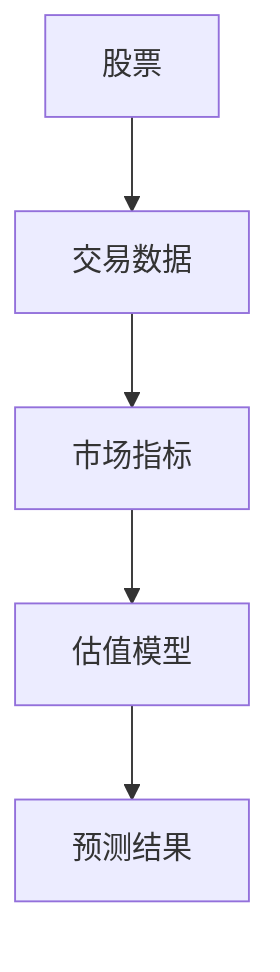
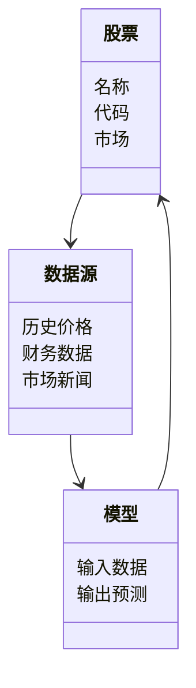

                 


# 人工智能在股市估值预测中的应用

## 关键词  
人工智能，股市估值，机器学习，深度学习，时间序列分析

## 摘要  
本文系统地探讨了人工智能在股市估值预测中的应用，从背景介绍到核心概念，从算法原理到数学模型，从系统设计到项目实战，结合实际案例和最佳实践，全面解析了如何利用人工智能技术提高股市估值的准确性和效率。文章通过详细的理论分析和实践指导，为读者提供了一套完整的解决方案。

---

# 第1章 背景介绍

## 1.1 问题背景

### 1.1.1 股市估值预测的复杂性
股市估值预测是金融市场中的核心问题之一。股票价格受到多种因素的影响，包括宏观经济指标、公司财务数据、市场情绪、行业动态等。传统的方法依赖于经验丰富的分析师和复杂的数学模型，但仍然存在很大的局限性。

### 1.1.2 传统估值方法的局限性
传统估值方法主要包括基本面分析和技术分析。基本面分析依赖于对公司财务数据的深入研究，但忽略了市场情绪和宏观经济波动的影响；技术分析依赖于历史价格数据，但难以捕捉市场变化的非线性特征。

### 1.1.3 人工智能在金融领域的潜力
人工智能技术，特别是机器学习和深度学习，能够处理海量数据，发现复杂模式，并进行实时预测。这些技术在金融领域的应用日益广泛，尤其是在股票价格预测和估值分析方面。

## 1.2 问题描述

### 1.2.1 股票估值的核心要素
股票估值的核心要素包括：
1. **基本面数据**：收入、利润、资产负债表等。
2. **市场数据**：历史价格、成交量、市场指数等。
3. **行业数据**：行业趋势、竞争对手分析等。
4. **宏观经济数据**：GDP、利率、通货膨胀等。

### 1.2.2 人工智能如何解决估值预测中的问题
人工智能可以通过以下方式解决估值预测中的问题：
1. **非线性关系建模**：利用深度学习模型捕捉数据中的非线性关系。
2. **实时数据处理**：利用流数据处理技术实时分析市场动态。
3. **情绪分析**：通过自然语言处理技术分析新闻和社交媒体，捕捉市场情绪。

### 1.2.3 估值预测的边界与外延
估值预测的边界包括数据质量和模型假设，而外延则涉及风险管理、投资组合优化等更广泛的应用。

## 1.3 核心概念与联系

### 1.3.1 核心概念原理
- **数据**：包括结构化数据（如财务报表）和非结构化数据（如新闻文章）。
- **模型**：包括监督学习模型（如回归、分类）和无监督学习模型（如聚类）。
- **预测任务**：包括回归任务（如预测股票价格）和分类任务（如预测股票涨跌）。

### 1.3.2 核心概念属性特征对比
以下是对核心概念属性特征的对比表格：

| 概念     | 属性         |
|----------|--------------|
| 数据     | 结构化/非结构化 |
| 模型     | 监督/无监督    |
| 预测任务 | 分类/回归      |

### 1.3.3 ER实体关系图
以下是一个简单的ER实体关系图：



## 1.4 本章小结

---

# 第2章 核心概念与联系

## 2.1 核心概念原理

### 2.1.1 机器学习与深度学习的原理
- **机器学习**：通过训练数据学习特征与目标变量之间的关系。
- **深度学习**：通过多层神经网络自动提取数据中的特征。

### 2.1.2 时间序列分析的基本概念
时间序列分析是研究数据随时间变化的模式和趋势，常用于股票价格预测。

### 2.1.3 股市数据的特征与处理
- **特征提取**：从原始数据中提取有用的特征。
- **数据清洗**：处理缺失值和异常值。
- **数据标准化**：将数据归一化，方便模型训练。

## 2.2 核心概念属性特征对比

### 2.2.1 数据特征对比
以下是对数据特征的对比：

| 数据类型 | 描述                       |
|----------|----------------------------|
| 结构化数据 | 例如财务报表数据，具有明确的结构 |
| 非结构化数据 | 例如新闻文章，没有明确的结构 |

### 2.2.2 模型特征对比
以下是对模型特征的对比：

| 模型类型 | 描述                       |
|----------|----------------------------|
| 监督学习  | 例如回归和分类任务         |
| 无监督学习 | 例如聚类任务               |

### 2.2.3 任务特征对比
以下是对任务特征的对比：

| 任务类型 | 描述                       |
|----------|----------------------------|
| 回归任务 | 预测连续值，如股票价格       |
| 分类任务 | 预测离散值，如股票涨跌       |

## 2.3 实体关系图

### 2.3.1 数据流图


### 2.3.2 模型构建图


## 2.4 本章小结

---

# 第3章 算法原理讲解

## 3.1 机器学习算法

### 3.1.1 线性回归模型
线性回归模型用于预测连续值，其公式如下：
$$ y = \beta_0 + \beta_1x + \epsilon $$

### 3.1.2 支持向量机
支持向量机用于分类任务，其核心思想是找到一个超平面将数据分成两类。

## 3.2 深度学习算法

### 3.2.1 循环神经网络
循环神经网络（RNN）用于处理序列数据，其结构如下：


### 3.2.2 卷积神经网络
卷积神经网络（CNN）用于处理图像数据，其结构如下：


## 3.3 时间序列分析

### 3.3.1 ARIMA模型
ARIMA模型用于时间序列预测，其公式如下：
$$ y_t = \phi y_{t-1} + \theta e_{t-1} + \alpha e_t $$

### 3.3.2 LSTM网络
长短期记忆网络（LSTM）用于处理长序列数据，其结构如下：


### 3.3.3 Prophet模型
Prophet模型是Facebook开源的时间序列预测模型，其核心思想是将数据分解为趋势和周期部分。

## 3.4 本章小结

---

# 第4章 数学模型与公式

## 4.1 回归模型

### 4.1.1 线性回归公式
线性回归的公式如下：
$$ y = \beta_0 + \beta_1x + \epsilon $$

### 4.1.2 逻辑回归公式
逻辑回归的公式如下：
$$ P(y=1|x) = \frac{e^{\beta_0 + \beta_1x}}{1 + e^{\beta_0 + \beta_1x}} $$

## 4.2 分类模型

### 4.2.1 支持向量机公式
支持向量机的目标是最优化：
$$ \text{最大化} \frac{1}{||\mathbf{w}||} $$

### 4.2.2 决策树模型
决策树模型的构建基于信息增益：
$$ \text{信息增益} = \text{熵}(X) - \text{条件熵}(X|A) $$

## 4.3 时间序列模型

### 4.3.1 ARIMA模型
ARIMA模型的公式如下：
$$ y_t = \phi y_{t-1} + \theta e_{t-1} + \alpha e_t $$

### 4.3.2 LSTM模型
LSTM模型的公式如下：
$$
\begin{align*}
i_t &= \sigma(W_i x_t + U_i h_{t-1}) \\
f_t &= \sigma(W_f x_t + U_f h_{t-1}) \\
o_t &= \sigma(W_o x_t + U_o h_{t-1}) \\
g_t &= \tanh(W_g x_t + U_g h_{t-1}) \\
h_t &= i_t g_t + f_t h_{t-1}
\end{align*}
$$

## 4.4 本章小结

---

# 第5章 系统分析与架构设计

## 5.1 系统分析

### 5.1.1 问题场景介绍
系统需要预测股票价格，输入包括历史价格、财务数据和市场新闻，输出是股票的预测价格和估值。

### 5.1.2 领域模型
以下是领域模型的类图：



### 5.1.3 架构图
以下是系统的架构图：


## 5.2 系统架构设计

### 5.2.1 模块划分
系统模块包括数据获取、数据处理、模型训练和结果展示。

### 5.2.2 接口设计
系统接口包括数据接口和模型接口。

## 5.3 系统交互

### 5.3.1 序列图
以下是系统的交互序列图：


## 5.4 本章小结

---

# 第6章 项目实战

## 6.1 环境安装

### 6.1.1 安装Python
安装Python 3.8及以上版本。

### 6.1.2 安装依赖
安装必要的库，如Pandas、NumPy、Scikit-learn、Keras、TensorFlow。

## 6.2 系统核心实现

### 6.2.1 数据获取
使用Pandas库获取股票数据：
```python
import pandas as pd
import yfinance as yf

data = yf.download('AAPL', start='2020-01-01', end='2023-12-31')
```

### 6.2.2 数据处理
对数据进行清洗和标准化：
```python
data.dropna(inplace=True)
data['Adj Close'] = data['Adj Close'].apply(lambda x: x / data['Adj Close'].max())
```

### 6.2.3 模型实现
实现一个简单的LSTM模型：
```python
from tensorflow.keras.models import Sequential
from tensorflow.keras.layers import LSTM, Dense

model = Sequential()
model.add(LSTM(50, input_shape=(1, 1)))
model.add(Dense(1))
model.compile(loss='mean_squared_error', optimizer='adam')
model.fit(X_train, y_train, epochs=50, batch_size=32)
```

## 6.3 代码应用解读与分析
解释上述代码的含义和作用。

## 6.4 案例分析
以苹果公司股票为例，展示模型的预测结果。

## 6.5 本章小结

---

# 第7章 最佳实践与注意事项

## 7.1 最佳实践

### 7.1.1 数据预处理
确保数据的完整性和准确性。

### 7.1.2 模型调优
通过交叉验证和网格搜索优化模型参数。

### 7.1.3 风险管理
结合风险管理策略，避免过度依赖模型预测。

## 7.2 小结

## 7.3 注意事项
- 数据质量对模型性能影响重大。
- 模型的解释性可能较差。
- 需要定期更新模型。

## 7.4 拓展阅读
推荐一些关于股票预测和人工智能的书籍和论文。

---

# 作者

**作者：AI天才研究院/AI Genius Institute & 禅与计算机程序设计艺术 /Zen And The Art of Computer Programming**

---

以上是《人工智能在股市估值预测中的应用》的目录大纲和部分内容示例。

