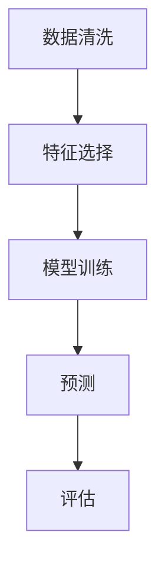
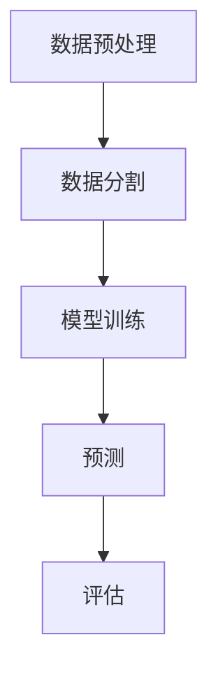
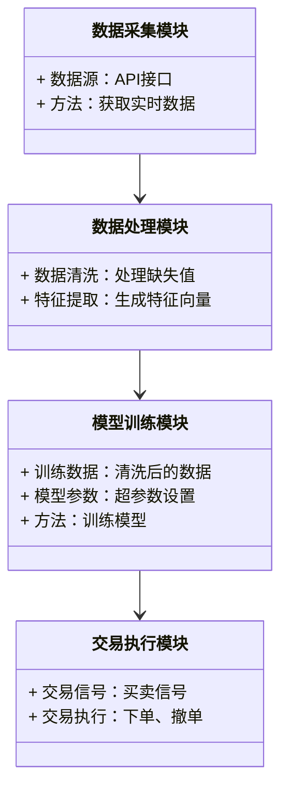
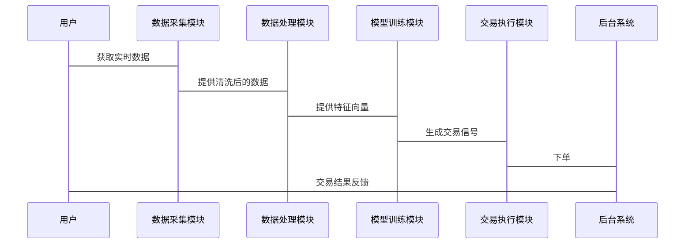

                 


# 人工智能在量化投资中的应用与挑战

## 关键词：量化投资，人工智能，机器学习，算法交易，数据挖掘，风险管理，系统设计

## 摘要：  
人工智能技术的快速发展为量化投资带来了革命性的变化。通过机器学习算法和大数据分析，人工智能能够帮助投资者更精准地捕捉市场机会，优化交易策略，降低投资风险。然而，人工智能在量化投资中的应用也面临诸多挑战，包括数据质量、模型过拟合、交易成本以及监管合规等问题。本文将深入探讨人工智能在量化投资中的核心应用，分析其算法原理，并结合实际案例，讨论如何应对相关挑战。

---

# 第1章: 量化投资与人工智能的背景介绍

## 1.1 量化投资的基本概念  
### 1.1.1 量化投资的定义  
量化投资是一种基于数学模型和算法的投资方式，通过分析大量市场数据来寻找投资机会并执行交易。  

### 1.1.2 量化投资的核心要素  
- 数据驱动：依赖历史价格、交易量、市场情绪等数据。  
- 模型构建：通过统计学和机器学习方法建立预测模型。  
- 系统化交易：基于模型信号自动执行交易。  

### 1.1.3 量化投资的发展历程  
从简单的技术分析到复杂的算法交易，量化投资逐步成为现代金融的重要组成部分。  

## 1.2 人工智能的基本概念  
### 1.2.1 人工智能的定义  
人工智能是模拟人类智能的计算机系统，包括学习、推理、决策等功能。  

### 1.2.2 人工智能的核心技术  
- 机器学习：监督学习、无监督学习、强化学习。  
- 自然语言处理：分析新闻、社交媒体等非结构化数据。  
- 计算机视觉：识别图表、图像中的市场信息。  

### 1.2.3 人工智能的应用领域  
- 金融：股票预测、风险评估、欺诈检测。  
- 医疗：疾病诊断、药物研发。  
- 交通：自动驾驶、路径规划。  

## 1.3 人工智能在量化投资中的应用背景  
### 1.3.1 量化投资与人工智能的结合  
人工智能的强大学习能力使其成为量化投资的核心工具。  

### 1.3.2 人工智能在金融领域的优势  
- 处理海量数据：捕捉市场中的微小趋势。  
- 快速决策：基于实时数据做出交易决策。  
- 自适应调整：根据市场变化动态优化模型。  

### 1.3.3 当前市场环境下的应用趋势  
- 数据量激增：推动AI技术在量化投资中的应用。  
- 技术进步：深度学习、强化学习算法的突破。  
- 机构化趋势：越来越多的机构采用AI驱动的交易策略。  

## 1.4 本章小结  
本章介绍了量化投资和人工智能的基本概念，并探讨了两者结合的应用背景和发展趋势。

---

# 第2章: 人工智能在量化投资中的核心概念与联系  

## 2.1 数据处理与特征工程  
### 2.1.1 数据的获取与清洗  
- 数据来源：历史价格、市场情绪、宏观经济指标。  
- 数据清洗：处理缺失值、异常值、重复数据。  

### 2.1.2 特征的提取与选择  
- 特征提取：从原始数据中提取有用的特征，如动量、波动率。  
- 特征选择：使用过滤法或包装法筛选重要特征。  

### 2.1.3 数据的预处理方法  
- 标准化：使数据具有相同的尺度。  
- 归一化：将数据缩放到[0,1]范围。  
- 分割：将数据划分为训练集、验证集和测试集。  

## 2.2 预测模型与交易策略  
### 2.2.1 预测模型的构建  
- 分类模型：预测股票涨跌（如随机森林、SVM）。  
- 回归模型：预测股票价格（如线性回归、LSTM）。  

### 2.2.2 交易策略的设计  
- 基于模型的信号：根据预测结果生成买卖信号。  
- 风险管理：设定止损、止盈点。  
- 组合策略：结合多个模型的信号进行交易。  

### 2.2.3 模型的评估与优化  
- 性能指标：准确率、召回率、F1分数。  
- 超参数调优：使用网格搜索或随机搜索优化模型。  
- 模型部署：将模型集成到交易系统中。  

## 2.3 系统架构与流程设计  
### 2.3.1 系统架构的组成  
- 数据采集模块：获取实时市场数据。  
- 数据处理模块：清洗、特征提取。  
- 模型训练模块：训练预测模型。  
- 交易执行模块：根据模型信号下单。  

### 2.3.2 流程设计的步骤  
1. 数据采集与预处理。  
2. 模型训练与优化。  
3. 交易信号生成与执行。  
4. 风险监控与调整。  

### 2.3.3 系统的模块划分  
- 数据模块：负责数据的获取和处理。  
- 模型模块：负责模型的训练和预测。  
- 交易模块：负责根据模型信号执行交易。  

## 2.4 核心概念对比与ER图  
### 2.4.1 核心概念对比分析  
| 概念 | 描述 |  
|------|------|  
| 数据处理 | 数据清洗、特征提取 |  
| 预测模型 | 分类、回归 |  
| 交易策略 | 信号生成、风险管理 |  

### 2.4.2 ER图的实体关系设计  
```mermaid
erd
  entity 市场数据 {
    key: 时间
    属性: 收盘价、成交量、波动率
  }
  entity 预测模型 {
    key: 模型ID
    属性: 模型类型、参数
  }
  entity 交易信号 {
    key: 信号ID
    属性: 买入/卖出、时间
  }
  市场数据 --|> 预测模型
  预测模型 --|> 交易信号
```

---

# 第3章: 人工智能算法原理与数学模型  

## 3.1 常用算法原理  
### 3.1.1 线性回归算法  
线性回归用于预测连续型变量，如股票价格。  

### 3.1.2 支持向量机算法  
SVM用于分类问题，如判断股票是否上涨。  

### 3.1.3 随机森林算法  
随机森林是一种集成学习方法，用于分类和回归问题。  

## 3.2 算法流程图  
### 3.2.1 线性回归流程图  


### 3.2.2 支持向量机流程图  


### 3.2.3 随机森林流程图  


## 3.3 数学模型与公式  
### 3.3.1 线性回归公式  
$$ y = \beta_0 + \beta_1x + \epsilon $$  

### 3.3.2 支持向量机公式  
$$ \text{maximize} \sum_{i=1}^n \alpha_i - \frac{1}{2}\sum_{i=1}^n \alpha_i \alpha_j y_i y_j (x_i \cdot x_j) $$  

### 3.3.3 随机森林公式  
$$ y = \sum_{i=1}^n \text{tree}(x_i) $$  

## 3.4 算法实现与案例分析  
### 3.4.1 线性回归实现  
```python
import numpy as np
from sklearn.linear_model import LinearRegression

X = np.array([x1, x2, x3])
y = np.array([y1, y2, y3])
model = LinearRegression()
model.fit(X, y)
y_pred = model.predict(X)
print(y_pred)
```

---

# 第4章: 系统分析与架构设计方案  

## 4.1 问题场景介绍  
投资者希望通过AI算法实现自动化交易，优化投资组合并降低风险。  

## 4.2 系统功能设计  
### 4.2.1 领域模型（Mermaid类图）  


## 4.3 系统架构设计（Mermaid架构图）  


## 4.4 系统接口设计  
- 数据接口：API调用。  
- 模型接口：模型训练和预测。  
- 交易接口：下单、撤单。  

## 4.5 系统交互（Mermaid序列图）  


---

# 第5章: 项目实战  

## 5.1 环境安装与配置  
- Python环境：安装Python 3.8及以上版本。  
- 库的安装：`pip install numpy pandas scikit-learn`。  

## 5.2 系统核心实现源代码  
```python
import numpy as np
import pandas as pd
from sklearn.linear_model import LinearRegression

# 数据加载
data = pd.read_csv('stock_data.csv')
X = data[['open', 'high', 'low', 'volume']]
y = data['close']

# 数据分割
X_train, X_test, y_train, y_test = train_test_split(X, y, test_size=0.2)

# 模型训练
model = LinearRegression()
model.fit(X_train, y_train)

# 模型预测
y_pred = model.predict(X_test)

# 模型评估
print('Accuracy:', model.score(X_test, y_test))
```

## 5.3 代码应用解读与分析  
- 数据加载：从CSV文件中读取股票数据。  
- 数据分割：将数据划分为训练集和测试集。  
- 模型训练：使用线性回归算法训练模型。  
- 模型预测：基于测试集进行预测。  
- 模型评估：计算模型的准确率。  

## 5.4 实际案例分析  
假设我们有一个股票数据集，包含过去一年的每天收盘价和相关指标。通过线性回归模型预测未来一天的收盘价，并根据预测结果生成交易信号。  

## 5.5 项目小结  
通过实战案例，我们展示了如何将AI算法应用于量化投资，从数据处理到模型训练，再到交易执行，完整地实现了一个量化交易系统。

---

# 第6章: 最佳实践、小结与注意事项  

## 6.1 最佳实践  
- 数据质量：确保数据的准确性和完整性。  
- 模型选择：根据问题选择合适的算法。  
- 风险管理：设定止损和止盈机制。  

## 6.2 小结  
人工智能为量化投资带来了新的可能性，但其应用也面临诸多挑战。通过合理选择算法和优化系统架构，可以有效提升投资收益并降低风险。  

## 6.3 注意事项  
- 数据过拟合：避免模型过拟合训练数据。  
- 交易成本：考虑交易手续费和滑点的影响。  
- 监管合规：确保交易行为符合相关法律法规。  

---

# 作者：AI天才研究院 & 禅与计算机程序设计艺术

---

**温馨提示：**  
本文仅作为技术探讨，不构成投资建议。量化投资有风险，入行需谨慎。

