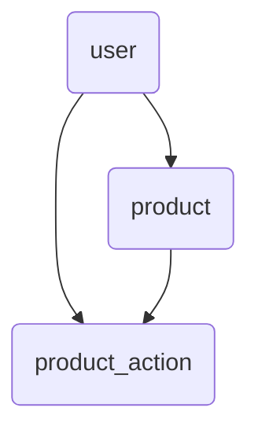
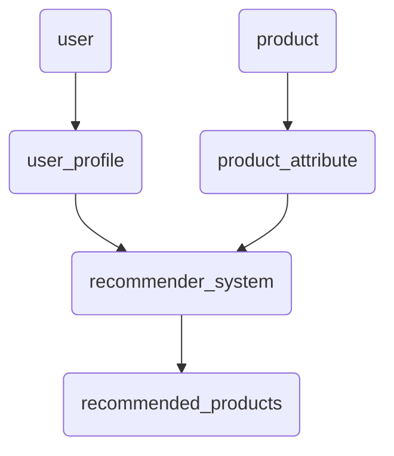

                 


# 人工智能在金融产品个性化推荐中的应用

## 关键词：人工智能，个性化推荐，金融产品，机器学习，深度学习，协同过滤

## 摘要：  
随着金融行业的数字化转型，个性化推荐已成为金融机构提升客户体验和业务收益的重要手段。本文深入探讨了人工智能在金融产品个性化推荐中的应用，从背景介绍、核心概念到算法原理、系统架构，再到项目实战和最佳实践，全面解析了如何利用AI技术构建高效、精准的金融推荐系统。文章结合实际案例，详细阐述了协同过滤、矩阵分解和深度学习等推荐算法，并通过系统设计和代码实现，展示了如何将理论应用于实践。最后，本文总结了人工智能在金融推荐中的未来发展趋势和注意事项。

---

# 第1章 人工智能与金融推荐的背景

## 1.1 金融行业的数字化转型

### 1.1.1 传统金融推荐模式的局限性
传统的金融推荐模式主要依赖人工经验或简单的规则引擎，存在以下问题：
- **信息孤岛**：难以整合多源数据，推荐结果缺乏全面性。
- **效率低下**：人工推荐耗时长，难以满足实时需求。
- **个性化不足**：难以针对不同用户的需求进行精准推荐。

### 1.1.2 人工智能技术的兴起
人工智能技术的快速发展为金融推荐提供了新的解决方案：
- **数据处理能力**：AI能够高效处理海量金融数据，发现复杂模式。
- **实时性**：基于机器学习的推荐系统可以实现实时响应。
- **个性化能力**：通过深度学习和用户行为分析，实现精准推荐。

### 1.1.3 个性化推荐在金融领域的价值
个性化推荐在金融领域的价值体现在以下几个方面：
- **提升客户体验**：通过精准推荐，满足用户个性化需求。
- **提高转化率**：推荐符合用户偏好的产品，提升销售效率。
- **降低风险**：通过分析用户行为，识别潜在风险。

## 1.2 金融推荐系统的现状与挑战

### 1.2.1 当前金融推荐的主要问题
- **数据多样性**：金融数据类型多样，包括文本、数值、时间序列等，处理难度大。
- **实时性要求**：金融市场的动态变化要求推荐系统具备实时性。
- **用户行为复杂性**：用户的金融行为受多种因素影响，难以建模。

### 1.2.2 数据多样性与实时性要求
- 数据多样性：金融推荐需要处理多源异构数据，如用户行为数据、市场数据、产品数据等。
- 实时性要求：金融市场的波动性要求推荐系统能够快速响应。

### 1.2.3 用户行为分析的复杂性
- 用户行为复杂性：用户的金融行为受市场环境、个人风险偏好等多种因素影响，难以建模。
- 行为数据的稀疏性：用户行为数据可能存在稀疏性，导致推荐系统的准确性下降。

## 1.3 人工智能在金融推荐中的作用

### 1.3.1 机器学习的核心优势
- **特征提取**：机器学习能够从多源数据中提取有用的特征，提升推荐准确性。
- **模式识别**：通过机器学习算法，发现数据中的潜在模式。
- **预测能力**：利用机器学习模型，预测用户的行为和偏好。

### 1.3.2 深度学习在金融推荐中的应用
- **非线性关系建模**：深度学习能够建模复杂的非线性关系，提升推荐精度。
- **文本处理**：深度学习在金融文本分析中具有重要作用，如新闻情感分析。
- **序列建模**：利用RNN或LSTM建模用户行为序列，提升推荐效果。

### 1.3.3 自然语言处理在金融文本分析中的作用
- **文本理解**：NLP技术能够从金融新闻、报告中提取有用信息，辅助推荐决策。
- **情感分析**：通过分析文本情感，预测市场趋势，辅助推荐策略。

## 1.4 金融推荐系统的概念与分类

### 1.4.1 个性化推荐的基本概念
个性化推荐是指根据用户的特征和行为，推荐符合其偏好的产品或服务。

### 1.4.2 基于协同过滤的推荐
协同过滤是一种经典的推荐算法，通过分析用户相似性或物品相似性，进行推荐。

### 1.4.3 基于内容的推荐
基于内容的推荐算法通过分析物品的属性，推荐与用户兴趣相符的物品。

### 1.4.4 混合推荐模型
混合推荐模型结合了协同过滤和内容推荐的优点，具有较高的推荐精度。

## 1.5 本章小结

---

# 第2章 金融推荐系统的实体关系分析

## 2.1 实体关系图的构建

### 2.1.1 用户实体
- 用户ID、用户属性（年龄、性别、资产规模）、用户行为（点击、购买、浏览）。

### 2.1.2 产品实体
- 产品ID、产品类型（基金、股票、保险）、产品属性（风险等级、收益率）。

### 2.1.3 行为实体
- 行为ID、行为类型（点击、收藏、购买）、时间戳。

### 2.1.4 实体关系图


---

# 第3章 人工智能推荐算法原理

## 3.1 协同过滤算法

### 3.1.1 协同过滤原理
协同过滤是一种基于用户相似性或物品相似性的推荐算法。

### 3.1.2 协同过滤的数学公式
- 相似度计算公式：
  $$\text{相似度} = \frac{\sum_{i} (x_i - \bar{x})(y_i - \bar{y})}{\sqrt{\sum_{i} (x_i - \bar{x})^2} \cdot \sqrt{\sum_{i} (y_i - \bar{y})^2}}$$

### 3.1.3 协同过滤的实现代码
```python
import numpy as np
from sklearn.metrics import pairwise_distances

# 计算用户相似度矩阵
def user_based_collaborative_filtering(X):
    # 计算平均值
    mean = np.mean(X, axis=1)
    # 去除均值
    X_centered = X - mean.reshape(-1, 1)
    # 计算余弦相似度
    similarity_matrix = pairwise_distances(X_centered, metric='cosine')
    return similarity_matrix

# 示例数据
X = np.array([[4, 3, 2], [5, 1, 4]])
similarity_matrix = user_based_collaborative_filtering(X)
print(similarity_matrix)
```

## 3.2 矩阵分解算法

### 3.2.1 矩阵分解原理
矩阵分解是一种将用户-产品评分矩阵分解为两个低维矩阵的方法。

### 3.2.2 矩阵分解的数学公式
- 矩阵分解公式：
  $$X = U \cdot V^T$$

### 3.2.3 矩阵分解的实现代码
```python
from sklearn.decomposition import NMF

# 矩阵分解示例
X = np.array([[4, 3, 5], [2, 4, 3]])
model = NMF(n_components=2, random_state=42)
U = model.fit_transform(X)
V = model.components_
print(U)
print(V)
```

## 3.3 深度学习推荐模型

### 3.3.1 深度学习推荐模型的原理
深度学习模型能够建模复杂的非线性关系，提升推荐精度。

### 3.3.2 基于深度学习的推荐模型
- DNN推荐模型：
  $$y = \sigma(W_1 x + b_1)$$
  $$y = \sigma(W_2 y + b_2)$$

### 3.3.3 深度学习推荐模型的实现代码
```python
import tensorflow as tf

# 深度学习推荐模型示例
X = tf.keras.Input(shape=(10,))
dense = tf.keras.layers.Dense(64, activation='relu')(X)
output = tf.keras.layers.Dense(1, activation='sigmoid')(dense)
model = tf.keras.Model(inputs=X, outputs=output)
model.compile(optimizer='adam', loss='binary_crossentropy')
```

---

# 第4章 系统分析与架构设计

## 4.1 问题场景介绍

### 4.1.1 项目介绍
本项目旨在构建一个基于人工智能的金融产品推荐系统。

### 4.1.2 系统功能设计
- 用户画像模块
- 产品特征提取模块
- 推荐引擎模块

### 4.1.3 系统架构设计


---

# 第5章 项目实战

## 5.1 环境搭建与数据准备

### 5.1.1 环境安装
- 安装必要的库：
  ```bash
  pip install numpy pandas scikit-learn tensorflow
  ```

### 5.1.2 数据准备
- 数据来源：
  - 用户行为数据
  - 产品属性数据

## 5.2 核心代码实现

### 5.2.1 数据预处理
```python
import pandas as pd

# 数据预处理示例
data = pd.read_csv('financial_data.csv')
data.dropna(inplace=True)
```

### 5.2.2 模型训练
```python
from sklearn.model_selection import train_test_split
from sklearn.neighbors import NearestNeighbors

# 协同过滤模型训练
X_train, X_test = train_test_split(data, test_size=0.2)
model = NearestNeighbors(n_neighbors=5).fit(X_train)
```

### 5.2.3 推荐生成
```python
# 生成推荐
distances, indices = model.kneighbors(X_test)
for i in range(len(X_test)):
    print(f"推荐结果：{indices[i]}")
```

## 5.3 实际案例分析

### 5.3.1 案例背景
- 案例：银行理财产品推荐

### 5.3.2 数据分析
- 数据分析结果：用户风险偏好、产品收益率等

### 5.3.3 推荐结果
- 推荐结果展示：推荐的理财产品列表

## 5.4 项目总结

---

# 第6章 最佳实践与未来展望

## 6.1 最佳实践

### 6.1.1 数据质量的重要性
- 数据清洗、特征工程

### 6.1.2 模型调优的技巧
- 参数调优、交叉验证

### 6.1.3 多模态数据的利用
- 文本、图像等多种数据的结合

## 6.2 未来展望

### 6.2.1 金融推荐的未来趋势
- 多模态推荐、实时推荐、可解释性推荐

### 6.2.2 可解释性的重要性
- 提升用户信任度

### 6.2.3 数据隐私保护
- 遵守GDPR等数据保护法规

## 6.3 注意事项

### 6.3.1 数据隐私
- 确保用户数据的隐私和安全

### 6.3.2 模型解释性
- 提供可解释的推荐结果

### 6.3.3 业务目标
- 确保推荐系统与业务目标一致

## 6.4 拓展阅读

### 6.4.1 推荐的经典书籍
- 《集体智慧编程》
- 《机器学习实战》

### 6.4.2 推荐的在线资源
- Coursera的《机器学习》课程
- TensorFlow官方文档

---

# 作者：AI天才研究院/AI Genius Institute & 禅与计算机程序设计艺术/Zen And The Art of Computer Programming

---

本文详细阐述了人工智能在金融产品个性化推荐中的应用，从背景介绍、核心概念到算法原理、系统架构，再到项目实战和最佳实践，全面解析了如何利用AI技术构建高效、精准的金融推荐系统。通过理论与实践的结合，为读者提供了一套完整的解决方案。

