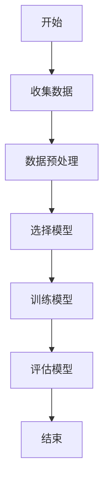
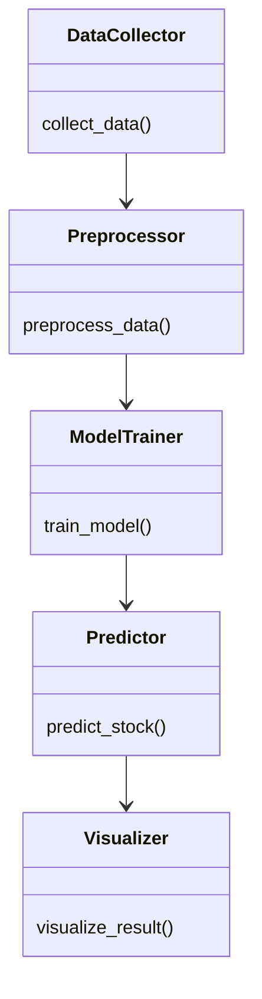

                 


# 人工智能选股：新技术如何改变基本面分析

## 关键词：人工智能，金融分析，股票投资，机器学习，深度学习

## 摘要：  
人工智能正在 revolutionize 传统的股票投资方法，特别是基本面分析。通过机器学习和深度学习等技术，AI 能够处理大量复杂数据，发现隐藏的模式，并做出更准确的投资决策。本文将探讨 AI 如何改变基本面分析，从理论到实践，详细解析其技术核心和实际应用。

---

# 第1章：人工智能与金融选股的结合

## 1.1 人工智能的基本概念

### 1.1.1 人工智能的定义与技术基础

人工智能（AI）是指计算机系统模拟人类智能的能力，包括学习、推理、问题解决和自然语言处理等。在金融领域，AI 通过处理大量数据，帮助投资者做出更明智的决策。

### 1.1.2 人工智能在金融领域的应用前景

AI 在金融中的应用广泛，包括风险管理、交易执行和投资决策。特别是在选股方面，AI 能够分析大量数据，识别潜在的投资机会。

### 1.1.3 人工智能如何改变选股方式

传统选股依赖人工分析，而 AI 能够自动化处理数据，发现隐藏的模式，提高选股的准确性和效率。

---

## 1.2 传统基本面分析的局限性

### 1.2.1 传统选股方法的优缺点

传统方法依赖财务指标和估值方法，但主观性强，难以处理海量数据。

### 1.2.2 数据量与复杂性带来的挑战

随着数据量的增加，传统方法难以快速分析，导致效率低下。

### 1.2.3 传统分析中的主观因素

分析师的主观判断可能导致决策偏差，影响投资结果。

---

# 第2章：基本面分析的传统方法

## 2.1 财务指标分析

### 2.1.1 常用财务指标

- **市盈率（PE）**：衡量股票价格是否合理。
- **市净率（PB）**：评估股票相对于账面价值的高低。
- **ROE（净资产收益率）**：衡量公司盈利能力。

### 2.1.2 财务报表分析的基本步骤

1. 收集财务报表数据。
2. 计算关键财务指标。
3. 分析公司的财务健康状况。

## 2.2 估值方法

### 2.2.1 市盈率法

通过比较股票的市盈率与行业平均水平，判断其估值是否合理。

### 2.2.2 现金流折现法

估算未来现金流的现值，评估公司价值。

### 2.2.3 行业比较法

将公司与同行业竞争对手进行比较，寻找估值洼地。

---

# 第3章：人工智能在金融中的应用

## 3.1 机器学习与深度学习在选股中的应用

### 3.1.1 机器学习的基本原理

机器学习通过训练模型，从数据中学习模式，用于预测和分类。

### 3.1.2 常用算法

- **线性回归**：预测连续型变量。
- **随机森林**：通过树投票进行分类和回归。
- **支持向量机（SVM）**：用于分类和回归。

### 3.1.3 机器学习在选股中的应用

- **特征选择**：识别影响股价的关键因素。
- **预测模型**：预测股票未来表现。

### 3.2 深度学习在金融中的应用

### 3.2.1 卷积神经网络（CNN）在图像识别中的应用

通过图像识别技术分析K线图，识别价格趋势。

### 3.2.2 循环神经网络（RNN）在时间序列分析中的应用

分析股票价格的时间序列数据，预测未来走势。

---

# 第4章：技术核心：算法与数学模型

## 4.1 特征工程与模型选择

### 4.1.1 特征工程

- **数据预处理**：处理缺失值、标准化等。
- **特征选择**：使用PCA等方法提取关键特征。

### 4.1.2 模型选择与调优

- **超参数调优**：使用网格搜索优化模型参数。
- **模型评估**：使用交叉验证评估模型性能。

## 4.2 数学模型与算法实现

### 4.2.1 线性回归模型

#### 算法流程图（Mermaid）



#### Python代码示例

```python
import pandas as pd
import numpy as np
from sklearn.linear_model import LinearRegression
from sklearn.metrics import mean_squared_error

# 数据加载
data = pd.read_csv('stock_data.csv')

# 特征与目标变量分离
X = data[['PE', 'PB', 'ROE']]
y = data['Price']

# 模型训练
model = LinearRegression()
model.fit(X, y)

# 预测
y_pred = model.predict(X)

# 评估
mse = mean_squared_error(y, y_pred)
print('均方误差:', mse)
```

### 4.2.2 随机森林模型

#### 算法流程图（Mermaid）


#### Python代码示例

```python
from sklearn.ensemble import RandomForestRegressor
from sklearn.metrics import mean_absolute_error

# 数据加载
data = pd.read_csv('stock_data.csv')

# 特征与目标变量分离
X = data[['PE', 'PB', 'ROE']]
y = data['Price']

# 模型训练
model = RandomForestRegressor(n_estimators=100)
model.fit(X, y)

# 预测
y_pred = model.predict(X)

# 评估
mae = mean_absolute_error(y, y_pred)
print('平均绝对误差:', mae)
```

---

# 第5章：系统架构与设计

## 5.1 项目介绍

### 5.1.1 项目目标与范围

开发一个基于AI的选股系统，帮助投资者做出更明智的投资决策。

### 5.1.2 关键需求分析

- 数据采集与处理。
- 模型训练与预测。
- 结果可视化与报告生成。

## 5.2 系统功能设计

### 5.2.1 领域模型（Mermaid类图）



### 5.2.2 系统架构设计（Mermaid架构图）

```mermaid
dataclass
    class SystemArchitecture {
        DataCollector
        Preprocessor
        ModelTrainer
        Predictor
        Visualizer
    }
```

---

# 第6章：项目实战

## 6.1 环境安装与配置

### 6.1.1 安装Python

```bash
python --version
pip install numpy pandas scikit-learn
```

## 6.2 系统功能设计

### 6.2.1 系统功能模块

- 数据采集模块。
- 数据预处理模块。
- 模型训练模块。
- 预测模块。
- 可视化模块。

---

# 第7章：总结与展望

## 7.1 总结

人工智能正在改变股票投资的方式，通过机器学习和深度学习，AI 能够提高选股的准确性和效率。

## 7.2 未来展望

随着技术的进步，AI 在选股中的应用将更加广泛，可能涉及更多复杂的数据分析和预测模型。

---

# 作者：AI天才研究院 & 禅与计算机程序设计艺术

---

通过以上内容，读者可以系统地了解人工智能在选股中的应用，从基础概念到算法实现，再到系统设计和项目实战，全面掌握 AI 如何改变基本面分析。

