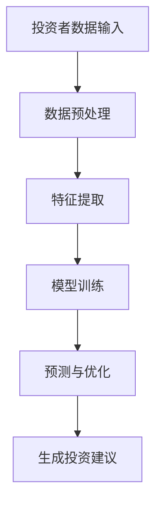
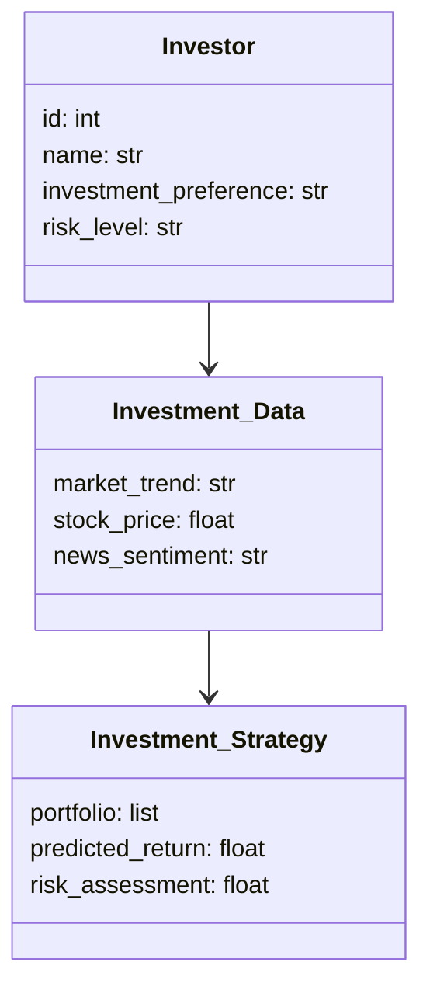
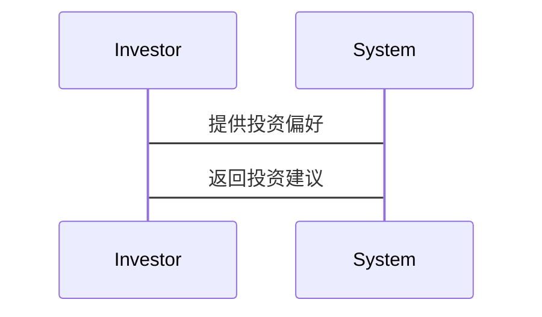

                 


# 人工智能驱动的个性化投资顾问服务

> 关键词：人工智能、投资顾问、个性化服务、机器学习、自然语言处理

> 摘要：本文探讨了人工智能技术在投资顾问服务中的应用，重点分析了如何利用机器学习和自然语言处理技术实现个性化的投资建议。文章从问题背景、核心概念、算法原理、系统架构到项目实战，全面解析了人工智能驱动的个性化投资顾问服务的实现过程，并提供了具体的代码示例和案例分析。

---

## 第一部分：人工智能驱动的个性化投资顾问服务概述

### 第1章：问题背景与核心概念

#### 1.1 问题背景

随着金融市场的日益复杂化和投资者需求的多样化，传统的投资顾问服务面临着以下挑战：

- **信息过载**：投资者需要处理海量的市场数据和信息，但传统投资顾问的服务能力有限。
- **个性化不足**：传统投资顾问往往采用标准化的策略，难以满足不同投资者的个性化需求。
- **效率低下**：人工分析和决策耗时长，无法快速响应市场变化。

#### 1.2 问题描述

人工智能技术的快速发展为投资顾问服务的个性化和智能化提供了新的可能性。本文的核心问题是：如何利用人工智能技术，构建一个能够根据投资者的个性化需求，提供实时、精准投资建议的服务系统。

#### 1.3 问题解决

人工智能驱动的个性化投资顾问服务通过以下方式解决上述问题：

- **数据驱动**：利用大数据分析技术，获取投资者的偏好、风险承受能力等信息，构建个性化的投资模型。
- **机器学习**：通过机器学习算法，预测市场趋势和投资组合的收益与风险，优化投资策略。
- **人机协同**：结合人工投资顾问的经验和人工智能的自动化能力，提供高效、个性化的投资建议。

#### 1.4 边界与外延

- **适用范围**：本文主要关注基于机器学习和自然语言处理的个性化投资顾问服务，不涉及传统金融分析中的基础理论。
- **区别与联系**：与传统投资顾问服务相比，本文提出的服务更加注重个性化和自动化，但仍然需要结合人工投资顾问的经验。

---

## 第二部分：人工智能驱动的个性化投资顾问核心概念

### 第2章：核心概念与联系

#### 2.1 核心概念原理

- **机器学习在投资顾问中的应用**：通过训练模型，预测市场趋势和投资组合的收益与风险。
- **自然语言处理在投资者行为分析中的作用**：通过分析投资者的对话和文本数据，理解其需求和偏好。
- **数据挖掘在个性化投资策略中的价值**：通过挖掘历史数据，发现投资规律和潜在机会。

#### 2.2 核心概念属性特征对比

| 概念 | 属性 | 特征 |
|------|------|------|
| 数据来源 | 类型 | 市场数据、用户行为数据、新闻数据 |
| 智能算法 | 类型 | 分析算法、预测算法、优化算法 |
| 人机交互 | 方式 | 图形化界面、自然语言对话、语音交互 |

#### 2.3 ER实体关系图

```mermaid
er
actor:投资者
actor --> User_Profile:拥有
actor --> Investment_Preference:具有
User_Profile --> Investment_Data:包含
Investment_Preference --> Investment_Strategy:生成
Investment_Strategy --> Trading_Signal:触发
```

---

## 第三部分：算法原理与数学模型

### 第3章：算法原理讲解

#### 3.1 算法原理概述

- **机器学习算法在投资顾问中的应用**：例如，利用随机森林算法进行市场趋势预测。
- **自然语言处理算法在投资者行为分析中的应用**：例如，利用情感分析算法分析市场情绪。

#### 3.2 算法流程图



#### 3.3 算法实现代码

```python
import pandas as pd
from sklearn.ensemble import RandomForestRegressor

# 示例数据加载
data = pd.read_csv('investment_data.csv')

# 特征提取
features = data[['market_trend', 'risk_level', 'user_preference']]
target = data['predicted_return']

# 模型训练
model = RandomForestRegressor(n_estimators=100)
model.fit(features, target)

# 预测与优化
new_investment = features.iloc[-1]
predicted_return = model.predict([new_investment])
```

#### 3.4 数学模型与公式

- **随机森林回归模型**：
  $$ \text{预测收益} = \sum_{i=1}^{n} w_i \cdot x_i + b $$
  其中，\( w_i \) 是特征 \( x_i \) 的权重，\( b \) 是偏置项。

---

## 第四部分：系统分析与架构设计

### 第4章：系统分析与架构设计

#### 4.1 问题场景介绍

投资者通过个性化投资顾问服务，输入其投资偏好和风险承受能力，系统基于实时市场数据和历史数据，生成个性化投资建议。

#### 4.2 系统功能设计



#### 4.3 系统架构设计


#### 4.4 系统接口设计

- **输入接口**：投资者输入投资偏好和风险承受能力。
- **输出接口**：系统输出投资建议和市场预测结果。

#### 4.5 系统交互流程图



---

## 第五部分：项目实战

### 第5章：项目实战

#### 5.1 环境安装

```bash
pip install pandas scikit-learn matplotlib
```

#### 5.2 系统核心实现

```python
import pandas as pd
from sklearn.ensemble import RandomForestRegressor
import matplotlib.pyplot as plt

# 数据加载与预处理
data = pd.read_csv('investment_data.csv')
data = data.dropna()

# 特征工程
features = data[['market_trend', 'risk_level', 'user_preference']]
target = data['predicted_return']

# 模型训练
model = RandomForestRegressor(n_estimators=100)
model.fit(features, target)

# 可视化
importances = model.feature_importances_
plt.bar(range(features.shape[1]), importances)
plt.xlabel('Feature Index')
plt.ylabel('Feature Importance')
plt.show()
```

#### 5.3 代码解读与分析

- **数据加载与预处理**：读取CSV文件，并删除缺失值。
- **特征工程**：选择相关特征，并将其与目标变量分离。
- **模型训练**：使用随机森林回归模型进行训练。
- **可视化**：绘制特征重要性图表，分析哪些特征对预测收益影响较大。

#### 5.4 案例分析

假设投资者A的风险承受能力为中等，投资偏好为稳健型。系统基于其输入数据，结合市场趋势和历史数据，生成个性化的投资组合建议。

#### 5.5 项目小结

通过本项目，我们可以看到人工智能在投资顾问服务中的巨大潜力。基于机器学习和自然语言处理技术，投资者可以得到更加精准和个性化的投资建议。

---

## 第六部分：最佳实践与总结

### 第6章：最佳实践

- **数据质量**：确保数据的准确性和完整性，是模型训练的基础。
- **模型选择**：根据具体场景选择合适的算法，避免过度复杂的模型。
- **实时更新**：金融市场变化迅速，模型需要定期更新和优化。

### 6.2 小结

人工智能驱动的个性化投资顾问服务，通过结合机器学习、自然语言处理和大数据分析技术，为投资者提供了高效、精准的投资建议。本文通过理论分析和实际案例，详细展示了这一服务的实现过程。

### 6.3 注意事项

- **数据隐私**：投资者数据的安全性和隐私保护是至关重要的。
- **模型解释性**：复杂的模型可能难以解释，需要确保模型的透明性和可解释性。

### 6.4 拓展阅读

- [《机器学习实战》](https://zh.wikipedia.org/wiki/机器学习实战)
- [《自然语言处理入门》](https://zh.wikipedia.org/wiki/自然语言处理入门)

---

## 作者：AI天才研究院 & 禅与计算机程序设计艺术

