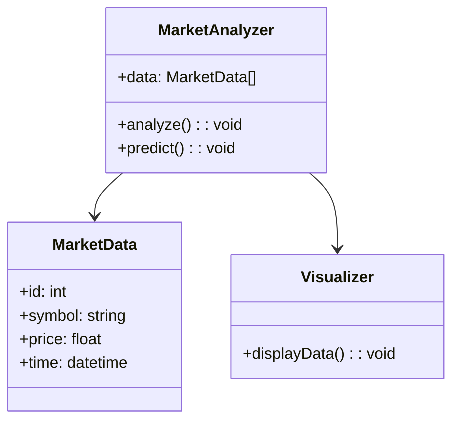
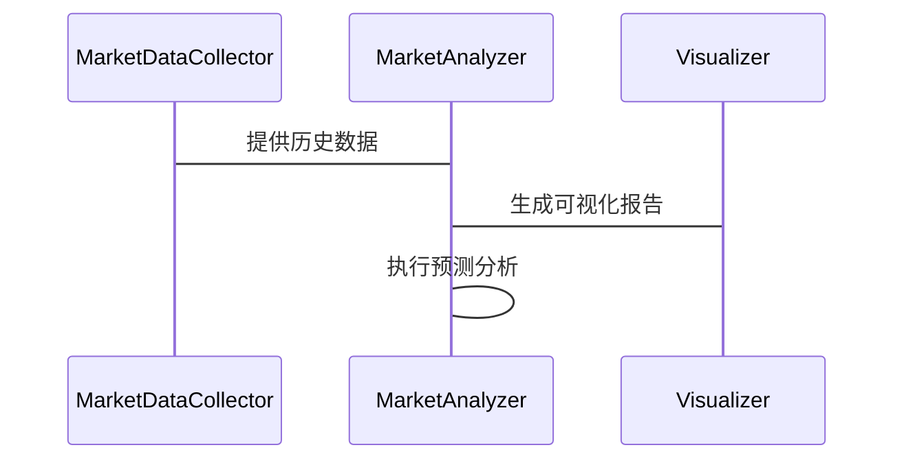

                 


# 从历史角度理解当前市场状况的重要性

## 关键词：市场分析、历史数据、趋势预测、经济周期、数据分析、技术应用

## 摘要：  
在当今快速变化的市场环境中，理解当前市场状况的重要性不言而喻。通过从历史角度分析市场数据和趋势，可以帮助我们更好地识别市场周期、预测未来走势，并制定有效的策略。本文将从历史数据分析的角度，结合技术工具和方法，详细探讨如何理解当前市场状况的重要性，并为读者提供实用的分析工具和方法。

---

# 第1章: 市场分析的背景与重要性

## 1.1 市场分析的基本概念

### 1.1.1 市场分析的定义  
市场分析是通过对市场数据的收集、整理和分析，研究市场现状、趋势和潜在机会的过程。它旨在帮助企业或投资者更好地理解市场环境，制定科学的决策。

### 1.1.2 市场分析的核心要素  
- **市场参与者**：包括消费者、竞争对手、供应商等。  
- **市场需求**：包括需求量、需求结构、消费者偏好等。  
- **市场供给**：包括供给量、供给结构、供应商能力等。  
- **市场趋势**：包括行业发展趋势、技术进步、政策变化等。  

### 1.1.3 市场分析的背景与重要性  
随着全球经济的快速发展，市场环境日益复杂。通过市场分析，可以帮助企业和投资者：  
1. 识别市场机会和风险。  
2. 制定科学的市场进入策略。  
3. 优化资源配置，提高效率。  
4. 提前预判市场变化，制定应对策略。  

---

## 1.2 历史分析在市场研究中的作用

### 1.2.1 历史分析的定义与特点  
历史分析是通过研究过去的数据和事件，揭示市场的演变规律和趋势。它的特点包括：  
1. **数据驱动**：基于历史数据进行分析。  
2. **周期性**：市场往往呈现周期性变化。  
3. **参考性**：历史数据为预测未来提供参考。  

### 1.2.2 历史分析在市场研究中的优势  
1. **验证假设**：通过历史数据验证市场假设的合理性。  
2. **识别模式**：发现市场的周期性规律和趋势。  
3. **风险预警**：通过历史案例识别潜在风险。  

### 1.2.3 历史分析与当前市场的关系  
历史是未来的镜子。通过研究历史数据，可以更好地理解当前市场的形成原因，并为未来预测提供依据。

---

## 1.3 市场分析的核心概念与联系

### 1.3.1 市场周期的定义与特征  
市场周期是指市场从繁荣到衰退再到复苏的循环过程。其特征包括：  
1. **波动性**：市场的波动性是周期性变化的结果。  
2. **周期性**：市场周期具有一定的规律性。  
3. **复杂性**：市场周期受多种因素影响，如经济政策、技术进步等。  

### 1.3.2 市场趋势的定义与分类  
市场趋势是指市场在一定时期内表现出的总体方向。其分类包括：  
1. **长期趋势**：反映市场的基本发展方向。  
2. **中期趋势**：反映市场在特定周期内的变化。  
3. **短期趋势**：反映市场的短期波动。  

### 1.3.3 市场波动的定义与影响  
市场波动是指市场在短时间内价格或指数的剧烈波动。其影响包括：  
1. **投资者情绪**：波动会加剧市场的不确定性和投资者的恐慌。  
2. **市场效率**：过度波动可能降低市场的信息效率。  
3. **政策干预**：波动过大可能引发政府干预。  

---

## 1.4 本章小结  
本章从市场分析的基本概念出发，探讨了历史分析在市场研究中的作用，并分析了市场周期、趋势和波动的核心概念及其相互联系。通过这些分析，我们可以更好地理解市场环境，并为后续的市场预测提供基础。

---

# 第2章: 市场周期与经济指标

## 2.1 市场周期的定义与分类

### 2.1.1 经济周期的定义  
经济周期是指经济活动从繁荣到衰退再到复苏的循环过程。通常包括以下几个阶段：  
1. **繁荣期**：经济增长迅速，就业率高，物价稳定。  
2. **衰退期**：经济增长放缓，就业率下降，物价可能下跌。  
3. **复苏期**：经济开始恢复，就业率逐渐回升。  
4. **扩张期**：经济继续增长，进入新一轮繁荣。  

### 2.1.2 经济周期的分类  
经济周期的分类主要依据其波动的频率和持续时间：  
1. **长期周期**：持续时间较长，通常数十年。  
2. **中期周期**：持续时间数年。  
3. **短期周期**：持续时间较短，通常数月。  

### 2.1.3 市场周期与经济周期的关系  
市场周期与经济周期密切相关。经济周期的变化直接影响市场周期的演变。例如，在经济衰退期，市场通常会经历调整和衰退；在经济复苏期，市场逐步恢复并进入繁荣期。

---

## 2.2 主要经济指标的分析

### 2.2.1 GDP的定义与作用  
GDP（国内生产总值）是衡量一个国家或地区经济规模和增长的重要指标。它反映了经济的整体表现。  

### 2.2.2 失业率的定义与影响  
失业率是指一定时期内，失业人口占总劳动力人口的比例。高失业率通常与经济衰退相关联。  

### 2.2.3 消费者价格指数（CPI）的定义与作用  
CPI是衡量通货膨胀的重要指标。它反映了消费者购买一篮子商品和服务的价格变化。  

---

## 2.3 历史案例分析

### 2.3.1 经济危机的历史案例  
例如，2008年的全球金融危机，其起因是房地产泡沫的破裂和金融市场的过度杠杆化。通过分析这一案例，我们可以更好地理解经济衰退的形成和应对措施。  

### 2.3.2 经济复苏的历史案例  
例如，2008年金融危机后，全球经济逐步复苏，各国政府采取了刺激政策和货币宽松措施。  

### 2.3.3 经济繁荣的历史案例  
例如，20世纪90年代的互联网泡沫，尽管最终以泡沫破裂告终，但推动了信息技术的发展。  

---

## 2.4 本章小结  
本章分析了经济周期的定义与分类，探讨了主要经济指标的作用，并通过历史案例进一步说明了经济周期对市场的影响。通过这些分析，我们可以更好地理解当前经济环境的复杂性。

---

# 第3章: 市场趋势与历史数据的分析

## 3.1 市场趋势的定义与分类

### 3.1.1 长期趋势的定义  
长期趋势是指市场在较长时期内表现出的总体发展方向。  

### 3.1.2 中期趋势的定义  
中期趋势是指市场在数年内的变化趋势。  

### 3.1.3 短期趋势的定义  
短期趋势是指市场在短时间内（如数周或数月）的价格波动。  

---

## 3.2 历史数据的收集与整理

### 3.2.1 数据收集的定义  
数据收集是指从各种来源（如政府统计、市场调研、企业报告等）获取相关数据的过程。  

### 3.2.2 数据整理的定义  
数据整理是指对收集到的数据进行清洗、分类和归档的过程。  

### 3.2.3 数据清洗的定义  
数据清洗是指识别并处理数据中的错误、遗漏或异常值，确保数据的准确性和一致性。  

---

## 3.3 数据分析与可视化

### 3.3.1 数据分析的定义  
数据分析是指通过统计方法和工具对数据进行处理、分析和解释的过程。  

### 3.3.2 数据可视化的定义  
数据可视化是指将数据以图表、图形等形式直观展示的过程，有助于更好地理解和分析数据。  

### 3.3.3 数据分析工具的介绍  
常用的数据分析工具包括Excel、R、Python（如Pandas和Matplotlib库）等。  

---

## 3.4 本章小结  
本章探讨了市场趋势的定义与分类，并详细介绍了历史数据的收集、整理和分析方法。通过数据分析和可视化，我们可以更好地识别市场趋势，并为预测提供依据。

---

# 第4章: 系统分析与架构设计

## 4.1 问题场景介绍  
本章将通过一个具体的市场分析系统设计案例，展示如何利用历史数据分析方法进行系统设计。

## 4.2 系统功能设计

### 4.2.1 领域模型Mermaid类图  


### 4.2.2 系统架构设计Mermaid架构图  
```mermaid
architectural
    MarketAnalysisSystem
    components {
        MarketDataCollector --> MarketDatabase
        MarketDatabase --> MarketAnalyzer
        MarketAnalyzer --> Visualizer
        MarketAnalyzer --> ReportGenerator
    }
```

## 4.3 系统接口设计  
系统接口包括数据输入接口、数据处理接口和结果输出接口。

## 4.4 系统交互Mermaid序列图  


---

## 4.5 本章小结  
本章通过系统设计展示了如何利用历史数据分析方法构建一个完整的市场分析系统。通过类图、架构图和序列图，我们明确了系统的功能模块和交互流程。

---

# 第5章: 项目实战

## 5.1 环境安装  
本项目需要以下工具：  
- Python 3.8+  
- Jupyter Notebook  
- Pandas、Matplotlib等库  

## 5.2 核心实现源代码

```python
import pandas as pd
import matplotlib.pyplot as plt

# 加载数据
data = pd.read_csv('market_data.csv')

# 数据清洗
data.dropna(inplace=True)
data['date'] = pd.to_datetime(data['date'])

# 数据分析
data['price'].plot(kind='line')
plt.title('Market Price Trend')
plt.xlabel('Date')
plt.ylabel('Price')
plt.show()
```

## 5.3 代码应用解读与分析  
上述代码展示了如何利用Python进行数据加载、清洗和可视化。通过绘制价格趋势图，我们可以直观地观察市场趋势。

## 5.4 案例分析与详细讲解  
通过分析具体案例（如某行业的市场数据），我们可以识别市场周期、预测未来趋势，并制定相应的策略。

## 5.5 项目小结  
本章通过实际项目展示了历史数据分析的具体应用。通过代码实现和案例分析，我们进一步验证了历史数据分析方法的有效性。

---

# 第6章: 总结与注意事项

## 6.1 本章总结  
通过本文的分析，我们可以看出，从历史角度理解当前市场状况的重要性不言而喻。历史数据分析不仅能够帮助我们识别市场周期和趋势，还能够为未来的市场预测提供重要参考。

## 6.2 注意事项  
- 数据的准确性和完整性是分析的基础。  
- 分析结果需结合实际情况进行验证和调整。  
- 避免过度依赖历史数据，需关注当前市场环境的变化。  

## 6.3 最佳实践 tips  
- 定期更新数据，保持分析的时效性。  
- 结合多种分析方法，提高预测的准确性。  
- 建立有效的监控机制，及时捕捉市场变化。  

## 6.4 拓展阅读  
推荐阅读以下书籍和资源：  
- 《数据分析实战》  
- 《经济周期与市场预测》  
- Python数据分析库的官方文档  

---

# 作者：AI天才研究院/AI Genius Institute & 禅与计算机程序设计艺术 /Zen And The Art of Computer Programming

---

以上是《从历史角度理解当前市场状况的重要性》的完整目录和内容框架。希望这篇文章能够为读者提供有价值的见解和实用的方法，帮助他们在复杂的市场环境中做出更明智的决策。

