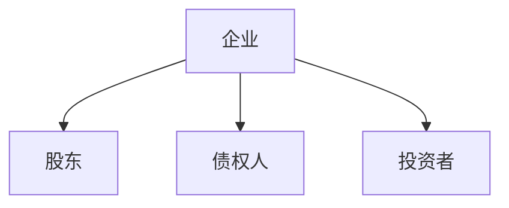
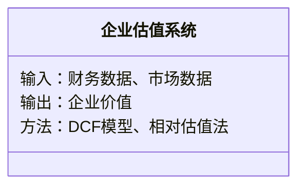
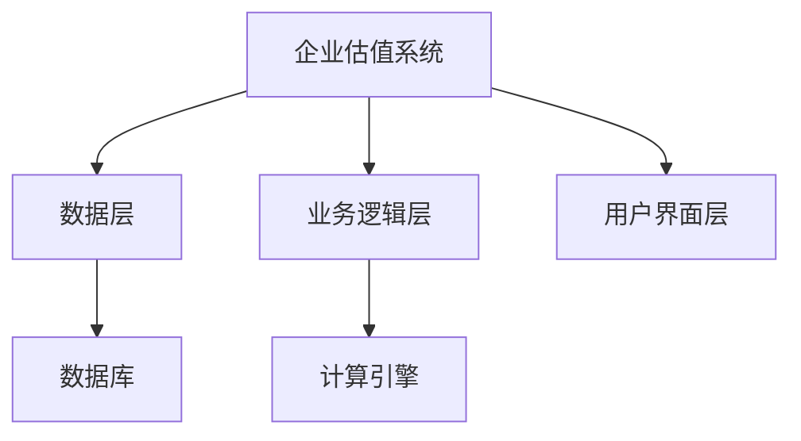
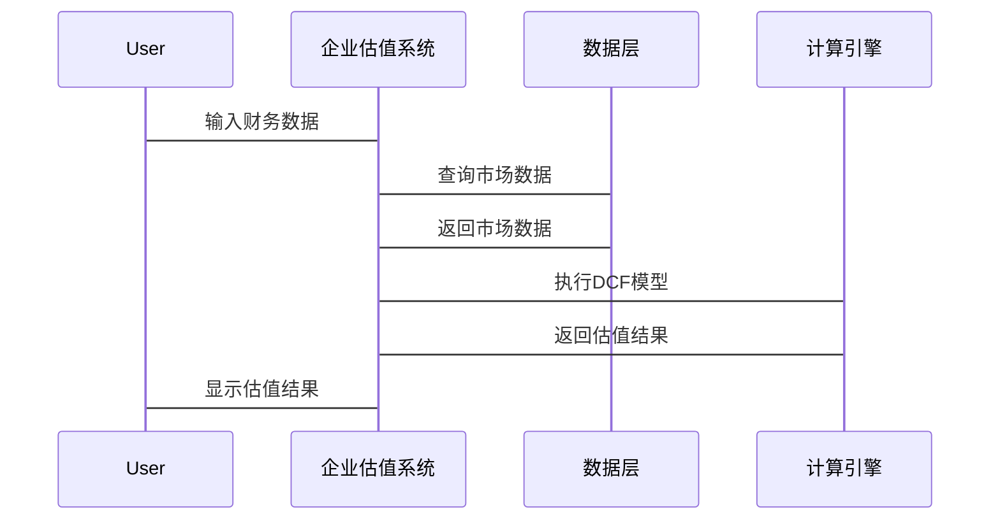

                 


# 从零开始学习企业估值方法

> 关键词：企业估值，DCF模型，相对估值法，企业价值，财务指标，投资分析

> 摘要：本文将从企业估值的基本概念入手，系统地介绍企业估值的核心方法，包括现金流折现模型（DCF模型）、相对估值法等，通过实际案例分析和数学公式的详细推导，帮助读者掌握企业估值的核心原理和实际应用。

---

# 第一部分: 企业估值方法概述

# 第1章: 企业估值的核心概念与背景

## 1.1 企业估值的基本概念

### 1.1.1 什么是企业估值

企业估值是指对企业的整体价值或股权价值进行评估的过程。它通常用于企业并购、投资决策、融资等场景，以确定企业的合理价格。

### 1.1.2 企业估值的目的与意义

- **目的**：帮助投资者或企业确定企业的合理价格，评估企业的财务健康状况，为投资决策提供依据。
- **意义**：企业估值是资本市场的核心工具之一，能够帮助投资者识别价值低估或高估的企业，优化资源配置。

### 1.1.3 企业估值的常见应用场景

- 企业并购
- 投资决策
- 融资定价
- 股权激励

## 1.2 企业估值的基本方法

### 1.2.1 市盈率法（P/E）

- **定义**：市盈率是企业市值与每股收益的比值。
- **公式**：
  $$ P/E = \frac{\text{股价}}{\text{每股收益}} $$
- **优点**：简单易用，适用于周期性较弱的行业。
- **缺点**：受市场情绪影响较大，无法反映企业的实际盈利能力。

### 1.2.2 市净率法（P/B）

- **定义**：市净率是企业市值与每股净资产的比值。
- **公式**：
  $$ P/B = \frac{\text{股价}}{\text{每股净资产}} $$
- **优点**：适用于净资产驱动型企业，如银行、地产等。
- **缺点**：无法反映企业的盈利能力。

### 1.2.3 企业价值倍数（EV）

- **定义**：企业价值倍数是企业整体价值与息税折旧摊销前利润（EBITDA）的比值。
- **公式**：
  $$ EV = \frac{\text{企业价值}}{\text{EBITDA}} $$
- **优点**：能够综合反映企业的财务状况和盈利能力。
- **缺点**：计算复杂，需要准确的企业价值数据。

## 1.3 企业估值的关键要素

### 1.3.1 企业的财务状况

- 资产负债表：包括流动资产、非流动资产、流动负债、非流动负债等。
- 利润表：包括收入、成本、利润等。

### 1.3.2 企业的盈利能力

- 净利润：企业实现的净利润。
- 毛利率：销售收入与销售成本的差额占销售收入的比例。
- 净利率：净利润占销售收入的比例。

### 1.3.3 企业的成长潜力

- 收入增长率：销售收入的年增长率。
- 利润增长率：净利润的年增长率。
- 市场占有率：企业在市场中的份额占比。

## 1.4 企业估值的边界与外延

### 1.4.1 企业估值的局限性

- 数据质量：企业估值依赖于财务数据的准确性。
- 假设条件：DCF模型依赖于未来现金流的预测，存在假设误差。
- 市场情绪：市场情绪会影响估值结果。

### 1.4.2 企业估值与其他评估方法的区别

- 企业估值与资产估值：企业估值关注整体价值，资产估值关注单项资产的价值。
- 企业估值与股票估值：企业估值关注股权价值，股票估值关注每股价格。

### 1.4.3 企业估值的核心要素组成

- 财务指标：收入、利润、现金流等。
- 市场因素：行业竞争、市场需求等。
- 管理团队：管理层的能力和战略规划。

## 1.5 本章小结

通过本章的学习，我们了解了企业估值的基本概念、方法和关键要素，为后续深入学习企业估值方法奠定了基础。

---

# 第二部分: 企业估值的核心概念与联系

# 第2章: 企业价值的定义与属性

## 2.1 企业价值的定义

### 2.1.1 企业整体价值的定义

企业整体价值是指企业在持续经营条件下，所有资产的公允价值之和。

### 2.1.2 企业股权价值的定义

企业股权价值是指企业所有股东权益的公允价值。

### 2.1.3 企业资产价值的定义

企业资产价值是指企业所有资产的公允价值，包括流动资产和非流动资产。

## 2.2 企业价值的核心属性

### 2.2.1 财务表现

- 收入与利润：企业的收入和利润是企业价值的核心驱动因素。
- 现金流：现金流是企业价值的重要指标，反映了企业的盈利能力和流动性。

### 2.2.2 市场地位

- 市场份额：企业在市场中的份额占比。
- 行业地位：企业在行业中的竞争力和影响力。

### 2.2.3 竞争优势

- 核心竞争力：企业的核心竞争优势，如技术、品牌、成本优势等。
- 技术创新：企业的技术创新能力，决定了企业的长期发展潜力。

## 2.3 企业价值与财务指标的关系

### 2.3.1 收入与利润的关系

收入是企业价值的重要指标，利润是收入减去成本后的结果，反映了企业的盈利能力。

### 2.3.2 资产与负债的关系

资产是企业的资源，负债是企业的债务，两者共同影响企业的财务健康状况。

### 2.3.3 现金流与企业价值的关系

现金流是企业价值的核心指标，反映了企业的盈利能力和流动性。

## 2.4 企业价值的实体关系图



## 2.5 本章小结

通过本章的学习，我们了解了企业价值的核心属性及其与财务指标的关系，为后续学习企业估值方法提供了理论基础。

---

# 第三部分: 企业估值的算法原理

# 第3章: 现金流折现模型（DCF模型）

## 3.1 DCF模型的基本原理

### 3.1.1 现金流的概念

现金流是指企业在一定时期内产生的现金流入和流出。

### 3.1.2 折现率的计算

折现率是将未来现金流折算成现值的利率，通常包括无风险利率和风险溢价。

### 3.1.3 现金流折现的过程

1. 预测未来现金流。
2. 计算折现率。
3. 将未来现金流折算成现值。
4. 将现值加总得到企业价值。

## 3.2 DCF模型的数学公式

### 3.2.1 企业整体价值公式

$$\text{企业价值} = \sum_{t=1}^{n} \frac{\text{现金流}_t}{(1 + r)^t}$$

### 3.2.2 股权价值公式

$$\text{股权价值} = \text{企业价值} - \text{债务价值}$$

---

# 第四部分: 企业估值系统分析与架构设计

# 第4章: 企业估值系统分析与架构设计

## 4.1 问题场景介绍

企业估值系统用于帮助企业或投资者快速、准确地评估企业的整体价值或股权价值。

## 4.2 系统功能设计

### 4.2.1 领域模型



### 4.2.2 系统架构设计



## 4.3 系统接口设计

- 输入接口：接收企业的财务数据和市场数据。
- 输出接口：输出企业的估值结果。

## 4.4 系统交互设计



---

# 第五部分: 企业估值项目实战

# 第5章: 企业估值项目实战

## 5.1 环境安装与配置

### 5.1.1 安装Python环境

使用Anaconda安装Python 3.8及以上版本。

### 5.1.2 安装相关库

安装numpy、pandas、scipy等库。

## 5.2 系统核心实现源代码

### 5.2.1 DCF模型实现

```python
import numpy as np
import pandas as pd
from scipy import stats

def dcf_model(fcf, discount_rate, years):
    """DCF模型实现"""
    # 计算现值
    pv = 0
    for t in range(years):
        cash_flow = fcf * (1 + growth_rate)
        discount_factor = 1 / (1 + discount_rate) ** (t + 1)
        pv += cash_flow * discount_factor
    return pv

# 示例数据
fcf = 100  # 自由现金流
discount_rate = 0.1  # 折现率
years = 5  # 年数
growth_rate = 0.05  # 现金流增长率

enterprise_value = dcf_model(fcf, discount_rate, years)
print(f"企业价值：{enterprise_value}")
```

---

# 第六部分: 企业估值最佳实践与小结

# 第6章: 企业估值的最佳实践

## 6.1 数据质量的重要性

- 数据来源：确保数据的准确性和可靠性。
- 数据清洗：处理缺失值、异常值等。

## 6.2 模型选择的注意事项

- 根据企业特点选择合适的估值方法。
- 结合定性和定量分析。

## 6.3 持续学习与优化

- 关注行业动态和市场变化。
- 不断优化估值模型。

## 6.4 本章小结

通过本章的学习，我们了解了企业估值的最佳实践，包括数据质量、模型选择和持续优化等方面。

---

# 作者：AI天才研究院/AI Genius Institute & 禅与计算机程序设计艺术 /Zen And The Art of Computer Programming

