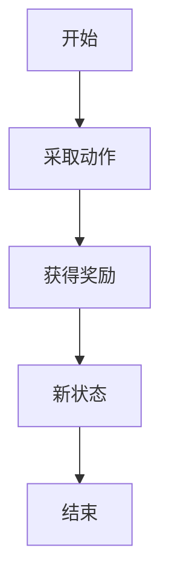
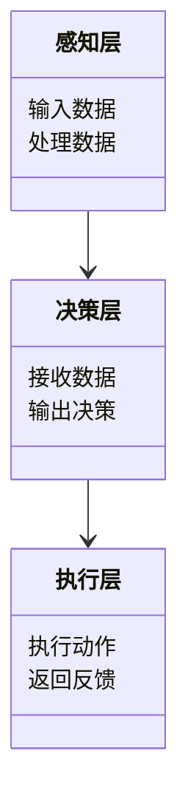
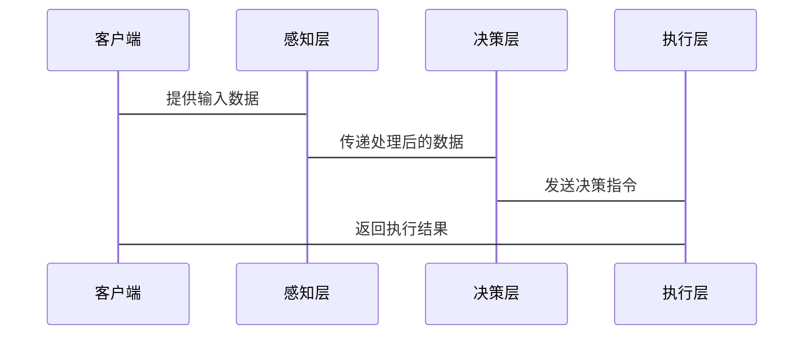

                 


# 从零开始：构建AI Agent的完整指南

> 关键词：AI Agent，人工智能，机器学习，系统架构，算法原理，项目实战

> 摘要：本文将指导读者从零开始构建一个完整的AI Agent系统。通过系统的背景介绍、核心概念解析、算法原理分析、系统架构设计、项目实战演示和最佳实践分享，读者将全面掌握AI Agent的构建过程。从基础概念到高级算法，从系统设计到实际应用，本文将为您提供一份详尽的指南。

---

# 第1章: AI Agent 的背景与概念

## 1.1 AI Agent 的基本概念

### 1.1.1 什么是 AI Agent
AI Agent（人工智能代理）是指能够感知环境、自主决策并执行任务的智能实体。它通过传感器获取信息，利用算法处理信息，并通过执行器与环境交互。

### 1.1.2 AI Agent 的特点与优势
- **自主性**：AI Agent能够在没有外部干预的情况下独立运作。
- **反应性**：能够实时感知环境变化并做出响应。
- **智能性**：通过算法和知识库进行推理和决策。
- **适应性**：能够根据环境反馈调整自身行为。

### 1.1.3 AI Agent 的应用场景
- **自动驾驶**：通过传感器和算法实现车辆的自主导航。
- **智能助手**：如Siri、Alexa等，帮助用户完成日常任务。
- **机器人控制**：用于工业自动化和家庭服务机器人。
- **游戏AI**：在电子游戏中实现智能NPC和对手。

---

## 1.2 AI Agent 的发展背景

### 1.2.1 人工智能技术的发展历程
人工智能技术经历了从规则驱动到数据驱动的转变，近年来深度学习的兴起极大地推动了AI Agent的发展。

### 1.2.2 当前 AI Agent 的技术现状
- **感知技术**：如计算机视觉和自然语言处理的进步。
- **决策算法**：强化学习和深度学习在决策任务中的应用。
- **执行技术**：机器人和自动化系统的成熟。

### 1.2.3 AI Agent 的未来趋势
- **人机协作**：AI Agent与人类协同工作的能力将越来越强。
- **边缘计算**：AI Agent将在边缘设备上运行，减少对云端的依赖。
- **多智能体系统**：多个AI Agent协同工作的复杂场景将成为主流。

---

## 1.3 构建 AI Agent 的意义

### 1.3.1 提升效率与智能化水平
AI Agent能够自动化执行任务，显著提高效率。

### 1.3.2 优化决策与执行能力
通过算法优化，AI Agent能够做出更优的决策。

### 1.3.3 推动人机协作的创新模式
AI Agent将人与机器的协作提升到新的高度，推动了技术创新。

---

## 1.4 本章小结
本章介绍了AI Agent的基本概念、发展背景及其构建的意义，为后续章节奠定了基础。

---

# 第2章: AI Agent 的核心概念与体系结构

## 2.1 AI Agent 的核心概念

### 2.1.1 感知层
- **定义**：通过传感器获取环境信息。
- **关键技术**：计算机视觉、自然语言处理。
- **流程**：信息采集 → 数据处理 → 特征提取。

### 2.1.2 决策层
- **定义**：基于感知信息做出决策。
- **关键算法**：强化学习、监督学习。
- **流程**：状态识别 → 动作选择 → 决策输出。

### 2.1.3 执行层
- **定义**：通过执行器将决策转化为行动。
- **关键技术**：机器人控制、自动化系统。
- **流程**：接收指令 → 执行动作 → 返回反馈。

---

## 2.2 AI Agent 的体系结构

### 2.2.1 分层架构
- **感知层**：负责信息采集。
- **决策层**：负责策略制定。
- **执行层**：负责动作执行。

### 2.2.2 分布式架构
- **多智能体系统**：多个AI Agent协同工作。
- **通信机制**：通过消息传递进行协作。

### 2.2.3 混合架构
- **结合分层与分布式**：兼顾集中式决策和分布式执行。

---

## 2.3 AI Agent 的核心要素

### 2.3.1 数据输入与处理
- **数据来源**：传感器、数据库、用户输入。
- **处理流程**：数据清洗 → 特征提取 → 数据存储。

### 2.3.2 知识库与推理引擎
- **知识库**：存储领域知识和经验。
- **推理引擎**：基于知识库进行逻辑推理。

### 2.3.3 行为规划与执行
- **行为规划**：制定行动方案。
- **执行监控**：实时监控执行过程。

---

## 2.4 核心概念对比分析

### 2.4.1 感知与决策的对比
| 特性       | 感知层                     | 决策层                     |
|------------|---------------------------|---------------------------|
| 定义       | 信息采集                   | 动作选择                   |
| 输入       | 环境数据                   | 状态描述                   |
| 输出       | 特征向量                   | 动作策略                   |

### 2.4.2 决策与执行的关联
- **决策层**输出动作策略，**执行层**根据策略执行动作。
- 执行结果反哺感知层，形成闭环。

### 2.4.3 知识库与推理引擎的协同
- 知识库提供决策依据，推理引擎基于知识库进行逻辑推理。

---

## 2.5 本章小结
本章详细介绍了AI Agent的核心概念与体系结构，为后续章节的深入分析奠定了基础。

---

# 第3章: AI Agent 的算法原理与数学模型

## 3.1 AI Agent 的核心算法

### 3.1.1 强化学习算法
- **定义**：通过试错机制优化决策策略。
- **核心算法**：Q-Learning、Deep Q-Network (DQN)。
- **流程**：环境 → 动作 → 奖励 → 状态。

### 3.1.2 监督学习算法
- **定义**：通过标注数据训练模型。
- **核心算法**：随机森林、支持向量机 (SVM)、神经网络。
- **流程**：输入 → 标签 → 模型训练。

### 3.1.3 无监督学习算法
- **定义**：通过未标注数据发现数据结构。
- **核心算法**：K-means、聚类分析、主成分分析 (PCA)。

---

## 3.2 算法原理与流程图

### 3.2.1 强化学习算法流程图


---

## 3.3 算法的数学模型与公式

### 3.3.1 强化学习的数学模型
- **状态空间**：$S$，表示环境状态。
- **动作空间**：$A$，表示可能的动作。
- **奖励函数**：$R(s, a)$，表示在状态$s$下采取动作$a$得到的奖励。
- **策略函数**：$\pi(a|s)$，表示在状态$s$下采取动作$a$的概率。

### 3.3.2 Q-Learning 的数学公式
$$ Q(s, a) = Q(s, a) + \alpha (r + \gamma \max Q(s', a') - Q(s, a)) $$
其中：
- $\alpha$ 是学习率。
- $\gamma$ 是折扣因子。

---

## 3.4 本章小结
本章详细介绍了AI Agent的核心算法及其数学模型，为后续章节的系统设计和项目实现提供了理论基础。

---

# 第4章: AI Agent 的系统分析与架构设计

## 4.1 项目背景与目标

### 4.1.1 项目背景
- **目标**：构建一个能够自主决策和执行的AI Agent。
- **应用场景**：智能客服、自动驾驶、智能家居。

### 4.1.2 项目目标
- 实现AI Agent的感知、决策和执行功能。
- 验证算法的有效性和系统的可行性。

---

## 4.2 系统功能设计

### 4.2.1 领域模型


### 4.2.2 系统架构


### 4.2.3 接口设计
- **感知层接口**：提供数据获取和处理的API。
- **决策层接口**：提供决策请求和结果返回的API。
- **执行层接口**：提供动作执行和反馈接收的API。

---

## 4.3 系统交互流程

### 4.3.1 交互流程


---

## 4.4 本章小结
本章从系统分析与架构设计的角度，详细阐述了AI Agent的构建过程。

---

# 第5章: AI Agent 的项目实战

## 5.1 环境安装与配置

### 5.1.1 安装Python
- 安装Python 3.8及以上版本。
- 安装必要的库：numpy、pandas、scikit-learn、tensorflow。

### 5.1.2 安装开发工具
- 安装PyCharm或VS Code作为开发环境。

---

## 5.2 系统核心实现

### 5.2.1 感知层实现
```python
import numpy as np

def process_data(data):
    # 数据预处理代码
    return processed_data
```

### 5.2.2 决策层实现
```python
from sklearn import tree

def decision_model(X_train, y_train):
    clf = tree.DecisionTreeClassifier()
    clf.fit(X_train, y_train)
    return clf
```

### 5.2.3 执行层实现
```python
def execute_action(action):
    # 执行动作的代码
    return result
```

---

## 5.3 代码实现与解读

### 5.3.1 感知层代码
```python
import numpy as np

def process_data(data):
    # 数据清洗和特征提取
    processed_data = data.dropna()
    processed_data = processed_data[['feature1', 'feature2']]
    return processed_data
```

### 5.3.2 决策层代码
```python
from sklearn import tree

def decision_model(X_train, y_train):
    clf = tree.DecisionTreeClassifier()
    clf.fit(X_train, y_train)
    return clf
```

### 5.3.3 执行层代码
```python
def execute_action(action):
    # 执行动作的代码
    print(f"执行动作：{action}")
    return f"动作{action}执行成功"
```

---

## 5.4 实际案例分析

### 5.4.1 案例背景
假设我们正在构建一个智能客服AI Agent，用于自动回答用户的问题。

### 5.4.2 案例实现
```python
# 感知层：获取用户输入
user_input = input("请输入问题：")

# 决策层：分类问题类型
clf.predict([user_input])

# 执行层：生成回答
response = generate_response(clf.predict([user_input]))
print(response)
```

---

## 5.5 本章小结
本章通过实际案例，详细讲解了AI Agent的项目实战过程，包括环境配置、代码实现和案例分析。

---

# 第6章: AI Agent 的优化与总结

## 6.1 项目总结

### 6.1.1 系统功能总结
- 成功实现了AI Agent的感知、决策和执行功能。
- 系统能够自主完成任务，并通过反馈优化性能。

### 6.1.2 项目经验总结
- 系统设计需要充分考虑模块化和可扩展性。
- 算法选择和参数调优对系统性能有重要影响。

---

## 6.2 最佳实践

### 6.2.1 系统设计
- 使用模块化设计，便于后续扩展和维护。
- 确保各模块之间的接口清晰，便于集成。

### 6.2.2 算法优化
- 根据具体场景选择合适的算法。
- 通过数据增强和超参数调优提升模型性能。

### 6.2.3 系统优化
- 使用边缘计算减少对云端的依赖。
- 通过并行计算加速处理流程。

---

## 6.3 项目小结
本章总结了AI Agent项目的优化经验，并提出了未来的改进方向。

---

# 作者：AI天才研究院/AI Genius Institute & 禅与计算机程序设计艺术 /Zen And The Art of Computer Programming

