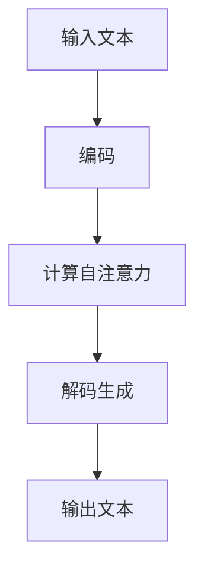
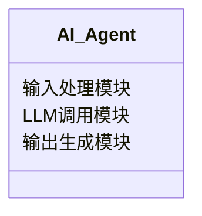
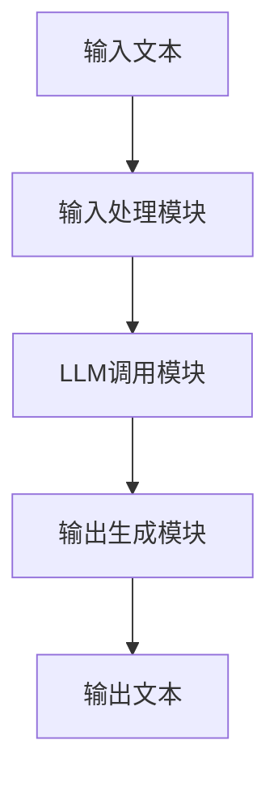
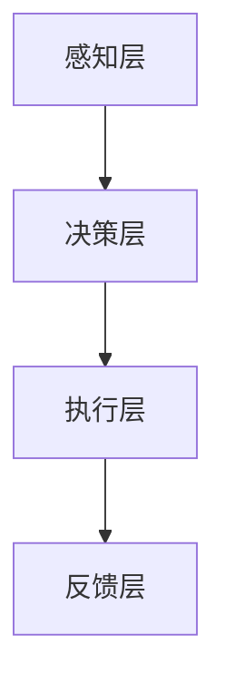
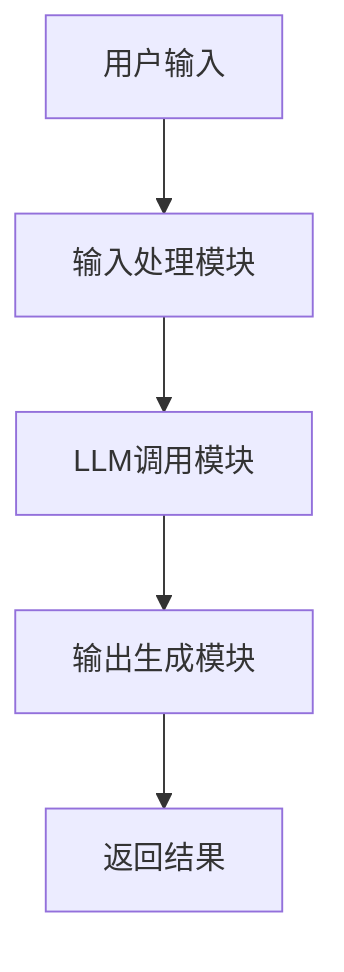

                 


# 从零构建AI Agent：LLM大模型应用开发实践概述

## 关键词
AI Agent, LLM大模型, 人工智能, 应用开发, 机器学习, 自然语言处理

## 摘要
本文详细介绍了从零构建基于LLM大模型的AI Agent的完整过程。从基本概念到算法原理，从系统架构到项目实战，全面解析了AI Agent的构建方法。通过实际案例分析，展示了如何将理论应用于实践，帮助读者掌握构建高效、智能的AI Agent的技巧。

---

# 第1章 AI Agent与LLM大模型概述

## 1.1 AI Agent的基本概念

### 1.1.1 AI Agent的定义与特点
AI Agent（人工智能代理）是一种能够感知环境、自主决策并执行任务的智能实体。它通过与环境交互，利用感知信息做出决策，并采取行动以实现目标。AI Agent的特点包括：
- **自主性**：无需外部干预，自主决策。
- **反应性**：能够实时感知环境变化并做出反应。
- **目标导向**：所有行为都以实现特定目标为导向。
- **学习能力**：通过经验或数据不断优化自身性能。

### 1.1.2 LLM大模型在AI Agent中的作用
大语言模型（LLM，Large Language Model）通过海量数据训练，能够理解和生成自然语言文本。在AI Agent中，LLM作为核心组件，负责处理文本输入、生成回复、理解上下文等任务。LLM为AI Agent提供了强大的语言理解和生成能力，使其能够与用户进行自然对话，完成复杂任务。

### 1.1.3 AI Agent的应用场景与优势
AI Agent的应用场景包括智能客服、智能家居控制、自动驾驶辅助决策等。其优势在于：
- **高效性**：能够快速处理大量信息并做出决策。
- **智能性**：通过LLM的强大能力，实现复杂的语言理解和生成。
- **可扩展性**：可以根据需求扩展功能，适应不同场景。

## 1.2 LLM大模型的核心原理

### 1.2.1 LLM大模型的基本原理
大语言模型通过深度学习技术，特别是Transformer架构，训练大规模语料库。模型通过自注意力机制捕捉上下文信息，生成连贯的文本输出。其核心流程包括：
1. **输入处理**：将输入文本转换为模型可处理的向量表示。
2. **自注意力计算**：计算输入文本中各部分之间的关联性。
3. **解码**：基于自注意力结果生成输出文本。

### 1.2.2 LLM大模型的训练与优化
训练LLM涉及以下步骤：
1. **数据预处理**：清洗数据、分词、去除停用词等。
2. **模型构建**：搭建基于Transformer的神经网络模型。
3. **损失函数优化**：使用交叉熵损失函数，通过梯度下降优化模型参数。
4. **模型调优**：调整超参数，如学习率、批次大小，以提高模型性能。

### 1.2.3 LLM大模型的推理机制
推理阶段，模型接收输入后，通过解码生成输出。具体步骤包括：
1. **输入编码**：将输入文本编码为模型可处理的向量。
2. **自注意力计算**：计算输入的自注意力权重。
3. **解码生成**：基于自注意力结果生成输出文本。

## 1.3 AI Agent与LLM大模型的结合

### 1.3.1 AI Agent的体系结构
AI Agent的体系结构通常包括以下模块：
- **感知模块**：负责接收外部输入，如用户指令。
- **决策模块**：基于感知信息，调用LLM生成回复。
- **执行模块**：根据决策结果执行具体任务。
- **反馈模块**：收集执行结果，优化后续决策。

### 1.3.2 LLM大模型在AI Agent中的应用
LLM在AI Agent中的主要应用包括：
- **自然语言理解**：理解用户输入的意图和需求。
- **对话生成**：生成自然流畅的回复。
- **上下文处理**：维护对话历史，保持连贯性。

### 1.3.3 AI Agent与LLM大模型的协同工作
AI Agent通过调用LLM API，将用户输入转化为模型可处理的向量，生成回复，并将结果返回给用户。这种协同工作方式使得AI Agent能够高效处理复杂任务。

---

# 第2章 LLM大模型的算法原理与数学模型

## 2.1 LLM大模型的训练过程

### 2.1.1 数据预处理与特征提取
数据预处理包括分词、去除停用词、数据清洗等。特征提取则是将文本转换为向量表示，常用的方法有词袋模型和词嵌入（如Word2Vec）。

### 2.1.2 模型训练与优化
模型训练使用大规模数据集，采用自监督学习方法。优化目标是最小化预测误差，常用损失函数为交叉熵损失。

### 2.1.3 模型评估与调优
评估指标包括准确率、BLEU、ROUGE等。调优包括调整学习率、批次大小等超参数，以提高模型性能。

## 2.2 LLM大模型的数学模型

### 2.2.1 概率论基础
语言模型的目标是最小化生成文本的概率。文本生成的概率可以分解为词序概率的乘积：$$P(w_1, w_2, ..., w_n) = \prod_{i=1}^{n} P(w_i | w_{<i})$$

### 2.2.2 神经网络基础
Transformer模型由编码器和解码器组成，编码器负责将输入文本转换为向量表示，解码器负责生成输出文本。编码器的自注意力机制公式为：$$\text{Attention}(Q, K, V) = \text{softmax}\left(\frac{QK^T}{\sqrt{d_k}}\right)V$$

### 2.2.3 变压器模型的数学公式
Transformer的前馈网络由多层感知机组成，每层包括线性变换和激活函数。自注意力机制的计算涉及查询（Q）、键（K）和值（V）向量。

## 2.3 LLM大模型的算法流程图
使用Mermaid绘制算法流程图：



## 2.4 本章小结
本章详细讲解了LLM大模型的训练过程和数学模型，为后续AI Agent的构建奠定了理论基础。

---

# 第3章 AI Agent的系统架构与设计

## 3.1 AI Agent的系统架构设计

### 3.1.1 基于LLM大模型的AI Agent架构
AI Agent的架构包括感知层、决策层和执行层。感知层负责接收输入，决策层调用LLM生成回复，执行层负责执行具体任务。

### 3.1.2 分层架构与模块化设计
系统采用分层架构，每一层负责不同的功能模块。模块化设计便于维护和扩展。

### 3.1.3 可扩展性与可维护性
通过插件式设计和模块化架构，系统具备良好的可扩展性和可维护性。

## 3.2 系统功能设计

### 3.2.1 需求分析与功能模块划分
根据需求，将系统划分为输入处理模块、LLM调用模块、输出生成模块等。

### 3.2.2 领域模型设计
使用Mermaid绘制领域模型图：



### 3.2.3 系统功能流程图
使用Mermaid绘制系统功能流程图：



## 3.3 系统架构设计

### 3.3.1 系统架构图
使用Mermaid绘制系统架构图：



### 3.3.2 模块间的交互关系
模块之间的交互通过API进行，确保系统各部分协同工作。

### 3.3.3 系统的可扩展性设计
通过插件式设计和模块化架构，系统具备良好的可扩展性。

---

# 第4章 AI Agent项目实战

## 4.1 项目背景与目标

### 4.1.1 项目背景
选择智能客服助手作为项目案例，展示AI Agent的构建过程。

### 4.1.2 项目目标
实现一个能够处理用户咨询的智能客服助手。

## 4.2 项目环境安装

### 4.2.1 安装Python
```bash
python --version
pip install --upgrade pip
```

### 4.2.2 安装必要的库
```bash
pip install numpy
pip install transformers
pip install torch
```

## 4.3 系统核心实现

### 4.3.1 输入处理模块
```python
def process_input(input_text):
    # 分词处理
    tokens = tokenizer.encode(input_text)
    return tokens
```

### 4.3.2 LLM调用模块
```python
def call_llm(tokens):
    # 调用LLM模型进行推理
    outputs = model.generate(tokens)
    return outputs
```

### 4.3.3 输出生成模块
```python
def generate_output(outputs):
    # 解码输出
    text = tokenizer.decode(outputs)
    return text
```

## 4.4 代码应用解读与分析

### 4.4.1 核心代码实现
```python
from transformers import AutoTokenizer, AutoModelForCausalLM

tokenizer = AutoTokenizer.from_pretrained('gpt2')
model = AutoModelForCausalLM.from_pretrained('gpt2')

def process_input(input_text):
    tokens = tokenizer.encode(input_text)
    return tokens

def generate_output(outputs):
    text = tokenizer.decode(outputs, skip_special_tokens=True)
    return text

# 示例调用
input_text = "我需要帮助"
tokens = process_input(input_text)
outputs = model.generate(tokens, max_length=50)
text = generate_output(outputs)
print(text)
```

### 4.4.2 系统交互流程图
使用Mermaid绘制系统交互流程图：



## 4.5 实际案例分析

### 4.5.1 案例背景
以智能客服助手为例，展示系统在实际场景中的应用。

### 4.5.2 案例分析
系统能够处理用户的问题，生成自然的回复，提升用户体验。

## 4.6 项目小结
通过项目实战，验证了AI Agent的构建方法，掌握了核心模块的设计和实现。

---

# 第5章 总结与展望

## 5.1 总结
本文详细介绍了从零构建AI Agent的过程，涵盖背景、原理、架构设计和项目实战。

## 5.2 展望
未来，AI Agent将更加智能化和个性化，应用场景也将更加广泛。

## 5.3 最佳实践Tips
- **选择合适的模型**：根据需求选择适合的LLM模型。
- **优化系统架构**：确保系统具备良好的扩展性和可维护性。
- **注重用户体验**：设计友好的交互界面，提升用户体验。

## 5.4 作者信息
作者：AI天才研究院  
邮箱：contact@aigenius.com  
GitHub：https://github.com/aigenius

---

通过本文的学习，读者将能够从零开始构建基于LLM大模型的AI Agent，掌握核心技术和实践方法。

