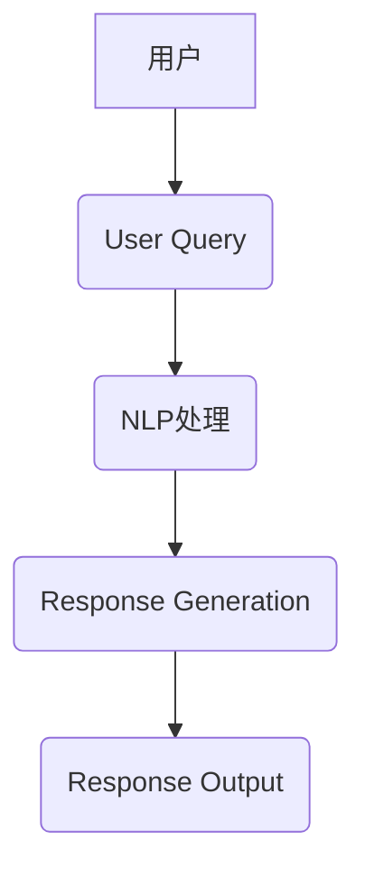
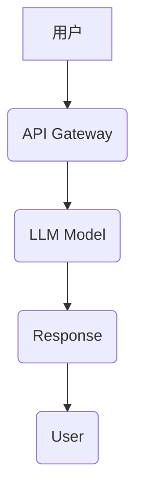
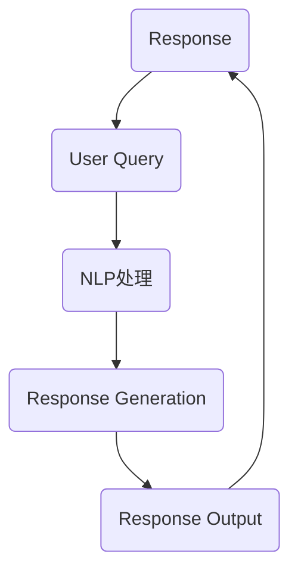

                 


# 从零构建AI Agent：LLM大模型应用开发实践概述

## 关键词：AI Agent, LLM, 大语言模型, 人工智能, 应用开发, 机器学习

## 摘要：  
本文将详细介绍从零开始构建基于大语言模型（LLM）的AI Agent的过程，涵盖AI Agent的基本概念、LLM的核心原理、系统架构设计、项目实战以及最佳实践。通过本文，读者将能够理解AI Agent的构建过程，并掌握实际开发中的关键技术和注意事项。

---

## 第一章: AI Agent与LLM大模型概述

### 1.1 AI Agent的基本概念

#### 1.1.1 什么是AI Agent  
AI Agent（人工智能代理）是指能够感知环境、自主决策并执行任务的智能实体。它可以是一个软件程序、机器人或其他智能系统，旨在帮助用户完成特定任务或提供智能化服务。  

#### 1.1.2 AI Agent的核心特征  
- **自主性**：能够在没有外部干预的情况下自主决策。  
- **反应性**：能够实时感知环境并做出反应。  
- **目标导向**：具备明确的目标，能够为实现目标而行动。  
- **学习能力**：能够通过经验改进自身的性能。  

#### 1.1.3 LLM大模型与AI Agent的关系  
LLM（大语言模型）是AI Agent的重要组成部分，负责处理自然语言理解和生成任务。AI Agent可以通过调用LLM模型来实现对话交互、信息检索等功能。  

#### 1.1.4 AI Agent的应用场景  
- 智能客服：通过对话交互解决用户问题。  
- 机器人助手：帮助用户完成日常任务。  
- 自动化系统：在工业、金融等领域实现自动化操作。  

#### 1.1.5 本节小结  
AI Agent是一种具备自主性、反应性和目标导向的智能实体，LLM大模型为其提供了强大的自然语言处理能力，广泛应用于多个领域。

---

### 1.2 LLM大模型的背景与发展

#### 1.2.1 大语言模型的起源  
LLM的起源可以追溯到2010年代初的自然语言处理技术，如词袋模型和词嵌入技术（Word2Vec）。  

#### 1.2.2 LLM的主流架构与特点  
- **Transformer架构**：基于自注意力机制，能够处理长序列数据。  
- **预训练-微调模式**：通过大规模数据预训练，再针对具体任务进行微调。  

#### 1.2.3 LLM在AI Agent中的作用  
LLM为AI Agent提供了强大的语言理解与生成能力，使其能够与用户进行自然交互。  

#### 1.2.4 当前LLM技术的挑战与未来方向  
- **计算资源消耗**：LLM的训练和推理需要大量计算资源。  
- **模型可解释性**：提升模型的透明性和可解释性。  
- **多模态能力**：结合视觉、听觉等多模态信息，提升交互体验。  

#### 1.2.5 本节小结  
LLM技术的发展为AI Agent提供了强大的语言处理能力，但也面临计算资源和可解释性等挑战。

---

## 第二章: LLM大模型的核心原理

### 2.1 LLM的模型结构

#### 2.1.1 Transformer架构的由来  
Transformer由Google于2017年提出，替代了传统的RNN/LSTM架构，具有并行计算能力强、模型容量大的特点。  

#### 2.1.2 编码器与解码器的结构分析  
- **编码器**：将输入序列映射到一个固定的向量空间。  
- **解码器**：基于编码器输出生成目标序列。  

#### 2.1.3 注意力机制的数学原理  
注意力机制通过计算输入序列中每个词对当前词的贡献程度，实现对序列的有效编码。  

#### 2.1.4 梯度下降与优化算法  
- **梯度下降**：通过计算损失函数的梯度，更新模型参数。  
- **优化算法**：如Adam、SGD等，用于加速收敛。  

#### 2.1.5 本节小结  
Transformer架构通过自注意力机制实现了高效的序列处理能力，是当前LLM的主流架构。

---

### 2.2 LLM的训练过程

#### 2.2.1 数据预处理与输入格式  
- **数据清洗**：去除噪音数据，确保数据质量。  
- **分词与编码**：将文本数据转换为模型可处理的格式。  

#### 2.2.2 损失函数的定义与优化  
- **交叉熵损失**：常用的损失函数，用于衡量预测与真实分布的差异。  

#### 2.2.3 参数更新的数学推导  
- **反向传播**：通过链式法则计算损失函数对模型参数的梯度。  
- **参数更新**：根据梯度下降算法更新参数。  

#### 2.2.4 并行训练与加速技术  
- **并行计算**：通过多GPU加速模型训练。  
- **模型并行与数据并行**：分别将模型和数据分发到多个GPU上进行训练。  

#### 2.2.5 本节小结  
LLM的训练过程包括数据预处理、损失函数定义、参数更新和加速技术等多个环节。

---

### 2.3 LLM的推理机制

#### 2.3.1 解码过程中的采样策略  
- **随机采样**：基于概率分布随机选择下一个词。  
- **贪婪采样**：选择概率最高的词作为输出。  

#### 2.3.2 动态注意力机制的实现  
动态注意力机制能够根据上下文动态调整注意力权重，提升生成效果。  

#### 2.3.3 前缀树与解码效率  
前缀树是一种数据结构，用于存储所有可能的前缀，提升解码效率。  

#### 2.3.4 解码过程中的温度与多样性参数  
- **温度参数**：控制生成结果的多样性，温度越高，生成结果越多样化。  

#### 2.3.5 本节小结  
LLM的推理机制通过采样策略、动态注意力机制和前缀树等技术，实现了高效且多样化的生成能力。

---

## 第三章: AI Agent的系统分析与架构设计

### 3.1 问题场景介绍

#### 3.1.1 项目背景  
假设我们正在开发一个智能客服AI Agent，用于帮助用户解答问题。  

#### 3.1.2 项目目标  
实现一个能够理解用户问题并提供准确答案的智能客服系统。  

---

### 3.2 系统功能设计

#### 3.2.1 领域模型设计  
使用Mermaid绘制领域模型图，展示系统的主要功能模块。  



---

### 3.3 系统架构设计

#### 3.3.1 系统架构图  
使用Mermaid绘制系统架构图，展示系统的整体架构。  



---

### 3.4 接口设计

#### 3.4.1 输入接口  
- **用户输入**：接收用户的自然语言输入。  

#### 3.4.2 输出接口  
- **文本输出**：将生成的文本返回给用户。  

---

### 3.5 交互设计

#### 3.5.1 交互流程图  
使用Mermaid绘制交互流程图，展示用户与AI Agent的交互过程。  



---

## 第四章: 项目实战

### 4.1 环境安装

#### 4.1.1 安装Python  
```bash
python --version
pip install --upgrade pip
```

#### 4.1.2 安装依赖库  
```bash
pip install transformers
pip install torch
pip install matplotlib
```

---

### 4.2 系统核心实现

#### 4.2.1 模型加载与初始化  
```python
from transformers import AutoTokenizer, AutoModelForCausalLM

tokenizer = AutoTokenizer.from_pretrained('gpt2')
model = AutoModelForCausalLM.from_pretrained('gpt2')
```

#### 4.2.2 文本生成函数  
```python
def generate_response(prompt, max_length=50):
    inputs = tokenizer.encode(prompt, return_tensors='pt')
    outputs = model.generate(inputs, max_length=max_length, do_sample=True)
    response = tokenizer.decode(outputs[0], skip_special_tokens=True)
    return response
```

#### 4.2.3 交互界面实现  
```python
while True:
    prompt = input("请输入您的问题：")
    response = generate_response(prompt)
    print("AI Agent:", response)
```

---

### 4.3 案例分析与优化

#### 4.3.1 案例分析  
通过实际运行代码，观察AI Agent的交互效果，分析生成文本的质量。  

#### 4.3.2 模型优化  
- **微调模型**：针对特定任务对模型进行微调，提升生成效果。  

#### 4.3.3 性能优化  
- **减少计算开销**：通过优化代码和使用更高效的算法，降低计算资源消耗。  

---

### 4.4 项目小结

#### 4.4.1 开发总结  
通过本次实战，我们掌握了AI Agent的基本开发流程，包括模型选择、代码实现和系统优化。  

#### 4.4.2 经验分享  
- **代码复用**：充分利用开源库，减少从零开始开发的工作量。  
- **性能优化**：关注模型的计算效率和生成质量的平衡。  

---

## 第五章: 最佳实践与总结

### 5.1 小结

#### 5.1.1 核心要点回顾  
- 理解AI Agent的核心概念。  
- 掌握LLM大模型的核心原理。  
- 学会系统架构设计与优化。  

#### 5.1.2 实战经验总结  
- 代码实现注重可复用性和可维护性。  
- 系统优化关注性能和用户体验的平衡。  

---

### 5.2 注意事项

#### 5.2.1 开发中的常见问题  
- **模型调参**：合理选择模型参数，避免生成低质量文本。  
- **计算资源**：根据需求选择合适的硬件资源。  

#### 5.2.2 部署与维护  
- **容器化部署**：使用Docker等技术实现系统的快速部署。  
- **持续优化**：定期更新模型和优化系统性能。  

---

### 5.3 拓展阅读

#### 5.3.1 推荐书籍  
- 《Deep Learning》——Ian Goodfellow  
- 《自然语言处理入门》——[中文书籍推荐]  

#### 5.3.2 在线资源  
- Hugging Face官方文档：https://huggingface.co/transformers  
- PyTorch官方文档：https://pytorch.org  

---

## 作者：AI天才研究院/AI Genius Institute & 禅与计算机程序设计艺术 /Zen And The Art of Computer Programming

---

通过本文，读者可以系统地了解从零构建AI Agent的完整过程，包括理论知识和实际开发经验。希望本文能为读者提供有价值的参考，帮助他们在AI Agent领域取得更大的进展。

