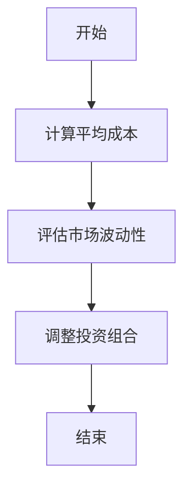
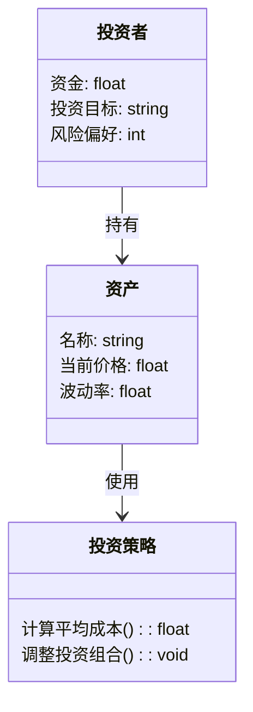
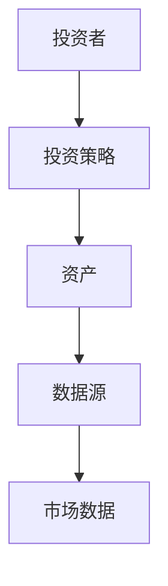

                 


# 价值平均投资法：利用市场波动的智慧策略

> 关键词：价值平均投资法, 投资策略, 市场波动, 平均成本法, 投资组合优化

> 摘要：本文深入探讨了价值平均投资法的核心思想、数学模型、算法实现、系统设计以及实际应用。通过详细的理论分析和案例研究，展示了如何利用市场波动性优化投资组合，降低投资成本，实现长期稳健的收益。文章从基础概念到实战应用，全面解析了价值平均投资法的智慧策略。

---

# 第一部分: 价值平均投资法的背景与概念

## 第1章: 价值平均投资法的背景

### 1.1 投资的基本概念

#### 1.1.1 投资的定义与分类
投资是指将资金投入某种资产或项目，期望在未来获得收益或资本增值的行为。常见的投资形式包括股票、债券、房地产、基金等。

#### 1.1.2 投资的目标与风险
- **目标**：追求收益最大化、资本增值、资产保值等。
- **风险**：包括市场风险、流动性风险、通货膨胀风险等。

### 1.2 价值平均投资法的起源

#### 1.2.1 投资学的基本发展史
- 20世纪30年代：现代投资组合理论（MPT）的提出，标志着投资学的系统化。
- 20世纪60年代：价值投资理念的兴起，强调长期持有优质资产。
- 20世纪90年代：量化投资方法的兴起，推动了投资策略的多样化。

#### 1.2.2 价值平均法的提出背景
价值平均投资法结合了传统投资策略与现代数学模型，旨在通过平均成本法降低投资门槛，利用市场波动性优化投资组合。

### 1.3 价值平均投资法的核心概念

#### 1.3.1 平均成本法的定义
平均成本法是一种分批买入资产的方法，通过在不同时间点以不同价格买入资产，降低整体投资成本。

#### 1.3.2 价值平均法与传统投资策略的区别
| 特性         | 传统投资策略       | 价值平均投资法   |
|--------------|--------------------|-------------------|
| 投资理念     | 长期持有优质资产   | 分批买入，平均成本|
| 风险控制     | 侧重资产质量       | 侧重成本控制     |
| 市场适应性   | 较弱               | 较强             |

#### 1.3.3 价值平均法的数学模型
价值平均法的核心公式为：
$$
\text{平均成本} = \frac{\sum_{i=1}^{n} p_i}{n}
$$
其中，$p_i$ 是第i次买入的价格，$n$ 是买入的次数。

---

# 第二部分: 价值平均投资法的理论基础

## 第2章: 投资组合理论

### 2.1 马科维茨的投资组合理论

#### 2.1.1 现代投资组合理论的核心思想
马科维茨提出，投资者可以通过优化资产配置来实现收益与风险的最优平衡。

#### 2.1.2 投资组合理论的应用
- 资产分配：根据风险承受能力分配不同资产。
- 风险调整：通过多样化降低组合风险。

### 2.2 市场波动性与投资策略

#### 2.2.1 市场波动性的定义与度量
市场波动性是衡量资产价格变动程度的指标，常用标准差或波动率来衡量。

#### 2.2.2 波动性对投资组合的影响
- 波动性高的资产收益可能更高，但风险也更大。
- 价值平均法通过分批买入，利用波动性降低平均成本。

### 2.3 价值平均法的数学模型与算法

#### 2.3.1 价值平均法的数学公式
$$
\text{最优投资比例} = \frac{\sum_{i=1}^{n} w_i \times p_i}{\sum_{i=1}^{n} w_i}
$$
其中，$w_i$ 是第i次买入的权重，$p_i$ 是第i次买入的价格。

#### 2.3.2 价值平均法的算法流程


---

# 第三部分: 价值平均投资法的系统设计与实现

## 第3章: 系统分析与架构设计

### 3.1 问题场景介绍

#### 3.1.1 投资者的常见问题
- 资金不足，无法一次性投入。
- 市场波动大，难以把握最佳投资时机。

#### 3.1.2 价值平均法的解决方案
通过分批买入，降低平均投资成本，优化投资组合。

### 3.2 系统功能设计

#### 3.2.1 领域模型


#### 3.2.2 系统架构设计


### 3.3 系统实现与代码示例

#### 3.3.1 Python代码实现
```python
import numpy as np

class ValueAveraging:
    def __init__(self, initial_balance, target_assets):
        self.balance = initial_balance
        self.target_assets = target_assets
        self.assets = []
        self.cost_basis = 0.0

    def calculate_average_cost(self):
        total_cost = sum(asset['price'] * asset['quantity'] for asset in self.assets)
        total_quantity = sum(asset['quantity'] for asset in self.assets)
        if total_quantity == 0:
            self.cost_basis = 0.0
        else:
            self.cost_basis = total_cost / total_quantity
        return self.cost_basis

    def adjust_portfolio(self, current_prices):
        # 调整投资组合以优化平均成本
        for asset in self.assets:
            target_price = current_prices[asset['name']]
            if asset['price'] > target_price:
                # 市场价格下降，增加该资产的持有量
                self.buy_asset(asset['name'], target_price)
        return

    def buy_asset(self, asset_name, price):
        # 计算可购买的数量
        available_funds = self.balance
        quantity = available_funds / price
        self.assets.append({'name': asset_name, 'price': price, 'quantity': quantity})
        self.balance -= quantity * price
        return
```

---

# 第四部分: 实战与案例分析

## 第4章: 实战应用

### 4.1 环境安装与配置

#### 4.1.1 安装Python环境
- 安装Python 3.8以上版本。
- 安装必要的库：numpy, pandas, matplotlib。

### 4.2 核心代码实现

#### 4.2.1 计算平均成本
```python
def compute_average_cost(prices):
    return np.mean(prices)
```

#### 4.2.2 波动性调整
```python
def calculate_volatility(prices):
    return np.std(prices)
```

### 4.3 案例分析

#### 4.3.1 案例背景
假设某投资者有10000元资金，计划投资于一只波动较大的股票。

#### 4.3.2 投资策略实施
- 分批买入，每次投入2000元，共5次买入。
- 每次买入的价格分别为：10元、9元、11元、8元、10元。

#### 4.3.3 平均成本计算
$$
\text{平均成本} = \frac{2000 \times (10 + 9 + 11 + 8 + 10)}{5} = 9.6 \text{元}
$$

---

# 第五部分: 总结与展望

## 第5章: 总结与注意事项

### 5.1 总结

#### 5.1.1 核心要点回顾
- 价值平均法通过分批买入，降低平均成本。
- 利用市场波动性优化投资组合。

#### 5.1.2 实战经验总结
- 定期调整投资组合，根据市场波动性优化投资策略。
- 风险控制是关键，避免过度集中投资。

### 5.2 注意事项

#### 5.2.1 风险提示
- 市场波动性大的资产风险较高。
- 投资者需根据自身风险承受能力调整投资策略。

#### 5.2.2 最佳实践
- 定期评估投资组合，及时调整。
- 长期持有优质资产，结合价值平均法优化投资成本。

---

# 附录

## 附录A: 术语表

- 价值平均投资法：通过分批买入资产，降低平均成本的投资策略。
- 平均成本法：计算投资组合的平均成本，优化投资决策。
- 市场波动性：资产价格的短期波动程度。

## 附录B: 工具推荐

- Python：数据分析与编程工具。
- Pandas：数据处理库。
- Matplotlib：数据可视化库。

## 附录C: 常见问题解答

- **Q1**：价值平均法适合所有投资者吗？
  - A1：不完全适合，需根据个人风险承受能力和市场环境调整策略。

---

# 作者

**作者：AI天才研究院/AI Genius Institute & 禅与计算机程序设计艺术 /Zen And The Art of Computer Programming**

---

以上是《价值平均投资法：利用市场波动的智慧策略》的文章大纲和详细内容。如果需要进一步修改或补充，请随时告知。

