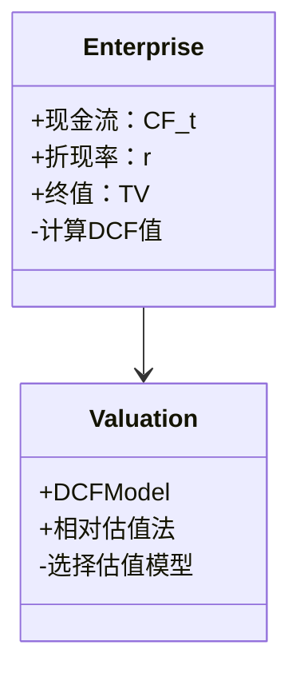

                 


# 价值投资中企业估值的核心算法模型

> 关键词：价值投资，企业估值，现金流折现模型，相对估值法，股权自由现金流模型

> 摘要：本文详细探讨了价值投资中企业估值的核心算法模型，包括现金流折现模型（DCF）、相对估值法和股权自由现金流模型。通过数学公式、实例分析和系统设计，本文为读者提供了从理论到实践的企业估值方法，帮助投资者更好地理解和应用这些模型。

---

# 第一部分: 价值投资与企业估值概述

## 第1章: 价值投资的背景与核心理念

### 1.1 价值投资的起源与发展

#### 1.1.1 价值投资的起源
价值投资的理念起源于20世纪初，由本杰明·格雷厄姆和戴维·多德提出。格雷厄姆强调以内在价值为基础进行投资，寻找市场价格低于内在价值的企业。

#### 1.1.2 价值投资的核心理念
- **安全边际**：买入价格低于内在价值，以确保投资的安全性。
- **长期视角**：关注企业的长期盈利能力，而非短期市场波动。
- **基本面分析**：通过财务报表等基本面数据评估企业的内在价值。

#### 1.1.3 价值投资与现代投资理论的联系
现代投资组合理论（MPT）强调分散投资和风险调整后的收益，而价值投资则关注于找到被市场低估的优质企业。两者在风险控制和收益最大化上存在一定的契合点。

### 1.2 企业估值的基本概念

#### 1.2.1 企业估值的定义
企业估值是通过对企业的财务数据、行业地位、竞争优势等因素的分析，估算其内在价值的过程。

#### 1.2.2 企业估值的核心要素
- **现金流**：企业未来产生的现金流是估值的基础。
- **增长率**：企业的盈利增长率影响其未来现金流的现值。
- **折现率**：用于将未来现金流折现为现值的利率，通常基于企业的风险水平。

#### 1.2.3 企业估值的常见方法
- **绝对估值法**：DCF模型、股权自由现金流模型等。
- **相对估值法**：市盈率、市净率、市销率等。

### 1.3 价值投资中的企业估值目标

#### 1.3.1 确定企业内在价值
通过分析企业的财务数据和行业地位，估算其合理的市场价值。

#### 1.3.2 识别市场低估企业
寻找市场价格低于内在价值的企业，作为投资标的。

#### 1.3.3 投资决策的依据
基于企业估值结果，做出买入、持有或卖出的投资决策。

---

## 第2章: 价值投资中的核心算法模型

### 2.1 现金流折现模型（DCF）

#### 2.1.1 DCF模型的定义
DCF模型通过将企业未来产生的自由现金流折现，计算其当前的内在价值。

#### 2.1.2 DCF模型的核心公式
$$DCF = \sum_{t=1}^{n} \frac{CF_t}{(1 + r)^t} + \frac{TV}{(1 + r)^n}$$

其中：
- $CF_t$：第t年的自由现金流
- $r$：折现率
- $n$：估值期数
- $TV$：终值，通常假设为永续年的现金流

#### 2.1.3 DCF模型的优缺点
- **优点**：考虑了资金的时间价值，能够准确反映企业的未来现金流。
- **缺点**：需要对增长率和折现率做出合理的假设，存在一定的主观性。

### 2.2 相对估值法

#### 2.2.1 相对估值法的定义
相对估值法是通过比较企业的估值指标（如市盈率、市净率）与行业平均水平或可比公司，来判断企业是否被高估或低估。

#### 2.2.2 常见相对估值指标

- **市盈率（P/E）**
  $$P/E = \frac{股价}{每股收益}$$

- **市净率（P/B）**
  $$P/B = \frac{股价}{每股净资产}$$

- **市销率（P/S）**
  $$P/S = \frac{股价}{每股收入}$$

#### 2.2.3 相对估值法的适用场景
- 当企业未来现金流难以预测时，相对估值法是一种简便的方法。
- 适用于中小型企业或新兴行业的估值。

### 2.3 股权自由现金流模型

#### 2.3.1 股权自由现金流的定义
股权自由现金流是指企业扣除所有资本成本后，能够分配给股东的现金流。

#### 2.3.2 股权自由现金流的计算公式
$$FCF = EBIT(1 - t) + Depreciation - Capital Expenditure$$

其中：
- $EBIT$：息税前利润
- $t$：税率
- $Depreciation$：折旧
- $Capital Expenditure$：资本支出

#### 2.3.3 股权自由现金流模型的应用
- 用于估算企业的股权价值。
- 适用于那些现金流稳定的企业。

### 2.4 企业生命周期与估值模型的选择

#### 2.4.1 企业生命周期的定义
企业生命周期分为初创期、成长期、成熟期和衰退期。

#### 2.4.2 不同生命周期阶段的估值模型选择
- **初创期**：使用相对估值法，如市销率。
- **成长期**：使用DCF模型，假设较高的增长率。
- **成熟期**：使用稳定的DCF模型或市盈率。
- **衰退期**：使用简单的相对估值法。

#### 2.4.3 生命周期对企业估值的影响
企业的生命周期决定了其现金流的增长速度和稳定性，从而影响估值模型的选择。

---

## 第3章: 价值投资中的企业估值核心算法模型

### 3.1 现金流折现模型（DCF）的详细讲解

#### 3.1.1 DCF模型的数学公式
$$DCF = \sum_{t=1}^{n} \frac{CF_t}{(1 + r)^t} + \frac{TV}{(1 + r)^n}$$

#### 3.1.2 DCF模型的步骤
1. **确定未来现金流**：预测企业未来几年的现金流。
2. **确定折现率**：基于企业的风险水平，选择合适的折现率。
3. **计算现值**：将未来现金流折现，计算其现值。
4. **加上终值**：假设企业在第n年后有终值，将其折现并加到现值中。

#### 3.1.3 DCF模型的优缺点
- **优点**：考虑了资金的时间价值，能够准确反映企业的未来现金流。
- **缺点**：需要对增长率和折现率做出合理的假设，存在一定的主观性。

### 3.2 相对估值法的数学公式

#### 3.2.1 市盈率（P/E）公式
$$P/E = \frac{股价}{每股收益}$$

#### 3.2.2 市净率（P/B）公式
$$P/B = \frac{股价}{每股净资产}$$

#### 3.2.3 市销率（P/S）公式
$$P/S = \frac{股价}{每股收入}$$

---

## 第4章: 系统分析与架构设计方案

### 4.1 问题场景介绍
本文将通过一个具体的案例，展示如何使用DCF模型对一家企业进行估值。

### 4.2 项目介绍
我们选择一家虚构的公司ABC，假设其未来五年的现金流分别为100万、120万、140万、160万、180万，折现率为8%，终值为200万。

### 4.3 系统功能设计

#### 4.3.1 领域模型（Mermaid 类图）


#### 4.3.2 系统架构设计（Mermaid 架构图）
```mermaid
container 企业估值系统 {
    component 数据输入
    component 模型计算
    component 结果输出
}
```

#### 4.3.3 系统接口设计
- 输入：企业财务数据、行业数据
- 输出：企业估值结果

#### 4.3.4 系统交互（Mermaid 序列图）
```mermaid
sequenceDiagram
    User -> 输入数据：输入企业财务数据
    输入数据 -> 模型计算：开始计算DCF模型
    模型计算 -> 结果输出：输出DCF值
    User <- 结果输出：显示企业估值结果
```

---

## 第5章: 项目实战

### 5.1 环境安装
需要安装Python和必要的库（如pandas、numpy）。

### 5.2 核心代码实现

```python
def calculate_dcf(cash_flows, discount_rate, terminal_value):
    dcf = 0
    for t, cf in enumerate(cash_flows):
        dcf += cf / (1 + discount_rate) ** t
    dcf += terminal_value / (1 + discount_rate) ** len(cash_flows)
    return dcf

# 示例数据
cash_flows = [100, 120, 140, 160, 180]
discount_rate = 0.08
terminal_value = 200

# 计算DCF
DCF = calculate_dcf(cash_flows, discount_rate, terminal_value)
print(f"DCF Value: {DCF}")
```

### 5.3 案例分析与解读
通过上述代码，我们可以计算出企业的DCF价值，从而判断其是否被低估。

---

## 第6章: 最佳实践与小结

### 6.1 投资的关键点
- **选择合适的企业**：寻找具有持续竞争优势的企业。
- **合理估值**：综合运用多种估值模型，避免单一模型的偏差。
- **长期持有**：耐心持有优质企业，避免短期波动的干扰。

### 6.2 小结
价值投资的核心在于找到市场价格低于内在价值的企业。通过DCF模型等算法模型，投资者可以更准确地评估企业的内在价值，做出明智的投资决策。

### 6.3 注意事项
- 估值模型的假设需要合理，避免过于乐观或悲观的假设。
- 定期更新财务数据，保持估值的准确性。

### 6.4 拓展阅读
- 格雷厄姆的《证券分析》
- 巴菲特的股东信中的投资理念

---

# 结语

通过本文的详细讲解，读者可以掌握价值投资中企业估值的核心算法模型，并能够在实际投资中灵活运用这些模型，做出更加明智的投资决策。

---

# 作者

作者：AI天才研究院/AI Genius Institute  
联系邮箱：contact@aitrading.com  
GitHub：https://github.com/aitrading

