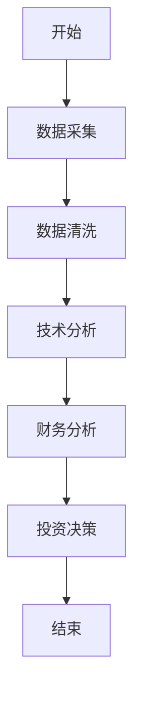
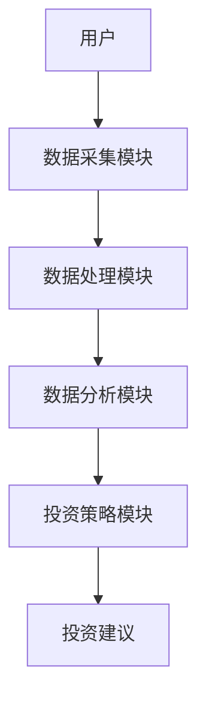

                 


# 价值投资中的5G技术机会

> 关键词：5G技术，价值投资，投资机会，5G产业链，技术分析

> 摘要：本文将详细分析5G技术在投资领域的机会，从5G技术的基本概念到其在各个产业中的应用，再到如何通过价值投资的方法挖掘5G技术带来的投资机会。通过分析5G产业链的各个环节，结合技术分析和财务分析，为投资者提供科学的投资策略和建议。

---

## 第1章：5G技术的概述与演进

### 1.1 5G技术的定义与核心特点

#### 1.1.1 5G技术的定义
5G技术是第五代移动通信技术，相较于4G技术，5G具有更高的传输速度、更低的延迟和更大的连接密度。

#### 1.1.2 5G技术的核心特点
- 高速率：5G的理论下载速度可以达到10Gbps。
- 低延迟：5G的理论延迟可以达到1ms。
- 大连接：5G可以支持每平方公里100万个连接。

#### 1.1.3 5G技术与4G技术的对比
| 特性      | 4G                | 5G                |
|-----------|-------------------|-------------------|
| 传输速度  | 最高1Gbps         | 最高10Gbps         |
| 延迟       | 50ms             | 1ms               |
| 连接密度   | 每平方公里10万个连接 | 每平方公里100万个连接 |

### 1.2 5G技术的演进历程

#### 1.2.1 从1G到5G的演进
- 1G：模拟通信
- 2G：数字通信，支持文本和语音
- 3G：数据传输，支持视频和图片
- 4G：高速互联网，支持高清视频和移动应用
- 5G：万物互联，支持工业互联网和智慧城市

### 1.3 5G技术对社会与经济的影响

#### 1.3.1 5G技术对社会的影响
- 提升通信效率
- 促进物联网发展
- 改善生活质量

#### 1.3.2 5G技术对经济的推动作用
- 推动产业升级
- 带动经济增长
- 创造新的就业机会

#### 1.3.3 5G技术与投资机会的关系
5G技术的广泛应用将带来巨大的投资机会，尤其是在以下几个方面：
- 5G设备制造
- 5G网络建设
- 5G应用开发

---

## 第2章：价值投资的基本原理

### 2.1 价值投资的定义与核心理念

#### 2.1.1 价值投资的定义
价值投资是一种投资策略，通过分析企业的基本面，寻找被市场低估的投资标的。

#### 2.1.2 价值投资的核心理念
- 购买优秀的公司
- 长期持有
- 避免短期波动

### 2.2 价值投资的关键要素

#### 2.2.1 行业分析
- 行业的生命周期
- 行业的竞争结构
- 行业的政策环境

#### 2.2.2 公司基本面分析
- 财务状况
- 盈利能力
- 管理团队

#### 2.2.3 财务指标分析
- 市盈率（P/E）
- 市净率（P/B）
- 净资产收益率（ROE）

---

## 第3章：5G技术的产业链分析

### 3.1 5G技术的产业链构成

#### 3.1.1 5G技术的上游产业
- 半导体制造
- 器件制造
- 通信设备制造

#### 3.1.2 5G技术的中游产业
- 网络设备供应商
- 网络建设商
- 网络运营商

#### 3.1.3 5G技术的下游产业
- 终端设备制造商
- 应用开发商
- 服务提供商

### 3.2 5G技术产业链的关键环节

#### 3.2.1 5G设备制造
- 基站设备
- 终端设备
- 传输设备

#### 3.2.2 5G网络建设
- 网络规划
- 网络部署
- 网络优化

#### 3.2.3 5G应用开发
- 工业互联网
- 智慧城市
- 智慧医疗

### 3.3 5G技术产业链的投资机会

#### 3.3.1 上游设备商的投资机会
- 半导体供应商
- 器件供应商
- 通信设备供应商

#### 3.3.2 中游网络建设商的投资机会
- 网络设备供应商
- 网络建设商
- 网络运营商

#### 3.3.3 下游应用开发商的投资机会
- 工业互联网应用商
- 智慧城市应用商
- 智慧医疗应用商

---

## 第4章：5G技术的应用场景与市场分析

### 4.1 5G技术的主要应用场景

#### 4.1.1 工业互联网
- 智能制造
- 智慧工厂
- 车联网

#### 4.1.2 智慧城市
- 智能交通
- 智能安防
- 智能能源

#### 4.1.3 智慧医疗
- 远程医疗
- 智能诊疗
- 医疗物联网

#### 4.1.4 智慧交通
- 自动驾驶
- 智能物流
- 智能交通管理

### 4.2 5G技术的市场发展趋势

#### 4.2.1 5G技术的市场需求
- 工业互联网需求增长
- 智慧城市需求增加
- 智慧医疗需求扩大

#### 4.2.2 5G技术的市场供给
- 5G网络覆盖扩大
- 5G设备产量增加
- 5G应用开发加速

#### 4.2.3 5G技术的市场前景
- 市场规模持续扩大
- 技术创新不断推进
- 应用场景日益丰富

---

## 第5章：基于5G技术的价值投资策略

### 5.1 5G技术的价值投资策略

#### 5.1.1 产业链分析法
- 上游设备商：关注半导体和器件供应商
- 中游网络建设商：关注网络设备供应商和网络运营商
- 下游应用开发商：关注工业互联网和智慧城市应用商

#### 5.1.2 技术分析法
- 通过K线图分析股票走势
- 通过技术指标分析股票买卖点

#### 5.1.3 财务分析法
- 通过市盈率、市净率和ROE等指标筛选投资标的

### 5.2 5G技术的价值投资案例分析

#### 5.2.1 某知名5G设备商的投资分析
- 公司基本面分析
- 财务指标分析
- 股票估值分析

#### 5.2.2 某5G网络运营商的投资分析
- 行业分析
- 公司竞争优势分析
- 股票投资价值评估

---

## 第6章：5G技术的价值投资算法与系统设计

### 6.1 5G技术分析的算法原理

#### 6.1.1 算法原理
- 基于5G技术的关键指标进行分析
- 通过数学模型预测股票价格走势

#### 6.1.2 算法流程图


#### 6.1.3 算法实现代码
```python
def five_g_analysis(data):
    # 数据清洗
    cleaned_data = data.dropna()
    # 技术分析
    cleaned_data['EMA'] = cleaned_data['收盘价'].ewm(span=10).mean()
    cleaned_data['RSI'] = ta.RSI(cleaned_data['收盘价'], window=14)
    # 财务分析
    cleaned_data['PE'] = cleaned_data['收盘价'] / cleaned_data['每股收益']
    return cleaned_data

# 示例数据
data = pd.DataFrame({
    '收盘价': [100, 105, 110, 115, 120],
    '每股收益': [2, 2.5, 3, 3.5, 4]
})
result = five_g_analysis(data)
print(result)
```

### 6.2 价值投资策略的系统设计

#### 6.2.1 系统架构设计


#### 6.2.2 系统功能设计
- 数据采集模块：采集5G相关企业的财务数据和市场数据
- 数据处理模块：清洗和整理数据
- 数据分析模块：进行技术分析和财务分析
- 投资策略模块：生成投资建议

---

## 第7章：5G技术的价值投资项目实战

### 7.1 项目背景介绍

#### 7.1.1 项目目标
分析某5G设备商的投资机会，制定投资策略。

### 7.2 项目环境搭建

#### 7.2.1 数据源选择
- 公司财务数据
- 行业市场数据
- 股票价格数据

### 7.3 项目核心实现

#### 7.3.1 数据分析
- 技术分析：计算EMA和RSI指标
- 财务分析：计算PE和ROE指标

#### 7.3.2 投资策略制定
- 基于技术分析和财务分析，制定买入和卖出策略

### 7.4 项目案例分析

#### 7.4.1 某5G设备商的分析
- 财务数据：公司收入、利润、每股收益
- 技术数据：股票价格走势、EMA和RSI指标

#### 7.4.2 投资建议
- 买入建议：当EMA和RSI指标均处于上升趋势时
- 卖出建议：当EMA和RSI指标均处于下降趋势时

### 7.5 项目小结

---

## 第8章：总结与展望

### 8.1 总结
5G技术的广泛应用将带来巨大的投资机会，尤其是在工业互联网、智慧城市和智慧医疗等领域。通过价值投资的方法，可以有效挖掘这些机会。

### 8.2 展望
随着5G技术的不断发展，未来将有更多的应用场景出现，投资者需要持续关注5G技术的最新发展，及时调整投资策略。

---

## 作者：AI天才研究院/AI Genius Institute & 禅与计算机程序设计艺术 /Zen And The Art of Computer Programming

