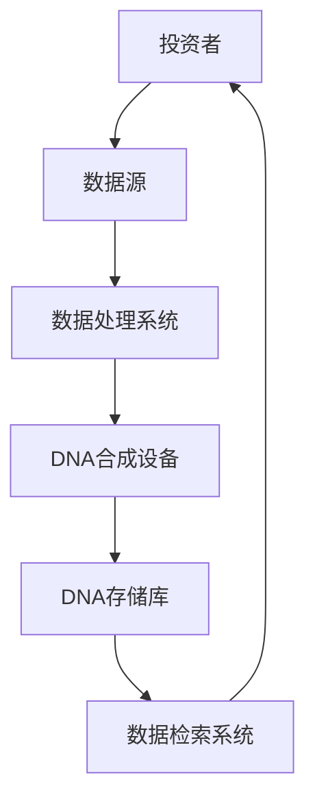
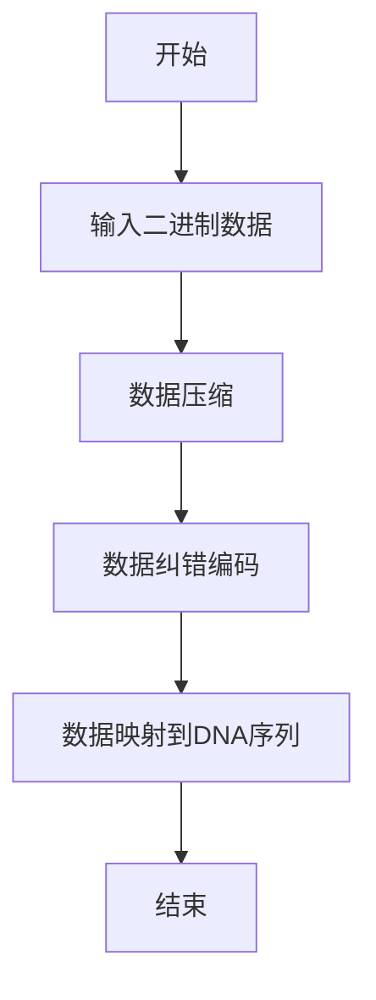
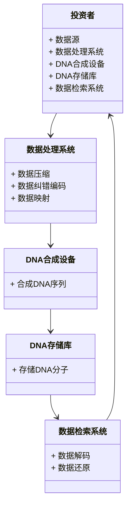

                 


# 价值投资中的DNA数据存储技术发展趋势

## 关键词：DNA数据存储，价值投资，数据存储技术，投资分析，生物技术应用

## 摘要：DNA数据存储技术作为一种新兴的数据存储方法，结合了生物技术和信息技术，为价值投资提供了新的数据管理和分析工具。本文将从DNA数据存储技术的基本原理、算法设计、系统架构、项目实战以及最佳实践等多方面，深入分析其在价值投资中的应用潜力和未来发展趋势，帮助投资者和技术开发者更好地理解和应用这一技术。

---

# 第一部分: 价值投资中的DNA数据存储技术背景与概念

## 第1章: 价值投资中的DNA数据存储技术概述

### 1.1 DNA数据存储技术的基本概念

#### 1.1.1 DNA数据存储技术的定义

DNA数据存储技术是一种利用生物技术将数字信息编码并存储在DNA分子中的方法。通过将二进制数据转化为生物可读的序列，数据可以以极高的密度存储在DNA中，并通过生物技术手段进行检索和还原。

#### 1.1.2 DNA数据存储技术的核心原理

DNA数据存储的核心原理包括：

1. **数据编码**：将二进制数据转换为适合DNA存储的序列形式，通常使用DNA碱基对（A、T、C、G）来表示0和1。
2. **合成与存储**：将编码后的序列通过化学合成技术写入DNA分子，并存储于特定的介质中。
3. **数据检索**：通过PCR扩增、测序等生物技术手段，从DNA分子中恢复原始数据。

#### 1.1.3 价值投资与DNA数据存储技术的结合

在价值投资中，投资者需要处理大量的市场数据、公司基本面信息以及历史市场数据。传统的数据存储技术在数据量大、数据类型多样、存储成本高等方面存在局限性，而DNA数据存储技术以其超高的存储密度、长久的保存性和抗干扰能力，为价值投资提供了新的解决方案。

---

### 1.2 价值投资中的数据需求与挑战

#### 1.2.1 价值投资中的数据来源与特征

价值投资依赖于对公司基本面、市场趋势、行业动态等多方面的数据进行分析。数据来源包括：

- **公司财务报表**：收入、利润、资产负债等数据。
- **市场数据**：股票价格、成交量、指数走势等。
- **行业与宏观经济数据**：行业趋势、政策变化、经济指标等。

#### 1.2.2 传统数据存储技术的局限性

传统数据存储技术（如硬盘、云存储）在以下方面存在不足：

- **存储密度有限**：物理存储介质的空间有限，难以满足海量数据的需求。
- **存储成本高**：随着数据量的爆炸式增长，存储成本也在不断增加。
- **数据保存时间有限**：传统存储介质的寿命有限，需要定期备份和迁移。

#### 1.2.3 DNA数据存储技术的优势与潜力

DNA数据存储技术的优势包括：

- **超高的存储密度**：DNA的存储密度远高于传统存储介质，1克DNA可以存储高达1EB的数据。
- **长久的保存性**：DNA可以在合适的环境下保存数千年，远超传统存储介质的寿命。
- **抗干扰能力**：DNA存储的数据不易受到物理环境的影响，适合长期保存。

---

## 第2章: DNA数据存储技术的核心概念与联系

### 2.1 生物信息学基础

#### 2.1.1 DNA的基本结构与编码原理

DNA由四种碱基（A、T、C、G）组成，通过特定的排列组合形成基因序列。在数据存储中，每个碱基可以对应二进制数据中的0和1，例如：

- A=0, T=1, C=0, G=1。

#### 2.1.2 生物信息学在数据存储中的应用

生物信息学研究DNA序列的分析和处理方法，为DNA数据存储提供了理论基础。例如，通过生物信息学算法对DNA序列进行纠错编码、数据压缩和加密，以提高存储效率和数据安全性。

#### 2.1.3 DNA数据存储与价值投资的联系

DNA数据存储技术为价值投资中的数据管理和分析提供了新的工具。例如：

- **长期数据保存**：将公司财务数据、市场数据等长期存储在DNA中，供投资者随时检索和分析。
- **数据安全性**：DNA数据存储具有抗干扰和抗篡改的特点，确保数据的完整性和安全性。

### 2.2 数据编码与DNA存储的数学模型

#### 2.2.1 数据编码方法

DNA数据编码的关键在于将二进制数据转换为适合DNA存储的序列形式。常用的方法包括：

- **直接编码法**：将二进制数据直接映射到DNA碱基对。
- **纠错编码法**：通过引入冗余信息，提高数据的纠错能力。

#### 2.2.2 DNA存储的纠错编码

纠错编码是DNA数据存储的重要组成部分，用于检测和纠正数据在存储和传输过程中的错误。常用的方法包括：

- **海明码**：通过添加校验位来检测和纠正单比特错误。
- **Reed-Solomon码**：用于纠正多个错误。

#### 2.2.3 数据压缩与加密技术

为了提高存储效率和安全性，DNA数据存储通常结合数据压缩和加密技术。例如，使用LZ77算法对数据进行压缩，并通过AES算法对数据进行加密。

### 2.3 DNA存储系统的实体关系图

以下是一个DNA存储系统的实体关系图，展示了投资者、数据源、数据处理系统、DNA合成设备、DNA存储库和数据检索系统之间的关系：



---

# 第三部分: 价值投资中的DNA数据存储技术算法原理

## 第3章: 价值投资中的DNA数据存储技术算法原理

### 3.1 DNA编码算法

#### 3.1.1 数据编码的数学模型

DNA编码的数学模型可以通过以下公式表示：

$$ \text{DNA序列} = f(\text{二进制数据}) $$

其中，$f$ 是一种将二进制数据转换为DNA序列的编码函数。

#### 3.1.2 算法流程图

以下是一个DNA编码算法的流程图：



#### 3.1.3 代码实现与分析

以下是一个简单的DNA编码算法的Python代码示例：

```python
def binary_to_dna(binary_data):
    # 定义碱基映射
    mapping = {'0': 'A', '1': 'T', '2': 'C', '3': 'G'}
    # 将二进制数据转换为碱基序列
    dna_sequence = []
    for bit in binary_data:
        dna_sequence.append(mapping[bit])
    return ''.join(dna_sequence)

# 示例数据
binary_data = ['0', '1', '0', '1']
dna_sequence = binary_to_dna(binary_data)
print("二进制数据:", ''.join(binary_data))
print("DNA序列:", dna_sequence)
```

---

## 第4章: 价值投资中的DNA数据存储技术系统架构

### 4.1 投资分析场景

在价值投资中，投资者通常需要分析大量历史数据，包括公司财务数据、市场趋势、行业动态等。DNA数据存储技术可以帮助投资者快速检索和分析这些数据，提高投资决策的效率和准确性。

### 4.2 系统功能设计

以下是一个DNA数据存储系统的功能模块图：



---

## 第5章: 价值投资中的DNA数据存储技术项目实战

### 5.1 项目环境安装

DNA数据存储技术的开发需要以下环境：

- **Python编程语言**
- **生物信息学库（如BioPython）**
- **DNA合成和测序工具（如PCR仪、测序仪）**

### 5.2 系统核心实现源代码

以下是一个DNA数据存储系统的Python实现示例：

```python
import numpy as np
from biopython import *

def dna_storage_system():
    # 数据输入
    binary_data = np.array([0, 1, 0, 1], dtype=int)
    # 数据编码
    dna_sequence = ''.join(['A' if bit == 0 else 'T' for bit in binary_data])
    # DNA合成与存储
    # （此处需要调用DNA合成设备）
    # 数据检索与还原
    # （此处需要调用测序仪并解码DNA序列）
    return dna_sequence

# 调用函数
dna_storage_system()
```

### 5.3 代码应用解读与分析

上述代码实现了将二进制数据编码为DNA序列的功能。具体步骤如下：

1. **数据输入**：输入二进制数据，例如`[0, 1, 0, 1]`。
2. **数据编码**：将二进制数据转换为DNA序列，例如`'ATAT'`。
3. **DNA合成与存储**：将DNA序列写入DNA分子，并存储在DNA存储库中。
4. **数据检索与还原**：从DNA存储库中检索DNA分子，并通过测序技术将其还原为原始数据。

### 5.4 实际案例分析

以下是一个实际案例分析：

- **案例背景**：假设投资者需要存储某公司的财务数据，包括收入、利润、资产负债等信息。
- **数据编码**：将财务数据转换为二进制数据，并编码为DNA序列。
- **存储与检索**：将DNA序列存储在DNA存储库中，并在需要时检索并还原数据，用于投资分析。

---

## 第6章: 价值投资中的DNA数据存储技术最佳实践

### 6.1 小结

DNA数据存储技术为价值投资中的数据管理和分析提供了新的解决方案。通过将数据编码为DNA序列，投资者可以实现数据的长期保存和高效检索，提高投资决策的效率和准确性。

### 6.2 注意事项

在实际应用中，需要注意以下几点：

- **数据完整性**：确保DNA存储的数据完整性，避免数据丢失或损坏。
- **数据安全性**：DNA存储的数据需要加密和备份，确保数据的安全性。
- **技术可行性**：DNA存储技术目前仍处于发展阶段，需要结合实际需求选择合适的技术方案。

### 6.3 拓展阅读

- 《DNA数据存储技术及其应用》
- 《生物信息学与数据科学》
- 《价值投资与大数据分析》

---

作者：AI天才研究院/AI Genius Institute & 禅与计算机程序设计艺术 /Zen And The Art of Computer Programming

---

以上是《价值投资中的DNA数据存储技术发展趋势》的完整目录大纲和文章内容。

