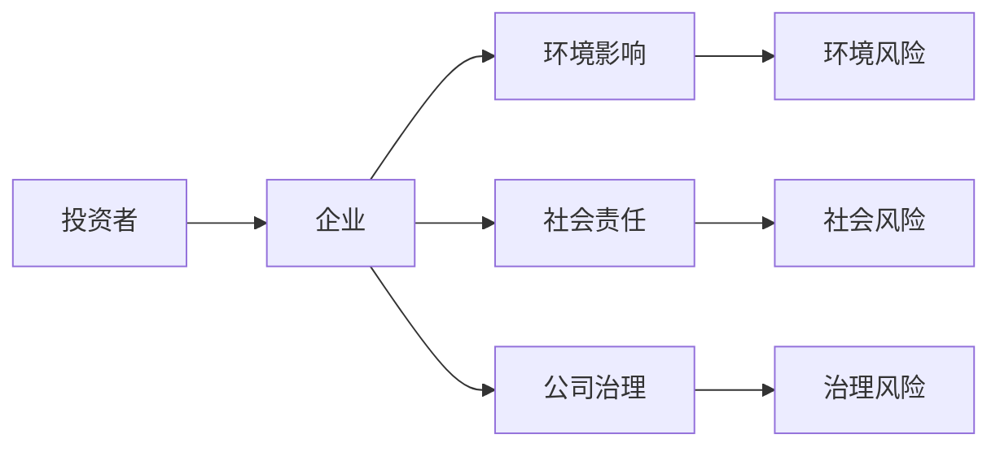

                 


# 价值投资中的ESG因素分析

## 关键词：ESG投资，价值投资，环境、社会、治理（ESG），投资策略，可持续发展

## 摘要：
本文深入探讨了ESG（环境、社会、治理）因素在价值投资中的重要性及其分析方法。通过结合技术与投资学的视角，详细分析了ESG的核心概念、评分模型、算法原理以及在投资策略中的应用。本文旨在为投资者提供基于ESG的科学投资决策支持，帮助他们在复杂多变的市场环境中实现长期稳健的投资回报。

---

# 第1章 ESG概念与价值投资概述

## 1.1 ESG的定义与背景

### 1.1.1 ESG的定义
ESG是环境（Environmental）、社会（Social）和治理（Governance）三个维度的简称，用于评估企业在可持续发展方面的表现。环境因素关注企业的碳排放、资源利用效率等；社会因素关注企业的社会责任、员工权益等；治理因素关注企业的董事会结构、管理层透明度等。

### 1.1.2 ESG投资的兴起与发展趋势
随着全球气候变化加剧、社会不平等问题凸显以及企业治理透明度要求的提高，ESG投资逐渐成为主流。越来越多的投资者开始关注企业在ESG方面的表现，以评估其长期投资价值。

### 1.1.3 ESG与价值投资的结合
价值投资强调以低于内在价值的价格买入优质资产。ESG因素为价值投资者提供了新的视角，帮助他们在选择标的时更加注重企业的长期可持续发展能力。

## 1.2 ESG在价值投资中的重要性

### 1.2.1 ESG因素对投资决策的影响
ESG因素能够帮助投资者识别企业的潜在风险和机会。例如，高碳排放企业可能面临政策风险，而社会责任感强的企业可能更具品牌优势。

### 1.2.2 ESG与企业长期价值的关系
研究表明，ESG表现优异的企业往往具有更高的ROE（净资产收益率）和更强的抗风险能力。这使得ESG成为企业长期价值的重要组成部分。

### 1.2.3 投资者关注ESG的驱动因素
投资者关注ESG不仅是出于道德考量，更是为了实现更好的投资回报。ESG表现良好的企业通常更具成长性和稳定性。

## 1.3 本章小结
本章介绍了ESG的基本概念、发展趋势及其在价值投资中的重要性，为后续分析奠定了基础。

---

# 第2章 ESG的核心概念与联系

## 2.1 ESG核心概念原理

### 2.1.1 环境因素（E）的内涵与外延
环境因素关注企业在资源利用、污染排放、气候变化等方面的表现。例如，企业是否采用绿色能源、是否遵守环保法规等。

### 2.1.2 社会责任（S）的内涵与外延
社会责任包括企业对员工、消费者、社区等利益相关方的责任。例如，企业是否关注员工福利、是否支持公益活动等。

### 2.1.3 公司治理（G）的内涵与外延
公司治理涉及董事会结构、管理层透明度、股东权益保护等方面。例如，企业是否建立有效的内控制度、是否实现利益相关者共赢等。

## 2.2 ESG概念属性特征对比

### 2.2.1 ESG三要素的属性对比表格

| 属性       | 环境（E）                     | 社会（S）                   | 治理（G）                 |
|------------|------------------------------|-----------------------------|--------------------------|
| 关注点     | 资源利用、碳排放             | 员工权益、社会责任           | 董事会结构、透明度       |
| 数据来源   | 环境报告、政府数据           | 社会责任报告、新闻报道       | 公司治理报告、财报       |
| 影响因素   | 政策风险、环境法规           | 社会舆论、品牌形象           | 内部控制、股东结构       |
| 衡量指标   | 碳排放强度、能源效率         | 员工满意度、公益活动参与度   | 董事会多样性、高管薪酬比 |

### 2.2.2 ESG三要素的特征对比分析
环境因素具有较强的外部性，容易受到政策和法规的影响；社会因素具有较强的道德属性，与企业品牌形象密切相关；治理因素具有较强的内生性，与企业内部管理效率密切相关。

## 2.3 ESG实体关系图



## 2.4 本章小结
本章通过对比分析和实体关系图，展示了ESG三要素的内涵、外延及其相互关系。

---

# 第3章 ESG评分模型与算法原理

## 3.1 ESG评分模型概述

### 3.1.1 ESG评分模型的定义与作用
ESG评分模型是通过量化方法，对企业在环境、社会、治理三个维度的表现进行评分，从而帮助投资者评估企业的ESG表现。

### 3.1.2 常见的ESG评分方法
常见的ESG评分方法包括加权评分法、因子分析法和机器学习算法。加权评分法是最常用的简单方法，适合初入ESG投资的投资者。

## 3.2 ESG评分算法流程

### 3.2.1 ESG评分流程图


### 3.2.2 ESG评分的具体步骤
1. **数据输入**：收集企业在环境、社会、治理三个维度的相关数据。
2. **特征提取**：提取影响企业ESG表现的关键指标。
3. **权重分配**：根据投资目标对各维度赋予不同的权重。
4. **评分计算**：根据权重和指标评分计算综合ESG评分。
5. **结果输出**：输出企业的ESG评分和分析报告。

## 3.3 ESG评分的数学模型

### 3.3.1 基于加权的ESG评分公式
$$ESG\_score = \sum_{i=1}^{n} w_i \cdot x_i$$

其中：
- $w_i$ 表示第i个指标的权重，范围为[0,1]。
- $x_i$ 表示第i个指标的评分，范围为[1,5]（1分最低，5分最高）。

例如，假设某企业环境指标得分为4分，权重为0.4；社会指标得分为3分，权重为0.3；治理指标得分为5分，权重为0.3。则其ESG评分为：
$$ESG\_score = (0.4 \times 4) + (0.3 \times 3) + (0.3 \times 5) = 1.6 + 0.9 + 1.5 = 4.0$$

## 3.4 本章小结
本章通过流程图和数学公式，详细讲解了ESG评分模型的构建和应用方法。

---

# 第4章 ESG在价值投资中的应用

## 4.1 ESG与投资策略

### 4.1.1 基于ESG的多因子投资模型
多因子投资模型将ESG因素与其他传统财务指标相结合，以提高投资组合的收益和风险调整能力。

### 4.1.2 ESG因子与投资收益的关系
研究表明，ESG表现优异的企业通常具有较高的ROE和较低的波动性，这使得ESG因子成为投资组合中重要的收益来源。

## 4.2 ESG投资的风险与收益分析

### 4.2.1 ESG投资的潜在风险
ESG投资可能面临流动性风险、数据偏差风险和短期收益不显著的问题。

### 4.2.2 ESG投资的长期收益分析
从长期来看，ESG表现优异的企业往往具有更强的抗风险能力和持续的盈利能力，这为投资者带来了稳定的收益。

## 4.3 本章小结
本章分析了ESG在价值投资中的应用及其风险收益特征，为投资者提供了科学的投资决策依据。

---

# 第5章 ESG投资系统的分析与设计

## 5.1 系统分析

### 5.1.1 投资者需求分析
投资者需要一个高效、准确的ESG评分系统，以帮助其进行投资决策。

### 5.1.2 系统功能需求
系统需要具备数据采集、ESG评分、投资策略生成和风险预警等功能。

## 5.2 系统架构设计

### 5.2.1 系统功能模块


### 5.2.2 系统架构图


## 5.3 本章小结
本章通过系统分析和架构设计，展示了如何构建一个高效的ESG投资系统。

---

# 第6章 项目实战：基于ESG的股票投资策略

## 6.1 环境安装与数据准备

### 6.1.1 环境安装
安装Python、Pandas、NumPy等必要的库。

### 6.1.2 数据准备
从公开数据源获取企业的ESG相关数据。

## 6.2 系统核心实现源代码

### 6.2.1 ESG评分模块代码

```python
def calculate_esg_score(environment_score, social_score, governance_score, weights):
    return environment_score * weights[0] + social_score * weights[1] + governance_score * weights[2]
```

### 6.2.2 投资策略模块代码

```python
def generate_investment_strategy(esg_scores, financial_scores):
    portfolio = []
    for i in range(len(esg_scores)):
        if esg_scores[i] > 3 and financial_scores[i] > 2:
            portfolio.append(i)
    return portfolio
```

## 6.3 代码应用解读与分析

### 6.3.1 ESG评分模块解读
上述代码定义了一个计算ESG评分的函数，输入为环境、社会、治理三项得分和对应的权重，输出为综合ESG评分。

### 6.3.2 投资策略模块解读
上述代码定义了一个生成投资组合的函数，根据ESG评分和财务指标筛选出符合条件的股票。

## 6.4 实际案例分析与详细讲解

### 6.4.1 案例背景
假设我们有10只股票，每只股票的ESG评分和财务评分为1到5分。

### 6.4.2 案例分析
假设权重为[0.4, 0.3, 0.3]，则综合ESG评分为：
$$ESG\_score = 环境得分 \times 0.4 + 社会得分 \times 0.3 + 治理得分 \times 0.3$$

## 6.5 本章小结
本章通过实战案例，展示了如何利用ESG评分和投资策略代码进行股票投资。

---

# 第7章 总结与展望

## 7.1 总结
本文系统地分析了ESG在价值投资中的重要性，详细讲解了ESG评分模型、算法原理及投资策略。通过案例分析和系统设计，为投资者提供了科学的投资决策支持。

## 7.2 展望
未来，随着ESG投资的深入发展，还需要进一步完善ESG评分标准和算法模型，探索更多创新的投资策略。

---

# 作者信息

作者：AI天才研究院/AI Genius Institute  
联系方式：info@aitianji.com  
版权所有：禅与计算机程序设计艺术/Zen And The Art of Computer Programming  

--- 

**本文为技术研究性文章，转载请注明出处。**

