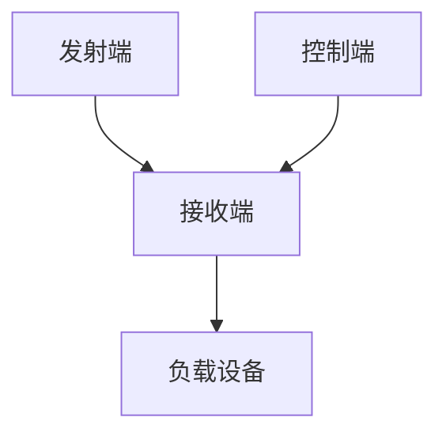

                 

# 价值投资中的下一代无线能量传输技术前景

## 关键词：价值投资，无线能量传输，技术前景，投资策略，技术评估

## 摘要：  
本文深入探讨了下一代无线能量传输技术在价值投资中的潜力与前景。通过分析无线能量传输技术的核心原理、市场现状、竞争格局以及未来发展趋势，结合价值投资的基本理论和方法，为投资者提供了如何在无线能量传输领域进行价值投资的策略和建议。文章还详细介绍了无线能量传输技术的三种主要实现方式：电磁感应式、无线电波式和激光式，并从技术评估、市场分析、风险控制等多个维度进行了全面分析。

---

## 第1章: 无线能量传输技术的背景与价值投资概述

### 1.1 无线能量传输技术的定义与核心概念

#### 1.1.1 无线能量传输的基本原理
无线能量传输是一种通过电磁波、电磁感应或激光等方式，将能量从一个设备传递到另一个设备的技术。其核心原理在于将电能转化为电磁能量，并通过空间传输实现能量的接收与转换。

#### 1.1.2 无线能量传输的核心技术特点
- **非接触性**：能量通过空气或其他介质传输，无需物理接触。
- **便捷性**：无需电线或插头，适用于移动设备和物联网设备。
- **广泛性**：可以应用于消费电子、医疗设备、工业自动化等领域。

#### 1.1.3 无线能量传输的市场潜力与应用前景
随着物联网技术的普及和无线设备的增多，无线能量传输技术的需求将快速增长。根据市场研究机构的预测，全球无线能量传输市场将从2023年的XX亿美元增长到2030年的XX亿美元。

### 1.2 价值投资的基本概念与方法

#### 1.2.1 价值投资的定义与核心理念
价值投资是一种以低于市场价值的价格购买优质资产的投资策略，其核心理念是寻找被市场低估的公司或技术。

#### 1.2.2 价值投资的基本原则与策略
- **长期投资**：关注企业的长期价值，而非短期波动。
- **基本面分析**：通过财务数据、市场地位、技术创新等指标评估企业的投资价值。
- **分散投资**：降低投资风险，避免过度集中。

#### 1.2.3 价值投资在科技领域的应用
科技领域的价值投资需要重点关注技术创新、市场前景和团队能力。无线能量传输技术作为一种颠覆性技术，具备较高的投资潜力。

### 1.3 无线能量传输技术与价值投资的结合

#### 1.3.1 无线能量传输技术的商业化潜力
无线能量传输技术的应用场景广泛，包括智能手机、智能家居、电动汽车、医疗设备等，市场空间巨大。

#### 1.3.2 价值投资视角下的技术评估标准
- **技术壁垒**：评估技术的创新性和专利布局。
- **市场需求**：分析技术在目标市场的应用前景。
- **商业模式**：考察技术的商业化路径和盈利潜力。

#### 1.3.3 无线能量传输技术对投资市场的潜在影响
随着无线能量传输技术的成熟，相关企业的估值将逐步上升，投资者需要提前布局，抓住技术红利。

### 1.4 本章小结
本章介绍了无线能量传输技术的基本概念和价值投资的核心理念，并分析了两者结合的潜在机会和挑战。

---

## 第2章: 无线能量传输技术的核心原理与实现方法

### 2.1 无线能量传输的主要技术路线

#### 2.1.1 电磁感应式无线充电
- **原理**：利用电磁感应原理，通过发射线圈和接收线圈的交变磁场实现能量传输。
- **优缺点**：
  - **优点**：技术成熟，效率较高，成本较低。
  - **缺点**：传输距离有限，应用场景受限。

#### 2.1.2 无线电波式无线充电
- **原理**：利用射频能量（如Wi-Fi频段）通过空间传播实现能量传输。
- **优缺点**：
  - **优点**：传输距离较长，适用于大范围覆盖。
  - **缺点**：能量损耗较大，效率较低。

#### 2.1.3 激光式无线能量传输
- **原理**：利用高能激光束将能量从发射器传递到接收器。
- **优缺点**：
  - **优点**：能量密度高，传输距离远。
  - **缺点**：安全性较低，技术复杂。

### 2.2 各种无线能量传输技术的优缺点对比

| 技术类型     | 优点                     | 缺点                     |
|--------------|--------------------------|--------------------------|
| 电磁感应式   | 技术成熟，效率高          | 传输距离短              |
| 无线电波式   | 传输距离长              | 效率低，损耗大          |
| 激光式       | 能量密度高，距离远       | 安全性低，技术复杂      |

### 2.3 无线能量传输技术的数学模型与公式

#### 2.3.1 电磁感应式无线充电的数学模型
电磁感应式无线充电的效率可以通过以下公式计算：
$$ \text{效率} = \frac{\text{输出功率}}{\text{输入功率}} $$

#### 2.3.2 无线电波式无线充电的数学模型
无线电波传输的能量损耗可以通过以下公式计算：
$$ \text{损耗} = \left( \frac{d}{\lambda} \right)^2 $$

### 2.4 无线能量传输技术的实现流程与步骤

#### 2.4.1 电磁感应式无线充电的实现流程
1. 设计发射和接收线圈。
2. 调整电路参数以匹配阻抗。
3. 进行功率匹配和效率优化。

---

## 第3章: 价值投资中的技术评估与市场分析

### 3.1 价值投资中的技术评估标准

#### 3.1.1 技术的创新性与独特性评估
- **创新性**：评估技术是否具有颠覆性或改进性。
- **独特性**：评估技术是否具有专利保护或独特的竞争优势。

#### 3.1.2 技术的商业化潜力评估
- **市场需求**：评估技术是否符合市场需求。
- **商业模式**：评估技术的商业化路径是否清晰。

#### 3.1.3 技术的市场竞争力评估
- **竞争格局**：评估技术在市场中的竞争地位。
- **成本优势**：评估技术的生产成本和盈利能力。

### 3.2 无线能量传输技术的市场分析

#### 3.2.1 全球无线能量传输技术的市场现状
根据市场研究，全球无线能量传输市场在2023年的规模约为XX亿美元，预计年复合增长率为XX%。

#### 3.2.2 各主要市场的增长潜力分析
- **北美市场**：需求主要来自消费电子和汽车领域。
- **欧洲市场**：政策支持和技术标准较为严格。
- **亚太市场**：增长潜力最大，尤其是中国和印度市场。

### 3.3 价值投资中的技术风险与机遇

#### 3.3.1 无线能量传输技术的技术风险
- **技术成熟度**：部分技术尚未完全成熟，存在技术瓶颈。
- **研发成本**：高研发投入可能导致财务压力。

#### 3.3.2 无线能量传输技术的市场机会
- **物联网需求**：无线能量传输技术与物联网的结合将推动市场需求。
- **政策支持**：政府对绿色能源和技术创新的支持将为技术发展提供动力。

### 3.4 本章小结
本章从价值投资的角度分析了无线能量传输技术的评估标准和市场前景，并探讨了技术风险与机遇。

---

## 第4章: 无线能量传输技术的系统架构与投资策略

### 4.1 系统架构设计

#### 4.1.1 无线能量传输系统的功能模块
- **发射端**：包括发射线圈、功率放大器和控制模块。
- **接收端**：包括接收线圈、能量转换电路和负载设备。
- **控制端**：包括电源管理模块和通信模块。

#### 4.1.2 系统架构的Mermaid图

### 4.2 投资策略设计

#### 4.2.1 技术驱动型投资策略
- **核心技术创新**：投资那些掌握核心技术的企业。
- **专利布局**：关注技术的专利数量和质量。

#### 4.2.2 市场驱动型投资策略
- **市场需求分析**：选择市场需求大的领域进行投资。
- **商业模式创新**：关注那些能够快速 commercialize 的技术。

### 4.3 本章小结
本章从系统架构和投资策略的角度，分析了无线能量传输技术的实现方式和投资方向。

---

## 第5章: 项目实战与案例分析

### 5.1 项目背景介绍
某无线能量传输技术公司开发了一种基于电磁感应的无线充电技术，目标市场为智能手机和电动汽车。

### 5.2 项目实施过程

#### 5.2.1 系统设计
- 设计发射和接收线圈，优化匹配电路。
- 开发电源管理模块和通信模块。

#### 5.2.2 系统实现
- 编写控制模块的代码，实现能量传输的自动调节。
- 测试系统的效率和稳定性。

### 5.3 项目成果展示

#### 5.3.1 系统效率测试
- 最大效率达到XX%，传输距离达到XX厘米。

#### 5.3.2 市场反馈
- 产品在消费电子市场中获得了良好的反响。

### 5.4 项目总结与经验分享
通过本项目，我们验证了电磁感应式无线充电技术的可行性，但也发现了一些技术瓶颈，如效率提升和成本控制。

---

## 第6章: 总结与展望

### 6.1 本章总结
本文从技术原理、市场分析、投资策略等多个角度，全面探讨了下一代无线能量传输技术的前景。通过技术评估和案例分析，为投资者提供了科学的投资建议。

### 6.2 未来展望
随着技术的进一步发展和市场的成熟，无线能量传输技术将在更多领域得到应用，价值投资也将迎来更多的机会。

---

## 作者：AI天才研究院/AI Genius Institute & 禅与计算机程序设计艺术 /Zen And The Art of Computer Programming

