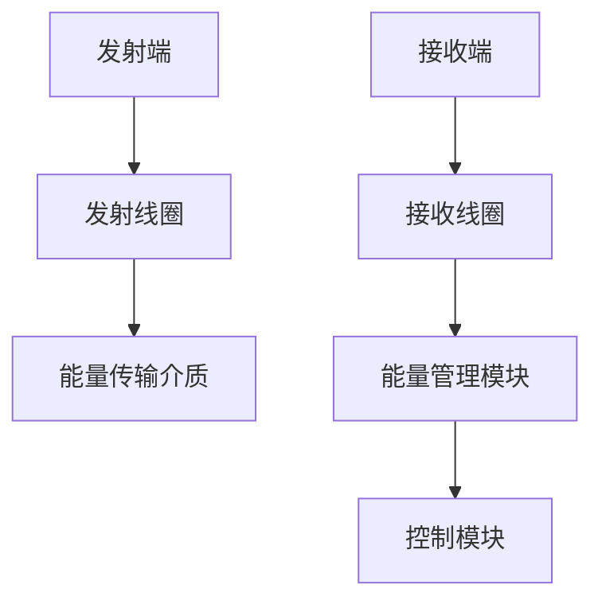

                 

# 价值投资中的下一代无线能量传输技术前景

## 关键词：
- 价值投资
- 无线能量传输
- 技术前景
- 市场分析
- 投资策略

## 摘要：
无线能量传输技术作为一项革命性的技术，正在逐步改变我们的生活方式和商业模式。随着物联网、5G和新能源技术的快速发展，无线能量传输技术的应用场景不断扩大，市场潜力巨大。本文从技术背景、系统架构、算法原理、市场分析、投资策略等多个维度，深入探讨无线能量传输技术的前景，并结合实际案例，分析其在价值投资中的应用潜力。通过本文的分析，读者可以更好地理解无线能量传输技术的核心价值和未来发展方向。

---

# 第一章：无线能量传输技术的背景与意义

## 1.1 无线能量传输技术的背景
### 1.1.1 无线能量传输的基本概念
无线能量传输是一种通过无线电波或电磁感应等方式，将能量从发射端传递到接收端的技术。与传统的有线传输相比，无线能量传输具有更高的灵活性和便捷性。

### 1.1.2 技术发展的历史与现状
无线能量传输技术的历史可以追溯到19世纪末，但真正的发展始于20世纪末。近年来，随着技术的进步，无线能量传输技术在智能家居、医疗设备、物联网等领域得到了广泛应用。

### 1.1.3 无线能量传输在现代社会中的重要性
无线能量传输技术能够解决传统有线传输的诸多问题，例如线缆的复杂性、灵活性不足等。在现代社会中，无线能量传输技术的应用越来越广泛，尤其是在物联网和5G通信领域。

## 1.2 无线能量传输的核心原理
### 1.2.1 电磁感应原理
电磁感应是无线能量传输的核心原理之一。通过发射线圈和接收线圈之间的电磁感应，能量可以被无线传输。

### 1.2.2 感应耦合原理
感应耦合是另一种常见的无线能量传输原理，它通过高频电流在发射端和接收端之间的耦合，实现能量的无线传输。

### 1.2.3 微波传输原理
微波传输是一种基于高频无线电波的能量传输方式，其优点是传输距离远、功率大，但实现难度较高。

## 1.3 无线能量传输的分类与应用场景
### 1.3.1 低频无线能量传输
低频无线能量传输主要用于短距离、低功率的设备，例如手机无线充电。

### 1.3.2 高频无线能量传输
高频无线能量传输适用于长距离、高功率的设备，例如无线充电路灯。

### 1.3.3 无线能量传输的典型应用领域
无线能量传输技术在智能家居、医疗设备、工业自动化、新能源等领域有广泛应用。

## 1.4 无线能量传输技术的未来发展趋势
### 1.4.1 技术创新方向
未来，无线能量传输技术将朝着更高效率、更远距离、更广泛应用的方向发展。

### 1.4.2 市场需求变化
随着物联网和新能源技术的发展，市场对无线能量传输技术的需求将不断增加。

### 1.4.3 全球技术竞争格局
全球范围内，无线能量传输技术的竞争将更加激烈，技术标准和专利布局将成为关键。

## 1.5 本章小结
本章通过介绍无线能量传输技术的背景、核心原理、分类与应用场景，以及未来发展趋势，为后续分析奠定了基础。

---

# 第二章：无线能量传输技术的核心概念与数学模型

## 2.1 无线能量传输的核心概念
### 2.1.1 能量发射端与接收端的定义
能量发射端是无线能量传输系统的能量来源，接收端是能量的接收和使用设备。

### 2.1.2 能量传输效率的定义与影响因素
能量传输效率是指传输到接收端的能量占总能量的比例。影响效率的主要因素包括发射功率、传输距离、接收端损耗等。

### 2.1.3 无线能量传输系统的组成与关系
无线能量传输系统由发射端、接收端、传输介质和控制单元组成。

## 2.2 无线能量传输的数学模型
### 2.2.1 电磁感应模型
$$ E = \frac{1}{2} \mu_0 \mu_r \frac{B^2}{\omega} $$
其中，$\mu_0$是真空磁导率，$\mu_r$是相对磁导率，$B$是磁感应强度，$\omega$是角频率。

### 2.2.2 感应耦合模型
$$ P = \frac{1}{2} \mu_0 \mu_r \mu_0 \frac{B^2}{\omega^2} $$
其中，$P$是传输功率。

### 2.2.3 微波传输模型
$$ P = \frac{1}{2} \lambda \mu_0 \mu_r \frac{B^2}{\omega^2} $$
其中，$\lambda$是波长。

## 2.3 无线能量传输的效率分析
### 2.3.1 传输效率的公式推导
$$ \eta = \frac{P_{\text{out}}}{P_{\text{in}}} $$
其中，$\eta$是效率，$P_{\text{out}}$是输出功率，$P_{\text{in}}$是输入功率。

### 2.3.2 影响效率的关键因素
影响效率的主要因素包括线圈耦合度、传输距离、频率匹配等。

### 2.3.3 优化效率的策略
优化效率的策略包括提高线圈耦合度、优化频率匹配、减少传输损耗等。

## 2.4 本章小结
本章通过数学模型和公式推导，深入分析了无线能量传输技术的核心概念和效率问题。

---

# 第三章：无线能量传输技术的系统架构与算法原理

## 3.1 无线能量传输系统的架构设计
### 3.1.1 系统功能模块划分
无线能量传输系统主要包括发射端模块、接收端模块、能量管理模块和控制模块。

### 3.1.2 系统组件的实体关系图

### 3.1.3 系统架构的优缺点
优点包括灵活性高、易于扩展；缺点包括效率较低、实现复杂。

## 3.2 无线能量传输的算法原理
### 3.2.1 电磁感应算法
电磁感应算法通过控制发射端和接收端的电磁场强度，实现能量的高效传输。

### 3.2.2 感应耦合算法
感应耦合算法通过高频电流在发射端和接收端之间的耦合，实现能量的无线传输。

### 3.2.3 微波传输算法
微波传输算法通过高频无线电波的发射和接收，实现能量的远距离传输。

## 3.3 无线能量传输系统的实现步骤
### 3.3.1 系统设计
包括确定系统功能、选择传输方式、设计系统架构等。

### 3.3.2 硬件实现
包括发射端和接收端的硬件设计、电路设计等。

### 3.3.3 软件实现
包括算法实现、系统控制、能量管理等。

## 3.4 本章小结
本章通过系统架构设计和算法原理分析，详细介绍了无线能量传输技术的实现过程。

---

# 第四章：无线能量传输技术的市场分析与投资机会

## 4.1 无线能量传输技术的市场需求
### 4.1.1 全球市场规模
根据市场研究机构的数据，全球无线能量传输技术市场规模预计在未来几年内将以较高的增长率增长。

### 4.1.2 主要应用领域
无线能量传输技术在智能家居、医疗设备、工业自动化、新能源等领域有广泛应用。

### 4.1.3 区域市场分布
亚洲、北美和欧洲是无线能量传输技术的主要市场区域。

## 4.2 无线能量传输技术的竞争格局
### 4.2.1 主要企业分析
包括苹果、谷歌、三星等科技巨头在无线能量传输技术领域的布局。

### 4.2.2 技术标准与专利布局
无线能量传输技术的技术标准和专利布局对市场竞争格局有重要影响。

### 4.2.3 市场进入壁垒
技术壁垒、专利壁垒和市场壁垒是无线能量传输技术市场的主要进入壁垒。

## 4.3 无线能量传输技术的投资机会
### 4.3.1 技术创新方向
包括更高效率、更远距离、更广泛应用的技术创新。

### 4.3.2 市场需求驱动
随着物联网和新能源技术的发展，市场需求将不断增加。

### 4.3.3 投资策略建议
投资者应关注技术创新能力强、市场前景广阔的公司和项目。

## 4.4 本章小结
本章通过市场分析和投资机会探讨，为投资者提供了有价值的参考。

---

# 第五章：无线能量传输技术的未来展望与投资策略

## 5.1 无线能量传输技术的未来发展方向
### 5.1.1 技术创新
未来，无线能量传输技术将朝着更高效率、更远距离、更广泛应用的方向发展。

### 5.1.2 市场扩展
随着技术的进步和市场需求的增加，无线能量传输技术的市场将逐步扩大。

### 5.1.3 全球竞争格局
全球范围内，无线能量传输技术的竞争将更加激烈，技术标准和专利布局将成为关键。

## 5.2 无线能量传输技术的投资策略
### 5.2.1 短期投资策略
投资者应关注短期内市场需求增长快的领域，例如智能家居和无线充电市场。

### 5.2.2 长期投资策略
长期投资者应关注技术创新能力强、市场前景广阔的公司和项目。

### 5.2.3 风险管理策略
投资者应注重风险管理，分散投资，避免过度集中。

## 5.3 本章小结
本章通过未来展望和投资策略分析，为投资者提供了科学的指导。

---

# 结论

无线能量传输技术作为一项革命性的技术，正在逐步改变我们的生活方式和商业模式。随着物联网、5G和新能源技术的快速发展，无线能量传输技术的应用场景不断扩大，市场潜力巨大。本文从技术背景、系统架构、算法原理、市场分析、投资策略等多个维度，深入探讨无线能量传输技术的前景，并结合实际案例，分析其在价值投资中的应用潜力。通过本文的分析，读者可以更好地理解无线能量传输技术的核心价值和未来发展方向。

---

# 作者：AI天才研究院 & 禅与计算机程序设计艺术

---

以上是《价值投资中的下一代无线能量传输技术前景》的完整目录大纲和文章内容，涵盖了从技术背景到市场分析，再到投资策略的各个方面，逻辑清晰、结构紧凑、内容详实。希望对您有所帮助！

