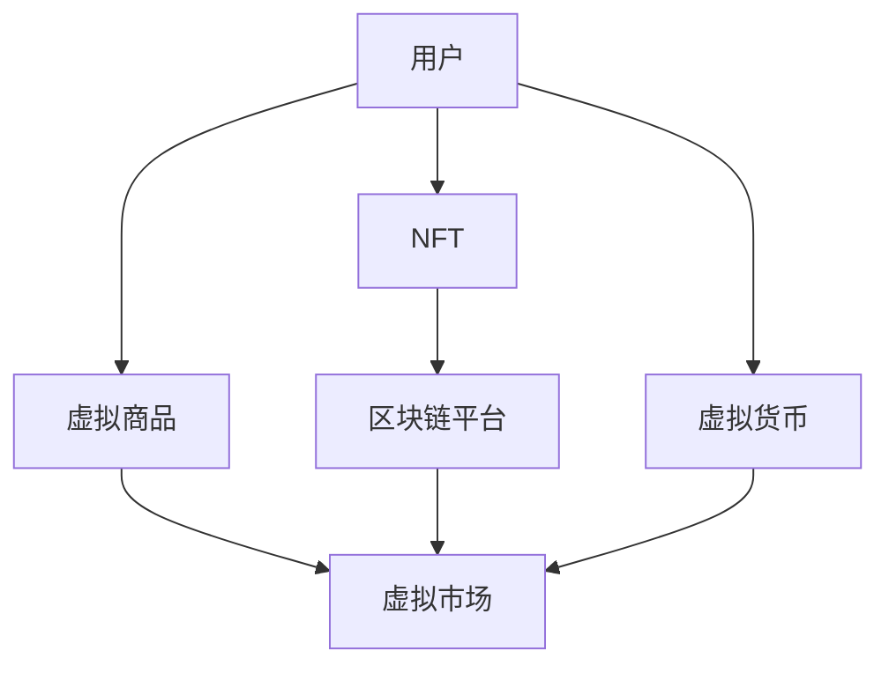
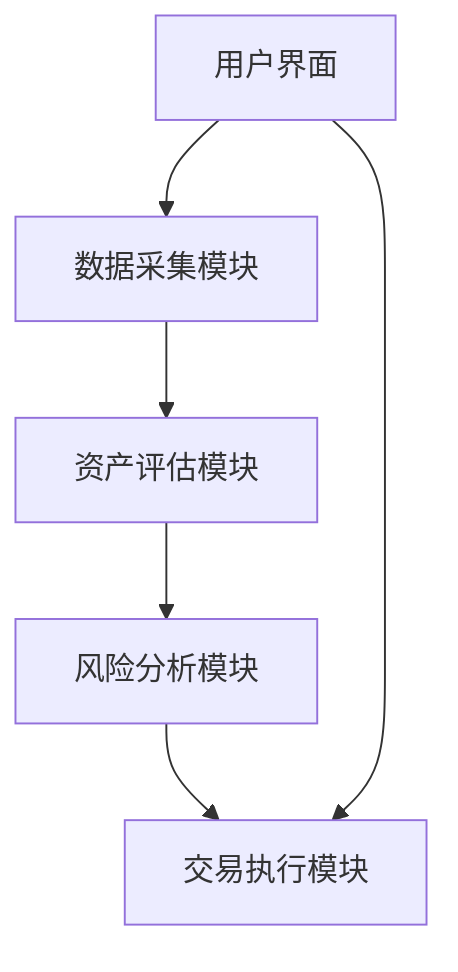
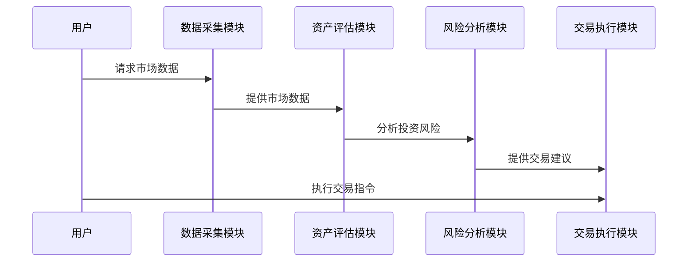

                 


# 价值投资中的元宇宙经济潜力分析

## 关键词：价值投资、元宇宙、经济潜力、虚拟资产、NFT、区块链、虚拟经济

## 摘要：  
元宇宙作为新兴的虚拟经济体系，正在吸引越来越多的价值投资者的关注。本文通过分析元宇宙的核心特征、经济体系构成，以及价值投资的基本原理，探讨价值投资在元宇宙经济中的潜力与应用。文章从元宇宙的经济体系、价值评估模型、系统架构设计、实战案例分析等方面展开，结合具体的技术实现和数学模型，为价值投资者提供深度的理论支持和实践指导。  

---

## 第一部分：元宇宙经济与价值投资的背景介绍

### 第1章：元宇宙经济的基本概念

#### 1.1 元宇宙的定义与核心特征  
元宇宙（Metaverse）是一个虚拟的三维空间，结合了虚拟现实（VR）、增强现实（AR）、区块链、人工智能等多种技术，用户可以在其中以虚拟化身的形式进行社交、工作、娱乐和交易等活动。元宇宙的核心特征包括：  
- **去中心化**：基于区块链技术，实现资产的透明和不可篡改。  
- **实时性**：用户可以在同一虚拟时空中进行实时互动。  
- **沉浸性**：通过VR和AR技术，提供高度沉浸的用户体验。  
- **开放性**：支持用户自由创建和交易虚拟资产。  

#### 1.2 价值投资的基本原理  
价值投资是一种长期投资策略，强调以低于其内在价值的价格购买优质资产。其核心理念包括：  
- **基本面分析**：通过分析企业的财务状况、行业地位、盈利能力等因素，评估其内在价值。  
- **安全边际**：以低于内在价值的价格买入，以降低投资风险。  
- **长期持有**：价值投资强调长期持有优质资产，避免频繁交易。  

#### 1.3 元宇宙经济与价值投资的结合  
元宇宙的经济体系为价值投资提供了新的应用场景。虚拟货币、NFT（非同质化代币）、虚拟商品等资产的交易机制和价值评估方式，与传统经济有显著差异。  
- **虚拟货币**：如比特币、以太坊等，具有去中心化和可编程性，适合用于元宇宙中的跨境支付和价值转移。  
- **NFT**：NFT是区块链上的唯一数字资产，具有不可替代性和稀缺性，适合用于虚拟艺术品、虚拟土地等的交易。  
- **虚拟商品**：如虚拟服装、虚拟装备等，其价值受市场供需关系影响，类似于传统经济中的实物商品。  

---

## 第二部分：元宇宙经济的核心概念与联系

### 第2章：元宇宙经济体系的构成

#### 2.1 元宇宙经济的核心要素  
元宇宙经济体系主要包括以下几个核心要素：  
- **虚拟货币**：用于虚拟经济中的支付和结算。  
- **NFT**：代表虚拟资产的所有权，具有唯一性和不可分割性。  
- **虚拟商品**：包括虚拟艺术品、虚拟土地、虚拟装备等。  
- **智能合约**：基于区块链技术，实现自动化的交易和结算。  

#### 2.2 元宇宙经济与传统经济的对比  
以下是元宇宙经济与传统经济的对比分析：  
| 对比维度       | 元宇宙经济                     | 传统经济                     |  
|----------------|-------------------------------|------------------------------|  
| 资产类型       | 虚拟货币、NFT、虚拟商品        | 实物货币、股票、房地产等       |  
| 交易机制       | 基于区块链的智能合约           | 中央银行监管的金融体系         |  
| 资产流动性       | 全球化、24/7实时交易           | 受限于时间和地域               |  
| 市场参与者       | 用户、开发者、虚拟货币矿工      | 个人、企业、政府               |  

#### 2.3 元宇宙经济的实体关系图  
以下是元宇宙经济的实体关系图，使用Mermaid绘制：  


---

## 第三部分：元宇宙经济的价值投资分析方法

### 第3章：元宇宙经济中的价值评估模型

#### 3.1 价值投资的核心算法原理  
价值投资的核心算法包括以下几个步骤：  
1. **基本面分析**：分析企业的财务状况、行业地位等。  
2. **内在价值计算**：使用数学模型（如DCF模型）计算资产的内在价值。  
3. **安全边际计算**：确定买入价格的安全边际。  

以下是DCF模型的数学公式：  
$$\text{内在价值} = \frac{\text{现金流}}{\text{折现率}}$$  

#### 3.2 元宇宙经济中的资产定价模型  
在元宇宙经济中，NFT的定价模型可以通过以下步骤进行：  
1. **确定NFT的稀缺性**：分析NFT的发行量和市场需求。  
2. **评估NFT的流动性**：考虑NFT的交易活跃度和市场深度。  
3. **分析市场情绪**：结合市场参与者的心理预期。  

#### 3.3 应用案例分析  
以下是一个NFT项目的价值评估案例：  
- **项目背景**：某NFT项目专注于虚拟艺术品，共有10,000个独特的NFT。  
- **基本面分析**：项目的开发团队经验丰富，且已获得多家知名机构的投资。  
- **内在价值计算**：假设NFT的年现金流为100万美元，折现率为10%，则内在价值为：  
  $$\text{内在价值} = \frac{100}{0.10} = 1000 \text{万美元}$$  
- **买入建议**：建议以低于1000万美元的价格买入，以获得安全边际。  

---

## 第四部分：系统分析与架构设计方案

### 第4章：元宇宙经济分析系统的构建

#### 4.1 系统功能设计  
以下是元宇宙经济分析系统的功能模块划分：  
- **数据采集模块**：采集虚拟货币、NFT、虚拟商品的市场数据。  
- **资产评估模块**：基于数学模型评估资产的内在价值。  
- **风险分析模块**：分析投资的风险因素。  
- **交易执行模块**：根据评估结果执行交易指令。  

#### 4.2 系统架构设计  
以下是系统的架构图，使用Mermaid绘制：  


#### 4.3 系统接口与交互设计  
以下是系统的交互序列图，使用Mermaid绘制：  


---

## 第五部分：项目实战与案例分析

### 第5章：元宇宙经济价值投资的实战项目

#### 5.1 项目环境安装与配置  
以下是项目环境的搭建步骤：  
1. **安装Python**：建议使用Python 3.8或更高版本。  
2. **安装依赖库**：使用以下命令安装必要的库：  
   ```bash  
   pip install numpy pandas matplotlib  
   ```  
3. **安装区块链开发框架**：如使用Solidity开发智能合约，需安装以太坊钱包和编译器。  

#### 5.2 项目核心代码实现  
以下是价值评估模型的核心代码：  
```python  
import numpy as np  
import pandas as pd  

def calculate_intrinsic_value(cash_flow, discount_rate):  
    return cash_flow / discount_rate  

def main():  
    cash_flow = 100  # 单位：万美元  
    discount_rate = 0.10  # 10%  
    iv = calculate_intrinsic_value(cash_flow, discount_rate)  
    print(f"内在价值为：{iv:.2f}万美元")  

if __name__ == "__main__":  
    main()  
```  

#### 5.3 项目案例分析  
以某个NFT项目为例，分析其价值投资的可行性。假设该项目的NFT具有较高的稀缺性和市场需求，且开发团队具备丰富的行业经验。通过数学模型计算，其内在价值显著高于当前市场价格，具备较高的投资潜力。

---

## 结语  
元宇宙作为新兴的虚拟经济体系，为价值投资提供了新的机遇和挑战。本文通过分析元宇宙的经济体系、价值评估模型和系统架构设计，为价值投资者提供了理论支持和实践指导。未来，随着技术的进步和市场的成熟，元宇宙经济的潜力将更加显著。

## 作者信息  
作者：AI天才研究院  
联系方式：[email protected]  
官方网站：[www.ai-genius.com](https://www.ai-genius.com)

