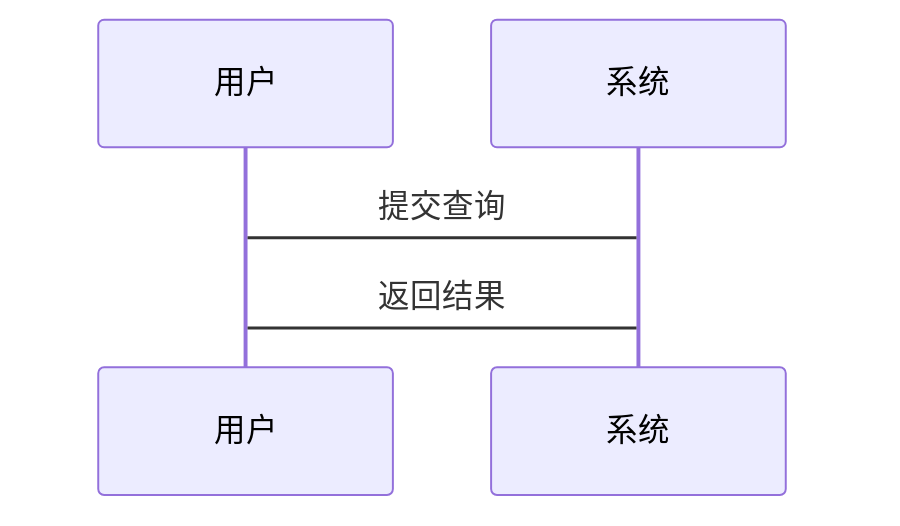

                 


# 价值投资中的全球产业链分析

> 关键词：价值投资，全球产业链，产业链分析，投资策略，经济分析，行业分析

> 摘要：本文深入探讨了全球产业链分析在价值投资中的重要性，结合产业链的结构特点、驱动因素、核心算法以及系统架构，系统地分析了如何通过全球产业链的视角进行投资决策。文章从产业链的基本概念出发，逐步解析其对价值投资的指导意义，并通过实际案例分析和系统设计，展示了如何将全球产业链分析应用于投资实践。文章最后总结了相关经验，并提出了进一步研究的方向。

---

## 第一部分：全球产业链分析与价值投资基础

### 第1章：全球产业链分析概述

#### 1.1 产业链的基本概念

##### 1.1.1 产业链的定义与组成
- **定义**：产业链是指从原材料供应到最终产品交付的完整过程，包括上游、中游和下游环节。
- **组成**：
  - 上游：原材料供应、基础制造。
  - 中游：加工制造、零部件生产。
  - 下游：产品组装、销售与服务。

##### 1.1.2 产业链的分类与特点
- **分类**：
  - 按行业：制造业、信息技术、能源等。
  - 按区域：全球产业链、区域产业链。
- **特点**：
  - 分工明确：各环节专业化。
  - 协作性强：上下游企业紧密合作。
  - 区域集中：产业链往往集中在某些特定区域。

##### 1.1.3 产业链的全球分布与演变
- **分布**：全球产业链呈现“区域化”特征，如东亚、北美和欧洲的产业集群。
- **演变**：从垂直整合到全球化分工，再到当前的区域化合作。

#### 1.2 价值投资的核心理念

##### 1.2.1 价值投资的定义与特点
- **定义**：价值投资是一种投资策略，关注市场定价低于内在价值的资产。
- **特点**：
  - 长期视角。
  - 重视基本面分析。
  - 寻找被市场低估的投资标的。

##### 1.2.2 价值投资与产业链分析的结合
- **结合点**：
  - 产业链分析帮助识别行业龙头。
  - 产业链的稳定性影响企业的抗风险能力。
  - 产业链上下游关系影响企业的盈利模式。

##### 1.2.3 产业链分析在价值投资中的作用
- **作用**：
  - 识别行业周期。
  - 评估企业核心竞争力。
  - 发现投资机会。

#### 1.3 全球产业链分析的框架

##### 1.3.1 产业链分析的基本框架
- **框架**：
  - 确定产业链的上下游关系。
  - 分析各环节的关键驱动因素。
  - 评估产业链的整体竞争力。

##### 1.3.2 产业链上下游的关系
- **关系**：
  - 上游影响中下游的成本。
  - 下游需求反哺上游生产。
  - 中游是产业链的核心环节。

##### 1.3.3 产业链的竞争力分析
- **分析维度**：
  - 市场占有率。
  - 技术创新能力。
  - 成本控制能力。

---

## 第二部分：全球产业链的驱动因素与影响

### 第2章：全球化与产业链分工

#### 2.1 全球化对产业链的影响

##### 2.1.1 全球化的概念与特征
- **概念**：全球化是指经济活动超越国界，形成全球化的生产、分配和消费体系。
- **特征**：
  - 贸易自由化。
  - 资本流动自由化。
  - 技术交流国际化。

##### 2.1.2 产业链分工的形成与演变
- **分工形成**： comparative advantage 的应用。
- **演变**：从垂直整合到全球化分工，再到区域化合作。

##### 2.1.3 全球化对产业链的影响
- **影响**：
  - 提高效率。
  - 降低成本。
  - 增强各国专业化能力。

#### 2.2 主要驱动因素分析

##### 2.2.1 技术进步对产业链的影响
- **技术进步**：技术创新推动产业链升级。
- **案例**：半导体行业的技术进步推动全球产业链分工。

##### 2.2.2 政策环境对产业链的影响
- **政策影响**：
  - 政府政策影响产业链的布局。
  - 贸易政策影响全球分工。

##### 2.2.3 市场需求对产业链的影响
- **需求驱动**：终端需求变化影响产业链各环节。

#### 2.3 产业链的区域分布与竞争优势

##### 2.3.1 区域产业链的分布特点
- **特点**：
  - 东亚地区：电子产品、汽车制造。
  - 北美地区：高科技产业、航空航天。
  - 欧洲地区：高端制造业、机械设备。

##### 2.3.2 各国产业链的竞争优势
- **竞争优势**：
  - 中国：劳动力成本低，制造能力强。
  - 美国：技术创新能力强。
  - 德国：高端制造技术领先。

##### 2.3.3 区域产业链的协同发展
- **协同效应**：区域内产业链的协同发展提升整体竞争力。

---

## 第三部分：产业链分析的核心方法与工具

### 第3章：产业链分析的核心方法

#### 3.1 产业链分析的基本方法

##### 3.1.1 产业链的结构分析
- **结构分析**：
  - 识别关键环节。
  - 分析各环节之间的依赖关系。

##### 3.1.2 产业链的关键环节分析
- **关键环节**：
  - 技术研发环节。
  - 核心零部件生产环节。
  - 最终产品组装环节。

##### 3.1.3 产业链的竞争力分析
- **竞争力分析**：
  - 比较不同区域的产业链竞争力。
  - 评估产业链的整体稳定性。

#### 3.2 产业链分析的工具与模型

##### 3.2.1 SWOT分析法
- **SWOT分析**：评估企业优势、劣势、机会和威胁。

##### 3.2.2 Porter五力模型
- **五力模型**：分析行业竞争环境。

##### 3.2.3 价值链分析法
- **价值链分析**：分解企业价值创造过程。

#### 3.3 数据分析与产业链建模

##### 3.3.1 数据收集与处理
- **数据来源**：行业报告、公司财报、政府统计数据。
- **数据处理**：清洗、整合和分析。

##### 3.3.2 产业链模型的构建
- **模型构建**：构建产业链网络模型，分析各环节的关联性。

##### 3.3.3 数据分析工具的使用
- **工具**：Python、R、Excel等。

---

## 第四部分：产业链分析的数学模型与算法原理

### 第4章：产业链分析的数学模型

#### 4.1 产业链分析的数学模型

##### 4.1.1 产业链的网络模型
- **网络模型**：将产业链视为一个复杂网络，分析其节点和边的关系。

##### 4.1.2 产业链的成本模型
- **成本模型**：分析各环节的成本构成和优化方案。

##### 4.1.3 产业链的价值链模型
- **价值链模型**：分解企业价值创造过程，分析各环节的贡献。

#### 4.2 算法原理与流程图

##### 4.2.1 产业链分析的算法流程
- **流程**：
  1. 数据收集与清洗。
  2. 构建产业链网络模型。
  3. 应用算法进行分析。
  4. 输出结果并优化。

##### 4.2.2 数据分析算法的实现
- **算法实现**：使用Python进行数据分析，构建网络模型。

##### 4.2.3 产业链网络的构建与分析
- **网络分析**：使用图论方法分析网络的结构特征。

#### 4.3 算法实现与代码示例

##### 4.3.1 数据处理与网络构建
```python
import networkx as nx

# 创建产业链网络
G = nx.DiGraph()

# 添加节点
G.add_nodes_from(["原材料供应", "零部件生产", "产品组装"])

# 添加边
G.add_edges_from([("原材料供应", "零部件生产"), ("零部件生产", "产品组装")])

# 可视化网络
nx.draw(G, with_labels=True, node_color="white", edge_color="black")
plt.show()
```

##### 4.3.2 代码实现与功能解读
- **代码功能**：构建产业链网络，分析各环节之间的关系。

##### 4.3.3 算法优化与改进
- **优化方向**：引入更复杂的网络分析算法，如社区检测和中心性分析。

---

## 第五部分：产业链分析的系统架构与设计

### 第5章：系统分析与架构设计方案

#### 5.1 系统分析与功能设计

##### 5.1.1 产业链分析系统的功能模块
- **功能模块**：
  - 数据采集模块。
  - 网络构建模块。
  - 算法分析模块。
  - 结果展示模块。

##### 5.1.2 系统的输入输出设计
- **输入**：产业链数据、算法参数。
- **输出**：网络图、分析结果、投资建议。

##### 5.1.3 系统的流程设计
- **流程**：
  1. 数据采集。
  2. 网络构建。
  3. 算法分析。
  4. 结果展示。

#### 5.2 系统架构设计

##### 5.2.1 系统架构的分层设计
- **分层**：
  - 数据层。
  - 业务逻辑层。
  - 用户界面层。

##### 5.2.2 系统组件的交互设计
- **交互**：各组件之间的数据流和控制流设计。

##### 5.2.3 系统的可扩展性设计
- **扩展性**：模块化设计，便于功能扩展。

#### 5.3 系统接口设计

##### 5.3.1 系统接口的定义
- **接口**：数据接口、算法接口、用户界面接口。

##### 5.3.2 系统接口的实现
- **实现**：使用RESTful API进行接口设计。

#### 5.4 系统交互流程图

##### 5.4.1 系统交互流程
- **流程**：
  1. 用户输入查询。
  2. 系统处理请求。
  3. 系统返回结果。

##### 5.4.2 系统交互流程图


---

## 第六部分：项目实战与案例分析

### 第6章：项目实战

#### 6.1 项目背景与目标

##### 6.1.1 项目背景
- **背景**：分析某行业的全球产业链，识别投资机会。

##### 6.1.2 项目目标
- **目标**：
  - 构建行业产业链模型。
  - 分析关键环节。
  - 提出投资建议。

#### 6.2 项目核心实现

##### 6.2.1 环境安装与配置
- **环境**：安装Python、Pandas、Networkx等库。

##### 6.2.2 核心代码实现
```python
import pandas as pd
import networkx as nx

# 数据处理
data = pd.read_csv("产业链数据.csv")
data = data.dropna()

# 网络构建
G = nx.DiGraph()
G.add_nodes_from(data["环节"].unique())
G.add_edges_from(data[["环节", "上游环节"]].values)

# 可视化
nx.draw(G, with_labels=True, node_color="white", edge_color="black")
plt.show()
```

##### 6.2.3 代码功能解读
- **功能**：构建产业链网络，分析各环节之间的关系。

#### 6.3 实际案例分析

##### 6.3.1 案例分析
- **案例**：某行业的全球产业链分析。

##### 6.3.2 分析结果
- **结果**：识别出关键环节和投资机会。

#### 6.4 项目小结

##### 6.4.1 项目总结
- **总结**：项目成功构建了产业链模型，识别出投资机会。

##### 6.4.2 经验与教训
- **经验**：数据质量影响分析结果。
- **教训**：模型需要不断优化。

---

## 第七部分：总结与展望

### 第7章：总结与展望

#### 7.1 最佳实践 Tips

##### 7.1.1 数据分析的关键性
- **关键性**：数据质量直接影响分析结果。

##### 7.1.2 系统设计的重要性
- **重要性**：系统的可扩展性和稳定性影响长期使用。

#### 7.2 小结

##### 7.2.1 产业链分析的重要性
- **重要性**：产业链分析是价值投资的重要工具。

##### 7.2.2 本文的核心观点
- **观点**：通过全球产业链分析，可以有效指导投资决策。

#### 7.3 注意事项

##### 7.3.1 数据分析的注意事项
- **注意事项**：确保数据的准确性和完整性。

##### 7.3.2 系统使用的注意事项
- **注意事项**：定期更新数据和优化算法。

#### 7.4 拓展阅读

##### 7.4.1 相关书籍推荐
- **书籍**：《全球产业链重构：挑战与机遇》。

##### 7.4.2 相关学术论文推荐
- **论文**：《全球产业链分析方法研究》。

---

## 作者信息

作者：AI天才研究院/AI Genius Institute & 禅与计算机程序设计艺术 /Zen And The Art of Computer Programming

