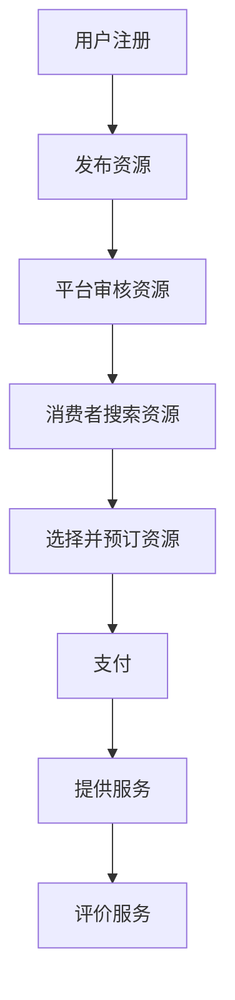
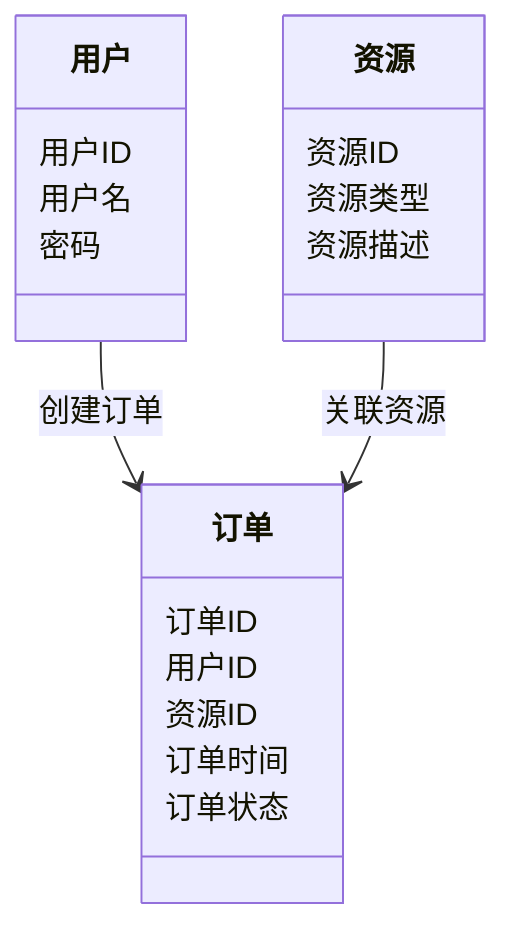
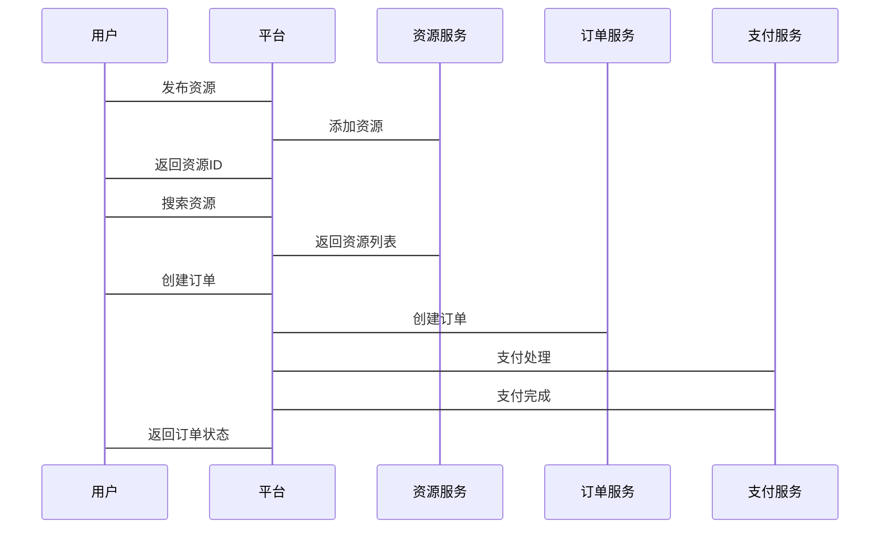

                 


# 价值投资中的共享经济模式分析

**关键词：** 价值投资，共享经济，模式分析，动态定价，收益预测，系统架构

**摘要：** 本文从价值投资的角度，深入分析共享经济模式的核心概念、算法原理、系统架构以及实际应用。通过构建数学模型和算法实现，探讨共享经济模式在价值投资中的应用潜力和挑战。

---

## 第1章 价值投资与共享经济模式概述

### 1.1 价值投资的基本概念

#### 1.1.1 价值投资的定义
价值投资是一种投资策略，强调以低于内在价值的价格购买优质资产。其核心在于寻找市场低估的股票，通过长期持有实现超额收益。

#### 1.1.2 价值投资的核心理念
- 市场先生：市场情绪波动影响短期价格，但不影响长期价值。
- 安全边际：买入价格与内在价值的差距提供保护。
- 股价与价值脱节：短期股价可能偏离长期价值。

#### 1.1.3 价值投资与传统投资的区别
- **传统投资**：基于技术分析和市场趋势。
- **价值投资**：基于基本面分析和长期价值。

### 1.2 共享经济模式的定义与特点

#### 1.2.1 共享经济的定义
共享经济是通过数字化平台，将闲置资源与需求方匹配，实现资源高效利用的经济模式。

#### 1.2.2 共享经济的核心特征
- **去中介化**：直接连接供给方与需求方。
- **资源闲置利用**：最大化资源利用率。
- **信任机制**：依赖平台建立信任。

#### 1.2.3 共享经济的典型应用场景
- 出行：如滴滴、Uber。
- 住宿：如Airbnb。
- 共享办公空间：如WeWork。

### 1.3 价值投资与共享经济模式的结合

#### 1.3.1 共享经济模式中的价值创造
共享经济通过提高资源利用率，降低交易成本，创造新的价值。

#### 1.3.2 价值投资在共享经济中的应用
- 投资共享经济平台的股权。
- 投资共享经济相关技术和服务。

#### 1.3.3 共享经济模式对价值投资的影响
- 提供新的投资机会。
- 改变传统投资方式。

---

## 第2章 共享经济模式的核心要素与关系

### 2.1 共享经济模式的实体关系分析

#### 2.1.1 用户角色的分类
- **资源提供者**：提供闲置资源。
- **消费者**：使用资源。

#### 2.1.2 平台角色的功能
- **匹配供需**：通过算法匹配资源提供者和消费者。
- **信任机制**：通过评分系统建立信任。
- **支付与结算**：提供支付和结算服务。

#### 2.1.3 资源提供者与消费者的互动关系
- 资源提供者通过平台发布资源。
- 消费者通过平台搜索、预订和支付。

### 2.2 共享经济模式的ER图分析

```mermaid
erDiagram
    actor 用户
    actor 资源提供者
    actor 平台
    actor 消费者

    用户 --> 平台 : 注册/登录
    平台 --> 用户 : 提供服务
    资源提供者 --> 平台 : 发布资源
    平台 --> 资源提供者 : 支付收益
    消费者 --> 平台 : 搜索资源
    平台 --> 消费者 : 提供资源
```

### 2.3 共享经济模式的流程分析



---

## 第3章 共享经济模式中的定价算法

### 3.1 动态定价模型

#### 3.1.1 动态定价的基本原理
动态定价根据供需变化实时调整价格，基于以下因素：
- **时间**：高峰期与低谷期。
- **供需**：需求量与供给量。
- **用户行为**：用户评价和需求偏好。

#### 3.1.2 基于供需的定价策略
- 需求旺盛时，价格上调。
- 需求疲软时，价格下调。

#### 3.1.3 基于用户行为的定价调整
- 频繁预订用户享有折扣。
- 新用户首单优惠。

### 3.2 共享经济中的收益预测模型

#### 3.2.1 收益预测的数学模型
收益 \( R \) 预测公式：
$$ R = \beta_0 + \beta_1 D + \beta_2 S + \epsilon $$
其中：
- \( D \) 是需求变量。
- \( S \) 是供给变量。
- \( \epsilon \) 是误差项。

#### 3.2.2 基于历史数据的回归分析
使用历史数据进行回归分析，确定各变量的系数 \( \beta \)。

#### 3.2.3 基于机器学习的预测方法
使用随机森林或神经网络模型预测收益。

### 3.3 算法实现与案例分析

#### 3.3.1 算法实现的Python代码

```python
import numpy as np
import pandas as pd
from sklearn.ensemble import RandomForestRegressor

# 示例数据
data = {
    '需求': [100, 200, 150, 80],
    '供给': [50, 70, 60, 40],
    '收益': [5000, 10000, 8000, 4000]
}

df = pd.DataFrame(data)

# 特征与目标
X = df[['需求', '供给']]
y = df['收益']

# 训练模型
model = RandomForestRegressor(n_estimators=100)
model.fit(X, y)

# 预测
new_data = {'需求': 120, '供给': 60}
new_X = pd.DataFrame([new_data])
predicted = model.predict(new_X)
print("预测收益:", predicted[0])
```

#### 3.3.2 算法结果的可视化与分析
使用 matplotlib 可视化需求、供给与收益的关系。

#### 3.3.3 案例分析与优化建议
以滴滴为例，分析动态定价策略的实际应用。

---

## 第4章 共享经济模式的系统架构设计

### 4.1 问题场景介绍
设计一个共享经济平台，支持资源发布、需求匹配、支付结算等功能。

### 4.2 系统功能设计



### 4.3 系统架构设计

```mermaid
container 微服务架构 {
    service 用户服务 {
        - 用户管理
        - 用户认证
    }
    service 资源服务 {
        - 资源发布
        - 资源查询
    }
    service 订单服务 {
        - 订单创建
        - 订单管理
    }
    service 支付服务 {
        - 支付处理
        - 支付状态查询
    }
}
```

### 4.4 系统接口设计
定义RESTful API接口，如：
- POST /api/users/register
- POST /api/resources/post
- POST /api/orders/create

### 4.5 系统交互流程图



---

## 第5章 项目实战

### 5.1 环境安装
安装Python、Django框架、Docker等。

### 5.2 系统核心实现源代码

```python
from django.urls import path
from . import views

urlpatterns = [
    path('api/users/', views.UserList.as_view()),
    path('api/resources/', views.ResourceList.as_view()),
    path('api/orders/', views.OrderList.as_view()),
]
```

### 5.3 代码应用解读与分析
解释URL配置、模型定义、视图实现等部分。

### 5.4 案例分析
以Airbnb为例，分析其商业模式和价值投资策略。

### 5.5 项目小结
总结项目实现过程中的经验与教训。

---

## 第6章 最佳实践与小结

### 6.1 最佳实践
- 定期更新模型参数。
- 关注市场需求变化。
- 优化平台用户体验。

### 6.2 小结
本文从价值投资的角度，系统分析了共享经济模式的核心概念、算法原理和系统架构，并通过项目实战验证了理论的可行性。

### 6.3 注意事项
- 风险管理：避免过度依赖单一模式。
- 数据隐私：保护用户数据安全。

### 6.4 拓展阅读
推荐相关书籍和论文，供进一步研究。

---

**作者：AI天才研究院 & 禅与计算机程序设计艺术**

