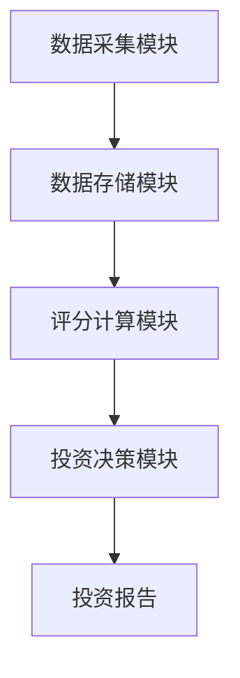
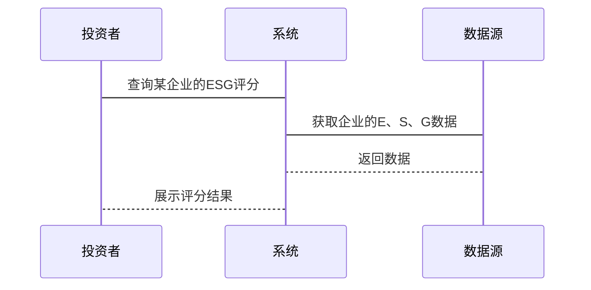

                 


# 价值投资中的可持续发展因素

> 关键词：价值投资、可持续发展、ESG评分、投资决策、风险管理

> 摘要：本文探讨了价值投资中的可持续发展因素，特别是环境（E）、社会（S）和治理（G）因素在投资决策中的重要性。通过分析这些因素如何影响企业价值、投资风险和长期收益，本文提供了量化评估方法和系统设计框架，帮助投资者在价值投资中更好地整合可持续发展理念。

---

## 第1章: 价值投资与可持续发展概述

### 1.1 价值投资的基本概念

#### 1.1.1 价值投资的定义
价值投资是一种以低于内在价值的价格买入优质资产的投资策略，核心在于寻找市场低估的公司。其本质是通过深入分析企业的基本面，寻找具有持续竞争优势和良好治理结构的企业。

#### 1.1.2 价值投资的核心理念
- 价格是投资的第一门语言，但价值才是核心。
- 长期投资，避免频繁交易。
- 买入并持有优质资产，等待其价值回归。

#### 1.1.3 价值投资与可持续发展的关联
随着全球可持续发展趋势的增强，企业的可持续发展能力逐渐成为其长期价值的重要组成部分。价值投资者越来越关注企业的ESG表现，因为这些因素直接影响企业的长期盈利能力和抗风险能力。

---

### 1.2 可持续发展与投资的关系

#### 1.2.1 可持续发展的定义与内涵
可持续发展是指在满足当前需求的同时，不损害后代人满足其需求的能力。在投资领域，可持续发展强调企业在环境、社会和治理方面的责任。

#### 1.2.2 可持续发展在投资中的重要性
- 环境因素（E）：企业对资源的使用效率和对环境的保护程度直接影响其运营成本和风险。
- 社会因素（S）：企业与社会的互动关系影响其声誉和员工稳定性。
- 治理因素（G）：公司治理结构和透明度决定企业的管理效率和抗风险能力。

#### 1.2.3 可持续投资的全球趋势
全球投资者 increasingly incorporate ESG factors into their investment strategies, as they realize that sustainable companies are more likely to deliver long-term returns.

---

### 1.3 价值投资中的可持续发展因素

#### 1.3.1 环境因素（E）
环境因素包括企业的碳排放、能源使用效率、环保合规性等。在价值投资中，企业对环境的保护能力被视为其长期竞争力的重要指标。

#### 1.3.2 社会因素（S）
社会因素涉及企业的员工待遇、社会责任、产品安全等。良好的社会表现通常意味着企业具备更强的公众信任和员工稳定性。

#### 1.3.3 治理因素（G）
治理因素包括董事会结构、高管薪酬、股东权利等。有效的公司治理是企业长期稳定发展的基础。

---

### 1.4 可持续发展因素对投资决策的影响

#### 1.4.1 可持续发展因素如何影响企业价值
- 通过降低运营成本和风险，增强企业的盈利能力。
- 提升企业的品牌价值和社会认可度，吸引更多优质人才。

#### 1.4.2 可持续发展因素对投资风险的评估
- 环境风险：政策变化或环保问题可能导致额外成本。
- 社会风险：社会责任缺失可能引发公众抗议或监管处罚。
- 治理风险：治理不善可能导致管理层决策失误或内部腐败。

#### 1.4.3 可持续发展因素对投资收益的长期影响
- 可持续发展的企业通常具备更强的抗风险能力和长期增长潜力。
- 越来越多的证据表明，ESG表现优异的公司往往能为投资者带来超额收益。

---

## 第2章: 可持续发展因素的量化评估

### 2.1 可持续发展因素的量化方法

#### 2.1.1 环境因素的量化
- 碳排放强度：单位产品或服务的碳排放量。
- 能源使用效率：单位能源消耗产出的经济价值。

#### 2.1.2 社会因素的量化
- 员工满意度：通过调查或第三方评估确定。
- 社区参与度：企业对当地社区的贡献程度。

#### 2.1.3 治理因素的量化
- 董事会多样性：独立董事比例、女性董事比例。
- 股东权利：股东是否能有效参与公司治理。

---

### 2.2 可持续发展评分体系

#### 2.2.1 ESG评分体系的定义
ESG评分是通过对企业在环境、社会和治理方面的表现进行量化，形成一个综合评分体系。评分通常采用0到100分或0到5分的评级标准。

#### 2.2.2 ESG评分的计算方法
- 数据收集：从公开披露的信息、第三方评级机构数据中获取。
- 权重分配：根据行业特点和投资目标设定各因素的权重。
- 综合评分：通过加权计算得出最终评分。

#### 2.2.3 ESG评分的行业差异
不同行业对E、S、G因素的重视程度不同。例如，能源行业更关注环境因素，而金融行业更关注治理因素。

---

### 2.3 可持续发展因素的权重分配

#### 2.3.1 权重分配的原则
- 行业特点：不同行业对E、S、G的权重应有所侧重。
- 投资目标：根据投资策略调整权重。
- 数据可得性：优先选择数据充足的因素。

#### 2.3.2 不同行业权重的调整
- 对于制造业，环境因素权重较大。
- 对于科技企业，治理因素权重较大。

#### 2.3.3 权重分配的案例分析
假设一个投资组合中，环境因素占40%，社会因素占30%，治理因素占30%。

---

## 第3章: 可持续发展因素对投资组合的影响

### 3.1 投资组合中的可持续发展因素整合

#### 3.1.1 投资组合构建的基本原理
- 资产配置：根据风险偏好和收益目标选择资产类别。
- 个股选择：筛选具有竞争优势和良好治理结构的企业。

#### 3.1.2 可持续发展因素在投资组合中的位置
- 作为筛选标准，剔除不符合可持续发展理念的企业。
- 作为加成因素，提升优质企业的权重。

#### 3.1.3 可持续发展因素对投资组合风险的影响
- 通过分散投资降低行业或地区的集中风险。
- 通过关注ESG因素降低企业的特定风险。

---

### 3.2 可持续发展因素对投资收益的长期影响

#### 3.2.1 可持续发展投资的收益表现
- 数据显示，ESG表现优异的企业往往能提供更高的风险调整后收益。
- 长期来看，可持续投资组合的收益表现与传统投资组合相当甚至更优。

#### 3.2.2 可持续发展投资的风险调整收益
- 通过关注治理因素，降低投资组合的流动性风险。
- 通过关注环境因素，降低投资组合的政策风险。

#### 3.2.3 可持续发展投资的未来趋势
- 投资者对ESG投资的需求不断增加。
- 未来，ESG因素将成为投资决策的核心考量。

---

## 第4章: 可持续发展因素的系统分析与架构设计

### 4.1 可持续发展因素的系统分析

#### 4.1.1 可持续发展因素的系统构成
- 数据采集模块：收集企业的E、S、G数据。
- 评分计算模块：对各因素进行量化评分。
- 投资决策模块：根据评分结果调整投资策略。

#### 4.1.2 可持续发展因素的相互关系
- 环境因素与治理因素相互影响。
- 社会因素与其他因素具有一定的关联性。

#### 4.1.3 可持续发展因素的动态变化
- 政策变化可能导致环境因素评分的变化。
- 企业内部治理结构的优化可能提升治理评分。

---

### 4.2 可持续发展投资的系统架构

#### 4.2.1 问题场景介绍
- 投资者需要一个系统化的工具，帮助其量化和评估企业的ESG表现。

#### 4.2.2 系统功能设计
- 数据采集模块：通过爬虫技术抓取企业公开信息。
- 评分计算模块：根据预设的权重计算ESG评分。
- 投资决策模块：基于评分结果生成投资建议。

#### 4.2.3 系统架构图



---

### 4.3 系统接口设计

#### 4.3.1 数据接口
- API接口：用于与其他数据源（如ESG评级机构）对接。
- 数据格式：JSON格式存储和传输数据。

#### 4.3.2 用户接口
- �界面前端：提供可视化的ESG评分展示。
- 交互后端：处理用户的查询和操作请求。

---

### 4.4 系统交互设计

#### 4.4.1 交互流程图



---

## 第5章: 项目实战

### 5.1 环境安装

#### 5.1.1 Python环境搭建
- 安装Python 3.8及以上版本。
- 安装必要的库：pandas、numpy、scikit-learn。

#### 5.1.2 数据源准备
- 下载企业ESG数据（如使用Morgan Stanley Capital International (MSCI)的数据）。

---

### 5.2 核心实现

#### 5.2.1 数据清洗与预处理
```python
import pandas as pd

# 读取数据
df = pd.read_csv('esg_data.csv')

# 删除缺失值
df.dropna(inplace=True)

# 标准化处理
from sklearn.preprocessing import StandardScaler
scaler = StandardScaler()
df_scaled = pd.DataFrame(scaler.fit_transform(df), columns=df.columns)
```

#### 5.2.2 ESG评分计算
```python
def calculate_esg_score(data, weights):
    # 权重分配
    e_weight, s_weight, g_weight = weights
    # 计算ESG评分
    e_score = data['E'] * e_weight
    s_score = data['S'] * s_weight
    g_score = data['G'] * g_weight
    total_score = e_score + s_score + g_score
    return total_score

# 示例权重
weights = [0.4, 0.3, 0.3]
esg_scores = df.apply(lambda row: calculate_esg_score(row, weights), axis=1)
```

---

### 5.3 案例分析

#### 5.3.1 环境影响评估
- 分析某企业的碳排放强度，评估其环境表现。
- 对比同行业其他企业的排放数据，确定其行业地位。

#### 5.3.2 社会因素分析
- 调查企业员工满意度，评估其社会表现。
- 评估企业对社区的贡献程度，如教育、医疗等方面的投入。

#### 5.3.3 治理结构评估
- 分析企业董事会结构，评估其治理能力。
- 调查高管薪酬与绩效的关系，评估治理透明度。

---

## 第6章: 结论与展望

### 6.1 本章总结
- 价值投资中，可持续发展因素（ESG）对企业价值和投资收益具有重要影响。
- 通过量化评估和系统设计，投资者可以更好地将ESG因素融入投资决策。

### 6.2 未来展望
- 更多投资者将关注ESG因素，推动可持续投资的发展。
- 技术进步将提升ESG评分的准确性和实时性。

### 6.3 投资建议
- 投资者应根据自身需求和行业特点，合理分配ESG因素的权重。
- 在投资组合中加入ESG因素，降低风险，提升长期收益。

---

## 附录

### 附录A: 数据来源
- 公开的企业年报。
- 第三方ESG评级机构（如MSCI、Sustainalytics）。

### 附录B: 工具与库
- Python库：pandas、numpy、scikit-learn。
- 数据可视化工具：Matplotlib、Seaborn。

---

作者：AI天才研究院/AI Genius Institute & 禅与计算机程序设计艺术 /Zen And The Art of Computer Programming

