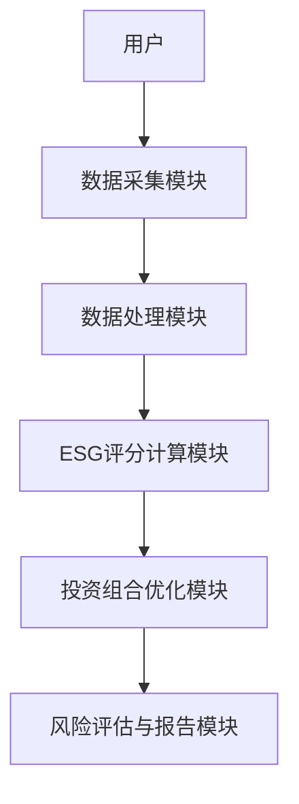
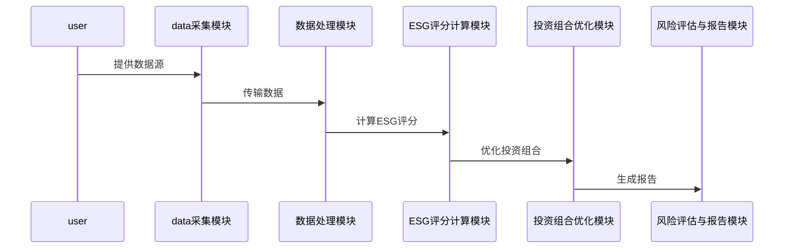

                 


# 价值投资中的可持续发展目标对标

## 关键词：可持续发展目标, 价值投资, ESG, 企业价值, 投资策略

## 摘要：  
本文探讨了如何在价值投资中结合可持续发展目标，特别是通过环境、社会和治理（ESG）因素的量化评估，构建长期价值投资策略。文章从背景、核心概念、算法原理到系统架构、项目实战等多维度展开，深入分析了可持续发展目标与价值投资的内在联系，并通过具体案例展示了如何在实际投资中应用这些方法。

---

## 第一部分：可持续发展目标与价值投资的背景介绍

### 第1章：可持续发展目标的背景与内涵

#### 1.1 可持续发展目标的核心概念

- **问题背景**：可持续发展已成为全球关注的焦点，联合国提出的17个可持续发展目标（SDGs）涵盖了经济、社会和环境等多个方面。企业作为社会的重要组成部分，其行为对实现这些目标具有重要影响。
- **问题描述**：企业需要在追求经济效益的同时，承担社会责任，减少对环境的负面影响，促进社会公平与正义。然而，企业在实践中如何将可持续发展目标与自身发展战略相结合，仍是一个挑战。
- **问题解决**：通过制定明确的可持续发展目标，企业可以优化资源配置，提升社会形象，同时增强企业的长期竞争力。
- **边界与外延**：可持续发展目标的外延包括环境（如减少碳排放）、社会（如促进教育公平）和治理（如加强企业透明度）等多个方面，而其边界则在于如何将这些目标转化为具体的行动方案和衡量指标。
- **概念结构与核心要素**：可持续发展目标的核心要素包括目标设定、资源分配、过程管理和社会影响评估。企业需要将这些要素整合到自身的战略规划中，以实现长期的可持续发展。

#### 1.2 价值投资的背景与核心理念

- **价值投资的核心理念**：价值投资强调以低于内在价值的价格买入优质资产，长期持有，以获得超额收益。其核心在于识别那些被市场低估的企业，这些企业具有稳定的盈利能力、良好的财务状况和健康的治理结构。
- **价值投资的哲学基础**：价值投资认为市场的短期波动并不能反映企业的真正价值，长期来看，企业的内在价值将决定其股价。因此，投资者应关注企业的基本面，而非市场的短期情绪。
- **价值投资与可持续发展的结合**：随着社会对可持续发展的关注增加，越来越多的投资者意识到，企业的可持续发展能力是其长期价值的重要组成部分。企业如果在ESG方面表现不佳，可能会面临更高的风险，从而影响其长期价值。

#### 1.3 可持续发展目标与价值投资的结合

- **结合的意义**：将可持续发展目标纳入价值投资策略，可以帮助投资者识别那些在可持续发展方面表现优异的企业，这些企业具有更强的抗风险能力和长期增长潜力。
- **结合的目标**：通过建立基于可持续发展目标的评价体系，投资者可以更全面地评估企业的价值，从而做出更明智的投资决策。
- **结合的必要性**：随着全球范围内对可持续发展的重视，企业如果不关注可持续发展目标，可能会面临政策风险、声誉风险和道德风险，这些都会影响企业的长期价值。

---

## 第二部分：可持续发展目标与价值投资的核心概念与联系

### 第2章：可持续发展目标的框架与分析

#### 2.1 可持续发展目标的框架体系

- **联合国SDGs的17个目标**：包括消除贫困、保护地球、促进繁荣等。
- **目标之间的相互关系**：这些目标并不是孤立的，而是相互关联、相互影响的。例如，减少碳排放（环境目标）不仅有助于应对气候变化，还能促进技术创新和经济增长（经济目标）。
- **目标的优先级分析**：在不同行业和不同地区，目标的优先级可能有所不同。例如，对于资源型企业，减少碳排放可能是优先目标；而对于教育企业，促进教育公平可能是优先目标。

#### 2.2 价值投资中的ESG框架

- **ESG的定义与内涵**：
  - **环境（E）**：包括碳排放、资源消耗、环保合规等。
  - **社会（S）**：包括员工权益、社会责任、产品安全等。
  - **治理（G）**：包括公司治理结构、高管薪酬、董事会独立性等。
- **ESG评分体系的构建与应用**：通过量化企业的ESG表现，投资者可以更好地评估企业的社会和环境风险，从而做出更明智的投资决策。

#### 2.3 可持续发展目标与ESG框架的对比与联系

- **对比分析表**：

| **维度**   | **可持续发展目标（SDGs）** | **ESG框架**               |
|------------|------------------------------|---------------------------|
| **目标**   | 长期社会和环境目标的实现    | 企业短期和长期的社会和环境表现 |
| **范围**   | 全球性、广泛性               | 企业层面的具体表现         |
| **应用**   | 用于指导企业战略规划       | 用于评估企业投资价值         |
| **驱动因素** | 政策、道德和社会压力         | 投资者需求和风险管理         |

- **联系**：可持续发展目标为ESG框架提供了更广泛的社会和环境目标，而ESG框架则为实现这些目标提供了具体的操作指南和评估标准。

---

## 第三部分：基于可持续发展目标的价值投资算法原理

### 第3章：可持续发展目标的量化与指标体系

#### 3.1 可持续发展目标的量化方法

- **指标体系构建**：
  - 选择与可持续发展目标相关的具体指标，例如碳排放强度、员工满意度、董事会多样性等。
  - 确定每个指标的权重，权重的确定可以通过专家评分、数据相关性分析等方式进行。
- **数据来源与处理**：
  - 数据来源包括企业公开报告、第三方评级机构数据、政府统计数据等。
  - 数据处理包括数据清洗、标准化和归一化。

#### 3.2 ESG评分模型的构建与应用

- **评分模型构建**：
  - 确定评分标准和评分方法，例如使用加权平均法计算企业的ESG评分。
  - 通过机器学习算法（如回归分析、聚类分析）优化评分模型。
- **应用**：
  - 将企业的ESG评分纳入价值投资模型，作为评估企业长期价值的重要因素。
  - 通过ESG评分筛选出在可持续发展方面表现优异的企业，构建投资组合。

### 第4章：基于可持续发展目标的价值投资算法

#### 4.1 可持续发展目标的因子分析

- **因子分解**：
  - 将可持续发展目标分解为具体的因子，例如碳排放因子、员工满意度因子、董事会独立性因子等。
  - 分析这些因子之间的相互影响，例如提高员工满意度可能会提升企业的社会形象，从而降低企业面临的声誉风险。
- **因子的重要性排序与权重分配**：
  - 通过统计分析和专家判断确定每个因子的权重。
  - 使用层次分析法（AHP）等方法优化权重分配。

#### 4.2 基于可持续发展目标的价值投资策略

- **策略目标**：
  - 通过筛选在可持续发展方面表现优异的企业，构建长期价值投资组合。
- **算法步骤**：
  1. 收集企业的ESG相关数据。
  2. 计算企业的ESG评分。
  3. 根据ESG评分和传统财务指标，评估企业的内在价值。
  4. 筛选出那些被市场低估且ESG评分较高的企业，构建投资组合。
  5. 定期调整投资组合，以适应市场变化和企业ESG表现的变化。

---

## 第四部分：系统分析与架构设计方案

### 第5章：基于可持续发展目标的价值投资系统设计

#### 5.1 系统功能需求分析

- **数据采集与处理模块**：
  - 从企业公开报告、第三方评级机构等多渠道采集数据。
  - 对数据进行清洗、标准化和归一化处理。
- **ESG评分计算模块**：
  - 根据预设的指标体系和评分模型，计算企业的ESG评分。
- **投资组合优化模块**：
  - 结合ESG评分和传统财务指标，优化投资组合。
- **风险评估与报告模块**：
  - 定期评估投资组合的风险和收益。
  - 生成投资报告，包括ESG表现分析和投资建议。

#### 5.2 系统架构设计

- **系统整体架构图**：



- **系统交互序列图**：



---

## 第五部分：项目实战

### 第6章：基于可持续发展目标的价值投资实战

#### 6.1 环境安装与数据准备

- **环境安装**：
  - 安装Python、Pandas、NumPy、Scikit-learn等工具。
- **数据准备**：
  - 下载企业公开数据和ESG评级数据。
  - 数据清洗和预处理。

#### 6.2 核心代码实现

```python
import pandas as pd
import numpy as np
from sklearn.linear_model import LinearRegression

# 数据加载
data = pd.read_csv('esg_data.csv')

# 计算ESG评分
def calculate_esg_score(data):
    # 假设数据中包含E、S、G三个维度的指标
    E = data['E']
    S = data['S']
    G = data['G']
    # 计算加权平均ESG评分
    esg_scores = (E + S + G) / 3
    return esg_scores

# 应用ESG评分模型
esg_scores = calculate_esg_score(data)

# 结合传统财务指标进行投资组合优化
# 假设数据中包含市盈率（PE）和ROE（净资产收益率）
X = data[['PE', 'ROE']]
y = esg_scores

# 训练线性回归模型
model = LinearRegression()
model.fit(X, y)

# 预测ESG评分
predicted_esg = model.predict(X)

# 筛选出ESG评分高的企业
selected = data[predicted_esg > np.mean(predicted_esg)]
```

#### 6.3 案例分析与结果解读

- **案例分析**：
  - 选择一个行业（如能源行业）进行分析。
  - 根据ESG评分和传统财务指标，筛选出具有长期投资价值的企业。
- **结果解读**：
  - 展示投资组合的表现，包括收益、风险和ESG表现。
  - 分析ESG评分对投资决策的影响。

---

## 第六部分：最佳实践与小结

### 第7章：最佳实践与小结

#### 7.1 最佳实践

- **小结**：本文从背景、核心概念、算法原理到系统架构和项目实战，详细探讨了如何在价值投资中结合可持续发展目标。通过ESG评分模型的构建和应用，投资者可以更好地评估企业的长期价值。
- **注意事项**：
  - 数据的质量和来源是关键，确保数据的准确性和完整性。
  - 持续关注企业的ESG表现，及时调整投资策略。
- **拓展阅读**：
  - 推荐阅读相关书籍和论文，深入了解ESG投资和可持续发展目标的最新研究。

---

## 作者：AI天才研究院/AI Genius Institute & 禅与计算机程序设计艺术 /Zen And The Art of Computer Programming

---

以上是基于《价值投资中的可持续发展目标对标》的完整文章大纲和内容框架。

