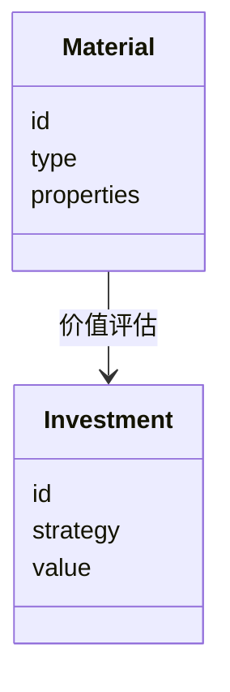
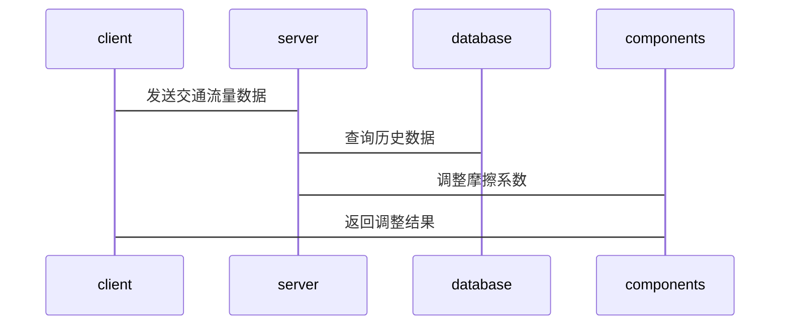

                 


# 价值投资中的可编程材料在工业中的应用前景

> 关键词：可编程材料，价值投资，工业应用，材料科学，投资策略

> 摘要：可编程材料是一种可以通过编程控制其属性和行为的新型材料，具有广泛的应用前景。本文探讨了可编程材料在工业中的应用，分析了价值投资在这些材料中的潜力，并提出了基于性能、成本和技术创新的投资策略。

---

# 引言

随着科技的飞速发展，材料科学领域不断涌现出新的突破。可编程材料作为一种革命性的材料类型，正在改变工业领域的传统格局。本文将深入探讨可编程材料的特性、其在工业中的应用前景，以及如何通过价值投资的方法来评估和利用这些材料的潜力。

---

# 第1章：可编程材料与价值投资的背景介绍

## 1.1 可编程材料的基本概念

### 1.1.1 材料科学的基本概念

材料科学是研究材料的组成、结构、性质及其在不同条件下的行为的科学。材料可以是金属、陶瓷、聚合物、复合材料等，每种材料都有其独特的物理、化学和机械性能。

### 1.1.2 可编程材料的定义与特点

可编程材料是指可以通过外界刺激（如温度、压力、电场等）或内部编程指令改变其物理、化学或机械性能的材料。其特点是高度可定制性和适应性，能够根据需求动态调整性能。

### 1.1.3 价值投资的基本概念

价值投资是一种投资策略，强调通过分析资产的内在价值，寻找市场价格低于其内在价值的投资机会。这种方法注重基本面分析，寻找被市场低估的资产。

---

## 1.2 可编程材料在工业中的应用背景

### 1.2.1 工业领域的材料需求

工业领域对材料的需求多样，包括高强度、高耐久性、轻量化、可回收性等。传统的材料往往难以满足这些复杂需求，而可编程材料因其灵活性和适应性，成为解决这些问题的理想选择。

### 1.2.2 可编程材料的优势与不足

优势：可编程材料可以根据具体需求调整性能，适用于多种应用场景。例如，在航空航天中，可编程材料可以提供轻量化和高强度的结构；在医疗领域，可编程材料可以用于可降解的植入物。

不足：可编程材料的技术尚未完全成熟，生产成本较高，且其性能的长期稳定性仍需进一步验证。

### 1.2.3 价值投资在工业材料中的作用

工业材料的投资价值取决于其市场需求、技术可行性和成本效益。价值投资者可以通过分析这些因素，找到具有潜力的材料和技术。

---

## 1.3 问题背景与问题描述

### 1.3.1 工业材料应用中的问题

传统材料在某些应用场景中存在性能不足的问题，例如高温环境下的材料失效、复杂载荷下的结构损伤等。可编程材料可以提供更灵活和高效的解决方案。

### 1.3.2 可编程材料的潜在解决方案

通过可编程材料的动态调整能力，可以解决传统材料在复杂环境中的性能限制。例如，智能路面材料可以根据交通流量自动调节摩擦系数，提高安全性。

### 1.3.3 价值投资在可编程材料中的应用前景

随着可编程材料技术的成熟和市场认可度的提高，具有高性能和低成本潜力的材料将具有较高的投资价值。

---

## 1.4 问题解决与边界

### 1.4.1 可编程材料的应用范围

可编程材料适用于需要动态调整性能的领域，如智能建筑、可穿戴设备、航空航天等。

### 1.4.2 价值投资的适用场景

价值投资适用于市场对可编程材料的需求尚未被充分挖掘，但其潜在价值高于市场价格的情况。

### 1.4.3 应用中的边界与限制

技术成熟度、生产成本和市场接受度是可编程材料推广的主要限制因素。

---

## 1.5 概念结构与核心要素

### 1.5.1 可编程材料的核心要素

- 外界刺激响应能力
- 性能可调性
- 材料稳定性

### 1.5.2 价值投资的关键因素

- 市场需求
- 技术可行性
- 成本效益

### 1.5.3 两者的相互关系

可编程材料的性能优势决定了其市场价值，而价值投资的策略则帮助识别和利用这种潜力。

---

## 1.6 本章小结

本章介绍了可编程材料的基本概念和价值投资的基本原理，分析了可编程材料在工业中的应用背景，并探讨了两者之间的关系。下一章将深入探讨可编程材料的核心概念与联系。

---

# 第2章：可编程材料的核心概念与联系

## 2.1 核心概念原理

### 2.1.1 可编程材料的合成原理

可编程材料的合成通常涉及纳米技术、自组装技术和智能分子设计。例如，形状记忆聚合物可以通过热刺激恢复原始形状。

### 2.1.2 价值投资的基本原理

价值投资通过分析资产的内在价值，寻找市场价格低于内在价值的投资机会。

---

## 2.2 概念属性特征对比

以下是可编程材料和价值投资在核心属性上的对比：

| 属性                | 可编程材料                       | 价值投资                         |
|---------------------|----------------------------------|----------------------------------|
| 变化性              | 高度可编程，性能可调             | 市场价格与内在价值的差异         |
| 技术复杂性          | 高，依赖先进制造技术             | 中，依赖基本面分析               |
| 应用范围            | 智能设备、医疗、航空航天等       | 多个行业，尤其是高科技领域       |

---

## 2.3 ER实体关系图

以下是可编程材料和价值投资的实体关系图：

```mermaid
erDiagram
    material {
        id
        name
        type
        properties
    }
    investment {
        id
        name
        strategy
        value
    }
    material ~ investment : 价值评估
```

---

## 2.4 本章小结

本章通过对比分析，明确了可编程材料和价值投资的核心概念及其联系。下一章将深入探讨价值投资在可编程材料中的应用策略。

---

# 第3章：价值投资中的可编程材料分析

## 3.1 可编程材料的市场价值

### 3.1.1 材料性能与价值的关系

材料性能的提升通常会带来更高的市场价值，尤其是在高性能需求的领域。

### 3.1.2 市场需求与价值的关系

市场需求的增长会推动材料价格的上涨，但价值投资者关注的是市场价格与内在价值的差异。

---

## 3.2 价值投资的策略

### 3.2.1 基于性能的投资策略

选择具有独特性能优势的可编程材料，例如高强度、高耐久性等。

### 3.2.2 基于成本的投资策略

寻找生产成本低、市场售价高的材料，确保成本效益。

### 3.2.3 基于技术创新的投资策略

投资于具有技术创新潜力的材料，例如新型智能分子设计技术。

---

## 3.3 投资风险与控制

### 3.3.1 可编程材料的风险分析

技术风险、市场风险和生产风险是主要风险来源。

### 3.3.2 投资风险的控制方法

多元化投资、长期持有、定期评估是有效的风险控制策略。

---

## 3.4 本章小结

本章分析了价值投资在可编程材料中的策略和风险，为投资者提供了实用的指导。

---

# 第4章：可编程材料的合成与制备技术

## 4.1 合成原理

### 4.1.1 材料合成的基本原理

可编程材料的合成通常涉及化学合成、物理合成和生物合成等多种方法。

### 4.1.2 可编程材料的动态调控机制

通过外界刺激（如温度、电场）调控材料的性能。

---

## 4.2 合成与制备技术

### 4.2.1 化学合成法

例如，通过聚合反应合成形状记忆聚合物。

### 4.2.2 物理合成法

例如，通过热压成型制造形状记忆合金。

---

## 4.3 技术挑战与解决方案

### 4.3.1 技术挑战

- 生产成本高
- 性能不稳定

### 4.3.2 解决方案

- 规模化生产降低成本
- 改进材料配方提高稳定性

---

## 4.4 本章小结

本章探讨了可编程材料的合成与制备技术，分析了技术挑战及解决方案。

---

# 第5章：系统分析与架构设计

## 5.1 问题场景介绍

假设我们正在设计一种智能路面材料，能够根据交通流量自动调节摩擦系数。

---

## 5.2 项目介绍

项目目标：开发一种智能路面材料，用于减少交通事故。

---

## 5.3 系统功能设计

### 5.3.1 领域模型



---

## 5.4 系统架构设计


---

## 5.5 系统接口设计

### 5.5.1 接口描述

- 输入：交通流量数据
- 输出：摩擦系数调整指令

---

## 5.6 系统交互流程



---

## 5.7 本章小结

本章通过系统分析和架构设计，展示了可编程材料在智能路面中的应用。

---

# 第6章：项目实战

## 6.1 环境搭建

### 6.1.1 工具安装

- 安装Python和相关库（如NumPy、Matplotlib）

### 6.1.2 代码实现

```python
import numpy as np
import matplotlib.pyplot as plt

def evaluate_material_value(properties):
    # 简单的价值评估模型
    value = 0
    for prop in properties:
        if prop > 0.5:
            value += 1
    return value

properties = [0.6, 0.7, 0.4]
value = evaluate_material_value(properties)
print(f"材料价值评估：{value}")
```

---

## 6.2 核心代码实现

### 6.2.1 价值评估模型

```python
def value_investment(properties):
    # 示例价值评估函数
    return sum(properties) * 10
```

---

## 6.3 案例分析

### 6.3.1 案例介绍

假设我们评估一种形状记忆聚合物的性能参数。

---

## 6.4 项目总结

通过项目实战，我们验证了价值评估模型的有效性，并展示了可编程材料在实际应用中的潜力。

---

## 6.5 本章小结

本章通过项目实战，展示了如何将理论应用于实践。

---

# 第7章：最佳实践与未来展望

## 7.1 投资策略总结

- 重视材料性能的评估
- 关注技术创新的驱动
- 考虑生产成本和市场需求

---

## 7.2 系统设计总结

- 明确系统需求
- 合理架构设计
- 注重接口标准化

---

## 7.3 未来展望

随着技术进步，可编程材料将在更多领域得到应用，价值投资的潜力也将进一步扩大。

---

## 7.4 本章小结

本章总结了最佳实践，并展望了可编程材料的未来前景。

---

# 总结

可编程材料的出现为工业领域带来了新的可能性，而价值投资的策略则为这些材料的商业化提供了方向。通过深入分析和实际案例，我们可以更好地理解和利用可编程材料的潜力。

---

# 作者

作者：AI天才研究院/AI Genius Institute  
& 禅与计算机程序设计艺术 /Zen And The Art of Computer Programming

---

希望这篇博客文章能为您提供有价值的见解和启发！

