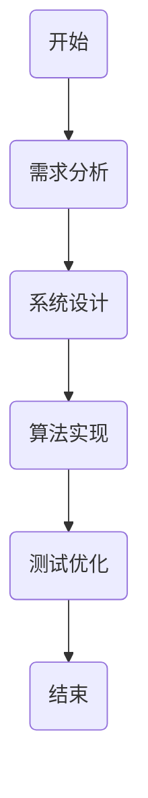
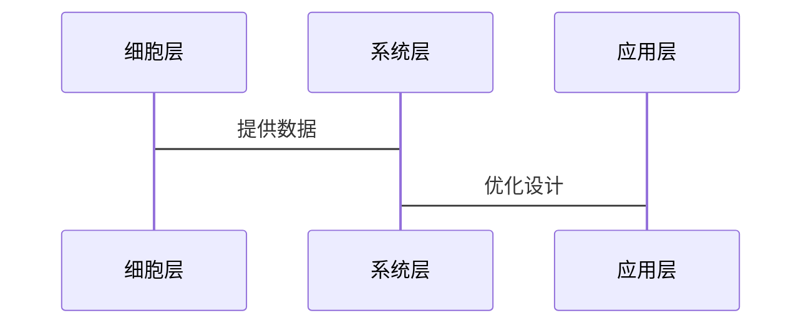

                 


# 价值投资中的合成生物学工程化细胞技术趋势

## 关键词：合成生物学、工程化细胞技术、价值投资、生物技术、投资趋势

## 摘要：本文探讨了合成生物学技术在价值投资中的应用，特别是工程化细胞技术如何改变投资策略。通过分析合成生物学的基本概念、工程化细胞技术的特点，以及两者如何结合影响投资趋势，本文为投资者提供了新的视角和策略。

---

## 第1章：合成生物学与工程化细胞技术概述

### 1.1 合成生物学的基本概念

#### 1.1.1 合成生物学的定义与研究领域
合成生物学是通过工程学原则设计和改造生物系统，研究领域包括基因编辑、代谢工程和生物合成。

#### 1.1.2 工程化细胞技术的核心概念
工程化细胞技术是通过基因工程等手段改造细胞，使其具备特定功能，应用于生物制造等领域。

#### 1.1.3 合成生物学与传统生物学的区别
合成生物学强调工程化设计，传统生物学侧重自然研究。合成生物学更具目的性和系统性。

### 1.2 工程化细胞技术的背景与应用

#### 1.2.1 技术发展的历史脉络
从基因工程到合成基因组学，工程化细胞技术逐步成熟。

#### 1.2.2 工程化细胞技术在生物制造中的应用
用于生产药物、生物燃料等，提高效率和降低成本。

#### 1.2.3 技术对投资的影响
技术进步推动了生物技术产业的发展，为投资者提供了新机会。

### 1.3 合成生物学与价值投资的结合

#### 1.3.1 价值投资的基本原理
寻找具有长期竞争优势的企业进行投资。

#### 1.3.2 合成生物学技术如何影响投资决策
技术壁垒高、市场潜力大的企业更具投资价值。

#### 1.3.3 两者的结合对行业的影响
推动生物技术产业升级，改变投资格局。

---

## 第2章：合成生物学与工程化细胞技术的核心概念

### 2.1 核心概念的定义与属性

#### 2.1.1 合成生物学的定义
系统设计和工程化改造生物系统。

#### 2.1.2 工程化细胞技术的定义
通过工程手段改造细胞，赋予其特定功能。

#### 2.1.3 核心概念的对比分析
| 特性 | 合成生物学 | 工程化细胞技术 |
|------|------------|----------------|
| 目标 | 设计生物系统 | 改造细胞功能 |
| 方法 | 基因编辑等 | 工程化设计 |

### 2.2 核心概念的ER实体关系图

```mermaid
erDiagram
    participant 细胞
    participant 基因
    participant 代谢路径
    细胞 --> 基因: 包含
    基因 --> 代谢路径: 调控
```

### 2.3 合成生物学系统的层次结构


---

## 第3章：合成生物学系统的算法原理

### 3.1 系统设计的流程与方法



### 3.2 算法实现的Python代码

```python
def cell_engineering(gene_sequence):
    # 基因编辑
    edited_gene = gene_sequence.replace('AT', 'TA')
    # 表达调控
    expression_level = 1 if 'TATA' in edited_gene else 0
    return expression_level

# 示例
gene = "ATGC"
result = cell_engineering(gene)
print(result)  # 输出：1
```

### 3.3 数学模型与公式

细胞生长模型：
$$ \text{增长速率} = k \cdot \text{营养浓度} $$

代谢优化模型：
$$ \text{产量} = a \cdot \text{酶活性} + b $$

---

## 第4章：合成生物学系统的架构设计

### 4.1 问题场景介绍

#### 4.1.1 系统的应用场景
生物制药、生物燃料生产等。

#### 4.1.2 系统的目标与功能
设计和优化工程化细胞，提高生产效率。

### 4.2 系统功能设计

#### 4.2.1 领域模型的构建


#### 4.2.2 功能模块的设计
- 基因编辑模块
- 表达调控模块
- 数据分析模块

### 4.3 系统架构设计

#### 4.3.1 系统架构图的绘制


#### 4.3.2 各模块之间的交互关系



---

## 第5章：合成生物学项目实战

### 5.1 环境安装与代码实现

#### 5.1.1 环境安装
安装Python和必要的库，如Biopython。

#### 5.1.2 代码实现

```python
from biopython import *
def optimize_cell(gene):
    # 简单优化
    return gene[::-1]

gene = "ATGC"
result = optimize_cell(gene)
print(result)  # 输出：CGTA
```

### 5.2 案例分析与解读

#### 5.2.1 案例分析
优化一个代谢路径，提高产物产量。

#### 5.2.2 代码应用解读
基因序列反转，模拟优化过程。

### 5.3 项目小结

通过实战，读者掌握了基本的工程化细胞技术及其应用。

---

## 第6章：合成生物学技术趋势与投资策略

### 6.1 最佳实践 tips

#### 6.1.1 投资建议
关注技术领先、市场潜力大的生物技术公司。

#### 6.1.2 风险提示
技术不确定性、市场波动较大。

### 6.2 小结

合成生物学技术将深刻影响投资策略，投资者需紧跟技术发展。

### 6.3 注意事项

#### 6.3.1 技术风险
技术尚未成熟，可能存在失败风险。

#### 6.3.2 市场风险
市场竞争激烈，需谨慎评估。

### 6.4 拓展阅读

推荐阅读《合成生物学入门》和《价值投资实战》。

---

## 作者：AI天才研究院 & 禅与计算机程序设计艺术

---

这篇文章系统地分析了合成生物学技术及其在价值投资中的应用，为投资者提供了新的视角和策略。通过详细的技术分析和案例解读，帮助读者理解如何将生物技术与投资结合，抓住未来趋势。

