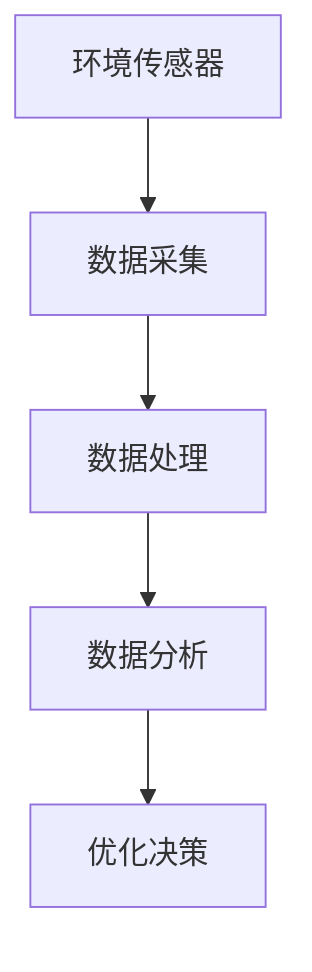

                 

# 价值投资中的垂直农业发展趋势

> 关键词：价值投资，垂直农业，发展趋势，市场分析，技术创新，投资策略

> 摘要：本文探讨了垂直农业在价值投资中的发展趋势，分析了垂直农业的技术创新、市场结构、商业模式及其对投资策略的影响。通过结合价值投资的基本理论，本文详细阐述了垂直农业的投资机会、风险分析和投资策略，为投资者提供了有价值的参考。

---

## 第一部分：垂直农业的背景与发展

### 第1章：垂直农业的定义与发展趋势

#### 1.1 垂直农业的定义与核心要素

垂直农业是指通过垂直空间利用和技术创新，实现高密度、高效能的农业生产模式。其核心要素包括：

- **空间利用**：最大化利用垂直空间，减少土地使用。
- **技术驱动**：依赖物联网、大数据和人工智能等技术。
- **高效生产**：通过技术优化，提高产量和资源利用率。

| 垂直农业与传统农业对比 | 垂直农业 | 传统农业 |
|------------------------|----------|-----------|
| 土地利用率             | 高       | 低         |
| 技术依赖               | 高       | 低         |
| 生产效率               | 高       | 中等       |
| 环境影响               | 小       | 较大       |

#### 1.2 垂直农业的技术驱动因素

垂直农业的发展离不开技术创新，主要体现在：

- **物联网（IoT）**：通过传感器和数据采集设备，实时监测和控制农业生产环境。
- **大数据与人工智能（AI）**：利用数据分析优化种植策略和预测市场趋势。

**算法原理：**

以下是物联网在垂直农业中的数据采集和分析流程：

物联网系统通过传感器收集数据，经处理和分析后，生成优化决策，提升农业生产效率。

#### 1.3 垂直农业的商业模式

垂直农业的商业模式主要包括：

- **B2B模式**：向企业客户提供定制化种植解决方案。
- **B2C模式**：直接向消费者销售产品，如垂直种植的有机蔬菜。

---

## 第二部分：价值投资的基本理论

### 第2章：价值投资的核心理念

#### 2.1 价值投资的定义与特点

价值投资是一种以基本面分析为基础的投资策略，强调以低于内在价值的价格买入优质资产。其特点包括：

- **长期视角**：注重长期价值，而非短期波动。
- **基本面分析**：关注企业的财务状况、行业地位和竞争优势。

#### 2.2 价值投资的基本分析方法

- **基本面分析**：分析企业的财务报表，包括利润表、资产负债表和现金流量表。
- **技术分析**：通过股票价格和成交量的历史数据，预测未来价格走势。
- **行业分析**：研究行业趋势和竞争格局，评估企业的市场地位。

#### 2.3 价值投资的组合管理

- **投资组合构建**：根据风险承受能力和收益目标，选择多样化的资产。
- **风险管理**：通过分散投资和止损策略，降低投资风险。

---

## 第三部分：垂直农业的市场分析

### 第3章：垂直农业的市场结构

#### 3.1 垂直农业的市场需求

- **消费者需求**：对高质量、安全食品的需求增加。
- **企业需求**：农业企业和科技公司对高效种植技术的需求。

#### 3.2 垂直农业的竞争格局

垂直农业市场的主要竞争者包括：

- **科技公司**：如 Monsanto 和 Bayer，利用技术优化农业生产。
- **初创企业**：专注于垂直种植技术和商业模式创新。

#### 3.3 垂直农业的投资机会

- **技术创新**：物联网和人工智能的应用带来投资机会。
- **市场扩展**：垂直农业在城市化进程中需求增加。

---

## 第四部分：垂直农业的技术驱动与投资分析

### 第4章：垂直农业的技术创新

#### 4.1 垂直农业的技术创新方向

- **智能化种植**：利用AI优化种植过程。
- **自动化管理**：通过物联网实现远程监控和管理。

#### 4.2 技术创新对企业价值的影响

技术创新可以显著降低成本、提高效率和增强市场竞争力。例如，采用AI优化种植策略，可以将单位面积产量提高30%。

#### 4.3 技术创新与投资机会

技术创新带来投资机会，但也伴随技术风险和市场风险。投资者需评估技术创新的可扩展性和商业可行性。

---

## 第五部分：垂直农业的价值投资策略

### 第5章：垂直农业的价值评估

#### 5.1 垂直农业的价值评估方法

- **市盈率（P/E）**：评估企业盈利能力。
- **市净率（P/B）**：评估企业资产价值。

#### 5.2 价值评估与投资决策

价值评估是投资决策的核心，需结合企业基本面和技术前景进行综合判断。

#### 5.3 价值投资策略

- **长期持有**：投资于具有长期增长潜力的企业。
- **分散投资**：降低投资风险。

---

## 结论

垂直农业作为新兴的农业模式，结合价值投资的理论，为投资者提供了丰富的投资机会。技术创新和市场需求的驱动，使得垂直农业在价值投资中具有广阔的发展前景。投资者需结合技术分析和基本面分析，制定合理的投资策略，以实现稳健的投资回报。

---

## 附录

### 附录1：相关术语解释

- **物联网（IoT）**：通过互联网连接各种设备，实现数据的采集和传输。
- **大数据分析**：通过对海量数据的处理和分析，提取有价值的信息。

### 附录2：投资工具推荐

- **股票分析工具**：如 Yahoo Finance 和 Bloomberg。
- **数据可视化工具**：如 Tableau 和 Power BI。

---

## 作者

作者：AI天才研究院/AI Genius Institute & 禅与计算机程序设计艺术 /Zen And The Art of Computer Programming

---

版权归原作者所有，未经授权不得转载、摘编或利用其它方式使用。

