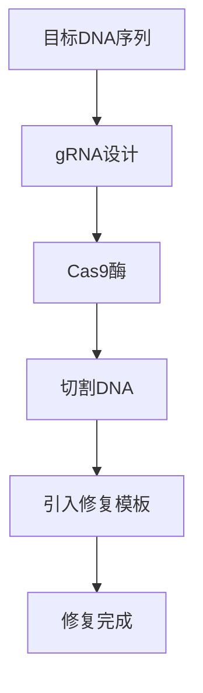

                 

# 价值投资中的基因编辑技术机遇

> 关键词：基因编辑技术、价值投资、CRISPR-Cas9、投资机会、市场分析

> 摘要：基因编辑技术作为一种革命性的生物技术，正在改变医疗、农业和工业等多个领域。本文将探讨基因编辑技术在这些领域的应用及其对投资的影响，分析市场现状和未来趋势，为投资者提供科学的指导。

---

# 第1章: 基因编辑技术的概述

## 1.1 基因编辑技术的定义与原理

### 1.1.1 基因编辑技术的基本概念
基因编辑技术是指通过人工手段对生物体的基因组进行精确修改的技术。它能够插入、删除或替换特定的基因片段，从而实现对生物特性的改造。

**核心原理**：基因编辑技术通过引导RNA（gRNA）与目标DNA序列配对，利用核酸酶（如Cas9）切割DNA双链，随后引入修复模板，实现基因的精准编辑。

### 1.1.2 基因编辑的主要技术手段
目前，最常用的技术是CRISPR-Cas9系统。其工作流程如下：

### 1.1.3 基因编辑技术的核心原理
基因编辑技术的核心在于其高精度和高效性。通过CRISPR-Cas9系统，科学家可以在基因组的特定位置进行编辑，从而实现对生物特性的改造。

## 1.2 基因编辑技术的应用领域

### 1.2.1 医疗健康领域的应用
基因编辑技术在医疗领域的应用主要集中在疾病治疗和基因疗法。例如，CRISPR-Cas9技术被用于治疗遗传性疾病、癌症和免疫系统疾病。

### 1.2.2 农业领域的应用
在农业领域，基因编辑技术被用于改良作物品种，提高抗病性和产量。例如，通过编辑水稻的基因组，可以提高其抗病能力。

### 1.2.3 工业领域的应用
在工业领域，基因编辑技术被用于改造微生物，提高其生产效率。例如，通过编辑酵母菌的基因组，可以提高其乙醇生产能力。

## 1.3 基因编辑技术的市场现状与未来趋势

### 1.3.1 全球基因编辑技术的市场分析
根据市场研究，全球基因编辑技术市场规模预计将在未来几年快速增长，年复合增长率超过20%。主要驱动因素包括医疗和农业领域的应用需求。

### 1.3.2 基因编辑技术的未来发展方向
未来，基因编辑技术将朝着更高精度、更广泛应用的方向发展。例如，基于CRISPR-Cas9的基因编辑技术将进一步优化，以提高编辑效率和准确性。

---

# 第2章: 价值投资的基本原理

## 2.1 价值投资的核心概念

### 2.1.1 价值投资的定义
价值投资是一种投资策略，旨在通过分析企业的基本面，寻找被市场低估的投资标的。其核心思想是“以合理的价格买入优质的资产”。

### 2.1.2 价值投资的主要原则
价值投资的主要原则包括：
1. 长期投资：关注企业的长期价值，而非短期波动。
2. 质量优先：选择具有强大竞争优势的企业。
3. 安全边际：确保买入价格低于内在价值。

### 2.1.3 价值投资与成长投资的区别
价值投资与成长投资的主要区别在于投资策略和目标。价值投资注重低估值，而成长投资注重高增长潜力。

## 2.2 价值投资的关键要素

### 2.2.1 企业的基本面分析
基本面分析包括对企业财务状况、盈利能力、成长性和竞争优势的评估。例如，分析企业的收入、利润、资产负债表和现金流。

### 2.2.2 财务指标的评估
关键财务指标包括市盈率（P/E）、市净率（P/B）、股息率和ROE（净资产收益率）。这些指标可以帮助投资者评估企业的估值和盈利能力。

### 2.2.3 行业分析与竞争环境
行业分析包括对行业发展趋势、市场规模和竞争格局的评估。例如，在医疗行业，基因编辑技术的应用前景广阔，但竞争也较为激烈。

---

# 第3章: 基因编辑技术的商业价值与投资机会

## 3.1 基因编辑技术的商业价值

### 3.1.1 基因编辑技术在医疗领域的商业价值
在医疗领域，基因编辑技术可以用于治疗遗传性疾病、癌症和免疫系统疾病。例如，CRISPR-Cas9技术在癌症治疗中的应用前景广阔。

### 3.1.2 基因编辑技术在农业领域的商业价值
在农业领域，基因编辑技术可以用于改良作物品种，提高抗病性和产量。例如，通过编辑水稻的基因组，可以提高其抗病能力。

### 3.1.3 基因编辑技术在工业领域的商业价值
在工业领域，基因编辑技术可以用于改造微生物，提高其生产效率。例如，通过编辑酵母菌的基因组，可以提高其乙醇生产能力。

## 3.2 基因编辑技术的投资机会

### 3.2.1 基因编辑技术在医疗健康领域的投资机会
在医疗领域，基因编辑技术的应用前景广阔。例如，CRISPR-Cas9技术在癌症治疗中的应用前景广阔。

### 3.2.2 基因编辑技术在农业领域的投资机会
在农业领域，基因编辑技术可以用于改良作物品种，提高抗病性和产量。例如，通过编辑水稻的基因组，可以提高其抗病能力。

### 3.2.3 基因编辑技术在工业领域的投资机会
在工业领域，基因编辑技术可以用于改造微生物，提高其生产效率。例如，通过编辑酵母菌的基因组，可以提高其乙醇生产能力。

---

# 第4章: 基因编辑技术的市场分析与投资策略

## 4.1 基因编辑技术的市场分析

### 4.1.1 市场规模与增长预测
根据市场研究，全球基因编辑技术市场规模预计将在未来几年快速增长，年复合增长率超过20%。主要驱动因素包括医疗和农业领域的应用需求。

### 4.1.2 市场竞争格局分析
当前，基因编辑技术领域的竞争主要集中在医疗和农业领域。主要参与者包括CRISPR Therapeutics、Editas Medicine和 Monsanto等。

### 4.1.3 市场风险与挑战
基因编辑技术的市场风险主要来自技术不确定性和监管政策的变化。例如，CRISPR-Cas9技术的安全性和有效性尚未完全验证。

## 4.2 价值投资策略的制定

### 4.2.1 投资目标的确定
在制定投资策略时，需要明确投资目标。例如，可以选择投资于具有强大研发能力和市场前景的基因编辑技术公司。

### 4.2.2 投资组合的构建
在构建投资组合时，需要分散风险，合理配置资产。例如，可以同时投资于医疗、农业和工业领域的基因编辑技术公司。

### 4.2.3 投资风险的控制
为了控制风险，需要密切关注技术进展和市场变化。例如，定期评估投资标的的财务状况和市场前景。

---

# 第5章: 基因编辑技术的法律与伦理问题

## 5.1 基因编辑技术的法律问题

### 5.1.1 基因编辑技术的法律框架
基因编辑技术的法律框架主要包括专利法、反垄断法和生物安全法。例如，CRISPR-Cas9技术的专利纠纷是当前的热点问题。

### 5.1.2 基因编辑技术的伦理争议
基因编辑技术的伦理争议主要集中在人类基因编辑的伦理问题上。例如，人类基因编辑可能导致基因歧视和社会不平等。

---

作者：AI天才研究院/AI Genius Institute & 禅与计算机程序设计艺术 /Zen And The Art of Computer Programming

