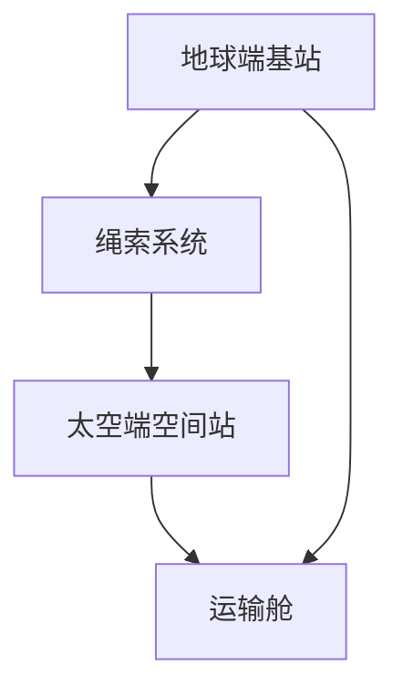
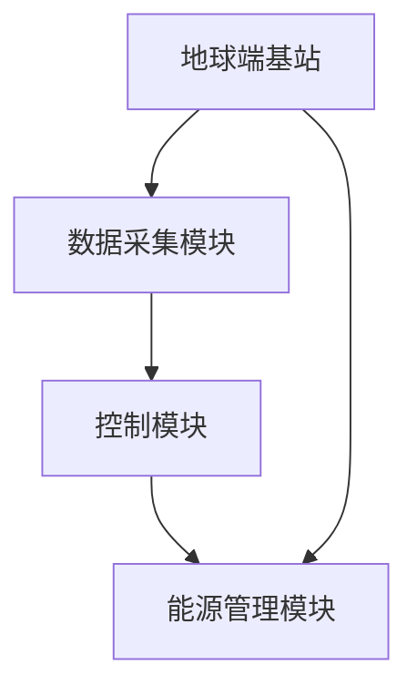
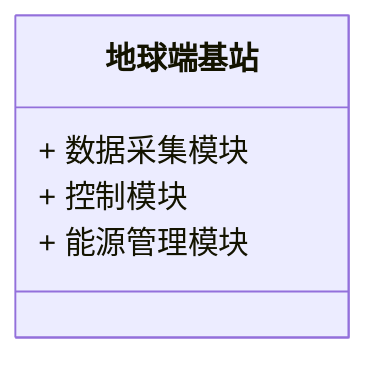

                 

# 价值投资中的太空电梯技术发展前景

## 关键词
太空电梯，价值投资，技术分析，投资模型，商业航天

## 摘要
太空电梯技术作为一种革命性的航天技术，正在逐步从概念走向现实。本文通过分析太空电梯技术的核心原理、市场潜力以及投资价值，构建了一个基于技术评估和市场分析的太空电梯投资模型。文章详细探讨了太空电梯技术的关键技术特征、投资评估指标以及未来发展趋势，为投资者提供了科学的决策参考。

---

# 第1章 太空电梯技术的背景与定义

## 1.1 太空电梯技术的起源与发展

### 1.1.1 太空电梯技术的历史背景
太空电梯的概念最早可以追溯到19世纪末，由俄罗斯科学家Konstantin Tsiolkovsky首次提出。真正意义上的太空电梯技术研究始于20世纪60年代，随着材料科学的进步，太空电梯的技术可行性逐渐得到验证。

$$
\text{太空电梯的起源可以追溯到1895年，Tsiolkovsky在《The Exploration of Cosmic Space by Means of Rocket Devices》中首次提出相关概念。}
$$

### 1.1.2 太空电梯技术的核心概念
太空电梯是一种通过长绳连接地球表面和地球同步轨道的空间站，利用地球自转产生的离心力，实现人员和货物的低能耗运输。其核心特征包括：
- **超长绳索**：使用高强度材料（如碳纳米管）制造，长度可达数万公里。
- **可重复使用**：太空电梯可以多次运输，降低发射成本。
- **低能耗**：相比传统火箭发射，太空电梯的能源消耗大幅降低。

### 1.1.3 太空电梯技术的现状与未来展望
目前，太空电梯技术仍处于研发阶段，但已有多个国家和企业（如美国、日本、俄罗斯）在该领域展开竞争。未来，随着材料科学和能源技术的进步，太空电梯有望成为航天运输的重要方式。

---

## 1.2 价值投资与太空电梯技术的结合

### 1.2.1 价值投资的基本概念
价值投资是一种投资策略，强调以低于内在价值的价格买入优质资产。其核心在于分析企业的基本面，寻找被市场低估的投资机会。

### 1.2.2 太空电梯技术在投资中的潜力
太空电梯技术的商业化将显著降低太空运输成本，推动卫星发射、太空资源开发等领域的发展。这将为相关企业带来巨大的市场空间和盈利能力。

### 1.2.3 价值投资与太空电梯技术的结合方式
- **技术评估**：分析太空电梯技术的成熟度、成本优势以及商业化潜力。
- **市场分析**：评估太空电梯技术的市场需求和竞争环境。
- **财务分析**：通过财务指标（如ROE、毛利率）判断企业的盈利能力。

---

## 1.3 太空电梯技术的核心原理

### 1.3.1 太空电梯的基本结构与功能
太空电梯主要由以下部分组成：
- **地球端**：连接地球表面的基站。
- **太空端**：位于地球同步轨道的空间站。
- **绳索**：连接地球端和太空端的长绳，提供运输通道。

### 1.3.2 太空电梯的技术难点与解决方案
- **材料强度**：需要使用高强度材料（如碳纳米管）以承受巨大的拉力。
- **稳定性控制**：通过精确的控制算法保持绳索的稳定性。
- **能源供应**：采用太阳能等可再生能源为电梯提供动力。

### 1.3.3 太空电梯的技术发展趋势
- **材料创新**：开发更轻、更强的材料。
- **智能化控制**：引入人工智能技术优化电梯运行。
- **商业化应用**：逐步实现太空电梯的商业化运营。

---

## 1.4 价值投资中的太空电梯技术分析框架

### 1.4.1 技术分析在价值投资中的作用
技术分析帮助投资者评估企业的技术优势、研发能力和市场竞争力。对于太空电梯技术，技术分析的重点在于其技术成熟度和商业化潜力。

### 1.4.2 太空电梯技术的市场分析方法
- **市场规模**：评估太空电梯技术的潜在市场容量。
- **竞争格局**：分析行业内主要竞争对手的技术和市场地位。
- **政策环境**：研究政府政策对太空电梯技术发展的支持。

### 1.4.3 价值投资中的技术评估指标
- **技术壁垒**：企业的技术专利数量和核心技术优势。
- **成本优势**：技术带来的成本降低幅度。
- **市场潜力**：技术在市场中的应用前景。

---

## 1.5 本章小结
本章详细介绍了太空电梯技术的背景、核心概念以及其与价值投资的结合方式。通过分析太空电梯的技术特征和市场潜力，为后续的投资分析奠定了基础。

---

# 第2章 太空电梯技术的核心概念与联系

## 2.1 太空电梯技术的核心原理

### 2.1.1 太空电梯的技术架构
太空电梯的技术架构可以分为以下几个部分：
1. **地球端基站**：负责电梯的起始点和控制中心。
2. **太空端空间站**：位于地球同步轨道，作为电梯的终点。
3. **绳索系统**：连接基站和空间站，提供运输通道。
4. **运输舱**：用于人员和货物的运输。

### 2.1.2 太空电梯的关键技术特点
- **轻量化设计**：使用高强度、低密度的材料。
- **智能化控制**：通过AI算法实现精确控制。
- **可扩展性**：支持未来的扩展和升级。

---

## 2.2 太空电梯技术与投资价值的关系

### 2.2.1 技术进步对投资价值的影响
技术进步可以显著降低太空运输成本，提高企业的利润率。例如，如果某企业成功研发出更高效的电梯系统，其市场竞争力将大幅增强。

### 2.2.2 太空电梯技术的市场潜力分析
随着太空探索的升温，市场对低成本运输的需求日益增加。太空电梯技术的商业化将为企业带来巨大的市场机会。

### 2.2.3 太空电梯技术的商业化前景
- **卫星发射**：太空电梯可以大幅降低卫星发射成本。
- **太空资源开发**：支持月球和火星基地的建设。
- **太空旅游**：为游客提供低成本的太空旅行方式。

---

## 2.3 太空电梯技术的核心概念对比

### 2.3.1 不同太空电梯技术的对比分析
目前，多个企业和机构在研发不同的太空电梯技术。例如：
- **美国的SpaceX**：专注于 reusable rockets，但也在探索太空电梯技术。
- **日本的Obayashi Corporation**：提出了基于碳纳米管的太空电梯计划。

### 2.3.2 太空电梯技术与传统航天技术的对比
- **成本**：太空电梯的运输成本远低于传统火箭。
- **效率**：太空电梯可以实现常态化运输，而火箭发射频率较低。
- **安全性**：太空电梯的风险更低。

### 2.3.3 太空电梯技术的未来发展路径
- **基础研究**：继续改进材料和控制技术。
- **实验验证**：开展小规模试验，验证技术可行性。
- **商业化应用**：逐步实现太空电梯的商业化运营。

---

## 2.4 本章小结
本章通过对比分析不同太空电梯技术的特点和市场潜力，探讨了其对投资价值的影响。未来，随着技术的成熟，太空电梯将成为航天领域的重要组成部分。

---

# 第3章 太空电梯技术的算法原理与数学模型

## 3.1 太空电梯技术的算法原理

### 3.1.1 太空电梯技术的核心算法
太空电梯的运行需要复杂的算法支持，包括：
- **稳定性控制算法**：确保绳索的稳定性。
- **路径规划算法**：优化电梯的运行路径。
- **能量管理算法**：合理分配能源。

### 3.1.2 太空电梯技术的优化算法
通过优化算法可以提高电梯的运行效率和安全性。例如，使用遗传算法优化电梯的控制参数。

### 3.1.3 太空电梯技术的模拟算法
通过模拟算法可以预测电梯在不同条件下的表现。例如，使用蒙特卡洛模拟分析电梯的运行风险。

---

## 3.2 太空电梯技术的数学模型

### 3.2.1 太空电梯技术的基本数学公式
电梯的运行需要考虑以下几个关键参数：
- **绳索张力**：$T = \frac{F}{A}$
- **加速度**：$a = \frac{F}{m}$
- **运行时间**：$t = \frac{d}{v}$

### 3.2.2 太空电梯技术的优化模型
优化模型的目标是最大化电梯的运行效率。例如，使用线性规划模型优化电梯的运行参数。

### 3.2.3 太空电梯技术的仿真模型
仿真模型可以帮助研究人员预测电梯的运行表现。例如，使用MATLAB进行电梯的动态仿真。

---

## 3.3 算法与数学模型的实际应用

### 3.3.1 算法在太空电梯技术中的应用案例
例如，SpaceX使用优化算法降低火箭发射成本。

### 3.3.2 数学模型在太空电梯技术中的应用案例
例如，日本的Obayashi Corporation使用仿真模型验证太空电梯的可行性。

### 3.3.3 算法与数学模型的对比分析
- **算法**：更注重运行过程的优化。
- **数学模型**：更注重系统的整体表现。

---

## 3.4 本章小结
本章详细介绍了太空电梯技术的算法原理和数学模型，为后续的技术分析奠定了基础。

---

# 第4章 太空电梯技术的系统分析与架构设计

## 4.1 系统分析与设计的基本概念

### 4.1.1 系统分析的定义与作用
系统分析是指对系统的各个部分进行详细研究，以确定其功能和相互关系。

### 4.1.2 系统设计的定义与作用
系统设计是根据系统分析的结果，设计系统的结构和功能。

---

## 4.2 太空电梯技术的系统架构设计

### 4.2.1 太空电梯技术的系统架构图

### 4.2.2 太空电梯技术的模块划分
- **数据采集模块**：采集电梯运行数据。
- **控制模块**：实现电梯的精确控制。
- **能源管理模块**：管理电梯的能源供应。

### 4.2.3 太空电梯技术的系统架构图

---

## 4.3 太空电梯技术的系统功能设计

### 4.3.1 系统功能需求
- **数据采集**：实时采集电梯运行数据。
- **控制**：实现电梯的精确控制。
- **能源管理**：优化能源使用效率。

### 4.3.2 系统功能设计图

---

## 4.4 本章小结
本章通过系统分析和架构设计，为太空电梯技术的实现提供了理论支持。

---

# 第5章 项目实战：基于太空电梯技术的投资分析

## 5.1 项目背景介绍

### 5.1.1 项目目标
分析某家太空电梯技术企业的投资价值。

### 5.1.2 项目需求
评估企业的技术优势、市场潜力和财务状况。

---

## 5.2 系统核心实现

### 5.2.1 技术评估指标
- **技术成熟度**：企业的技术专利数量。
- **成本优势**：技术带来的成本降低幅度。
- **市场潜力**：技术在市场中的应用前景。

### 5.2.2 投资评估模型
$$
\text{投资价值} = \text{技术评估} \times \text{市场潜力} \times \text{财务状况}
$$

---

## 5.3 实际案例分析

### 5.3.1 案例选择
选择某家太空电梯技术企业作为分析对象。

### 5.3.2 数据采集
收集企业的财务数据、技术专利和市场信息。

### 5.3.3 数据分析
- **财务分析**：计算企业的ROE、毛利率等指标。
- **技术分析**：评估企业的技术优势。
- **市场分析**：预测企业的市场潜力。

### 5.3.4 投资建议
根据分析结果，给出投资建议。

---

## 5.4 本章小结
本章通过实际案例分析，展示了如何基于太空电梯技术进行投资分析。

---

# 作者

作者：AI天才研究院/AI Genius Institute & 禅与计算机程序设计艺术 /Zen And The Art of Computer Programming

