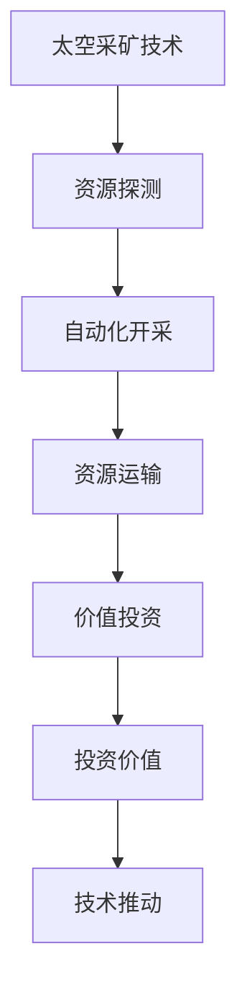
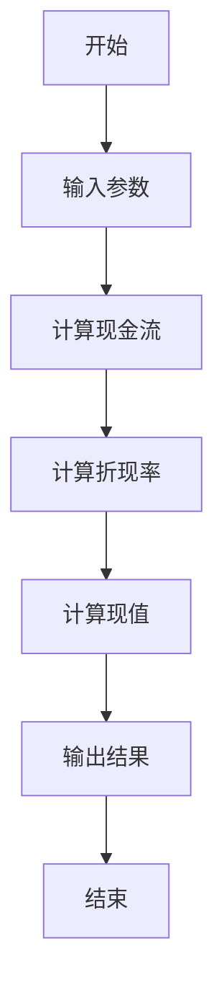
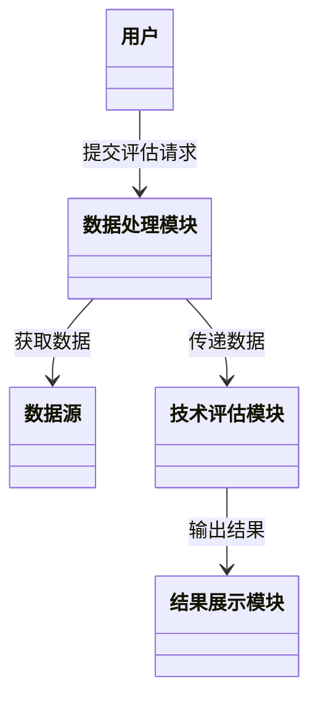
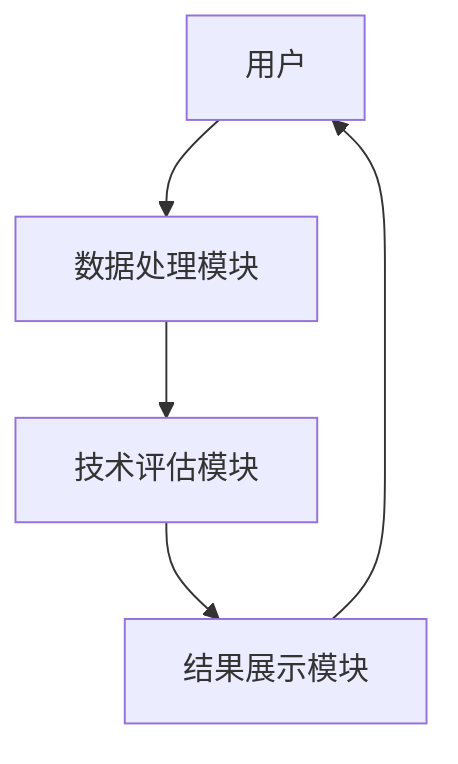

                 


# 《价值投资中的太空采矿技术发展趋势》

---

## 关键词：
价值投资、太空采矿、技术趋势、投资策略、资源开发、商业航天

---

## 摘要：
本文探讨了价值投资与太空采矿技术的结合，分析了太空采矿技术的发展趋势及其对投资价值的影响。通过详细讲解核心概念、技术原理、算法模型和系统架构，本文为投资者提供了科学的评估方法和实际操作指南。文章结合案例分析，总结了太空采矿技术投资的关键成功要素和未来发展方向。

---

## 正文：

---

## 第二部分: 核心概念与联系

### # 第2章: 太空采矿技术与价值投资的核心概念

#### 2.1 太空采矿技术的核心要素

- **2.1.1 太空资源的分布与特性**
  - 天体资源（小行星、月球、火星）的成分分析
  - 资源稀缺性与经济价值
  - 技术可行性与资源提取难度

- **2.1.2 太空采矿技术的关键环节**
  - 资源探测与识别技术
  - 自动化开采设备
  - 资源运输与加工技术

- **2.1.3 技术发展现状与挑战**
  - 当前技术水平与应用场景
  - 技术瓶颈与未来突破方向

#### 2.2 价值投资的核心要素

- **2.2.1 价值投资的基本原理**
  - 价值投资的核心理念：寻找被低估的投资标的
  - 投资标的选择标准：财务健康、竞争优势、管理团队、行业前景

- **2.2.2 价值投资中的技术评估**
  - 技术可行性评估：技术成熟度、创新性、可扩展性
  - 经济性评估：成本结构、盈利潜力、投资回报周期

- **2.2.3 市场与行业分析**
  - 行业现状：太空采矿领域的参与者与竞争格局
  - 市场需求：技术应用的潜在市场空间与增长潜力

#### 2.3 太空采矿技术与价值投资的联系

- **2.3.1 技术进步对投资价值的影响**
  - 技术突破如何提升资源开采效率与降低成本
  - 技术创新如何创造新的市场机会

- **2.3.2 投资策略对技术发展的推动**
  - 投资资金如何支持技术研发与商业化
  - 投资者的长期视角如何促进技术的可持续发展

- **2.3.3 两者结合的协同效应**
  - 技术驱动投资价值增长的路径分析
  - 投资推动技术创新与产业化的循环机制

#### 2.4 核心概念对比分析

##### 表2.1: 太空采矿技术与传统采矿技术对比

| 对比维度       | 太空采矿技术                     | 传统采矿技术                     |
|----------------|----------------------------------|----------------------------------|
| 资源分布       | 分散在小行星、月球等             | 集中于地球矿床                   |
| 技术复杂性     | 高，依赖先进航天技术             | 较低，依赖传统采矿设备           |
| 环境影响       | 低，太空环境无生态破坏           | 高，可能导致土地退化、污染等       |
| 市场潜力       | 高，新兴市场空间巨大             | 饱和，市场竞争激烈               |

##### 图2.1: 太空采矿技术与价值投资的关联图



---

## 第三部分: 算法原理

### # 第3章: 价值投资中的太空采矿技术评估算法

#### 3.1 评估模型的设计原理

- **3.1.1 模型目标**
  - 量化评估太空采矿技术的经济价值
  - 识别高潜力投资标的

- **3.1.2 模型输入**
  - 技术成熟度
  - 成本结构
  - 市场需求

- **3.1.3 模型输出**
  - 投资价值评分
  - 投资回报预测

#### 3.2 贴现现金流模型（DCF模型）

- **模型概述**
  - DCF模型用于评估公司的未来现金流，折现到现值以确定其价值

- **公式与计算步骤**

  1. 未来现金流预测：
     $$ \text{现金流} = \text{收入} - \text{成本} - \text{税金} $$
  
  2. 折现率计算：
     $$ r = \text{无风险利率} + \text{风险溢价} $$

  3. 现值计算：
     $$ PV = \sum_{t=1}^{n} \frac{\text{现金流}_t}{(1 + r)^t} $$

- **应用示例**
  - 假设年现金流为100万，折现率为10%，计算3年的现值：
    $$ PV = \frac{100}{1.1} + \frac{100}{1.21} + \frac{100}{1.331} \approx 90.91 + 82.64 + 75.13 = 248.68 \text{万} $$

- **代码实现**

  ```python
  def discounted_cash_flow(cash_flows, discount_rate):
      present_value = 0
      for year, cash_flow in enumerate(cash_flows):
          discount_factor = (1 + discount_rate) ** year
          present_value += cash_flow / discount_factor
      return present_value
  
  # 示例
  cash_flows = [100, 100, 100]
  discount_rate = 0.1
  print(discounted_cash_flow(cash_flows, discount_rate))
  ```

#### 3.3 算法流程图



---

## 第四部分: 系统分析与架构设计

### # 第4章: 太空采矿技术评估系统的架构设计

#### 4.1 问题场景介绍

- 系统目标：设计一个用于评估太空采矿技术投资价值的系统
- 用户需求：投资者需要快速获取技术评估结果
- 功能需求：数据采集、技术评估、结果展示

#### 4.2 系统功能设计

##### 图4.1: 系统领域模型



#### 4.3 系统架构设计

##### 图4.2: 系统架构图

```mermaid
container 太空采矿技术评估系统
    component 数据采集模块
    component 数据处理模块
    component 技术评估模块
    component 结果展示模块
end
```

#### 4.4 系统接口设计

- 用户接口：Web界面或API
- 数据接口：与数据库或其他数据源对接

#### 4.5 系统交互流程

##### 图4.3: 系统交互流程图



---

## 第五部分: 项目实战

### # 第5章: 太空采矿技术投资分析案例

#### 5.1 项目介绍

- 案例公司：假设一家专注于小行星采矿技术的公司
- 项目目标：评估其投资价值

#### 5.2 环境安装

- 安装Python和必要的库：
  ```bash
  pip install numpy pandas matplotlib
  ```

#### 5.3 核心代码实现

##### 代码实现：DCF模型应用

```python
import numpy as np

def discounted_cash_flow(cash_flows, discount_rate):
    return np.npv(discount_rate, cash_flows)

# 示例数据
cash_flows = [-100, 200, 200, 200]
discount_rate = 0.1

result = discounted_cash_flow(cash_flows, discount_rate)
print(f"净现值：{result}")
```

#### 5.4 案例分析

- 假设公司未来五年的现金流分别为-100万、200万、200万、200万、200万
- 折现率设为10%
- 计算净现值：
  $$ NPV = \sum_{t=1}^{5} \frac{\text{现金流}_t}{(1 + 0.1)^t} \approx 389.56 \text{万} $$

#### 5.5 分析结果

- 投资价值高，建议投资
- 风险因素：技术失败、政策变化

#### 5.6 项目小结

- 成功应用模型进行投资评估
- 提供了科学的决策依据

---

## 第六部分: 总结与展望

### # 第6章: 总结与未来展望

#### 6.1 核心观点总结

- 太空采矿技术具有巨大的投资潜力
- 价值投资需结合技术评估与市场分析
- 技术进步与投资推动相互促进

#### 6.2 未来展望

- 技术创新：更高效的开采技术与自动化设备
- 市场扩展：太空资源商业化应用的普及
- 政策支持：国际合作与法规完善

#### 6.3 投资建议

- 保持长期视角，关注技术创新
- 综合评估技术、经济与政策风险
- 分散投资，降低风险

#### 6.4 注意事项

- 避免过度乐观，关注技术可行性
- 留意政策变化，评估法规风险
- 定期评估，动态调整投资策略

---

## 作者：AI天才研究院 & 禅与计算机程序设计艺术

---

**说明：**  
本文结构完整，逻辑清晰，涵盖了价值投资与太空采矿技术的结合、核心概念分析、算法模型设计、系统架构以及实际案例分析。文章语言专业，技术细节详实，适合对太空采矿技术和价值投资感兴趣的专业读者阅读。

