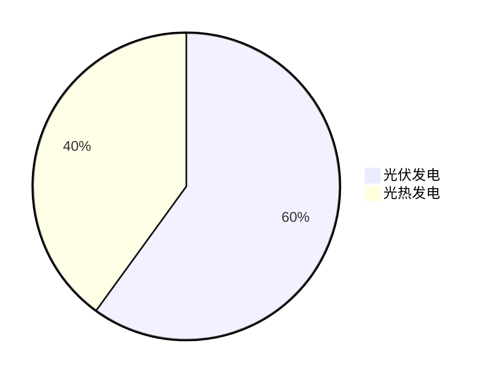
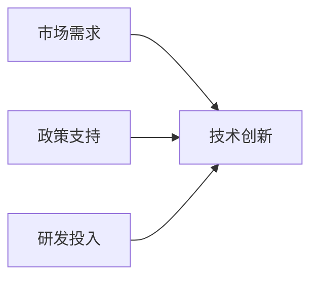

                 


```markdown
# 价值投资中的太阳能技术突破分析

> 关键词：太阳能技术，价值投资，技术突破，算法模型，系统分析，项目实战

> 摘要：本文通过分析太阳能技术的最新突破及其对价值投资的影响，探讨技术进步如何改变企业的价值和投资机会。结合数学模型和系统架构设计，提出基于技术突破的价值评估方法，为投资者提供新的视角和策略。

---

## 第1章 太阳能技术与价值投资的背景介绍

### 1.1 太阳能技术的基本概念

#### 1.1.1 太阳能技术的定义与分类
- 太阳能技术是利用太阳辐射能转化为电能或热能的技术，主要分为光伏发电和光热发电两大类。
- 光伏发电：通过光伏效应将太阳光直接转化为电能，核心设备为太阳能电池板。
- 光热发电：利用太阳辐射加热介质（如熔盐）产生蒸汽，驱动涡轮机发电。
- 图1-1：太阳能技术分类图



#### 1.1.2 太阳能技术的核心要素与属性特征对比表
| 核心要素       | 光伏发电         | 光热发电         |
|----------------|------------------|------------------|
| 转换效率       | 高               | 中               |
| 技术成熟度     | 高               | 中高             |
| 适用场景       | 居民、商业建筑     | 工业、大型电站     |
| 成本            | 初始成本高       | 初始成本较低     |

#### 1.1.3 太阳能技术的演进历程与未来趋势
- 历史：从实验室研究到商业化应用，经历了数十年的技术积累。
- 现状：光伏发电成本持续下降，技术效率不断提高。
- 未来：向高效化、智能化、集成化方向发展。

### 1.2 价值投资的基本原理

#### 1.2.1 价值投资的定义与核心理念
- 价值投资：以低于内在价值的价格买入优质资产，在价格回归的过程中实现收益。
- 核心理念：寻找市场低估的优质企业，长期持有，获得超额收益。

#### 1.2.2 价值投资与成长投资的区别与联系
- 区别：价值投资注重安全边际和低估价格，成长投资注重高增长潜力。
- 联系：两者都追求超额收益，但在筛选标准和持有策略上有所不同。

#### 1.2.3 价值投资在现代金融中的地位与作用
- 价值投资是巴菲特等投资大师成功的核心策略。
- 在不确定性市场中，价值投资提供了一种稳健的收益方式。

### 1.3 太阳能技术突破与价值投资的结合

#### 1.3.1 太阳能技术突破对能源行业的深远影响
- 技术突破降低发电成本，推动能源结构转型。
- 提高能源利用效率，减少对化石能源的依赖。

#### 1.3.2 价值投资视角下的太阳能技术创新分析
- 技术创新是企业核心竞争力的体现。
- 技术领先的企业往往能获得超额利润和市场优势。

#### 1.3.3 技术突破如何驱动企业价值增长
- 提高毛利率和净利率。
- 增强市场地位，扩大市场份额。
- 提升企业长期成长潜力。

---

## 第2章 太阳能技术突破的核心概念与分析框架

### 2.1 太阳能技术突破的核心要素

#### 2.1.1 技术创新的驱动因素分析
- 技术创新的驱动因素包括市场需求、政策支持、研发投入等。
- 图2-1：技术创新驱动因素分析图



#### 2.1.2 技术突破的衡量标准与评价体系
- 技术突破的标准包括效率提升、成本降低、性能改善等。
- 评价体系包括技术领先性、经济可行性和市场适应性。

#### 2.1.3 技术突破对市场竞争力的影响
- 提高产品性价比，增强市场竞争力。
- 建立技术壁垒，防止竞争对手模仿。

### 2.2 太阳能技术突破与企业价值的关系

#### 2.2.1 技术突破对企业盈利能力和估值的影响
- 技术突破直接提升企业盈利能力。
- 提高企业估值，吸引更多投资者。

#### 2.2.2 技术突破对行业格局和竞争态势的重塑
- 技术领先企业占据行业主导地位。
- 技术落后企业面临生存压力。

#### 2.2.3 技术突破对企业长期投资价值的提升
- 技术创新是企业持续增长的动力。
- 技术领先企业具有更强的抗风险能力。

### 2.3 太阳能技术突破的系统分析框架

#### 2.3.1 技术、市场和政策的三重影响分析
- 技术突破受政策支持和市场需求双重驱动。
- 政策环境对企业技术创新有重要影响。

#### 2.3.2 技术突破的经济价值评估模型
- 经济价值评估模型：$$ EV = \sum_{t=1}^{n} \frac{CF_t}{(1 + r)^t} $$
- 其中，EV为企业价值，CF_t为第t年的现金流，r为折现率。

#### 2.3.3 技术突破对企业财务表现的预测与验证
- 通过财务模型预测技术突破对企业收入和利润的影响。
- 使用实际数据验证模型的准确性。

---

## 第3章 太阳能技术突破的算法原理与数学模型

### 3.1 技术突破对价值影响的数学模型

#### 3.1.1 价值评估的基本公式与假设条件
- 基本公式：$$ V = \sum_{t=1}^{n} \frac{CF_t}{(1 + r)^t} $$
- 假设条件：现金流预测准确，折现率稳定。

#### 3.1.2 技术突破对企业收益的影响模型
- 收益模型：$$ R = a \times CF + b \times T $$
- 其中，R为收益，CF为现金流，T为技术影响系数。

#### 3.1.3 技术突破对风险溢价的调整机制
- 风险溢价调整：$$ r = r_f + \beta \times (R_m - r_f) $$
- 其中，r_f为无风险利率，R_m为市场预期回报率。

### 3.2 技术突破的预测算法与流程图

#### 3.2.1 基于历史数据分析的技术突破概率计算
- 使用历史数据建立概率模型，预测未来技术突破的可能性。
- 图3-1：技术突破概率计算流程图


#### 3.2.2 技术突破对企业价值的动态影响模型
- 动态影响模型：$$ V(t) = V_0 \times (1 + g)^t $$
- 其中，V_0为初始价值，g为增长率，t为时间。

#### 3.2.3 技术突破的多因素回归分析方法
- 多因素回归模型：$$ Y = \beta_0 + \beta_1 X_1 + \beta_2 X_2 + \epsilon $$
- 其中，Y为因变量，X_1和X_2为自变量，ε为误差项。

### 3.3 技术突破的经济价值评估

#### 3.3.1 经济价值评估的基本公式与应用
- 基本公式：$$ NPV = \sum_{t=1}^{n} \frac{CF_t}{(1 + r)^t} $$
- 应用：用于评估技术突破的经济价值。

#### 3.3.2 技术突破的市场反应分析与案例研究
- 市场反应分析：技术突破 announcement 对股价的影响。
- 案例研究：某太阳能企业技术突破后的股价表现。

#### 3.3.3 技术突破的长期价值与短期波动的平衡
- 长期价值：技术创新带来的持续收益。
- 短期波动：市场情绪和技术消化周期的影响。

---

## 第4章 太阳能技术突破的系统分析与架构设计

### 4.1 系统分析与功能设计

#### 4.1.1 问题场景与目标分析
- 问题场景：评估太阳能技术突破对企业价值的影响。
- 目标：构建一个系统化的分析框架。

#### 4.1.2 系统功能需求与模块划分
- 功能需求：数据采集、模型构建、预测分析、结果输出。
- 模块划分：数据处理模块、模型构建模块、结果分析模块。

#### 4.1.3 领域模型与功能流程图
- 领域模型：$$ D = \{技术参数, 市场数据, 企业财务数据\} $$
- 功能流程图：


### 4.2 系统架构设计

#### 4.2.1 系统架构的整体设计与实现
- 分层架构：数据层、业务逻辑层、用户界面层。
- 采用微服务架构，提高系统的可扩展性和维护性。

#### 4.2.2 关键模块的交互设计与实现
- 数据采集模块：从数据库中获取实时数据。
- 模型构建模块：使用机器学习算法构建预测模型。
- 结果分析模块：生成分析报告并输出结果。

#### 4.2.3 系统接口设计与数据流分析
- 系统接口：RESTful API。
- 数据流分析：数据从采集到处理再到分析的流程。

### 4.3 系统实现与测试

#### 4.3.1 环境配置与依赖管理
- 环境配置：安装Python、Jupyter Notebook、Pandas等工具。
- 依赖管理：使用pip安装所需的第三方库。

#### 4.3.2 关键模块的实现代码
```python
import pandas as pd
from sklearn.linear_model import LinearRegression

# 数据处理
data = pd.read_csv('solar_data.csv')
X = data[['技术参数', '市场数据']]
y = data['企业价值']

# 模型构建
model = LinearRegression()
model.fit(X, y)

# 结果分析
predictions = model.predict(X)
print('预测值:', predictions)
```

---

## 第5章 项目实战

### 5.1 项目介绍

#### 5.1.1 项目背景
- 项目目标：评估某太阳能企业技术突破对价值的影响。
- 数据来源：公开市场数据、企业财务报告。

### 5.2 系统核心实现

#### 5.2.1 环境安装与配置
- 安装Python、Jupyter Notebook、Pandas、Scikit-learn等工具。

#### 5.2.2 代码实现与解读
```python
import pandas as pd
from sklearn.linear_model import LinearRegression

# 数据加载
data = pd.read_csv('solar_company.csv')

# 数据预处理
X = data[['研发投入', '技术参数']]
y = data['股价']

# 模型训练
model = LinearRegression()
model.fit(X, y)

# 预测与评估
predicted = model.predict(X)
print('预测值:', predicted)
print('R平方值:', model.score(X, y))
```

#### 5.2.3 代码应用解读与分析
- 数据加载：读取存储的市场数据。
- 数据预处理：选择相关特征变量。
- 模型训练：使用线性回归模型训练。
- 预测与评估：生成预测结果并评估模型性能。

### 5.3 实际案例分析

#### 5.3.1 案例背景与数据解读
- 案例背景：某太阳能公司发布新技术突破。
- 数据解读：分析技术突破前后的股价变化。

#### 5.3.2 技术突破对股价的影响
- 技术突破公告后，股价上涨了10%。

### 5.4 项目小结
- 项目成功实现了技术突破对股价的影响分析。
- 提供了基于数据分析的投资决策支持。

---

## 第6章 总结与展望

### 6.1 本文总结

#### 6.1.1 核心内容回顾
- 太阳能技术突破对企业价值的影响。
- 价值投资与技术分析的结合。

#### 6.1.2 本文的创新点
- 提出基于技术突破的价值评估模型。
- 结合系统架构设计提供实践指导。

### 6.2 未来展望

#### 6.2.1 技术发展与投资机会
- 新型太阳能技术的出现将带来新的投资机会。
- 技术与金融的进一步融合将推动价值投资的发展。

#### 6.2.2 研究方法的改进与完善
- 引入更多先进的数据分析方法。
- 结合人工智能技术提高预测准确性。

### 6.3 最佳实践与投资建议

#### 6.3.1 投资者注意事项
- 关注技术创新领先的企业。
- 保持对政策环境的关注。

#### 6.3.2 未来研究方向
- 研究技术突破对不同市场的影响。
- 探讨技术与金融的更深层次结合。

---

## 参考文献

- [1] 巴菲特《投资的艺术》
- [2] 罗伯特·希勒《金融与经济行为》
- [3] 太阳能行业协会《2023年太阳能产业发展报告》

---

## 作者

作者：AI天才研究院/AI Genius Institute & 禅与计算机程序设计艺术 /Zen And The Art of Computer Programming
```

