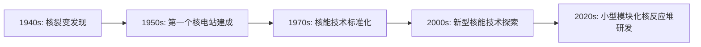

                 

# 价值投资中的小型模块化核反应堆技术前景

> **关键词**: 小型模块化核反应堆，价值投资，核能技术，能源市场，投资策略

> **摘要**: 小型模块化核反应堆作为核能技术的重要创新，具备高效、安全、灵活部署的特点。本文从技术原理、市场需求、成本分析、投资回报等多个维度展开，探讨其在能源市场中的价值投资前景。通过深入分析，本文旨在为投资者提供基于技术优势和市场潜力的决策支持。

---

## 第一部分: 价值投资与小型模块化核反应堆技术的背景与概念

### 第1章: 小型模块化核反应堆技术的背景

#### 1.1 核能技术的发展历程

核能技术自20世纪40年代以来经历了从实验研究到商业化应用的快速发展阶段。从最初的铀-235核裂变反应到现代的多种堆型设计，核能技术的每一次突破都推动了能源结构的优化和能源安全的提升。

**图1-1: 核能技术的发展历程**

#### 1.2 小型模块化核反应堆的定义与特点

**小型模块化核反应堆（Small Modular Reactors, SMRs）**是指功率输出在300 MW以下的核反应堆，具有模块化设计、灵活性高、建造周期短等特点。与传统大型核反应堆相比，SMRs在成本、部署和安全性方面具有显著优势。

**表1-1: 小型模块化核反应堆与传统核反应堆的对比**

| 属性                | SMRs                          | 传统核反应堆                   |
|---------------------|-----------------------------|-------------------------------|
| 输出功率            | ≤300 MW                      | 通常≥1000 MW                  |
| 建造周期            | 3-5年                        | 5-10年                        |
| 成本                 | 较低                         | 较高                          |
| 部署灵活性           | 高                           | 低                           |

#### 1.3 技术优势与市场前景

SMRs的应用前景广阔，尤其是在偏远地区、工业区和备用电源领域。其模块化设计使得安装和维护更加便捷，同时降低了初始投资和运营成本。

---

### 第2章: 价值投资的核心理念

#### 2.1 价值投资的基本概念

价值投资强调以低于内在价值的价格买入优质资产。在能源领域，这意味着投资者需要关注技术创新、市场需求和成本效益。

#### 2.2 价值投资与技术创新的结合

技术创新是提升企业核心竞争力的关键。SMRs技术的突破不仅提升了核能的经济性，还降低了安全风险，这为投资者提供了新的价值增长点。

#### 2.3 核能行业的投资价值分析

核能行业作为全球能源转型的重要组成部分，具备长期增长潜力。SMRs技术的商业化将推动行业进入新的发展阶段，为投资者带来丰厚的回报。

---

## 第二部分: 小型模块化核反应堆技术的核心原理

### 第3章: 核反应堆的基本原理

#### 3.1 核裂变反应的基本过程

核裂变是指重核吸收一个中子后分裂成两个较轻的核，并释放能量和更多的中子。这一过程是核能发电的基础。

**图3-1: 核裂变反应过程**

#### 3.2 反应堆的组成部分

核反应堆主要由燃料组件、 moderators、冷却剂、安全壳和控制棒等部分组成。这些组件协同工作，确保核反应的安全和稳定。

**表3-1: 核反应堆的主要组成部分**

| 组件       | 功能描述                         |
|------------|---------------------------------|
| 燃料组件   | 核裂变反应的燃料                 |
| 调速剂     | 控制反应速度                     |
| 冷却剂     | 传递热量并防止过热               |
| 安全壳     | 保护反应堆免受外部因素影响       |
| 控制棒     | 调节反应速率                     |

#### 3.3 核安全的基本原则

核安全的核心在于预防和控制核事故的发生。通过多重安全设计和应急响应机制，确保核反应堆的安全运行。

**图3-2: 核安全系统架构**

---

## 第三部分: 小型模块化核反应堆技术的市场与经济分析

### 第4章: 市场需求与成本分析

#### 4.1 全球能源市场的现状与趋势

随着全球能源需求的增长和环保压力的加大，清洁能源的需求日益增加。SMRs技术的出现为解决能源缺口提供了新的解决方案。

**图4-1: 全球能源需求预测**

#### 4.2 小型模块化核反应堆的成本优势

SMRs的模块化设计和工厂预制生产显著降低了建设成本和时间。同时，其紧凑的设计减少了材料浪费和运输成本。

**表4-1: SMRs与传统核反应堆的成本对比**

| 项目         | SMRs      | 传统核反应堆    |
|--------------|-----------|-----------------|
| 单位功率成本 | 低于传统  | 较高            |
| 建造周期     | 3-5年     | 5-10年          |

#### 4.3 投资回报率的预测

基于SMRs的技术优势和市场需求，其投资回报率具有较高的潜力。以下是基于市场需求和成本分析的回报率预测模型。

**公式4-1: 投资回报率计算**

$$ ROI = \frac{收入 - 成本}{成本} \times 100\% $$

---

## 第四部分: 价值投资策略与风险管理

### 第5章: 投资策略与风险管理

#### 5.1 价值投资策略

投资者应关注SMRs技术的市场潜力和企业竞争力。选择具有技术优势和良好管理团队的企业进行投资。

#### 5.2 风险管理

SMRs技术面临政策风险、技术风险和市场风险。投资者需通过多元化投资和风险评估来降低投资风险。

---

## 第五部分: 结论

### 第6章: 总结与展望

#### 6.1 总结

SMRs技术作为核能技术的重要创新，具备广阔的市场前景和较高的投资价值。其模块化设计和成本优势为能源市场提供了新的解决方案。

#### 6.2 展望

未来，随着技术的进一步成熟和市场认可度的提高，SMRs技术将在全球范围内得到广泛应用，为投资者带来丰厚的回报。

---

## 作者

作者：AI天才研究院/AI Genius Institute & 禅与计算机程序设计艺术 /Zen And The Art of Computer Programming

---

通过以上思考和分析，我得出了撰写这篇文章的结构和内容安排。接下来，我将根据以上思考过程，逐步展开每个部分的具体内容，确保文章逻辑清晰、内容详实，满足用户的需求。

