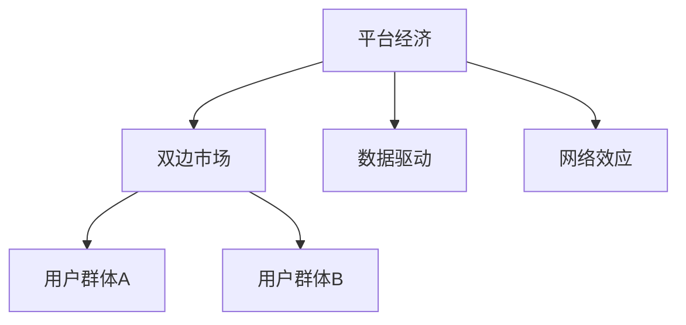

                 

# 价值投资中的平台经济分析

## 关键词：价值投资, 平台经济, 网络效应, 用户价值, 投资策略, 估值模型

## 摘要：  
平台经济作为数字经济的重要组成部分，正深刻改变着商业生态和投资模式。本文从价值投资的角度出发，系统分析平台经济的特征、竞争优势及估值方法，探讨如何在平台经济中发现投资机会，构建稳健的投资策略。文章结合实际案例，分析平台企业的商业模式、网络效应、用户增长及财务表现，为投资者提供深度的分析框架和实践指导。

---

## 第1章 引言

### 1.1 平台经济的定义与特征  
平台经济是一种通过技术手段连接供需双方的商业模式，具有以下核心特征：  
1. **双边市场**：平台同时服务两个或多个用户群体（如消费者和商家）。  
2. **网络效应**：用户数量增加会增强平台的整体价值。  
3. **数据驱动**：通过数据积累优化服务和决策。  
4. **轻资产模式**：依赖技术和用户资源，而非重资产投入。  

平台经济的典型例子包括电子商务（如亚马逊）、社交媒体（如Facebook）、搜索引擎（如谷歌）等。

### 1.2 价值投资的基本原理  
价值投资是一种以低于内在价值的价格买入优质资产的投资策略，核心理念包括：  
1. **安全边际**：买入价格应低于内在价值。  
2. **长期主义**：关注企业的长期盈利能力。  
3. **基本面分析**：通过财务指标、行业地位等评估企业价值。  

### 1.3 平台经济与价值投资的结合  
随着数字经济的快速发展，平台企业成为投资市场的焦点。然而，平台经济的特殊性（如网络效应、数据资产）也为价值投资带来了新的挑战和机遇。本文将从平台经济的特征出发，分析其对价值投资策略的影响。

---

## 第2章 平台经济的核心概念与分析框架

### 2.1 平台经济的特征分析  
平台经济的核心特征可以通过以下对比表格和Mermaid图进行分析：

| 特征 | 描述 | 与传统经济的对比 |
|------|------|----------------|
| 双边市场 | 平台连接多个用户群体 | 传统企业通常单边服务客户 |
| 网络效应 | 用户数量增加提升平台价值 | 传统企业增长主要依赖成本 |
| 数据驱动 | 平台通过数据优化服务 | 传统企业依赖经验和直觉 |

### 2.2 平台经济的核心要素  
平台经济的核心要素包括：  
1. **用户群体**：平台的价值取决于用户数量和活跃度。  
2. **数据资产**：数据是平台的核心资源，驱动创新和优化。  
3. **技术基础设施**：平台依赖技术架构支持用户交互和数据处理。  
4. **商业模式**：平台通过订阅、广告、交易佣金等方式盈利。  

### 2.3 平台经济的分析框架  
平台经济的分析框架包括：  
1. **网络效应分析**：评估用户增长的可持续性和平台粘性。  
2. **用户增长与留存分析**：通过用户增长率、留存率等指标评估平台的健康度。  
3. **收入模式与盈利潜力**：分析平台的收入来源和成本结构，预测盈利能力。  

---

## 第3章 价值投资的分析框架

### 3.1 价值投资的基本方法  
价值投资的基本方法包括：  
1. **基本面分析**：通过财务指标（如市盈率、市净率）评估企业内在价值。  
2. **竞争优势分析**：寻找具有护城河的企业。  
3. **安全边际分析**：确保买入价格低于内在价值。  

### 3.2 平台经济下的价值评估  
平台经济的估值模型需要考虑以下因素：  
1. **用户价值模型**：通过用户生命周期价值（CLV）评估平台的长期收益潜力。  
2. **网络效应模型**：通过网络效应的指数增长特性预测平台的扩张能力。  
3. **数据资产价值**：通过数据的变现能力评估平台的长期竞争优势。  

### 3.3 平台经济的财务分析  
平台企业的财务分析需要关注以下指标：  
1. **收入增长**：平台的收入是否快速增长且可持续。  
2. **用户留存率**：高留存率表明平台具有较强的用户粘性。  
3. **研发投入**：平台是否在技术研发上持续投入，保持竞争优势。  

---

## 第4章 平台经济下的投资策略

### 4.1 平台企业的竞争优势分析  
平台企业的竞争优势体现在：  
1. **市场地位**：是否是行业领导者或寡头之一。  
2. **网络效应**：用户数量和活跃度是否形成正反馈。  
3. **数据资产**：数据是否能够持续创造价值。  

### 4.2 平台企业的投资策略  
1. **长期投资**：关注平台企业的长期增长潜力。  
2. **风险控制**：通过分散投资和止损策略降低风险。  
3. **案例分析**：以亚马逊为例，分析其商业模式和投资价值。  

---

## 第5章 平台经济的投资风险管理

### 5.1 平台经济的波动性  
平台经济的高增长性和轻资产模式可能导致股价波动较大。投资者需关注市场情绪和政策变化对平台企业的影响。

### 5.2 平台经济的监管风险  
随着平台经济的快速发展，监管政策的变化可能对平台企业产生重大影响。投资者需关注行业监管动态，评估政策风险。

### 5.3 平台经济的财务风险  
平台企业的高研发投入和长回收期可能导致短期财务压力。投资者需关注企业的现金流和偿债能力。

---

## 第6章 总结与展望

### 6.1 总结  
本文从平台经济的特征出发，结合价值投资的分析框架，探讨了平台经济下的投资策略和风险管理。通过案例分析和理论探讨，为投资者提供了系统的分析工具。

### 6.2 展望  
随着技术进步和商业模式的创新，平台经济将继续改变投资模式。未来的研究可以关注新兴领域（如人工智能驱动的平台经济）和全球化背景下的平台企业投资机会。

---

## 作者：AI天才研究院/AI Genius Institute & 禅与计算机程序设计艺术/Zen And The Art of Computer Programming

