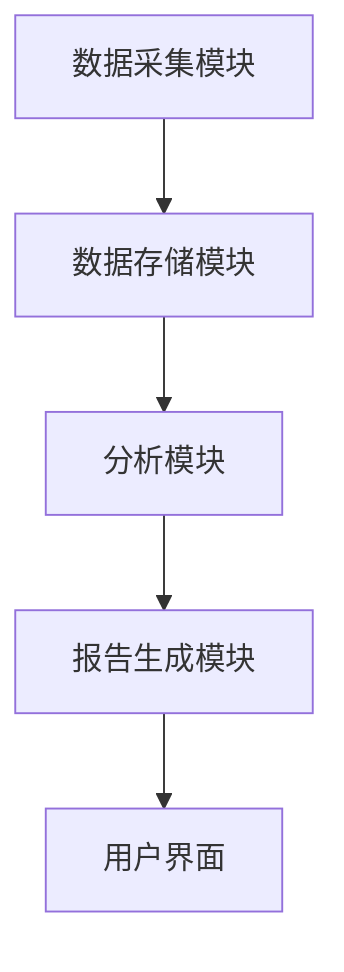

                 

# 《价值投资中的并购机会分析》

## 关键词：价值投资、并购分析、企业估值、协同效应、并购策略、DCF模型、EV/EBITDA

## 摘要：  
本书系统地探讨了价值投资中的并购机会分析方法，从并购的基本概念、内在逻辑到具体的估值模型和定价策略，结合实际案例和系统架构设计，为投资者提供了一套完整的并购分析框架。通过详细讲解现金流折现模型（DCF）、企业价值倍数（EV/EBITDA）等核心工具，本书帮助投资者识别和评估并购机会，创造价值。

---

## 第一部分：并购的基本概念与价值投资的背景

### 第1章：并购的基本概念

#### 1.1 并购的定义与类型

##### 1.1.1 并购的定义
并购（Mergers and Acquisitions, M&A）是指一家企业与其他企业合并或收购其资产、股权的行为。并购是企业扩张和优化资本结构的重要手段，通常通过收购或合并来实现。

##### 1.1.2 并购的主要类型
- **横向并购（Horizontal Mergers）**：同一行业内的企业并购，旨在扩大市场份额或提高效率。
- **纵向并购（Vertical Mergers）**：供应链上下游企业的并购，以整合生产流程。
- **混合并购（Mixed Mergers）**：不同行业之间的并购，通常基于多元化战略。

##### 1.1.3 并购在价值投资中的重要性
价值投资者通过分析并购机会，寻找被低估的企业，利用市场非理性定价带来的套利机会。并购能够创造协同效应，提升企业价值，是价值投资的重要策略之一。

#### 1.2 价值投资的基本原理

##### 1.2.1 价值投资的核心理念
价值投资强调以低于内在价值的价格买入优质企业，长期持有，获得超额收益。并购机会分析是识别低估企业的重要手段。

##### 1.2.2 市场先生与投资者的角色
市场先生比喻市场的波动性，投资者应利用市场的非理性定价，寻找低估的投资机会。并购市场中，市场先生的短期波动为价值投资者提供了长期盈利的机会。

##### 1.2.3 价值投资中的安全边际
安全边际是内在价值与市场价格的差额，确保在市场价格波动时，投资者仍能获得收益。并购分析中，寻找安全边际是价值投资的核心策略。

---

## 第二部分：并购的内在逻辑与分析框架

### 第2章：并购的内在逻辑

#### 2.1 并购如何创造价值

##### 2.1.1 协同效应的实现
协同效应是并购创造价值的关键，包括成本协同、收入协同和管理协同。例如，收购一家供应商可以降低采购成本，提升利润率。

##### 2.1.2 资源整合的优势
通过并购整合资源，企业可以优化资产配置，提升运营效率。例如，收购一家技术公司可以快速获取新技术，提升产品竞争力。

##### 2.1.3 并购中的成本优势分析
并购可以通过规模经济降低成本，或通过消除冗余部门提升效率。例如，两家竞争企业合并后，可以减少行政管理人员，降低管理成本。

#### 2.2 并购的协同效应分析

##### 2.2.1 财务协同效应
财务协同效应包括债务协同、税率优惠等。例如，收购一家税率较低的企业可以降低整体税负，提升净利润。

##### 2.2.2 经营协同效应
经营协同效应包括生产协同、销售协同等。例如，收购一家下游企业可以整合销售渠道，提升销售效率。

##### 2.2.3 战略协同效应
战略协同效应包括市场扩展、技术互补等。例如，收购一家海外企业可以快速进入新市场，提升全球竞争力。

### 第3章：并购分析框架

#### 3.1 并购前的准备工作

##### 3.1.1 目标公司的筛选标准
- 行业地位：选择行业龙头或具有竞争优势的企业。
- 财务健康：关注企业的盈利能力、资产负债率等财务指标。
- 管理层质量：管理层的愿景和战略能力是企业长期发展的关键。

##### 3.1.2 行业分析与竞争地位评估
行业分析包括市场规模、增长潜力、竞争结构等。评估目标企业的竞争地位，确保其具有竞争优势。

##### 3.1.3 财务健康状况分析
分析企业的财务报表，评估其盈利能力、现金流和债务情况。重点关注ROE、净利润率等指标。

#### 3.2 并购后的整合策略

##### 3.2.1 组织结构整合
优化组织结构，避免冗余，提升管理效率。例如，合并职能部门，减少管理层级。

##### 3.2.2 文化融合与团队整合
文化融合是并购成功的关键。通过团队融合，确保双方员工能够有效合作，提升企业凝聚力。

##### 3.2.3 业务流程整合
整合业务流程，优化运营效率。例如，统一采购、生产和销售流程，降低运营成本。

---

## 第三部分：并购的数学模型与估值方法

### 第4章：并购的估值模型

#### 4.1 现金流折现模型（DCF模型）

##### 4.1.1 DCF模型的基本原理
DCF模型通过预测未来现金流，折现到现值，评估企业的内在价值。公式如下：
$$
\text{企业价值} = \sum_{t=1}^{n} \frac{\text{自由现金流}_t}{(1 + r)^t} + \frac{\text{残值}}{(1 + r)^n}
$$
其中，r为折现率，n为预测期数。

##### 4.1.2 自由现金流的计算
自由现金流（FCF）= 经营活动现金流 - 资本支出。公式：
$$
\text{FCF} = \text{净利润} + \text{折旧与摊销} - \text{资本支出}
$$

##### 4.1.3 折现率的确定方法
折现率通常采用加权平均资本成本（WACC）计算，公式：
$$
\text{WACC} = w_d \times k_d + w_e \times k_e
$$
其中，\(w_d\)为债务权重，\(k_d\)为债务成本，\(w_e\)为股权权重，\(k_e\)为股权成本。

#### 4.2 企业价值倍数（EV/EBITDA）

##### 4.2.1 EV/EBITDA的定义与计算
EV/EBITDA = 企业价值 / 息税折旧及摊销前利润。公式：
$$
\text{EV/EBITDA} = \frac{\text{企业价值}}{\text{EBITDA}}
$$
其中，企业价值 = 市值 + 债务 - 现金。

##### 4.2.2 行业平均倍数的比较
比较目标公司与行业平均EV/EBITDA倍数，判断其估值是否合理。

##### 4.2.3 目标公司EV/EBITDA的合理性分析
目标公司EV/EBITDA应低于行业平均，表明其估值被低估。

### 第5章：并购定价策略

#### 5.1 并购定价的理论基础

##### 5.1.1 市场定价与内在价值的对比
市场定价受短期因素影响，内在价值基于长期基本面。价值投资者寻找市场定价低于内在价值的机会。

##### 5.1.2 并购中的定价博弈
并购双方通过讨价还价确定价格，目标公司价格应低于其内在价值。

##### 5.1.3 并购溢价的合理区间
合理溢价通常在10%-20%之间，超过30%可能过高，存在风险。

#### 5.2 并购中的价值发现

##### 5.2.1 寻找低估企业的标准
- 市盈率（P/E）低于行业平均。
- 市净率（P/B）低于行业平均。
- EV/EBITDA低于行业平均。

##### 5.2.2 分析公司财务报表的关键指标
- 净利润率：衡量盈利能力。
- 资产负债率：衡量财务风险。
- 现金流量：衡量流动性。

##### 5.2.3 评估管理层能力和战略意图
管理层能力优秀，战略清晰，企业具有长期增长潜力。

---

## 第四部分：并购的系统分析与架构设计

### 第6章：并购机会分析系统

#### 6.1 系统架构概述

##### 6.1.1 系统目标与范围
系统旨在帮助投资者分析并购机会，评估企业价值，提供投资决策支持。

##### 6.1.2 系统模块划分
- 数据采集模块：收集企业财务数据、行业信息。
- 分析模块：包括DCF模型、EV/EBITDA分析。
- 报告生成模块：生成并购分析报告，提供投资建议。

##### 6.1.3 系统架构的Mermaid图示

---

## 小结

本书系统地分析了价值投资中的并购机会，从基本概念到数学模型，再到实际应用，为投资者提供了全面的并购分析框架。通过DCF模型和EV/EBITDA分析，投资者可以准确评估企业价值，寻找低估机会，实现超额收益。并购分析需要综合考虑财务、经营和战略因素，确保投资决策的科学性和有效性。

---

## 作者

作者：AI天才研究院/AI Genius Institute & 禅与计算机程序设计艺术 /Zen And The Art of Computer Programming

---

感谢您的阅读！希望本书能为您的投资决策提供有价值的参考。

