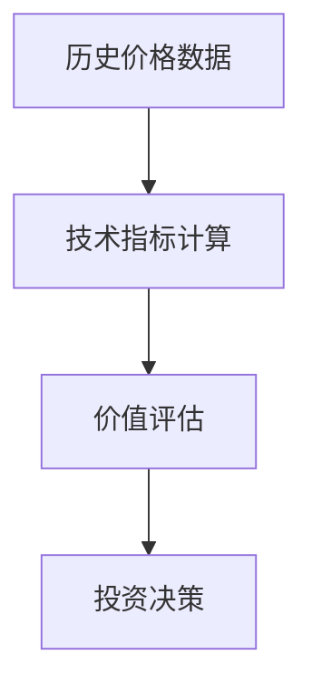
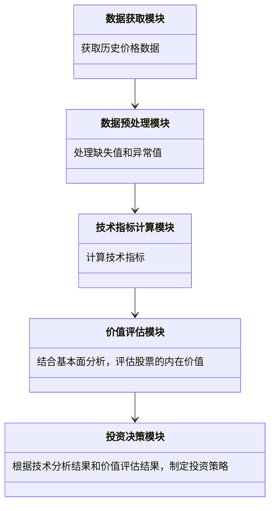

                 


# 《价值投资中的技术分析辅助》

> 关键词：价值投资，技术分析，算法，Python，股票预测

> 摘要：本文详细探讨了如何将技术分析应用于价值投资，通过数据驱动的方法和量化技术分析算法，帮助投资者做出更明智的决策。文章结合了技术分析的基本概念、算法原理、系统设计和项目实战，展示了如何利用技术分析辅助价值投资策略的制定与优化。

---

# 第一部分: 价值投资与技术分析的背景介绍

## 第1章: 价值投资与技术分析的背景介绍

### 1.1 价值投资的核心概念

#### 1.1.1 价值投资的定义与特点

价值投资是一种投资策略，强调以低于内在价值的价格购买优质资产。其核心在于通过分析企业的基本面（如财务状况、盈利能力、行业地位等）来判断其长期价值。价值投资的特点包括：

- 长期导向：关注企业的长期价值，而非短期价格波动。
- 逆向思维：在市场恐慌时寻找低估资产，在市场狂热时保持冷静。
- 安全边际：买入价格低于内在价值，以降低风险。

#### 1.1.2 价值投资的哲学与策略

价值投资的哲学来源于格雷厄姆和多德的价值投资体系，强调安全边际和对公司内在价值的深入分析。其策略包括：

- 资产配置：分散投资以降低风险。
- 纪律性：严格遵守投资纪律，避免情绪化决策。
- 长期持有：耐心持有优质资产，等待其价值回归。

#### 1.1.3 价值投资与技术分析的结合意义

传统价值投资依赖于对公司基本面的分析，但忽略了市场价格波动的技术面因素。将技术分析引入价值投资，可以通过量化方法捕捉市场情绪变化，优化投资策略，提高决策效率。

---

### 1.2 技术分析的核心概念

#### 1.2.1 技术分析的定义与特点

技术分析是一种通过分析历史价格数据来预测未来价格走势的方法。其特点包括：

- 价格反映一切：市场价格已经反映了所有相关信息。
- 历史重复：价格走势具有周期性，历史会重演。
- 可量化：通过数学模型和算法分析价格数据。

#### 1.2.2 技术分析的主要方法

技术分析主要通过以下方法进行：

- **趋势分析**：通过趋势线和支撑阻力位判断价格走势方向。
- **形态分析**：通过价格形态（如头肩顶、双底等）预测价格变化。
- **指标分析**：使用各种技术指标（如RSI、MACD等）辅助判断市场状态。

#### 1.2.3 技术分析在投资决策中的作用

技术分析可以帮助投资者：

- 识别市场趋势：确定买入或卖出的最佳时机。
- 量化风险：通过止损策略控制投资风险。
- 提高决策效率：通过自动化技术分析工具快速做出决策。

---

### 1.3 价值投资与技术分析的结合背景

#### 1.3.1 传统价值投资的局限性

传统价值投资依赖于对公司基本面的深入分析，但存在以下局限性：

- **信息滞后**：财务报表的发布通常滞后于市场变化。
- **忽略市场情绪**：市场情绪和技术面因素可能影响价格波动。
- **决策效率低下**：手动分析大量数据耗时耗力。

#### 1.3.2 技术分析在现代投资中的地位

技术分析在现代投资中的地位日益重要，主要体现在：

- **量化交易**：机构投资者广泛使用技术分析进行高频交易。
- **市场情绪监测**：通过技术指标判断市场情绪变化。
- **自动化交易系统**：技术分析算法被广泛应用于算法交易。

#### 1.3.3 两者结合的必要性与优势

将技术分析与价值投资结合的必要性在于：

- **弥补价值投资的不足**：通过技术分析捕捉短期价格波动，优化投资策略。
- **提高决策效率**：利用技术分析工具快速筛选投资标的，节省时间。
- **降低风险**：通过技术指标设置止损，控制投资风险。

---

## 第2章: 价值投资与技术分析的核心概念与联系

### 2.1 技术分析的原理与方法

#### 2.1.1 技术分析的假设与原则

技术分析基于以下基本假设：

- **价格反映一切**：市场价格已经反映了所有相关信息。
- **趋势延续性**：价格走势具有持续性，历史会重演。
- **重复性**：价格走势具有周期性，可以被预测和利用。

#### 2.1.2 技术分析的主要工具与指标

技术分析的主要工具和指标包括：

- **移动平均线（MA）**：用于判断价格趋势方向。
- **相对强弱指数（RSI）**：用于判断市场超买超卖状态。
- **布林带（Bollinger Bands）**：用于判断价格波动的范围。

#### 2.1.3 技术分析的分类与特点

技术分析可以分为以下几类：

- **趋势分析**：通过趋势线和通道判断价格走势方向。
- **形态分析**：通过价格形态预测价格变化。
- **指标分析**：通过技术指标判断市场状态。

---

### 2.2 价值投资的核心要素

#### 2.2.1 企业基本面分析

企业基本面分析包括以下几个方面：

- **财务状况**：分析公司的财务报表，判断其盈利能力、资产负债情况等。
- **行业地位**：分析公司在行业中的竞争地位。
- **管理团队**：分析公司管理团队的能力和稳定性。

#### 2.2.2 估值方法与指标

常用的估值方法和指标包括：

- **市盈率（P/E）**：用于判断股票的估值是否合理。
- **市净率（P/B）**：用于判断股票的估值是否合理。
- **股息率**：用于判断股票的分红能力。

#### 2.2.3 投资组合管理策略

投资组合管理策略包括：

- **资产配置**：根据市场情况调整资产配置比例。
- **风险控制**：通过分散投资和止损策略控制投资风险。
- **定期调整**：根据市场变化定期调整投资组合。

---

### 2.3 技术分析与价值投资的联系

#### 2.3.1 数据流与决策链

技术分析与价值投资的结合可以通过以下数据流实现：

1. **数据获取**：获取目标股票的历史价格数据。
2. **数据预处理**：清洗数据，处理缺失值和异常值。
3. **技术指标计算**：计算技术指标（如RSI、MA等）。
4. **价值评估**：结合基本面分析，评估股票的内在价值。
5. **投资决策**：根据技术分析结果和价值评估结果，制定投资策略。



#### 2.3.2 核心概念对比表格

以下是技术分析与价值投资的核心概念对比：

| 概念 | 技术分析 | 价值投资 |
|------|----------|----------|
| 核心 | 价格走势 | 企业基本面 |
| 工具 | K线图、均线 | 财务报表、估值指标 |
| 目标 | 短期价格预测 | 长期价值判断 |

---

## 第3章: 技术分析辅助价值投资的算法原理

### 3.1 常用技术分析算法

#### 3.1.1 移动平均线（MA）

移动平均线是一种常用的技术指标，用于平滑价格波动，判断价格趋势方向。计算公式如下：

$$ MA_n = \frac{1}{n} \sum_{i=1}^{n} P_i $$

其中，$P_i$ 是第i天的价格，$n$ 是计算天数。

#### 3.1.2 相对强弱指数（RSI）

RSI用于判断市场超买超卖状态，计算公式如下：

$$ RSI = \frac{100}{1 + \frac{D}{S}} $$

其中，$D$ 是下跌幅度，$S$ 是上升幅度。

#### 3.1.3 布林带（Bollinger Bands）

布林带用于判断价格波动的范围，计算公式如下：

$$ BB_{upper} = MA + 2 \times \sigma $$
$$ BB_{lower} = MA - 2 \times \sigma $$

其中，$MA$ 是移动平均线，$\sigma$ 是标准差。

---

### 3.2 算法原理与数学模型

#### 3.2.1 移动平均线的计算公式

移动平均线的计算公式如下：

$$ MA_n = \frac{1}{n} \sum_{i=1}^{n} P_i $$

例如，计算5天的移动平均线：

$$ MA_5 = \frac{P_1 + P_2 + P_3 + P_4 + P_5}{5} $$

#### 3.2.2 相对强弱指数的计算公式

RSI的计算公式如下：

$$ RSI = \frac{100}{1 + \frac{D}{S}} $$

其中，$D$ 是下跌幅度，$S$ 是上升幅度。

---

## 第4章: 技术分析辅助价值投资的系统设计与架构

### 4.1 系统功能设计

技术分析辅助价值投资的系统功能设计包括以下几个模块：

- **数据获取模块**：获取目标股票的历史价格数据。
- **数据预处理模块**：清洗数据，处理缺失值和异常值。
- **技术指标计算模块**：计算技术指标（如RSI、MA等）。
- **价值评估模块**：结合基本面分析，评估股票的内在价值。
- **投资决策模块**：根据技术分析结果和价值评估结果，制定投资策略。

### 4.2 系统架构设计

以下是系统架构设计的类图：



---

## 第5章: 技术分析辅助价值投资的项目实战

### 5.1 项目背景与目标

本项目旨在通过技术分析辅助价值投资，帮助投资者做出更明智的投资决策。项目目标包括：

- 实现技术分析算法，计算常用技术指标。
- 结合基本面分析，评估股票的内在价值。
- 制定投资策略，优化投资组合。

### 5.2 系统实现

#### 5.2.1 环境安装与配置

- **Python**：安装Python 3.x。
- **数据获取**：使用Yahoo Finance API获取股票数据。
- **数据处理**：使用Pandas进行数据清洗和处理。
- **技术指标计算**：使用TA-Lib库计算技术指标。
- **可视化**：使用Matplotlib进行数据可视化。

#### 5.2.2 核心实现代码

以下是核心实现代码：

```python
import pandas as pd
import numpy as np
import talib as ta
import matplotlib.pyplot as plt

# 数据获取
df = pd.read_csv('stock_data.csv')

# 数据预处理
df.dropna(inplace=True)

# 技术指标计算
df['MA5'] = ta.SMA(df['close'], timeperiod=5)
df['RSI'] = ta.RSI(df['close'], timeperiod=14)

# 可视化
plt.figure(figsize=(12, 6))
plt.plot(df['close'], label='Close Price')
plt.plot(df['MA5'], label='MA5')
plt.legend()
plt.show()
```

---

## 第6章: 总结与最佳实践

### 6.1 总结

本文详细探讨了如何将技术分析应用于价值投资，通过数据驱动的方法和量化技术分析算法，帮助投资者做出更明智的决策。文章结合了技术分析的基本概念、算法原理、系统设计和项目实战，展示了如何利用技术分析辅助价值投资策略的制定与优化。

### 6.2 最佳实践 tips

- **数据驱动决策**：利用技术分析工具和算法，快速筛选投资标的，节省时间。
- **风险管理**：通过技术指标设置止损，控制投资风险。
- **持续学习**：技术分析和价值投资都需要不断学习和实践，保持对市场的敏感性。

### 6.3 未来展望

未来，随着人工智能和大数据技术的不断发展，技术分析在价值投资中的应用将更加广泛和深入。投资者可以通过更复杂的算法和模型，捕捉更多的市场机会，优化投资策略。

---

## 作者：AI天才研究院/AI Genius Institute & 禅与计算机程序设计艺术 /Zen And The Art of Computer Programming

---

# THE END

---

