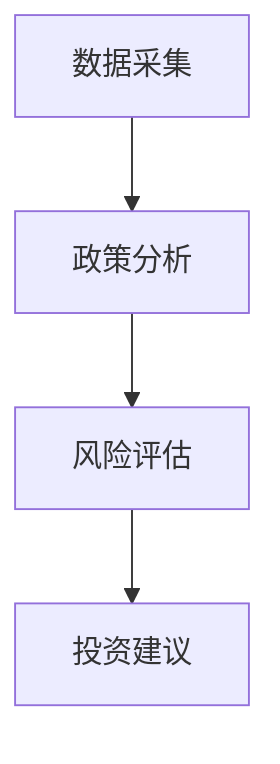

                 


# 价值投资中的政策影响分析

## 关键词：
价值投资、政策影响、投资策略、风险管理、市场分析、数据分析

## 摘要：
政策变化对价值投资有着深远的影响，投资者需要系统地分析和评估这些影响，以制定有效的投资策略。本文从政策影响的基本概念出发，详细探讨其对价值投资的核心影响机制，构建分析框架，并通过量化方法和系统设计提供解决方案。结合实际案例，本文展示了如何在政策变化中抓住投资机会，同时有效管理政策风险。

---

## 第1章: 引言

### 1.1 价值投资的基本概念
价值投资是一种长期投资策略，强调以低于市场价值的价格买入优质资产。其核心理念是寻找被市场低估的企业，长期持有，等待其价值回归。

### 1.2 政策影响的重要性
政策变化（如税收政策、行业监管、货币政策等）直接影响市场环境和企业运营，进而影响资产价格。忽视政策影响可能导致投资决策失误。

---

## 第2章: 政策影响的重要性

### 2.1 政策影响的市场传导机制
政策通过影响市场结构、企业成本和消费者行为，间接影响资产价格。例如，环保政策可能导致企业生产成本上升，进而影响股价。

### 2.2 不同类型政策对投资的影响
- **财政政策**：影响政府支出和税收，影响企业的盈利能力和市场信心。
- **货币政策**：通过利率和货币供应量影响市场流动性，进而影响资产价格。
- **行业监管政策**：直接影响特定行业的发展，如金融行业。

### 2.3 政策风险与投资决策
政策风险是价值投资中的重要风险来源。投资者需要识别政策风险的来源，并通过多元化等手段进行管理。

---

## 第3章: 政策影响的分析框架

### 3.1 分析框架的构建
政策影响分析框架包括以下几个步骤：
1. 确定政策类型和影响范围。
2. 分析政策对行业和企业的具体影响。
3. 量化政策影响对资产价格的影响。

### 3.2 分析工具与方法
- **定性分析**：通过政策文本分析和专家访谈，评估政策对企业的影响。
- **定量分析**：使用回归分析等方法，量化政策变量对资产价格的影响。

---

## 第4章: 政策影响的量化分析

### 4.1 线性回归模型的应用
回归模型可以量化政策变量对资产价格的影响。例如，建立如下模型：
$$ y = \beta_0 + \beta_1x + \epsilon $$
其中，$y$为资产收益，$x$为政策变量，$\beta_1$为政策影响系数。

### 4.2 时间序列分析
时间序列分析可以捕捉政策变化对资产价格的动态影响。例如，使用ARIMA模型预测政策变化后的市场反应。

---

## 第5章: 风险管理与策略调整

### 5.1 政策风险的识别与评估
投资者需要识别政策风险的来源，并评估其潜在影响。例如，通过VaR模型评估政策变化带来的潜在损失。

### 5.2 投资组合的调整策略
- **分散化**：通过投资不同行业的资产，降低政策风险的影响。
- **动态调整**：根据政策变化及时调整投资组合。

---

## 第6章: 系统设计与实现

### 6.1 系统架构设计
系统包括数据采集、政策分析、风险评估和投资建议四个模块。系统架构图如下：



### 6.2 系统功能模块
- **数据采集**：收集政策和市场数据。
- **政策分析**：分析政策对市场的影响。
- **风险评估**：评估政策风险。
- **投资建议**：根据分析结果提出投资建议。

---

## 第7章: 项目实战

### 7.1 环境安装
安装必要的数据分析工具，如Python、Pandas、Matplotlib。

### 7.2 核心实现代码
```python
import pandas as pd
import numpy as np
from sklearn.linear_model import LinearRegression

# 数据加载
data = pd.read_csv('policy_data.csv')

# 建立回归模型
model = LinearRegression()
model.fit(data[['policy_variable']], data['asset_return'])

# 预测结果
predicted_returns = model.predict(data[['policy_variable']])
```

### 7.3 实际案例分析
以某项税收政策为例，分析其对特定行业的影响，预测政策变化后的市场反应，并提出投资建议。

---

## 第8章: 总结与展望

### 8.1 总结
政策变化对价值投资有着重要影响，投资者需要系统地分析政策影响，制定有效的投资策略。

### 8.2 展望
未来研究可以引入机器学习模型，提高政策影响分析的准确性，同时探索更多政策类型对投资的影响。

---

## 作者：AI天才研究院 & 禅与计算机程序设计艺术

---

通过以上分析，价值投资者可以更好地理解和应对政策变化，抓住投资机会，降低政策风险。

