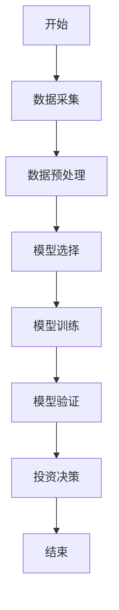

                 

# 价值投资中的政策红利捕捉

---

## 关键词：
- 价值投资
- 政策红利
- 数学模型
- 系统架构
- 实战案例

---

## 摘要：
在价值投资中，政策红利是一个关键因素，能够显著影响市场的长期表现。本文系统地探讨了政策红利的定义、来源、影响以及如何通过数学模型和系统架构来捕捉政策红利。文章首先介绍了价值投资和政策红利的基本概念，然后深入分析了政策红利的来源及其对经济和市场的影响。接着，文章详细讲解了捕捉政策红利的数学模型和算法原理，并通过系统架构设计展示了如何将这些理论应用于实际投资中。最后，文章通过实战案例分析了政策红利捕捉的具体实现过程，并总结了最佳实践和未来展望。

---

## 目录

---

# 第1章 价值投资与政策红利概述

## 1.1 价值投资的基本概念

### 1.1.1 价值投资的定义与核心理念

- 价值投资是一种长期投资策略，强调以低于公平价值的价格购买优质资产。
- 核心理念：市场短期波动，但长期趋向于反映资产的真实价值。
- 投资者需要关注企业的内在价值，而非市场的短期波动。

### 1.1.2 价值投资与其它投资策略的对比

- 股票投资的三大主要策略：价值投资、成长投资和趋势投资。
- 价值投资与其他策略的主要区别：
  - 价值投资关注低估资产，成长投资关注高增长资产，趋势投资关注市场短期走势。
  - 价值投资注重长期，成长投资注重中期，趋势投资注重短期。

### 1.1.3 价值投资在现代金融中的地位

- 价值投资是现代金融理论的重要组成部分。
- 在实践中，价值投资通过寻找市场错价机会，为投资者创造了超额收益。

## 1.2 政策红利的概念与特征

### 1.2.1 政策红利的定义

- 政策红利是指政府政策的变化对企业或行业产生的额外收益或机会。
- 这种红利可能来自于税收优惠、行业补贴、放松管制等政策。

### 1.2.2 政策红利的主要来源

- 宏观政策：如财政政策、货币政策、产业政策等。
- 行业政策：如特定行业的补贴、税收优惠、准入门槛降低等。
- 地方政策：如地方政府的招商引资、区域经济发展计划等。

### 1.2.3 政策红利的周期性与波动性

- 政策红利通常具有周期性，与政策制定者的决策周期相关。
- 政策红利可能因政策变化而波动，投资者需要具备敏锐的洞察力。

## 1.3 政策红利与价值投资的结合

### 1.3.1 政策红利对投资价值的影响

- 政策红利可能提升企业的盈利能力，从而增加其内在价值。
- 政策红利也可能改变行业的竞争格局，影响企业的长期前景。

### 1.3.2 政策红利在价值投资中的应用潜力

- 通过分析政策红利，投资者可以更好地识别低估资产。
- 政策红利为价值投资者提供了额外的收益来源。

### 1.3.3 政策红利捕捉的核心逻辑与方法

- 识别具有政策红利潜力的行业和企业。
- 评估政策红利的持续性和强度。
- 结合企业的基本面分析，判断其长期价值。

## 1.4 本章小结

- 价值投资是一种长期投资策略，强调以低于公平价值的价格购买优质资产。
- 政策红利是政府政策变化带来的额外收益或机会。
- 政策红利与价值投资的结合为投资者提供了新的投资机会。

---

# 第2章 政策红利的来源与影响

## 2.1 政策红利的来源

### 2.1.1 宏观政策分析

- 财政政策：政府通过调整税收、支出等手段影响经济。
- 货币政策：央行通过调整利率、货币供应量等手段影响经济。
- 产业政策：政府通过补贴、税收优惠等手段支持特定产业。

### 2.1.2 行业政策解读

- 特定行业的补贴：如新能源行业的补贴政策。
- 税收优惠：如高科技企业的税收减免。
- 准入门槛降低：如简化行政审批流程。

### 2.1.3 地方政策与区域经济发展

- 地方政府的招商引资政策。
- 区域经济发展计划：如东部地区优先发展高科技产业。

## 2.2 政策红利对经济与市场的影响

### 2.2.1 政策红利对行业的影响

- 提升行业竞争力：如税收优惠降低了企业的成本。
- 改善行业结构：如放松管制提高了行业的效率。

### 2.2.2 政策红利对企业的具体影响

- 增加企业利润：如税收优惠直接增加了企业的净利润。
- 改善企业融资环境：如政府提供的融资补贴降低了企业的融资成本。

### 2.2.3 政策红利对投资者的潜在机会

- 提供投资标的：政策红利可能使某些行业或企业成为投资热点。
- 增加投资收益：政策红利可能提升企业的盈利能力，从而增加其股票的价值。

## 2.3 政策红利的周期性与风险

### 2.3.1 政策红利的周期性分析

- 政策红利通常具有周期性，与政策制定者的决策周期相关。
- 政策红利的周期可能与经济周期相关。

### 2.3.2 政策红利的潜在风险

- 政策变化的不确定性：政策红利可能因政策变化而消失。
- 政策执行的不确定性：政策红利可能因执行不力而无法实现。

### 2.3.3 政策红利的可预测性与不可预测性

- 政策红利的可预测性：通过分析政策制定者的意图和历史数据，可以预测政策红利的可能性。
- 政策红利的不可预测性：政策变化可能受到外部因素的影响，具有一定的不可预测性。

## 2.4 本章小结

- 政策红利的来源包括宏观政策、行业政策和地方政策。
- 政策红利对经济和市场有重要影响，可能提升行业竞争力，增加企业利润，为投资者提供机会。
- 政策红利具有周期性，投资者需要关注政策变化的不确定性和执行风险。

---

# 第3章 政策红利捕捉的数学模型与算法原理

## 3.1 政策红利捕捉的算法原理

### 3.1.1 政策红利捕捉的基本思路

- 通过分析政策变化对企业或行业的影响，预测政策红利的出现和持续性。
- 结合企业的基本面分析，判断其长期价值。

### 3.1.2 政策红利捕捉的核心算法

- 算法步骤：
  1. 数据采集：收集政策变化、企业基本面数据。
  2. 数据分析：识别政策红利的影响因素。
  3. 模型预测：预测政策红利的出现和持续性。
  4. 投资决策：结合模型预测结果，做出投资决策。

### 3.1.3 算法的数学模型与公式

- 简单线性回归模型：用于预测政策红利对企业价值的影响。
  $$ \text{企业价值} = \beta_0 + \beta_1 \times \text{政策红利} + \epsilon $$

---

## 3.2 政策红利捕捉的数学模型

### 3.2.1 模型的构建过程

- 数据准备：收集政策变化、企业基本面数据。
- 模型选择：选择合适的数学模型，如多元回归模型。
- 模型训练：利用历史数据训练模型。
- 模型验证：验证模型的准确性和可靠性。

### 3.2.2 模型的输入变量与输出变量

- 输入变量：
  - 政策红利相关指标：如税收优惠、补贴金额。
  - 企业基本面指标：如收入、利润、资产等。
- 输出变量：
  - 政策红利对企业价值的影响。

### 3.2.3 模型的假设条件与限制

- 模型假设：
  - 政策红利对企业价值的影响是线性的。
  - 模型中的变量是独立的。
- 模型限制：
  - 不能捕捉非线性关系。
  - 受数据质量和数量的限制。

---

## 3.3 算法流程图

---

## 3.4 本章小结

- 政策红利捕捉的数学模型是通过分析政策变化对企业或行业的影响，预测政策红利的出现和持续性。
- 简单线性回归模型可以用于预测政策红利对企业价值的影响。
- 模型的构建需要数据准备、模型选择、模型训练和模型验证等步骤。

---

## 第4章 政策红利捕捉的系统架构与实现

### 4.1 系统需求分析

- 系统目标：
  - 捕捉政策红利，辅助投资者做出投资决策。
- 系统功能：
  - 数据采集：收集政策变化、企业基本面数据。
  - 数据分析：识别政策红利的影响因素。
  - 模型预测：预测政策红利的出现和持续性。
  - 投资决策：结合模型预测结果，做出投资决策。

### 4.2 系统架构设计

### 4.3 系统实现细节

- 数据采集：
  - 通过爬虫技术采集政策变化数据。
  - 通过数据库查询采集企业基本面数据。
- 数据分析：
  - 使用Python的pandas库进行数据清洗和预处理。
  - 使用scikit-learn库进行数据建模。
- 模型实现：
  - 实现简单线性回归模型。
  - 通过交叉验证评估模型的准确性。

---

## 4.4 本章小结

- 政策红利捕捉的系统架构包括数据采集、数据预处理、模型训练、模型预测和投资决策等模块。
- 系统实现需要使用Python的pandas库和scikit-learn库进行数据分析和建模。

---

## 第5章 政策红利捕捉的实战案例与分析

### 5.1 实战案例的选择与背景

- 案例背景：
  - 某地方政府出台政策，对本地高科技企业提供税收优惠。
- 案例目标：
  - 分析税收优惠对企业价值的影响。
  - 判断税收优惠是否能带来超额收益。

### 5.2 实战案例的分析过程

#### 5.2.1 数据的收集与整理

- 数据来源：
  - 政府政策文件。
  - 企业财务报表。
  - 市场数据。

#### 5.2.2 算法实现

- 使用简单线性回归模型预测税收优惠对企业价值的影响。
  $$ \text{企业价值} = \beta_0 + \beta_1 \times \text{税收优惠} + \epsilon $$

#### 5.2.3 结果分析

- 模型预测结果：
  - 税收优惠对企业的价值有显著的正向影响。
  - 企业的内在价值可能被低估，存在投资机会。

#### 5.2.4 投资决策

- 结合模型预测结果，判断企业是否具有投资价值。
- 如果企业价值被低估，且税收优惠可能持续，可以考虑买入。

---

## 5.3 本章小结

- 政策红利捕捉的实战案例分析展示了如何通过数学模型和系统架构来捕捉政策红利。
- 税收优惠对企业的价值有显著的正向影响，存在投资机会。

---

## 第6章 总结与展望

### 6.1 总结

- 本文系统地探讨了政策红利捕捉的理论和实践。
- 通过数学模型和系统架构，展示了如何捕捉政策红利并应用于价值投资。

### 6.2 未来展望

- 进一步优化数学模型，捕捉更多类型的政策红利。
- 结合机器学习技术，提高模型的准确性和预测能力。
- 研究政策红利的长期影响，优化投资策略。

---

## 作者信息

作者：AI天才研究院/AI Genius Institute & 禅与计算机程序设计艺术 /Zen And The Art of Computer Programming

---

感谢您的阅读！希望这篇文章对您在价值投资中的政策红利捕捉有所帮助！

