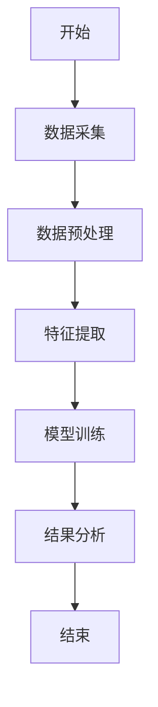
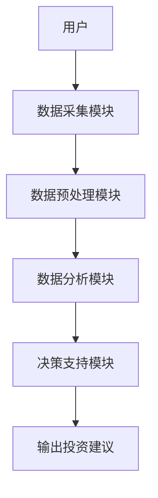

                 


# 价值投资中的数字化转型ROI分析

> 关键词：价值投资，数字化转型，ROI分析，投资回报，技术应用

> 摘要：  
本文深入探讨了数字化转型在价值投资中的应用及其对投资回报（ROI）的影响。通过分析数字化转型的核心概念、算法原理和系统架构，结合实际案例，展示了如何利用数字化技术提升投资决策的效率和准确性，从而实现更高的投资回报。文章还提出了数字化转型在价值投资中的未来发展方向和建议。

---

# 第一部分: 价值投资中的数字化转型背景介绍

## 第1章: 数字化转型与价值投资概述

### 1.1 数字化转型的定义与特征

#### 1.1.1 数字化转型的定义
数字化转型（Digital Transformation）是指通过利用数字技术（如大数据、人工智能、云计算等）改变业务模式、流程、文化或用户体验的过程。其核心在于将传统业务与数字技术深度融合，以实现业务创新和效率提升。

#### 1.1.2 数字化转型的核心特征
- **数据驱动**：依赖于数据的收集、分析和应用。
- **技术驱动**：以新兴技术（如AI、大数据）为支撑。
- **业务创新**：通过数字化手段实现业务模式的优化和创新。
- **用户体验**：注重提升用户（客户或投资者）的体验。

#### 1.1.3 数字化转型对企业的影响
- 提高效率和生产力。
- 优化决策过程。
- 开拓新的业务模式。
- 提升竞争力。

---

### 1.2 价值投资的基本概念

#### 1.2.1 价值投资的定义
价值投资是一种投资策略，强调以低于内在价值的价格购买优质资产。其核心在于寻找市场低估的股票，长期持有，等待其价值回归。

#### 1.2.2 价值投资的核心理念
- **安全边际**：以低于内在价值的价格买入，降低风险。
- **长期视角**：关注企业的基本面，而非短期市场波动。
- **选股标准**：选择具有持续盈利能力和良好管理的公司。

#### 1.2.3 价值投资与传统投资的区别
| 区别点 | 价值投资 | 传统投资 |
|--------|-----------|-----------|
| 投资理念 | 低买高卖，注重安全边际 | 短期交易，注重市场波动 |
| 时间框架 | 长期持有 | 短期操作 |
| 关注点 | 公司基本面 | 市场情绪 |

---

### 1.3 数字化转型在价值投资中的应用前景

#### 1.3.1 数字化转型在金融领域的应用
- **大数据分析**：利用大数据技术筛选和评估潜在投资标的。
- **人工智能**：通过AI模型预测市场趋势和股票价值。
- **自动化交易**：利用算法实现快速、精准的交易决策。

#### 1.3.2 价值投资中的数字化转型需求
- 提高数据处理效率。
- 优化选股模型。
- 实现投资决策的智能化。

#### 1.3.3 数字化转型对投资回报的影响
- 提升投资决策的准确性和效率。
- 降低投资成本。
- 拓展投资机会。

---

## 第2章: 数字化转型与价值投资的核心概念

### 2.1 数字化转型的 ROI 分析框架

#### 2.1.1 ROI 的定义与计算公式
**ROI（Return on Investment）**：投资回报率，衡量投资的收益与成本的比率。

计算公式：  
$$ ROI = \frac{\text{净收益}}{\text{投资成本}} \times 100\% $$

其中，净收益 = 收益 - 成本。

#### 2.1.2 数字化转型的 ROI 分析方法
- **成本分析**：评估数字化转型的投入成本。
- **收益预测**：预测数字化转型带来的收益。
- **收益与成本对比**：计算ROI，评估投资的可行性。

#### 2.1.3 数字化转型 ROI 的关键影响因素
- **技术成熟度**：技术越成熟， ROI 越高。
- **数据质量**：数据质量越高，分析结果越准确。
- **实施难度**：实施难度越低， ROI 越高。
- **市场需求**：市场需求越大， ROI 越高。

---

### 2.2 价值投资中的数字化转型 ROI 分析

#### 2.2.1 数字化转型对投资决策的影响
- **数据驱动决策**：通过大数据和AI模型，投资者可以更精准地评估公司基本面。
- **实时监控**：实时跟踪市场动态，及时调整投资策略。
- **风险控制**：利用数字化工具识别和规避投资风险。

#### 2.2.2 数字化转型对投资回报的提升
- **提高选股准确性**：通过数字化工具筛选出更具投资价值的标的。
- **降低交易成本**：自动化交易和大数据分析可以降低人工成本。
- **优化投资组合**：通过算法优化投资组合，提高整体回报。

#### 2.2.3 数字化转型 ROI 的评估指标
- **投资回报率（ROI）**
- **投资周期**
- **收益波动性**
- **风险控制能力**

---

## 第3章: 数字化转型 ROI 分析的核心算法与数学模型

### 3.1 数字化转型 ROI 分析的算法原理

#### 3.1.1 算法概述
数字化转型 ROI 分析的核心算法包括：
- **回归分析**：预测投资回报与相关变量的关系。
- **聚类分析**：将相似的投资标的归类，便于分析。
- **时间序列分析**：预测未来市场趋势。

#### 3.1.2 算法流程图（使用 Mermaid）


---

### 3.2 数字化转型 ROI 分析的数学模型

#### 3.2.1 投资回报预测模型
**线性回归模型**：  
$$ y = \beta_0 + \beta_1 x_1 + \beta_2 x_2 + \epsilon $$  
其中，$y$ 是投资回报率，$x_1$ 和 $x_2$ 是影响 ROI 的因素，$\epsilon$ 是误差项。

#### 3.2.2 风险评估模型
**夏普比率**：  
$$ \text{夏普比率} = \frac{\text{平均收益 - 无风险利率}}{\text{收益的标准差}} $$

---

## 第4章: 数字化转型 ROI 分析的系统架构设计

### 4.1 系统功能设计

#### 4.1.1 数据采集模块
- 采集股票价格、财务数据等。

#### 4.1.2 数据分析模块
- 使用机器学习算法分析数据，生成投资建议。

#### 4.1.3 决策支持模块
- 提供 ROI 分析结果和投资建议。

### 4.2 系统架构设计（使用 Mermaid）


---

## 第5章: 项目实战与案例分析

### 5.1 环境安装
- 安装 Python、Pandas、Scikit-learn 等工具。

### 5.2 核心代码实现
```python
import pandas as pd
from sklearn.linear_model import LinearRegression

# 数据加载
data = pd.read_csv('investment_data.csv')

# 特征与目标变量分离
X = data[['revenue', 'profit_margin']]
y = data['return_on_investment']

# 模型训练
model = LinearRegression()
model.fit(X, y)

# 预测 ROI
predicted_roi = model.predict(X)
```

---

## 第6章: 总结与展望

### 6.1 总结
数字化转型通过提升数据处理效率和优化投资决策，显著提升了价值投资的 ROI。本文从理论、算法和系统架构三个层面，详细分析了数字化转型在价值投资中的应用。

### 6.2 展望
未来，随着 AI 和大数据技术的进一步发展，数字化转型在价值投资中的应用将更加广泛和深入。投资者可以通过更加智能化的工具和模型，实现更高的投资回报。

---

**作者：AI天才研究院/AI Genius Institute & 禅与计算机程序设计艺术 /Zen And The Art of Computer Programming**

