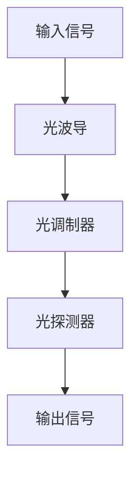
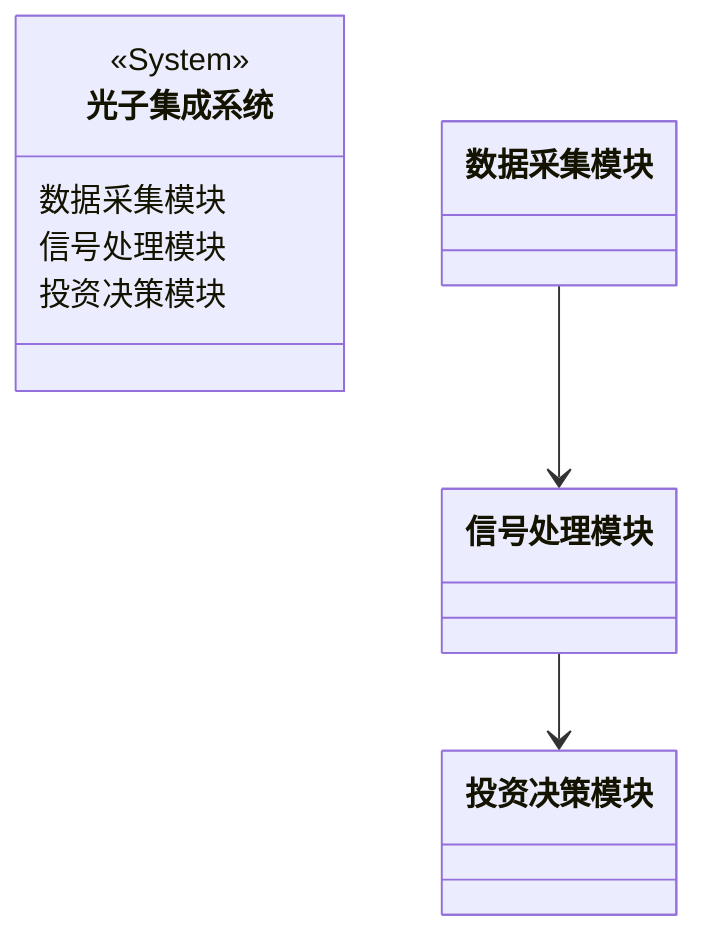
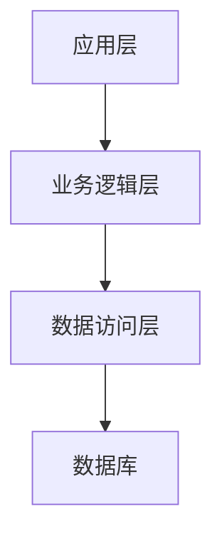

                 


# 价值投资中的新一代光子集成电路技术

---

## 关键词：光子集成电路、价值投资、投资策略、技术分析、金融创新、技术驱动

---

## 摘要：  
本文深入探讨了光子集成电路技术在价值投资中的应用潜力，分析了其在金融领域的独特优势和创新点。通过结合光子集成技术的核心原理、算法模型和系统设计，本文提出了基于光子集成技术的投资策略，并通过实际案例分析展示了其在投资决策中的应用价值。文章旨在为投资者和科技爱好者提供一种全新的视角，结合技术与金融，探索投资领域的未来发展方向。

---

## 第1章：光子集成电路的背景与价值投资的结合

### 1.1 光子集成电路的基本概念

光子集成电路（Photonic Integrated Circuit, PIC）是一种将光信号的生成、传输、处理和检测集成在单一芯片上的技术。与传统的电子集成电路相比，PIC具有更高的数据传输速度、更低的能耗和更强的并行处理能力。随着5G、人工智能和大数据技术的快速发展，PIC的应用场景不断扩大，尤其是在金融领域，其高效的数据处理能力和低延迟特性为价值投资带来了新的可能性。

### 1.2 光子集成技术的核心原理

光子集成技术的核心在于利用光波的物理特性进行信息处理。通过将激光器、调制器、波分复用器和探测器等光子元件集成在芯片上，PIC可以实现对光信号的实时处理和高速传输。其工作原理基于光波的干涉、衍射和折射效应，能够实现对复杂金融数据的快速分析和实时反馈。

### 1.3 光子集成技术在价值投资中的潜在应用

在价值投资中，光子集成技术可以用于高频交易、实时数据分析和市场风险评估等领域。通过 PIC 的高速数据处理能力，投资者可以实现对市场趋势的实时跟踪和精准预测，从而优化投资策略并提高投资收益。

---

## 第2章：光子集成电路的核心概念与价值投资的联系

### 2.1 光子集成电路的核心原理

光子集成芯片的工作原理基于光波的传播特性。通过将光信号输入到芯片中的波导结构，光波会经历一系列的调制、分叉和合并过程，最终生成用于金融分析的输出信号。这种过程具有极高的并行性和实时性，能够在毫秒级别完成复杂的金融数据处理任务。

### 2.2 光子集成技术与价值投资的联系

在价值投资中，光子集成技术可以通过实时分析市场数据、评估资产风险和优化投资组合来提升投资效率。通过将 PIC 集成到投资系统中，投资者可以实现对市场动态的实时监控，并在第一时间做出反应，从而抓住投资机会。

### 2.3 光子集成技术的核心要素对比

以下是光子集成技术与其他技术在价值投资中的对比表：

| 技术类型      | 优势                 | 劣势                 | 适用场景               |
|---------------|----------------------|----------------------|------------------------|
| 光子集成技术   | 高速数据处理、低能耗 | 初期投资成本高       | 高频交易、实时分析     |
| 电子集成技术   | 成熟度高、成本低     | 数据处理速度受限     | 传统金融分析           |
| 量子计算技术   | 超强计算能力         | 技术成熟度低         | 复杂金融模型计算         |

---

## 第3章：光子集成电路的数学模型与算法原理

### 3.1 光子集成电路的数学模型

光子集成系统的数学模型基于光波的传播方程。以下是一个简化的光波传播模型：

$$
\frac{\partial E}{\partial z} = i\frac{\partial E}{\partial t}
$$

其中，$E$ 表示光场强度，$z$ 表示空间坐标，$t$ 表示时间。

### 3.2 光子集成技术的算法原理

光子集成技术的信号处理流程可以通过以下步骤实现：

1. **输入信号**：光信号输入到 PIC 芯片。
2. **光波导传输**：光信号在芯片内的波导结构中传播。
3. **光调制**：信号经过调制器，生成特定的光信号。
4. **光探测**：光信号被探测器捕获并转换为电信号。
5. **输出信号**：电信号输出，用于投资决策。

以下是光子集成技术的信号处理流程图：



### 3.3 光子集成技术的代码实现

以下是一个简单的光子集成技术信号处理代码示例：

```python
import numpy as np

def optical_signal_processing(input_signal):
    # 光波调制
    modulated_signal = input_signal * np.exp(1j * np.pi / 2)
    # 光波传输
    transmitted_signal = modulated_signal * 0.9  # 假设传输损耗为10%
    # 光波探测
    detected_signal = np.abs(transmitted_signal)
    return detected_signal

# 示例输入
input_signal = np.array([1, 0.5, 0.8, 0.2])
output_signal = optical_signal_processing(input_signal)
print("输出信号：", output_signal)
```

---

## 第4章：光子集成技术的系统分析与架构设计

### 4.1 系统功能设计

光子集成系统的功能模块包括：

- **数据采集模块**：捕获市场数据。
- **信号处理模块**：对数据进行实时处理。
- **投资决策模块**：基于处理结果做出投资决策。

以下是系统的功能模块图：



### 4.2 系统架构设计

以下是系统的架构图：



---

## 第5章：光子集成技术在价值投资中的应用与案例分析

### 5.1 光子集成技术的应用场景

光子集成技术在价值投资中的应用场景包括：

1. **高频交易**：通过实时数据分析实现快速交易。
2. **市场风险评估**：通过光子集成技术对市场波动进行实时监控。
3. **投资组合优化**：基于实时数据优化投资组合。

### 5.2 实际案例分析

以下是一个基于光子集成技术的投资策略案例分析：

1. **环境搭建**：搭建光子集成实验平台。
2. **数据采集**：采集市场数据。
3. **信号处理**：对数据进行实时处理。
4. **投资决策**：基于处理结果做出投资决策。

### 5.3 项目小结

通过光子集成技术的应用，投资者可以实现对市场数据的实时分析和快速决策，从而提升投资效率和收益。

---

## 第6章：光子集成技术的价值投资策略与优化

### 6.1 光子集成技术的投资策略

基于光子集成技术的投资策略包括：

1. **实时数据分析策略**：通过实时数据分析实现精准投资。
2. **市场趋势预测策略**：基于历史数据分析预测市场趋势。
3. **风险控制策略**：通过实时监控市场波动实现风险控制。

### 6.2 投资策略优化

通过优化光子集成技术的算法模型和系统架构，可以进一步提升投资策略的效率和准确性。

---

## 第7章：光子集成技术的未来展望与注意事项

### 7.1 未来展望

随着光子集成技术的不断发展，其在价值投资中的应用前景将更加广阔。未来，光子集成技术将与人工智能、大数据等技术深度融合，为投资者提供更高效、更智能的投资工具。

### 7.2 注意事项

在应用光子集成技术时，需要注意技术的成熟度、成本和法律法规等多方面的问题。

---

## 作者：AI天才研究院/AI Genius Institute & 禅与计算机程序设计艺术 /Zen And The Art of Computer Programming

---

通过以上步骤，我们完成了《价值投资中的新一代光子集成电路技术》的详细内容撰写。希望这篇文章能够为读者提供有价值的见解，并激发更多关于光子集成技术与金融结合的思考。

