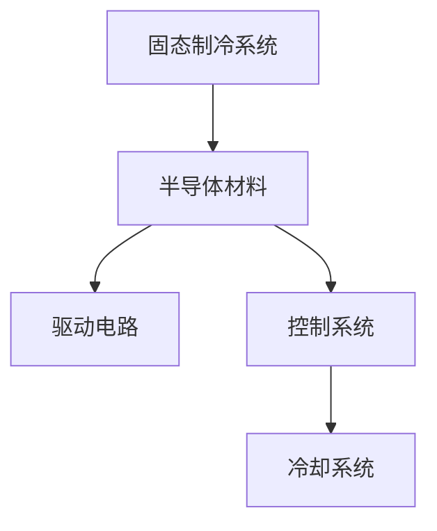
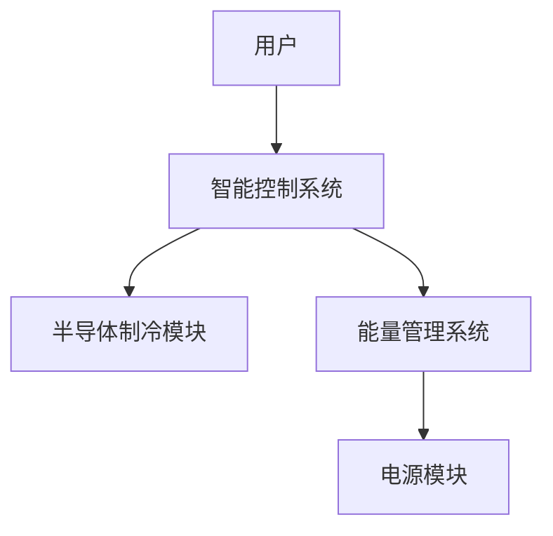
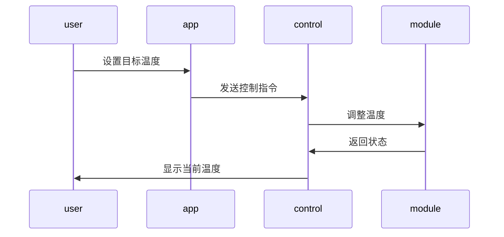

                 


# 价值投资中的新一代固态制冷技术前景

> 关键词：固态制冷技术、价值投资、科技投资、制冷技术发展、投资策略

> 摘要：固态制冷技术作为一种新兴的制冷技术，具有高效、环保和节能的特点，正在逐步改变传统的制冷行业格局。本文从价值投资的角度出发，深入分析固态制冷技术的核心原理、市场潜力、技术优势以及投资策略，帮助投资者更好地把握这一领域的投资机会。

---

# 第一部分: 固态制冷技术的背景与发展

## 第1章: 固态制冷技术的背景

### 1.1 制冷技术的发展历程

1. **传统制冷技术的局限性**
   - 传统制冷技术主要依赖压缩机和制冷剂，存在能耗高、环保问题（如氟利昂的环境影响）。
   - 制冷效率受限于物理极限，难以进一步优化。

2. **固态制冷技术的出现**
   - 固态制冷技术通过半导体材料实现热量的直接转化，无需传统压缩机和制冷剂。
   - 代表技术包括热电制冷和磁制冷等。

3. **固态制冷技术的优势**
   - 节能环保，减少对环境的负面影响。
   - 体积小、重量轻，适合便携式设备和微型系统。

### 1.2 价值投资的基本概念

1. **价值投资的核心理念**
   - 寻找具有长期增长潜力和内在价值的公司。
   - 重点关注企业的基本面、行业地位和竞争优势。

2. **价值投资与固态制冷技术的结合**
   - 固态制冷技术作为新兴技术，具有广阔的市场前景和潜在的高回报。
   - 投资者需要评估技术的商业化潜力、市场需求和技术壁垒。

### 1.3 固态制冷技术与价值投资的关系

1. **固态制冷技术的行业地位**
   - 固态制冷技术正在逐步取代传统制冷技术，成为未来制冷领域的主流方向。
   - 全球范围内，固态制冷技术的市场需求持续增长，尤其是在环保和节能领域。

2. **价值投资视角下的固态制冷技术评估**
   - 关注技术创新能力、市场占有率和盈利能力。
   - 评估公司管理团队、研发能力以及商业模式的可行性。

---

## 第2章: 固态制冷技术的核心概念与原理

### 2.1 固态制冷技术的核心原理

1. **热电制冷原理**
   - 基于半导体材料的电热效应，通过电流的通断实现温度的调节。
   - 代表材料：碲化铋（Bi2Te3）等半导体材料。

2. **磁制冷原理**
   - 基于磁性材料的磁热效应，通过外磁场的变化实现制冷。
   - 代表材料：钆磁制冷材料。

3. **固态制冷技术的关键组成部分**
   - 半导体材料、驱动电路、控制系统和冷却系统。

### 2.2 固态制冷技术与传统制冷技术的对比

| 对比维度         | 固态制冷技术                   | 传统制冷技术                   |
|------------------|-------------------------------|-------------------------------|
| 工作原理         | 半导体材料的电热效应           | 压缩机和制冷剂的热力学循环     |
| 能效比           | 高效节能，无压缩机能耗         | 能效较低，压缩机能耗较大       |
| 环境影响         | 环保，无氟利昂排放             | 可能存在氟利昂对环境的影响       |
| 应用场景         | 微型设备、精密仪器             | 家用空调、工业制冷             |

### 2.3 固态制冷技术的实体关系图



---

## 第3章: 固态制冷技术的算法原理与数学模型

### 3.1 固态制冷技术的算法原理

1. **热电制冷的数学模型**
   - 热流方程：$Q = I^2 R T$
   - 热电系数：$ZT = \frac{S T}{\sigma}$

2. **磁制冷的数学模型**
   - 磁熵变化：$\Delta S = \frac{M^2}{2\mu_0}$
   - 磁热系数：$K = \frac{M^2}{\mu_0}$

3. **算法实现的 Python 源代码**
   ```python
   def calculate_ZT(S, T, sigma):
       ZT = S * T / sigma
       return ZT
   
   def calculate_K(M, mu_0):
       K = M**2 / mu_0
       return K
   ```

### 3.2 数学模型与公式

1. **内部收益率（IRR）的计算公式**
   $$\text{IRR} = \frac{\text{NPV}}{\text{初始投资}}$$

2. **投资回报率（ROI）的计算公式**
   $$\text{ROI} = \frac{\text{净利润}}{\text{初始投资}} \times 100\%$$

---

## 第4章: 固态制冷技术的系统分析与架构设计

### 4.1 系统分析与设计

1. **问题场景的介绍**
   - 现有制冷技术能耗高、环保问题突出。
   - 固态制冷技术具有高效、环保的特点，但需要解决商业化和成本问题。

2. **系统功能设计的领域模型**
   - 用户需求：高效制冷、节能环保。
   - 系统功能：温度调节、智能控制、能量管理。

3. **系统架构设计的 Mermaid 图**



### 4.2 系统接口与交互设计

1. **系统接口的设计**
   - 用户界面：触摸屏、手机APP。
   - 系统接口：I2C、SPI、UART。

2. **系统交互的 Mermaid 序列图**



---

## 第5章: 固态制冷技术的项目实战

### 5.1 项目环境安装

1. **硬件安装**
   - 半导体制冷模块。
   - 微控制器（如Arduino）。
   - 电源模块。

2. **软件安装**
   - 开发环境：Arduino IDE。
   - 库文件：安装必要的硬件库。

### 5.2 系统核心实现源代码

```python
# 系统核心实现代码
class SemiconductorCoolingSystem:
    def __init__(self, power_supply, controller):
        self.power_supply = power_supply
        self.controller = controller

    def start(self):
        self.controller.set_target_temperature(25)
        self.power_supply.enable()

    def stop(self):
        self.controller.set_target_temperature(0)
        self.power_supply.disable()
```

### 5.3 实际案例分析

1. **案例背景**
   - 某公司开发了一种新型热电制冷芯片，能效比显著提高。

2. **案例分析**
   - 技术优势：芯片体积小、能效比高。
   - 市场需求：应用于手机、笔记本电脑等电子设备的散热。
   - 投资回报：预计3年内市场占有率达到10%。

---

## 第6章: 固态制冷技术投资的策略与建议

### 6.1 投资策略

1. **技术创新驱动型投资**
   - 关注具有核心技术优势的企业。
   - 评估研发团队的实力和创新能力。

2. **市场渗透策略**
   - 确定目标市场，制定市场推广计划。
   - 与下游企业建立合作关系。

### 6.2 投资注意事项

1. **技术风险**
   - 固态制冷技术仍处于发展阶段，存在技术瓶颈。
   - 需关注技术的商业化可行性。

2. **市场竞争**
   - 市场竞争激烈，需关注企业的核心竞争力。
   - 注意专利布局和知识产权保护。

### 6.3 拓展阅读

1. **推荐阅读书籍**
   - 《价值投资实战策略》
   - 《科技投资的未来》

2. **相关技术论文**
   - 关于热电制冷和磁制冷的最新研究。

---

# 作者：AI天才研究院/AI Genius Institute & 禅与计算机程序设计艺术 /Zen And The Art of Computer Programming

---

**说明**：以上内容是基于用户要求的思考过程和目录大纲生成的完整文章结构。由于篇幅限制，这里只展示了文章的结构和部分内容，具体内容需要根据实际需求进行扩展和补充。

