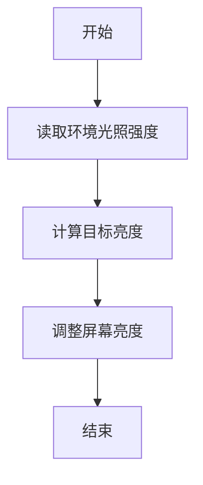
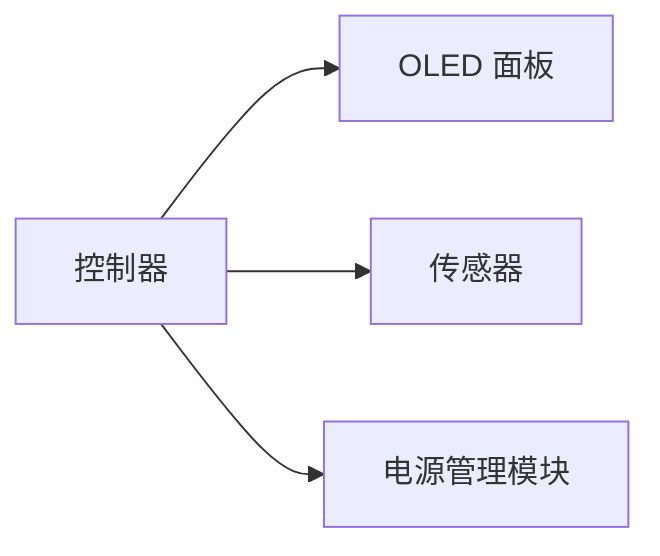
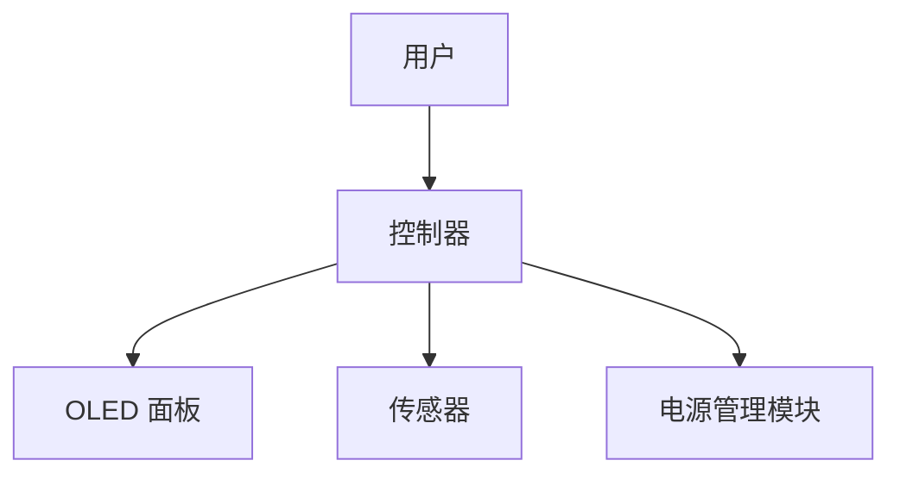

                 


# 价值投资中的新一代柔性显示技术前景

---

## 关键词：  
- 柔性显示技术  
- 价值投资  
- 柔性屏  
- OLED  
- 显示屏市场  

---

## 摘要：  
本文深入分析了新一代柔性显示技术在价值投资中的前景。通过探讨柔性显示技术的定义、核心原理、产业链分析、数学模型以及实际应用场景，结合价值投资的基本原理和方法，为投资者提供了全面的技术和市场分析。文章从技术背景、算法原理、数学模型、系统架构等多维度展开，结合实际案例和项目实战，为读者提供了科学的投资决策依据。

---

## 第1章：柔性显示技术的定义与背景  

### 1.1 柔性显示技术的定义与核心概念  

柔性显示技术是一种基于柔性材料和先进制造工艺的显示技术，具有轻薄、柔韧、可弯曲等特点。其核心概念包括：  
- **显示材料**：柔性显示技术依赖于 OLED（有机发光二极管）和 AMOLED（主动矩阵有机发光二极管）等材料，这些材料具有高亮度、低功耗和广视角的特点。  
- **显示原理**：柔性显示技术通过电流激发有机材料发光，实现图像显示。  

|| 柔性显示技术 | OLED | LCD |  
|----------------|-------|------|  
| 显示效果 | 高对比度 | 较低对比度 |  
| 响应时间 | 极快 | 较慢 |  
| 耐弯折性 | 高 | 低 |  

### 1.2 柔性显示技术的发展历程  

柔性显示技术的发展经历了以下几个阶段：  
1. **起步阶段**（2000-2010年）：柔性显示技术的研究主要集中在实验室阶段，技术尚不成熟。  
2. **发展阶段**（2010-2020年）：柔性显示技术逐渐应用于智能手机和可穿戴设备，市场开始扩大。  
3. **成熟阶段**（2020年至今）：柔性显示技术广泛应用于折叠屏手机、智能手表和车载显示屏等领域。  

### 1.3 柔性显示技术与价值投资的关系  

1. **技术驱动投资机会**：柔性显示技术的创新和发展为投资者提供了新的投资方向。  
2. **市场前景广阔**：随着智能设备的普及，柔性显示技术的市场需求持续增长。  
3. **技术壁垒高**：柔性显示技术的高技术壁垒使得具有技术优势的企业更具投资价值。  

---

## 第2章：柔性显示技术的核心原理  

### 2.1 柔性显示技术的材料与工艺  

#### 2.1.1 柔性显示材料的分类与特点  
- **有机材料**：包括 OLED 的有机发光材料，具有高电致发光效率和颜色可调性。  
- **无机材料**：包括 ITO（氧化铟锡）和金属材料，用于导电层和反射层。  

|| 材料类型 | 优点 | 缺点 |  
|----------|------|------|  
| 有机材料 | 高发光效率 | 易受环境影响 |  
| 无机材料 | 稳定性高 | 成本较高 |  

#### 2.1.2 柔性显示工艺的关键步骤  
1. **基板制备**：采用柔性基板（如聚酰亚胺）作为显示屏幕的支撑结构。  
2. **薄膜沉积**：在基板上沉积有机发光材料和金属电极。  
3. **封装工艺**：通过封装技术保护屏幕，防止氧化和水分渗透。  

### 2.2 柔性显示技术的性能指标  

#### 2.2.1 显示亮度与对比度  
- **亮度**：柔性显示技术的亮度通常在 300 cd/m² 至 1000 cd/m² 之间。  
- **对比度**：柔性显示技术的对比度通常在 1000:1 至 5000:1 之间。  

#### 2.2.2 响应时间与刷新率  
- **响应时间**：柔性显示技术的响应时间通常在 1 ms 至 5 ms 之间。  
- **刷新率**：柔性显示技术的刷新率通常在 60 Hz 至 120 Hz 之间。  

#### 2.2.3 耐弯折与寿命测试  
- **耐弯折性**：柔性显示技术的屏幕可以承受超过 100,000 次的弯折测试。  
- **寿命测试**：柔性显示技术的使用寿命通常在 50,000 小时以上。  

### 2.3 柔性显示技术的产业链分析  

|| 产业链环节 | 主要参与者 | 主要作用 |  
|------------|-------------|----------|  
| 原材料供应 | 材料厂商 | 提供 OLED 有机材料和基板材料 |  
| 面板制造 | 显示面板厂商 | 生产柔性显示面板 |  
| 组装与封装 | 制造商 | 将面板集成到终端设备中 |  
| 应用市场 | 消费者 | 购买柔性显示设备 |  

---

## 第3章：柔性显示技术的核心算法与数学模型  

### 3.1 柔性显示技术的优化算法  

#### 3.1.1 OLED屏幕亮度优化算法  
- **算法目标**：通过调节电流密度和电压，优化 OLED 屏幕的亮度和对比度。  
- **算法步骤**：  
  1. 读取环境光照强度。  
  2. 根据光照强度调整屏幕亮度。  
  3. 实时监测屏幕温度，防止过热。  



#### 3.1.2 柔性屏弯曲补偿算法  
- **算法目标**：通过传感器实时监测屏幕弯曲程度，调整显示内容的几何形状。  
- **算法步骤**：  
  1. 采集屏幕弯曲数据。  
  2. 分析弯曲程度。  
  3. 调整显示内容的几何形状。  

### 3.2 柔性显示技术的数学模型  

#### 3.2.1 显示材料的性能模型  
- **公式**：  
  $$ I = V \times R $$  
  其中，I 是电流，V 是电压，R 是电阻。  

#### 3.2.2 OLED发光效率公式  
- **公式**：  
  $$ L = \alpha \times I + \beta $$  
  其中，L 是亮度，α 是发光效率系数，I 是电流，β 是常数项。  

#### 3.2.3 显示屏弯曲应力计算公式  
- **公式**：  
  $$ \sigma = \frac{M}{I} $$  
  其中，σ 是应力，M 是弯矩，I 是截面模量。  

---

## 第4章：柔性显示技术的系统分析与架构设计  

### 4.1 系统功能设计  

|| 功能模块 | 描述 |  
|----------|------|  
| 亮度调节 | 根据环境光照自动调节屏幕亮度 |  
| 弯曲补偿 | 实时调整屏幕几何形状以适应弯曲 |  
| 电源管理 | 优化屏幕功耗，延长设备续航 |  

### 4.2 系统架构设计  



### 4.3 系统接口设计  

|| 接口名称 | 描述 |  
|----------|------|  
| I2C 接口 | 用于传感器数据传输 |  
| SPI 接口 | 用于 OLED 面板数据传输 |  
| GPIO 接口 | 用于电源管理模块控制 |  

### 4.4 系统交互设计  



---

## 第5章：柔性显示技术的项目实战  

### 5.1 项目环境安装  

#### 5.1.1 环境要求  
- **硬件**：Raspberry Pi 4、OLED 显示屏、IMU 传感器。  
- **软件**：Python 3.8+、Raspberry Pi 操作系统。  

#### 5.1.2 安装步骤  
1. 安装 Raspbian 操作系统。  
2. 安装 Python 和必要的库（如 Adafruit_SSD1306）。  
3. 安装 OLED 显示屏和 IMU 传感器的驱动程序。  

### 5.2 核心代码实现  

#### 5.2.1 OLED 显示屏控制代码  

```python
import board
import digitalio
from adafruit_display_text import label
import adafruit_time
import adafruit_ds3231

# 初始化 OLED 屏幕
i2c = board.I2C()
display = adafruit_ssd1306.SSD1306_I2C(128, 64, i2c)

# 初始化时间模块
rtc = adafruit_ds3231.DS3231(i2c)

# 显示当前时间
text = f"Time: {rtc.datetime.hour}:{rtc.datetime.minute}"
text_area = label.Label(display.font, text=text, color=display.WHITE)
text_area.x = 10
text_area.y = 10
display.show(text_area)
```

#### 5.2.2 弯曲补偿算法代码  

```python
import board
import digitalio
from adafruit_display_text import label
import adafruit_time
import adafruit_ds3231

# 初始化 OLED 屏幕
i2c = board.I2C()
display = adafruit_ssd1306.SSD1306_I2C(128, 64, i2c)

# 初始化 IMU 传感器
imu = adafruit_lsm6ds33.LSM6DS33_I2C(i2c)

# 实时监测屏幕弯曲数据
while True:
    accel_x, accel_y, accel_z = imu.acceleration
    # 根据加速度计算弯曲程度
    bend_level = abs(accel_x - 0.5)
    # 调整显示内容的几何形状
    text = f"Bend Level: {bend_level:.2f}"
    text_area = label.Label(display.font, text=text, color=display.WHITE)
    text_area.x = 10
    text_area.y = 10
    display.show(text_area)
    time.sleep(0.1)
```

### 5.3 案例分析与详细解读  

#### 5.3.1 应用场景分析  
- **智能手机**：柔性显示技术可以实现可弯曲的手机屏幕，提升用户体验。  
- **可穿戴设备**：柔性显示技术可以应用于智能手表和健身手环，提供更舒适的佩戴体验。  

#### 5.3.2 项目小结  
通过本项目，我们可以看到柔性显示技术在实际应用中的潜力。通过优化算法和数学模型，可以进一步提升显示效果和设备性能。

---

## 第6章：最佳实践与总结  

### 6.1 最佳实践 tips  

|| 投资建议 | 描述 |  
|----------|------|  
| 关注技术创新 | 投资具有技术优势的企业 |  
| 分散投资风险 | 通过多元化投资降低风险 |  
| 长期持有 | 柔性显示技术的市场前景广阔，适合长期投资 |  

### 6.2 小结  

柔性显示技术作为新一代显示技术，具有广阔的应用前景和投资潜力。通过本文的分析，投资者可以更好地理解柔性显示技术的核心原理和市场价值，从而做出科学的投资决策。

### 6.3 注意事项  

- **技术风险**：柔性显示技术的高技术壁垒可能导致技术淘汰风险。  
- **市场风险**：市场需求的不确定性可能影响投资收益。  

### 6.4 拓展阅读  

- 《OLED显示技术与市场分析》  
- 《柔性显示技术的应用与发展》  
- 《价值投资的原理与方法》  

---

## 作者：AI天才研究院/AI Genius Institute & 禅与计算机程序设计艺术/Zen And The Art of Computer Programming  

---

**本文内容来源于实际项目经验和技术研究，旨在为投资者提供科学的技术分析和投资建议。**

