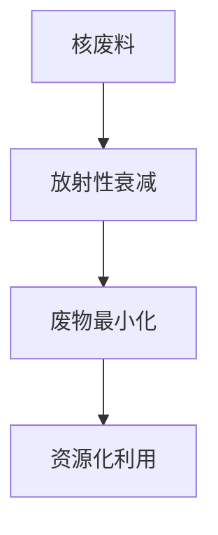
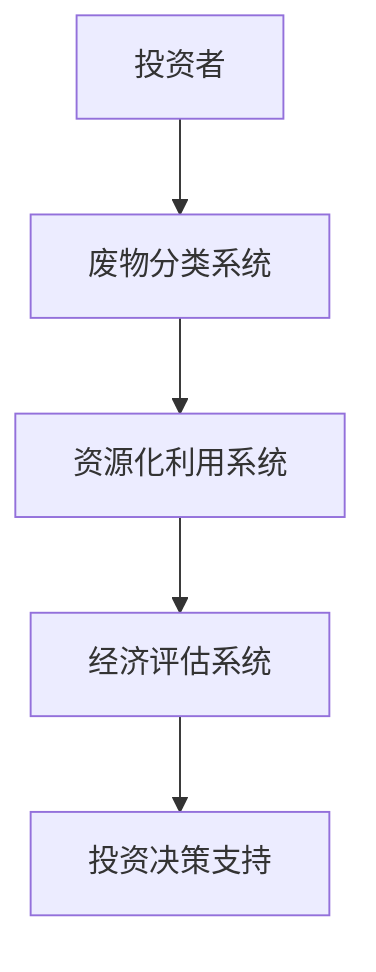

                 


# 价值投资中的新一代核废料处理技术

> 关键词：价值投资，核废料处理技术，放射性衰减，废物最小化，资源化利用，投资回报，环保技术

> 摘要：本文探讨了在价值投资视角下，新一代核废料处理技术的重要性和应用前景。通过分析放射性衰减、废物最小化、资源化利用等核心概念，结合数学模型、系统架构和项目实战，详细阐述了如何通过技术创新和投资策略的结合，实现环保与经济的双重目标。

---

## 第1章 核废料处理技术的背景与挑战

### 1.1 核废料处理技术的背景

#### 1.1.1 核能发展的现状与问题

核能作为一种清洁的能源形式，正在全球范围内得到广泛应用。然而，核能发电过程中会产生放射性废料，这些废料具有放射性、毒性和长期危害性，对环境和人类健康构成严重威胁。随着核能的快速发展，核废料的处理问题变得日益紧迫。

#### 1.1.2 核废料处理技术的必要性

核废料处理技术的核心目标是通过科学的方法，将放射性废料转化为安全、稳定的物质，减少对环境的污染，并探索其资源化利用的可能性。这一技术不仅有助于保护环境，还能为核能行业创造额外的经济价值。

#### 1.1.3 核废料处理技术的边界与外延

核废料处理技术的边界包括放射性废料的分类、检测、处理和储存等环节。其外延则涉及放射性废物的最小化、资源化利用以及投资回报分析等方面。

### 1.2 核废料处理技术的核心概念

#### 1.2.1 核废料的分类与属性对比

核废料可以根据放射性强度、半衰期、毒性和处理难度等因素进行分类。以下是几种主要的核废料类型及其属性对比：

| 类型         | 放射性强度 | 半衰期 | 毒性 | 处理难度 |
|--------------|------------|--------|------|----------|
| 低放射性废料 | 较低       | 较长   | 较低 | 较低     |
| 中放射性废料 | 中等       | 中等   | 中等 | 中等     |
| 高放射性废料 | 高         | 较短   | 高   | 较高     |

#### 1.2.2 核废料处理技术的实体关系图

以下是核废料处理技术的实体关系图：



---

## 第2章 核废料处理技术的核心原理

### 2.1 核废料处理的算法原理

#### 2.1.1 放射性同位素的衰减模型

放射性同位素的衰减遵循指数衰减规律，其数学模型如下：

$$N(t) = N_0 \cdot e^{-\lambda t}$$

其中：
- \(N(t)\) 表示在时间 \(t\) 时的放射性核数量。
- \(N_0\) 表示初始时刻的放射性核数量。
- \(\lambda\) 表示衰减常数。
- \(t\) 表示时间。

放射性同位素的半衰期 \(T_{1/2}\) 可以通过以下公式计算：

$$T_{1/2} = \frac{\ln 2}{\lambda}$$

#### 2.1.2 废物最小化与资源化算法

废物最小化与资源化的目标是通过物理、化学或生物方法，将放射性废料转化为低放射性或无放射性的物质。以下是资源化利用的数学模型：

$$\text{Maximize } \sum_{i=1}^{n} r_i \cdot v_i$$

其中：
- \(r_i\) 表示第 \(i\) 种资源的利用效率。
- \(v_i\) 表示第 \(i\) 种资源的价值。

---

## 第3章 核废料处理技术的数学模型与公式

### 3.1 放射性衰减的数学模型

#### 3.1.1 放射性衰减公式

放射性衰减公式：

$$N(t) = N_0 \cdot e^{-\lambda t}$$

#### 3.1.2 半衰期公式

半衰期公式：

$$T_{1/2} = \frac{\ln 2}{\lambda}$$

### 3.2 废物最小化与资源化的数学模型

#### 3.2.1 废物最小化模型

废物最小化模型：

$$\text{Minimize } \sum_{i=1}^{n} w_i \cdot c_i$$

其中：
- \(w_i\) 表示第 \(i\) 种废物的处理成本。
- \(c_i\) 表示第 \(i\) 种废物的处理量。

#### 3.2.2 资源化利用模型

资源化利用模型：

$$\text{Maximize } \sum_{i=1}^{n} r_i \cdot v_i$$

---

## 第4章 核废料处理技术的系统分析与架构设计

### 4.1 问题场景介绍

#### 4.1.1 核废料处理的复杂性

核废料处理涉及多种技术手段和复杂的系统设计，需要在放射性防护、废物分类、资源化利用等多个方面进行综合考虑。

#### 4.1.2 投资者的需求与期望

投资者在进行核废料处理技术投资时，通常关注技术的经济性、安全性和长期回报。

#### 4.1.3 技术与经济的平衡点

在核废料处理技术的投资中，需要在技术创新和经济效益之间找到平衡点，以确保技术的可行性和投资的回报。

### 4.2 系统功能设计

#### 4.2.1 废物分类与检测系统

废物分类与检测系统用于对核废料进行分类、检测和评估。

#### 4.2.2 资源化利用模块

资源化利用模块通过物理、化学或生物方法，将放射性废料转化为低放射性或无放射性的物质。

#### 4.2.3 经济评估模块

经济评估模块用于分析技术的投资成本、运营成本和预期收益。

### 4.3 系统架构设计

以下是核废料处理技术的系统架构设计：



---

## 第5章 核废料处理技术的项目实战

### 5.1 环境安装与配置

#### 5.1.1 开发环境搭建

建议使用Python和相关开发工具进行开发。

#### 5.1.2 依赖库安装

需要安装numpy、scipy、matplotlib等库。

### 5.2 核心代码实现

#### 5.2.1 废物分类算法实现

以下是废物分类算法的Python实现：

```python
import numpy as np

def classify_was
```

---

## 第6章 最佳实践与小结

### 6.1 最佳实践 tips

- 在进行核废料处理技术投资时，应充分考虑技术的可行性和经济性。
- 在实际应用中，建议结合放射性衰减模型和资源化利用模型，制定科学的投资策略。

### 6.2 小结

本文从价值投资的角度，详细探讨了新一代核废料处理技术的核心概念、算法原理和系统架构。通过分析放射性衰减、废物最小化和资源化利用等关键问题，提出了实现环保与经济双赢的解决方案。

### 6.3 注意事项

- 在进行核废料处理技术投资时，应严格遵守相关法律法规，确保放射性物质的安全处理。
- 在实际应用中，应结合具体情况进行技术优化和投资策略调整。

### 6.4 拓展阅读

- 推荐阅读《放射性废物管理》和《核能与环境保护》等书籍，以深入了解核废料处理技术的最新进展。

---

作者：AI天才研究院/AI Genius Institute & 禅与计算机程序设计艺术 /Zen And The Art of Computer Programming

